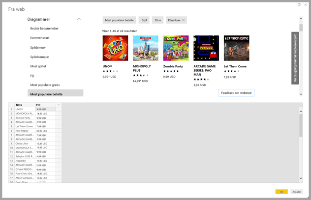
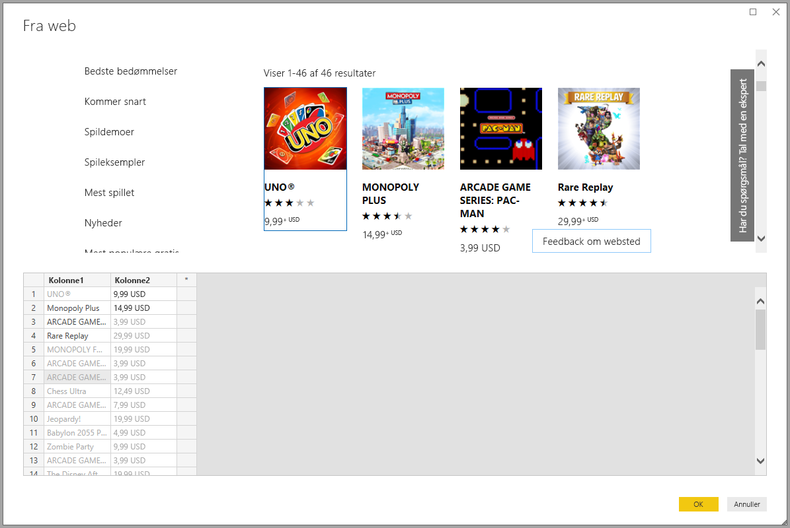

# Få websidedata ved at angive eksempler

Ved at hente data fra en webside kan brugere nemt udpakke data fra websider og importere data til *Power BI Desktop*. Data på websider findes imidlertid ofte ikke i overskuelige tabeller, der er nemme at udtrække noget fra. Det kan være en udfordring at hente data fra sådanne sider, selvom dataene er struktureret og konsistente.

Der findes en løsning. Via funktionen *Hent data fra web efter eksempel* kan du i store træk vise Power BI Desktop, hvilke data du vil udtrække, ved at angive et eller flere eksempler i connectordialogboksen. Power BI Desktop indsamler andre data på den side, der matcher dine eksempler. Med denne løsning kan du udtrække alle mulige slags data fra websider, herunder data, der findes i tabeller *og* andre data, der ikke stammer fra tabeller.

Priser i grafik er kun til eksempelformål.

## Brug Hent data fra web efter eksempel

Vælg **Hent data** på båndet **Hjem**. I den dialogboks, der vises, skal du vælge **Andet** i kategorierne i venstre rude og derefter vælge **Web**. Vælg **Opret forbindelse** for at fortsætte.

Angiv URL-adressen til den webside, som du vil udtække data fra, i **Fra web**. I denne artikel bruger vi websiden Microsoft Store og viser, hvordan denne connector fungerer.

Hvis du vil følge med, kan du bruge den [URL-adresse til Microsoft Store](https://www.microsoft.com/store/top-paid/games/xbox?category=classics), som vi bruger i denne artikel:

    https://www.microsoft.com/store/top-paid/games/xbox?category=classics

Når du vælger **OK**, sendes du videre til dialogboksen **Navigator**, hvor der vises nogle automatisk registrerede tabeller fra websiden. I det tilfælde, der vises på billedet nedenfor, blev der ikke fundet nogen tabeller. Vælg **Tilføj tabel ved hjælp af eksempler** for at angive eksempler.

**Tilføj tabel ved hjælp af eksempler** viser et interaktivt vindue, hvor du kan få vist indholdet af websiden. Indtast eksempelværdier for de data, du vil udtrække.

I dette eksempel udtrækker vi *Navn* og *Pris* for alle spil på siden. Det kan vi gøre ved at angive et par eksempler fra siden for hver kolonne. Når du angiver eksempler, udtrækker *Power Query* data, der passer til mønsteret for eksempelposter ved hjælp af intelligente algoritmer til dataudtrækning.

> [!NOTE]
> Værdiforslag omfatter kun værdier, der er 128 tegn eller færre lange.

Når du er tilfreds med de data, der udtrækkes fra websiden, skal du vælge **OK** for at gå til Power Query-editor. Du kan anvende flere transformationer eller forme dataene, f. eks. kombinere disse data med andre datakilder.

Herefter kan du oprette visuelle elementer eller på anden måde bruge websidedataene, når du opretter dine Power BI Desktop-rapporter.

## De næste trin

Du kan oprette forbindelse til mange forskellige typer data ved hjælp af Power BI Desktop. Hvis du vil have mere at vide om datakilder, kan du se følgende ressourcer:

* [Tilføj en kolonne ud fra et eksempel i Power BI Desktop](../create-reports/desktop-add-column-from-example.md)
* [Opret forbindelse til websider fra Power BI Desktop](desktop-connect-to-web.md)
* [Datakilder i Power BI Desktop](desktop-data-sources.md)
* [Udform og kombiner data i Power BI Desktop](desktop-shape-and-combine-data.md)
* [Opret forbindelse til Excel-projektmapper i Power BI Desktop](desktop-connect-excel.md)
* [Opret forbindelse til CSV-filer i Power BI Desktop](desktop-connect-csv.md)
* [Angiv data direkte i Power BI Desktop](desktop-enter-data-directly-into-desktop.md)
