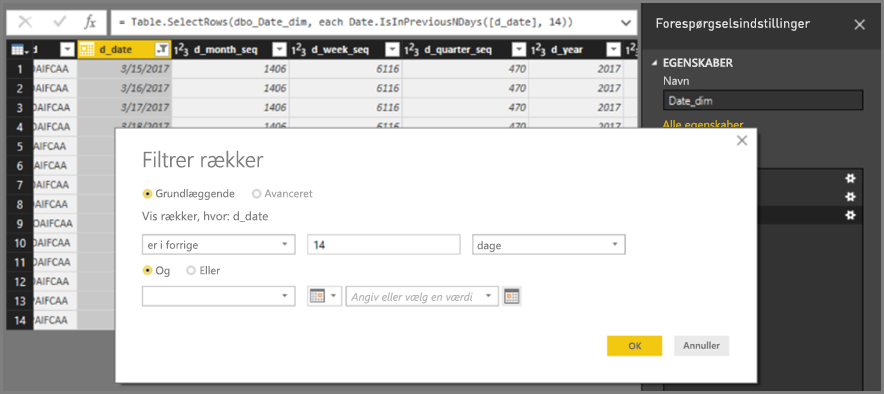
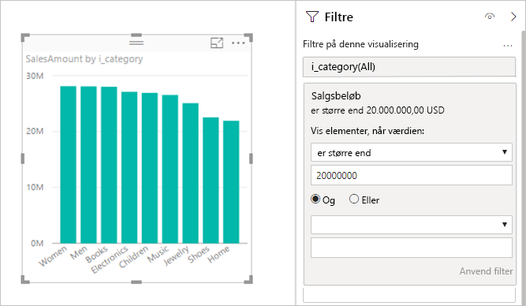
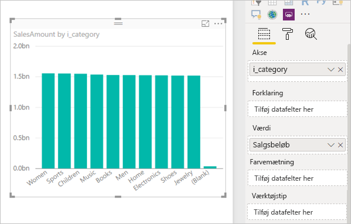

# <a name="about-using-directquery-in-power-bi"></a>Om brug af DirectQuery i Power BI

Du kan oprette forbindelse til alle mulige forskellige datakilder, når du bruger *Power BI Desktop* eller *Power BI-tjenesten* og oprette disse dataforbindelser på forskellige måder. Du kan *importere* data i Power BI, hvilket er den mest almindelige måde at hente data på, eller oprette forbindelse direkte til dataene i det oprindelige kildelager, der også er kendt som *DirectQuery*. I denne artikel beskrives DirectQuery-egenskaber:

* Forskellige forbindelsesmuligheder for DirectQuery
* Vejledning, når du overvejer at bruge DirectQuery i stedet for at importere
* Ulemper i forbindelse med brugen af DirectQuery
* Bedste fremgangsmåder i forbindelse med brugen af DirectQuery

Følg de bedste fremgangsmåder for brug af import kontra DirectQuery:

* Du skal importere data i Power BI, når det er muligt. Import udnytter fordelen ved forespørgselsprogrammets høje ydeevne i Power BI, og du får en yderst interaktiv oplevelse med fuld funktionalitet.
* Hvis du ikke kan få opfyldt dine mål vha. import af data, kan du overveje at bruge DirectQuery. Hvis dataene f.eks. ændres ofte, og rapporter skal afspejle de seneste data, kan DirectQuery være bedst. Brugen af DirectQuery er kun praktisk, når den underliggende datakilde kan levere interaktive forespørgsler, mindre end 5 sekunder, for en typisk samlet forespørgsel og kan håndtere den forespørgselsbelastning, der genereres. Desuden skal listen over begrænsninger for brugen af DirectQuery overvejes nøje.

Det sæt af egenskaber, Power BI kan tilbyde i forbindelse med import og DirectQuery, udvikles med tiden. Ændringerne vil indebære en øget fleksibilitet ved brug af importerede data, så importen kan bruges i flere tilfælde, og eliminering af nogle af de ulemper, der er forbundet med at bruge DirectQuery. Uanset disse forbedringer så vil ydeevnen for den underliggende datakilde altid være den største overvejelse ved brugen af DirectQuery. Hvis den underliggende datakilde er langsom, vil det fortsat ikke være praktisk at anvende DirectQuery for den pågældende kilde.

Denne artikel dækker DirectQuery med Power BI og ikke *SQL Server Analysis Services*. DirectQuery er også en funktion i SQL Server Analysis Services. Mange af de oplysninger, der er beskrevet i denne artikel, gælder for denne funktion. Der er også vigtige forskelle. Du kan finde flere oplysninger om brugen af DirectQuery med SQL Server Analysis Services under [DirectQuery i SQL Server 2016 Analysis Services](https://download.microsoft.com/download/F/6/F/F6FBC1FC-F956-49A1-80CD-2941C3B6E417/DirectQuery%20in%20Analysis%20Services%20-%20Whitepaper.pdf).

I denne artikel fokuseres der på det anbefalede workflow for DirectQuery, hvor rapporten oprettes i Power BI Desktop, men oprettelse af forbindelse direkte i Power BI-tjenesten dækkes også.

## <a name="power-bi-connectivity-modes"></a>Power BI-forbindelsestilstande

Power BI opretter forbindelse til et stort antal forskellige datakilder, der omfatter:

* Online-tjenester (Salesforce, Dynamics 365 med flere)
* Databaser (SQL Server, Access, Amazon Redshift med flere)
* Enkle filer (Excel, JSON med flere)
* Andre datakilder (Spark, websteder, Microsoft Exchange med flere)

For disse datakilder er det muligt at importere data i Power BI. For nogle er det også muligt at oprette forbindelse vha. DirectQuery. Hvis du vil se en oversigt over de kilder, der understøtter DirectQuery, skal du se [Datakilder, der understøttes af DirectQuery](power-bi-data-sources.md). Der aktiveres flere kilder for DirectQuery fremover, primært med fokus på kilder, der kan forventes at levere en god interaktiv ydeevne i forbindelse med forespørgsler.

SQL Server Analysis Services er et særligt tilfælde. Når du opretter forbindelse til SQL Server Analysis Services, kan du vælge at importere dataene eller bruge en *direkte forbindelse*. Brug af en direkte forbindelse svarer til DirectQuery. Der importeres ikke data, og den underliggende datakilde bliver altid forespurgt for at opdatere en visualisering. En direkte forbindelse er anderledes i mange andre forhold, så der bruges et andet begreb, *direkte forbindelse* kontra *DirectQuery*.

Disse tre muligheder for oprettelse af forbindelse til data: *import*, *DirectQuery* og *direkte forbindelse*.

### <a name="import-connections"></a>Importforbindelser

Når du bruger **Hent data** i Power BI Desktop til at oprette forbindelse til en datakilde som f.eks. SQL Server, er funktionsmåden for forbindelsen som følger:

* Under den oprindelige Hent data-oplevelse vil de valgte sæt tabeller hver definere en forespørgsel, som returnerer et sæt data. Disse forespørgsler kan redigeres, før du indlæser dataene, f.eks. for at anvende filtre eller samle dataene eller joinforbinde forskellige tabeller.
* Ved indlæsning importeres alle de data, der er defineret af disse forespørgsler, i Power BI-cachen.
* Ved oprettelse af en visualisering i Power BI Desktop, sendes en forespørgsel til de importerede data. Opbevaringen i Power BI sikrer, at forespørgslen er hurtig. Alle ændringer af visualiseringen afspejles med det samme.
* Eventuelle ændringer i de underliggende data afspejles ikke i visualiseringerne. Det er nødvendigt at *opdatere* for at importere data igen.
* Ved publicering af rapporten som en *.pbix-fil* i Power BI-tjenesten, oprettes der et datasæt, som uploades til Power BI-tjenesten. De importerede data inkluderes i det pågældende datasæt. Det er derefter muligt at planlægge en opdatering af de pågældende data, f.eks. for at importere dataene igen hver dag. Afhængigt af placeringen af den oprindelige datakilde kan det være nødvendigt at konfigurere en datagateway i det lokale miljø.
* Når du åbner en eksisterende rapport i Power BI-tjenesten eller forfatter en ny rapport, sendes en ny forespørgsel til de importerede data, hvilket sikrer interaktivitet.
* Visualiseringer eller hele rapportsider kan fastgøres som dashboardfelter. Felterne opdaterer automatisk, når det underliggende datasæt opdaterer.

### <a name="directquery-connections"></a>DirectQuery-forbindelser

Når du bruger **Hent data** i Power BI Desktop til at oprette forbindelse til en datakilde, er funktionsmåden for forbindelsen som følger for DirectQuery:

* Under den indledende Hent data-oplevelse, vælges kilden. I forbindelse med relationskilder vælges sæt af tabeller, som hver især definerer en forespørgsel, der logisk returnerer et datasæt. Ved flerdimensionelle kilder som SAP BW er det kun kilden, der vælges.
* Ved indlæsning importeres der ingen data i Power BI-lageret. Når du bygger en visualisering i Power BI Desktop, sendes forespørgsler i stedet til den underliggende datakilde for at hente de nødvendige data. Den tid, det tager at opdatere visualiseringen, afhænger af den underliggende datakildes ydeevne.
* Eventuelle ændringer i de underliggende data afspejles ikke i eksisterende visualiseringer med det samme. Det er stadig nødvendigt at opdatere. De nødvendige forespørgsler sendes igen for hver enkelt visualisering, og visualiseringen opdateres efter behov.
* Ved publicering af rapporten i Power BI-tjenesten oprettes der igen et datasæt i Power BI-tjenesten, som det også var tilfældet i forbindelse med import. Der inkluderes dog *ingen data* i det pågældende datasæt.
* Når du åbner en eksisterende rapport i Power BI-tjenesten, eller du opretter en ny, sendes der igen en forespørgsel til den underliggende datakilde for at hente de nødvendige data. Afhængigt af placeringen af den oprindelige datakilde kan det være nødvendigt at konfigurere en datagateway i det lokale miljø, ligesom den er påkrævet i importtilstanden, hvis dataene opdateres.
* Visualiseringer eller hele rapportsider kan fastgøres som dashboardfelter. Hvis du vil sikre dig, at åbningen af et dashboard sker hurtigt, skal felterne automatisk opdateres i henhold til en tidsplan, f.eks. hver time. Opdateringsfrekvensen kan styres, så den afspejler, hvor ofte dataene ændres, og hvor vigtigt det er at få vist de nyeste data. Felterne afspejler dataene ved den seneste opdatering, når du åbner et dashboard, og ikke nødvendigvis de nyeste ændringer, der er foretaget af den underliggende kilde. Du kan opdatere et åbent dashboard for at sikre, at det er opdateret.

### <a name="live-connections"></a>Liveforbindelser

Når du opretter forbindelse til SQL Server Analysis Services, er det muligt enten at importere data fra eller oprette en direkte forbindelse til den valgte datamodel. Hvis du bruger import, definerer du en forespørgsel i forhold til den eksterne SQL Server Analysis Services-kilde, og dataene importeres som normalt. Hvis du bruger en direkte forbindelse, er der ikke defineret en forespørgsel, og hele den eksterne model vises på feltlisten.

Den situation, der er beskrevet i den foregående sektion, gælder også i forbindelse med oprettelse af forbindelse til følgende kilder, bortset fra at det ikke er muligt at importere dataene:

* Power BI-datasæt, når der f.eks. oprettes forbindelse til et Power BI-datasæt, der tidligere er blevet oprettet og publiceret til tjenesten, for at oprette en ny rapport for det.
* Common Data Services.

Funktionsmåden for rapporter i forbindelse med SQL Server Analysis Services ved publicering til Power BI-tjenesten svarer til DirectQuery-rapporter på følgende måde:

* Når du åbner en eksisterende rapport i Power BI-tjenesten eller opretter en ny rapport, sendes der en forespørgsel til den underliggende SQL Server Analysis Services-kilde, som muligvis kræver en datagateway i det lokale miljø.
* Dashboardfelterne opdateres automatisk efter en tidsplan, som f.eks hver time.

Der er også vigtige forskelle. Ved f.eks. direkte forbindelser sendes identiteten af den bruger, der åbner rapporten, altid til den underliggende SQL Server Analysis Services-kilde.

Nu, hvor vi har lavet disse sammenligninger, kan vi nøjes med at fokusere på DirectQuery i resten af denne artikel.

## <a name="when-is-directquery-useful"></a>Hvornår er DirectQuery nyttig?

I følgende tabel beskrives scenarier, hvor det kan være nyttigt at oprette forbindelse med DirectQuery. Det omfatter tilfælde, hvor det er en fordel at lade dataene i den oprindelige kilde blive betragtet. I beskrivelsen diskuteres det, om det angivne scenarie er tilgængeligt i Power BI.

| Begrænsning | Beskrivelse |
| --- | --- |
| Data ændres ofte, og derfor er der behov for rapportering næsten i realtid |Modeller med importerede data kan opdateres højst én gang pr. time (oftere med Power BI Pro- eller Power BI Premium-abonnementer). Hvis dataene ændres hele tiden, og det er nødvendigt for rapporter at få vist de nyeste data, kan det være, at brugen af import med planlagt opdatering ikke opfylder disse behov. Du kan streame data direkte til Power BI, selvom der i disse tilfælde er en begrænsning på de understøttede datamængder. <br/> <br/> I modsætning hertil vil brugen af DirectQuery betyde, at der ved åbning eller opdatering af en rapport eller et dashboard altid vises de seneste data i kilden. Derudover kan dashboardfelterne opdateres oftere, helt op til hvert kvarter. |
| Datamængden er meget stor |Hvis datamængden er meget stort, vil det ikke være praktisk at importere den overhovedet. I modsætning hertil kræver DirectQuery ingen stor dataoverførsel, da der sendes en forespørgsel til dem der, hvor de ligger. <br/> <br/> Dog kan store datamængder også medføre, at ydeevnen af forespørgsler i forhold til den underliggende datakilde er for langsom som beskrevet i [Konsekvenser ved brugen af DirectQuery](#implications-of-using-directquery). Du behøver ikke altid at importere alle de detaljerede data. Dataene kan i stedet samles på forhånd under importen. *Forespørgselseditor* gør det nemt at samle data på forhånd under importen. I helt særlige tilfælde vil det være muligt at importere præcis de samlede data, der er brug for, for hver enkelt visualisering. Mens DirectQuery er den nemmeste måde at få adgang til store datamængder på, kan import af samlede data være en løsning, hvis den underliggende kilde er for langsom. |
| Sikkerhedsregler defineres i den underliggende kilde |Når dataene er importeret, opretter Power BI forbindelse til datakilden vha. legitimationsoplysningerne for den aktuelle bruger fra Power BI Desktop eller vha. de legitimationsoplysninger, der er defineret som en del af konfiguration af den planlagte opdatering fra Power BI-tjenesten. Det er vigtigt kun at dele en rapport med brugere, der har tilladelse til at se de samme data, når sådan en rapport publiceres og deles. Ellers skal der defineres sikkerhed på rækkeniveau som en del af datasættet. <br/> <br/> Da DirectQuery altid sender forespørgsler til den underliggende datakilde, vil denne konfiguration ideelt set tillade, at den underliggende kilde anvendes. I øjeblikket vil Power BI dog altid oprette forbindelse til den underliggende kilde vha. de samme legitimationsoplysninger, som bruges til import. <br/> <br/> Indtil Power BI gør det muligt at sende identiteten af brugeren af rapporten til den underliggende kilde, er der ingen fordele for datakildens sikkerhed med DirectQuery. |
| Der kan være begrænsninger for datasuverænitet |Nogle organisationer har politikker omkring datasuverænitet, hvilket betyder, at data ikke kan forlade det lokale miljø i en organisation. En løsning, der er baseret på import, vil tydeligvis medføre problemer. I modsætning hertil, forbliver dataene i den underliggende kilde med DirectQuery. <br/> <br/> Selv med DirectQuery bevares nogle cashelagrede data dog på visualiseringsniveau i Power BI-tjenesten på grund af planlagt opdatering af felter. |
| Underliggende datakilder er en OLAP-datakilde, der indeholder målinger |Hvis den underliggende datakilde indeholder *målinger*, som f.eks. SAP HANA eller SAP Business Warehouse, medfører importen af dataene andre problemer. Det betyder, at de importerede data befinder sig på et bestemt niveau i samlingen som defineret af forespørgslen. Det kan f.eks. være målingerne **TotalSales** efter **Class**, **Year** og **City**. Så hvis en visualisering bygges og efterspørger data på et højere niveau i samlingen, som f.eks. **TotalSales** efter **Year**, samles den samlede værdi yderligere. Denne samling fungerer fint for additive målinger, som f.eks.**Sum** og **Min**, men det er et problem for ikke-additive målinger, som f.eks. **Average**, **DistinctCount**. <br/> <br/> Hvis du vil gøre det nemt at hente de korrekte samlede data, som er relevant for en bestemt visualisering, direkte fra kilden, vil det være nødvendigt at sende forespørgsler pr. visualisering som i DirectQuery. <br/> <br/> Når du opretter forbindelse til SAP Business Warehouse (BW) og vælger DirectQuery, er denne behandling af målingerne mulig. Du kan finde oplysninger om SAP BW i [DirectQuery og SAP BW](desktop-directquery-sap-bw.md). <br/> <br/> I øjeblikket behandler DirectQuery i forhold til SAP HANA dataene på samme måde som en relationskilde, og importfunktionsmåden er den samme. Denne fremgangsmåde behandles yderligere under [DirectQuery og SAP HANA](desktop-directquery-sap-hana.md). |

Det vil sige, at med de aktuelle egenskaber i DirectQuery i Power BI, er der fordele med følgende scenarier:

* Data ændres ofte, og derfor er der behov for rapportering næsten i realtid.
* Håndtering af meget store datamængder, uden at der er behov for at samle på forhånd.
* Der kan være begrænsninger for datasuverænitet.
* Kilden er en multidimensionel kilde, der indeholder målinger, som f.eks. SAP BW.

Oplysningerne på den forrige liste er kun relateret til brugen af Power BI. Du kan i stedet bruge en ekstern SQL Server Analysis Services- eller Azure Analysis Services-model til at importere data. Brug derefter Power BI til at oprette forbindelse til den pågældende model. Selvom denne fremgangsmåde kræver yderligere konfiguration, er den mere fleksibel. Der kan importeres meget store datamængder. Der er ingen begrænsninger for, hvor ofte dataene kan opdateres.

## <a name="implications-of-using-directquery"></a>Konsekvenser ved brugen af DirectQuery

Brug af DirectQuery har muligvis negative konsekvenser, som beskrevet i dette afsnit. Nogle af disse begrænsninger er lidt anderledes, afhængigt af den nøjagtige kilde der bruges. Vi beskriver begrænsninger, hvor det er relevant, og der vil være separate artikler, der behandler de kilder, der er markant anderledes.

### <a name="performance-and-load-on-the-underlying-source"></a>Ydeevne og arbejdsbelastning i den underliggende kilde

Når du bruger DirectQuery, afhænger den generelle oplevelse i høj grad af den underliggende datakildes ydeevne. Hvis opdatering af hver visualisering, f.eks. efter du har ændret en udsnitsværdi, tager et par sekunder, normalt mindre end 5 sekunder, vil oplevelsen være rimelig. Oplevelsen kan føles langsom sammenlignet med den øjeblikkelige respons, når du importerer dataene til Power BI. Hvis kildens langsomhed bevirker, at de enkelte visualiseringer kan tage længere tid end ti sekunder, bliver oplevelsen meget dårlig. Forespørgsler kan også have timeout.

Sammen med den underliggende kildes ydeevne skal du lægge mærke til den belastning, der er på kilden. Belastning påvirker ydeevnen. Hver bruger, der åbner en delt rapport, og hvert dashboardfelt, der opdateres, sender mindst én forespørgsel pr. visualisering til den underliggende kilde. Det kræver, at kilden kan håndtere sådan en forespørgselsbelastning, samtidig med at der bevares en rimelig ydeevne.

### <a name="security-implications-when-combining-data-sources"></a>Sikkerhedskonsekvenser ved kombination af datakilder

Det er muligt at bruge flere datakilder i en DirectQuery-model, på samme måde som når du importerer data, ved hjælp af funktionen [Sammensatte modeller](../transform-model/desktop-composite-models.md). Når du bruger flere datakilder, er det vigtigt at forstå, hvordan data flyttes frem og tilbage mellem de underliggende datakilder og de [sikkerhedskonsekvenser](../transform-model/desktop-composite-models.md#security-implications), der medfølger.

### <a name="limited-data-transformations"></a>Begrænsede datatransformationer

På samme måde er der begrænsninger i datatransformationer, der kan anvendes i Forespørgselseditor. Med importerede data kan der let anvendes et avanceret sæt transformationer til at rydde op i og forme dataene igen, før du bruger dem til at oprette visualiseringer, som f.eks. fortolkning af JSON-dokumenter eller pivotering af data fra en kolonne- til en rækkeorienteret form. Disse transformationer er mere begrænset i DirectQuery.

Når du opretter forbindelse til en OLAP-kilde, f.eks. SAP Business Warehouse, kan der ikke defineres transformationer overhovedet, og hele den eksterne model hentes fra kilden. For relationskilder som SQL Server er det stadig muligt at definere et sæt transformationer pr. forespørgsel, men disse transformationer er begrænset af hensyn til ydeevnen.

Alle disse transformationer skal anvendes på hver enkelt forespørgsel til den underliggende kilde i stedet for én gang i forbindelse med dataopdatering. Derfor er de begrænset til de transformationer, der med rimelighed kan fortolkes til en enkelt oprindelig forespørgsel. Hvis du bruger en transformation, der er for kompleks, får du vist en fejl om, at den enten skal slettes, eller at modellen skal ændres til import.

Desuden anvendes den forespørgsel, der kommer fra dialogboksen **Hent data** eller Forespørgselseditor, i en undermarkering i de genererede forespørgsler og sendes for at hente de nødvendige data til en visualisering. Den forespørgsel, der er defineret i Forespørgselseditor, skal være gyldig i denne kontekst. Det er ikke muligt at bruge en forespørgsel ved hjælp af fælles tabeludtryk eller én, som aktiverer lagrede procedurer.

### <a name="modeling-limitations"></a>Begrænsninger på udformning

Udtrykket *udformning* betyder i denne kontekst den måde, du kan finjustere og forbedre rådata på som en del af oprettelsen af en rapport, der anvender disse data. Det kan f.eks. være:

* Definition af relationer mellem tabeller
* Tilføjelse af nye beregninger (beregnede kolonner og målinger)
* Omdøbning og skjul af kolonner og mål
* Definition af hierarkier
* Definition af formatering, standardopsummering og sorteringsrækkefølge for en kolonne
* Gruppering eller klyngeoprettelse af værdier

Når du bruger DirectQuery, kan mange af disse modelforbedringer stadig foretages, og der er stadig et princip om, at rådataene kan forbedres, hvilket også forbedrer den senere brug. Der er dog nogle udformningsegenskaber, der ikke er tilgængelige, eller som er begrænset, når du bruger DirectQuery. Begrænsningerne anvendes generelt for at undgå problemer med ydeevnen. Sættet af begrænsninger, der er fælles for alle DirectQuery-kilder, er angivet her. Der kan gælde yderligere begrænsninger for individuelle kilder som beskrevet i [Næste trin](#next-steps).

* **Intet indbygget datohierarki:** Når du importerer data, vil der også være et indbygget datahierarki tilgængeligt for hver enkelt dato/dato-klokkeslætskolonne. Hvis import af en tabel med salgsordrer f.eks. inkluderer en kolonne af typen **OrderDate**, vil det være muligt at vælge det relevante anvendelsesniveau (year, month, day), når du bruger **OrderDate** i en visualisering. Dette indbyggede datohierarki er ikke tilgængeligt, når du bruger DirectQuery. Hvis en **dato**tabel er tilgængelig i den underliggende kilde, hvilket er almindeligt i mange data warehouses, kan DAX Time Intelligence-funktionerne bruges som normalt.
* **Kun understøttelse af dato/klokkeslæt med sekundnøjagtighed:** Når du bruger tidskolonner i dit datasæt, sender Power BI kun forespørgsler til den underliggende kilde på detaljeniveauet med sekunder. Forespørgsler sendes ikke til DirectQuery-kilden for millisekunder. Fjern denne del af klokkeslættene fra kildekolonnerne.
* **Begrænsninger i beregnede kolonner:** Beregnede kolonner er begrænset til samme række, dvs. de kan kun referere til andre kolonner i samme tabel uden at bruge samlingsfunktioner. Derudover er DAX-skalarfunktioner, f.eks. `LEFT()`, der er tilladt, begrænset til de funktioner, der kan skubbes til den underliggende kilde. Funktionerne varierer, afhængigt af kildens nøjagtige egenskaber. Funktioner, der ikke understøttes, vises ikke under autofuldførelse, når DAX godkendes for en beregnet kolonne, og det vil medføre en fejl, hvis de bruges.
* **Ingen understøttelse af overordnede/underordnede DAX-funktioner:** I DirectQuery-modellen er det ikke muligt at bruge serien af `DAX PATH()`-funktioner, som normalt håndterer overordnet/underordnet-strukturer, som f.eks. diagram over konti eller medarbejderhierarkier.
* **Beregnede tabeller understøttes ikke:** Muligheden for at definere en beregnet tabel vha. et DAX-udtryk understøttes ikke i DirectQuery-tilstand.
* **Filtrering af relationer:** Du kan finde oplysninger om tovejs filtrering under [Tovejskrydsfiltrering](https://download.microsoft.com/download/2/7/8/2782DF95-3E0D-40CD-BFC8-749A2882E109/Bidirectional%20cross-filtering%20in%20Analysis%20Services%202016%20and%20Power%20BI.docx). Denne hvidbog præsenterer eksempler i konteksten for SQL Server Analysis Services. De grundlæggende punkter gælder også for Power BI.
* **Ingen klyngeoprettelse:** Når du bruger DirectQuery, er det ikke muligt at bruge klyngeoprettelsesegenskaben til automatisk at finde grupper.

### <a name="reporting-limitations"></a>Rapporteringsbegrænsninger

Næsten alle rapporteringsegenskaber understøttes for DirectQuery-modeller. Så længe den underliggende kilde tilbyder en passende ydeevne, kan det samme sæt visualiseringer bruges. Der er nogle vigtige begrænsninger i nogle af de andre egenskaber, der findes i Power BI-tjenesten, når en rapport publiceres:

* **Hurtig indsigt understøttes ikke:** Hurtig indsigt i Power BI søger gennem forskellige undersæt i datasættet og anvender samtidig et sæt avancerede algoritmer for at finde indsigt, der kan være interessant. På grund af behovet for forespørgsler med meget høj ydeevne er denne funktion ikke tilgængelig for datasæt, der bruger DirectQuery.
* **Spørgsmål og svar understøttes ikke:** Spørgsmål og svar i Power BI gør det muligt for dig at udforske dine data vha. intuitive egenskaber for naturligt sprog og modtage svar i form af diagrammer og grafer. Det understøttes dog ikke i øjeblikket for datasæt, der bruger DirectQuery.
* **Brug af Udforsk i Excel vil sandsynligvis resultere i dårligere ydeevne:** Du kan udforske dine data vha. egenskaben Udforsk i Excel i et datasæt. Denne fremgangsmåde vil gøre det muligt at oprette pivottabeller og pivotdiagrammer i Excel. Selvom denne egenskab understøttes i forbindelse med datasæt, der bruger DirectQuery, vil ydeevnen normalt være langsommere end oprettelsen af visualiseringer i Power BI. Hvis brugen af Excel er vigtige for dine scenarier, skal der derfor tages højde for dette faktum, når du beslutter dig for at bruge DirectQuery.

### <a name="security"></a>Sikkerhed

Som beskrevet tidligere i denne artikel vil en rapport i DirectQuery altid anvende de samme faste legitimationsoplysninger til at oprette forbindelse til den underliggende datakilde, efter at den er publiceret i Power BI-tjenesten. Denne fremgangsmåde gælder for DirectQuery og ikke for direkte forbindelser til SQL Server Analysis Services, som er anderledes i denne forbindelse. Det er nødvendigt at konfigurere legitimationsoplysningerne for den bruger, der skal arbejde med en DirectQuery-rapport, umiddelbart efter publiceringen af den. Indtil du har konfigureret legitimationsoplysningerne, får du vist en fejl, når du åbner rapporten i Power BI-tjenesten.

Når legitimationsoplysningerne for brugeren er angivet, anvendes disse legitimationsoplysninger, *uanset hvilken bruger der åbner rapporten*. På denne måde er det præcis som importerede data. Alle brugere kan se de samme data, medmindre sikkerhed på rækkeniveau er defineret som en del af rapporten. Hvis der er defineret sikkerhedsregler i den underliggende datakilde, er det vigtigt at være opmærksom i forbindelse med deling af rapporten.

### <a name="behavior-in-the-power-bi-service"></a>Funktionsmåde i Power BI-tjenesten

I dette afsnit beskrives funktionsmåden for en DirectQuery-rapport i Power BI-tjenesten for at forklare den belastningsgrad, som placeres på back end-kilden under hensyntagen til det antal brugere, rapporten og dashboardet deles med, samt rapportens kompleksitet og, om der er defineret sikkerhed på rækkeniveau i rapporten.

#### <a name="reports--opening-interacting-with-editing"></a>Rapporter – åbning, interaktion og redigering

Når en rapport åbnes, opdateres alle visualiseringer på den aktuelt synlige side. Hver enkelt visualisering kræver normalt mindst én forespørgsel til den underliggende datakilde. Nogle visualiseringer kræver muligvis mere end én forespørgsel. En visualisering kan f.eks. vise samlede værdier fra to forskellige faktatabeller eller indeholde en mere kompleks måling eller indeholde totaler for en ikke-additiv måling, som f.eks. Count Distinct. Hvis du flytter til en ny side, opdateres disse visualiseringer. Opdateringen sender et nyt sæt forespørgsler til den underliggende kilde.

Enhver interaktion i rapporten kan medføre, at visualiseringer opdateres. Hvis du f.eks. vælger en anden værdi i et udsnitsværktøj, kræver det, at der sendes et nyt sæt forespørgsler for at opdatere alle de berørte visualiseringer. Det samme gør sig gældende, hvis du klikker på en visualisering for at krydsfremhæve andre visualiseringer eller ændre et filter.

På samme måde vil redigering af en ny rapport kræve, at der sendes forespørgsler for hvert enkelt trin i forbindelse med produktionen af den endelige visualisering.

Nogle af resultaterne cachelagres. Opdateringen af en visualisering afspejles øjeblikkeligt, hvis de præcis samme resultater er blevet hentet for nylig. Hvis sikkerheden på rækkeniveau er defineret, deles disse cachelagringer ikke på tværs af brugere.

#### <a name="dashboard-refresh"></a>Dashboardopdatering

Individuelle visualiseringer eller hele sider kan fastgøres til dashboardet som felter. Felter, der er baseret på DirectQuery-datasæt, opdateres automatisk i henhold til en tidsplan. Felter sender forespørgsler til back end-datakilden. Som standard opdaterer datasæt hver time, men det kan konfigureres som en del af datasætindstillingerne til at forekomme med intervaller på mellem 15 minutter og ugentligt.

Hvis der ikke er defineret sikkerhed på rækkeniveau, opdateres hvert enkelt felt én gang, og resultaterne deles med alle brugere. Ellers kan der forekomme en stor multiplikatoreffekt. Hvert felt kræver, at der sendes separate forespørgsler pr. bruger til den underliggende kilde.

Et dashboard med ti felter, der deles med 100 brugere, og som er oprettet på et datasæt vha. DirectQuery med sikkerhed på rækkeniveau, og som er konfigureret til at blive opdateret hvert 15. minut, vil medføre, at der sendes mindst 1000 forespørgsler til back end-kilden hvert 15. minut.

Vær opmærksom på brugen af sikkerhed på rækkeniveau og konfigurationen af tidsplanen for opdatering.

#### <a name="time-outs"></a>Timeout

Der anvendes en timeout på fire minutter på individuelle forespørgsler i Power BI-tjenesten. Forespørgsler, der tager længere tid end det, mislykkes. Som tidligere understreget anbefaler vi, at du bruger DirectQuery til kilder, der giver en næsten interaktiv forespørgselsydeevne. Denne grænse er beregnet til at forhindre problemer fra ekstremt lange udførelsestider.

### <a name="other-implications"></a>Andre konsekvenser

Nogle af de øvrige generelle konsekvenser af brugen af DirectQuery er som følger:

* **Hvis dataene ændres, er det nødvendigt at opdatere for at sikre, at de nyeste data vises:** Ved brug af cachelagring er der ingen garanti for, at visualiseringen altid viser de nyeste data. En visualisering kan f.eks. vise transaktionerne for den seneste dag. På grund af et udsnit, der ændres, kan det blive opdateret, så det viser transaktionerne for de seneste to dage. Transaktionerne kan omfatte de seneste nyligt ankomne transaktioner. Hvis udsnitsværktøjet returneres til den oprindelige værdi, vil visualiseringen igen vise den cachelagrede værdi, der tidligere blev hentet.

  Hvis du vælger **Opdater**, ryddes alle cachelagre, og alle visualiseringerne på siden viser de nyeste data.

* **Hvis dataene ændres, er der ingen garanti for konsistens mellem visualiseringerne:** Forskellige visualiseringer, uanset om de er på samme side eller på forskellige sider, opdateres muligvis på forskellige tidspunkter. Hvis dataene i den underliggende kilde ændres, er der ingen garanti for, at hver enkelt visualisering viser dataene på præcist samme tidspunkt. Selvom der nogle gange kræves mere end én forespørgsel for en enkelt visualisering, f.eks. for at få vist både detaljer og totaler, kan konsistensen inden for en enkelt visualisering ikke altid garanteres. Hvis denne konsistens skal kunne garanteres, kræver det, at alle visualiseringer opdateres, uanset hvornår en vilkårlig visualisering opdateres, samtidigt med, at der anvendes dyre funktioner, såsom Snapshot Isolation, på den underliggende datakilde.

  Dette problem kan i høj udstrækning afhjælpes ved, at du vælger **Opdater** for at opdatere alle visualiseringer på siden. Selvom du er i importtilstand, er der et lignende problem med sikring af konsistens, hvis der importeres data fra mere end én tabel.

* **Opdatering i Power BI Desktop er nødvendig for at afspejle ændringer i metadata:** Når en rapport er publiceret, vil **Opdater** opdatere visualiseringerne i rapporten. Hvis skemaet for den underliggende kilde er ændret, er disse ændringer ikke automatisk anvendt for at ændre de tilgængelige felter på feltlisten. Hvis tabeller eller kolonner er blevet fjernet fra den underliggende kilde, kan det medføre, at der opstår fejl i forbindelse med forespørgslen ved opdatering. Hvis du åbner rapporten i Power BI Desktop og vælger **Opdater**, opdateres felterne i modellen, så de afspejler ændringerne.

* **Grænsen på 1 mio. rækker blev returneret for alle forespørgsler:** Der er en fast grænse på 1 mio. rækker for det antal rækker, der kan returneres i en enkelt forespørgsel til den underliggende kilde. Denne grænse har normalt ingen konsekvenser i praksis, og visualiseringerne viser ikke så mange punkter. Dog kan grænsen opstå i tilfælde, hvor Power BI ikke er fuldt optimeret til de sendte forespørgsler, og der er nogle mellemliggende forespørgselsresultater, som overskrider denne grænse. Det kan også forekomme, når du opretter en visualisering, inden den bliver endelig. Hvis **Customer** og **TotalSalesQuantity** inkluderes, rammes grænsen f.eks., hvis der er mere end 1 mio. kunder, indtil der anvendes et filter.

  Den fejl, der returneres, vil være: "Resultatsættet for en forespørgsel til en ekstern datakilde overskrider den maksimalt tilladte størrelse på '1000000' rækker."

* **Der kan ikke ændres fra tilstanden Import til DirectQuery:** Selvom det generelt er muligt at skifte tilstand for en model fra DirectQuery til Import, skal alle nødvendige data importeres. Det er heller ikke muligt at skifte tilbage, primært fordi sættet af funktioner ikke understøttes i tilstanden DirectQuery. DirectQuery-modeller i forhold til flerdimensionelle kilder kan, som det er tilfældet med SAP BW, heller ikke ændres fra DirectQuery til Import på grund af den anderledes behandling af eksterne målinger.

## <a name="directquery-in-the-power-bi-service"></a>DirectQuery i Power BI-tjenesten

Alle kilder understøttes via Power BI Desktop. Nogle kilder er også tilgængelige direkte fra Power BI-tjenesten. Det er f.eks. muligt for erhvervsbrugere at anvende Power BI til at oprette forbindelse til deres Salesforce-data og straks få et dashboard – uden brug af Power BI Desktop.

Det er kun to af de kilder, der er aktiveret via DirectQuery, der er tilgængelige direkte i tjenesten:

* Spark
* Azure SQL Data Warehouse

Vi anbefaler, at enhver brug af DirectQuery i forhold til disse to kilder startes i Power BI Desktop. Det skyldes, at der vil være mange vigtige begrænsninger, når der oprettes forbindelse til Power BI-tjenesten i starten af forbindelsen. Selvom startpunktet var nemt, er der en begrænsning på yderligere forbedring af den fremkomne rapport, som starter i Power BI-tjenesten. Det er f.eks. ikke muligt at oprette beregninger eller bruge mange analytiske funktioner eller endda opdatere metadataene, så de afspejler eventuelle ændringer i det underliggende skema.

## <a name="guidance-for-using-directquery-successfully"></a>Vejledning i korrekt brug af DirectQuery

Hvis du vil bruge DirectQuery, kan du i denne sektion finde råd til, hvordan du sikrer succes på højt niveau. Vejledningen i denne sektion er baseret på konsekvenserne af brugen af DirectQuery, som beskrevet i denne artikel.

### <a name="back-end-data-source-performance"></a>Ydeevne for back end-datakilde

Valider, at simple visualiseringer opdateres i et rimeligt tidsrum. En opdateringsperiode skal være inden for 5 sekunder for at sikre en rimelig interaktiv oplevelse. Hvis det tager mere end 30 sekunder at opdatere visualiseringer, er det meget sandsynligt, at der vil opstå flere problemer i forbindelse med publiceringen af rapporten. Disse problemer kan føre til, at løsningen ikke fungerer.

Hvis forespørgslerne er langsomme, skal du undersøge de forespørgsler, der sendes til den underliggende kilde, og kontrollere årsagen til deres ydeevne. Denne artikel dækker ikke de mange forskellige gode fremgangsmåder til databaseoptimering på tværs af det fulde sæt af potentielle underliggende datakilder. Den dækker dog de standardfremgangsmåder, der gælder i de fleste situationer i forbindelse med databaser:

* Relationer, der er baseret på heltalskolonner, har normalt en bedre ydeevne end joinforbindelser til kolonner med andre datatyper.
* Der skal oprettes de relevante indekser. Oprettelse af indekser betyder normalt brugen af kolonnelagerindekser i de understøttende datakilder, f.eks. SQL Server.
* Alle nødvendige statistikker i kilden skal opdateres.

### <a name="model-design-guidance"></a>Vejledning i modeldesign

Når du definerer modellen, skal du overveje at følge denne vejledning:

* **Undgå komplekse forespørgsler i Forespørgselseditor.** Forespørgselseditor oversætter en kompleks forespørgsel til en enkelt SQL-forespørgsel. Den enkelte forespørgsel vises i undermarkeringen af alle forespørgsler, der sendes til den pågældende tabel. Hvis denne forespørgsel er kompleks, kan det medføre problemer med ydeevnen for hver enkelt forespørgsel, der sendes. Du kan få den faktiske SQL-forespørgsel for et sæt trin ved at vælge det sidste trin i Forespørgselseditor og vælge **Vis oprindelig forespørgsel** i genvejsmenuen.
* **Sørg for, at målinger er enkle.** Vi anbefaler at begrænse målingerne til enkle samlinger – i det mindste indledningsvist. Hvis målingerne viser sig at være tilfredsstillende, kan der derefter defineres mere komplekse målinger. Det er dog vigtigt at være opmærksom på ydeevnen for hver enkelt.
* **Undgå relationer for beregnede kolonner.** Denne vejledning er relevant for databaser, hvor du skal udføre joinforbindelser med flere kolonner. På nuværende tidspunkt tillades relationer, der er baseret på flere kolonner, ikke i Power BI som FK/PK. Den almindelige midlertidige løsning er at sammenkæde kolonnerne vha. en beregnet kolonne og basere joinforbindelsen på den pågældende kolonne. Denne løsning er rimelig for importerede data, for DirectQuery resulterer det i en joinforbindelse på et udtryk. Dette resultat forhindrer almindeligvis brugen af indekser og medfører dårlig ydeevne. Den eneste midlertidige løsning er faktisk at materialisere flere kolonner til én enkelt kolonne i den underliggende database.
* **Undgå relationer for kolonner med datatypen uniqueidentifier.** Power BI understøtter ikke datatypen `uniqueidentifier` oprindeligt. Definitionen af en relation mellem kolonner af typen `uniqueidentifier`-kolonne resulterer i en forespørgsel med en joinforbindelse, der omfatter en cast. Denne fremgangsmåde medfører sædvanligvis også en dårlig ydeevne. Indtil denne fremgangsmåde optimeres specifikt, er den eneste midlertidige løsning at materialisere kolonner af en anden type i den underliggende database.
* **Skjul kolonnen til i relationer.** Kolonnen *til* i relationer er normalt den primære nøgle på tabellen *til*. Denne kolonne skal være skjult. Hvis den er skjult, vises den ikke på feltlisten, og den kan ikke bruges i visualiseringer. De kolonner, som relationer er baseret på, er faktisk ofte *systemkolonner*, f.eks. erstatningsnøgler i et datawarehouse. Det er en god idé at skjule disse kolonner alligevel. Hvis kolonnen har betydning, kan du introducere en beregnet kolonne, der er synlig, og som har et enkelt udtryk, der svarer til den primære nøgle, som i følgende eksempel:

  ```sql  
      ProductKey_PK   (Destination of a relationship, hidden)
      ProductKey (= [ProductKey_PK],   visible)
      ProductName
      ...
  ```

* **Undersøg al brug af beregnede kolonner og ændringer af datatyper.** Brug af disse funktioner er ikke nødvendigvis skadelige. De resulterer i forespørgsler, der sendes til den underliggende kilde, og som indeholder udtryk i stedet for simple referencer til kolonner. Det kan igen medføre, at indekserne ikke bruges.
* **Undgå brug af tovejstværfiltrering af relationer.** Brug af tovejstværfiltrering kan resultere i forespørgselssætninger, som ikke fungerer korrekt.
* **Eksperimentér med indstillingen *Antag referentiel integritet*.** Indstillingen Antag referentiel integritet på relationer aktiverer forespørgsler til at anvende `INNER JOIN`-sætninger i stedet for `OUTER JOIN`. Denne vejledning forbedrer ydeevnen for forespørgsler generelt, selvom det er afhængigt af specifikationerne for datakilden.
* **Brug ikke relativ datafiltrering i Forespørgselseditor.** Det er muligt at angive relativ datofiltrering i Forespørgselseditor. Du kan f.eks. filtrere på de rækker, hvor datoen er inden for de seneste 14 dage.
  
  
  
  Dette filter oversættes dog til et filter, der er baseret på den faste dato, som er det tidspunkt, hvor forespørgslen blev skrevet. Dette resultat kan ses i den oprindelige forespørgsel.
  
  
  
  Dette resultat er sandsynligvis ikke det, du ønsker. Hvis du vil sikre dig, at filteret anvendes på baggrund af datoen, når rapporten køres, skal du i stedet anvende filteret i rapporten som et Rapportfilter. I øjeblikket følger du denne fremgangsmåde ved at oprette en beregnet kolonne, der beregner antallet af dage, der er gået siden ved hjælp af funktionen `DAX DATE()`, og derefter bruger denne beregnede kolonne i et filter.

### <a name="report-design-guidance"></a>Vejledning i rapportdesign

Når du opretter en rapport vha. en DirectQuery-forbindelse, skal du følge denne vejledning:

* **Overvej at bruge indstillinger til reduktion af forespørgsel:** Med Power BI får du indstillinger i rapporten til at sende færre forespørgsler og til at deaktivere visse interaktioner, der ellers ville resultere i en dårlig oplevelse, hvis de deraf følgende forespørgsler tager lang tid at køre. Du får adgang til disse indstillinger i Power BI Desktop ved at gå til **Filer** > **Indstillinger** > **Indstillinger** og vælge **Reduktion af forespørgsel**.

   

    Ved at markere afkrydsningsfelter under **Reduktion af forespørgsel** kan du deaktivere krydsfremhævning på tværs af hele rapporten. Du kan også få vist en **Anvend**-knap til udsnitsværktøjer eller filtervalg. Med denne fremgangsmåde kan du derefter oprette mange udsnitsværktøjer og filtervalg, før du anvender dem. Der sendes ingen forespørgsler, før du vælger knappen **Anvend** på udsnitsværktøjet. Dine valg kan derefter bruges til at filtrere dataene.

    Disse indstillinger gælder for din rapport, mens du interagerer med den i Power BI Desktop. Disse indstillinger gælder også, når dine brugere anvender rapporten i Power BI-tjenesten.

* **Anvend filtre først:** Du skal altid anvende de relevante filtre, når du begynder at oprette et visuelt element. I stedet for f.eks. at trække **TotalSalesAmount** og **ProductName** ind skal du filtrere efter et bestemt år og anvende filteret på **Year** helt fra starten af. Hvert trin i oprettelsen af en visualisering sender en forespørgsel. Selvom det er muligt derefter at foretage en anden ændring, før den første forespørgsel er fuldført, så giver denne fremgangsmåde stadig en unødvendig belastning på den underliggende kilde. Når du anvender filtre tidligt, reducerer det generelt omkostningerne ved disse mellemliggende forespørgsler. Hvis du ikke anvender filtre tidligt, kan det også resultere i, at du rammer grænsen på 1 mio. rækker.
* **Begræns antallet af visuelle elementer på en side:** Når du åbner en side, eller et udsnitsværktøj på sideniveau eller et filter ændres, opdateres alle visualiseringer på en side. Der er også en grænse for antallet af forespørgsler, der sendes parallelt. Når antallet af visualiseringer øges, opdateres nogle visualiseringer i rækkefølge, hvilket medfører, at den tid, det tager at opdatere hele siden øges. Derfor anbefaler vi at begrænse antallet af visualiseringer på en enkelt side og i stedet anvende flere enkle sider.
* **Overvej at slå interaktion mellem visuelle elementer fra:** Som standard kan visualiseringer på en rapportside bruges til tværgående filtrering og tværgående fremhævning af de andre visualiseringer på siden. Hvis **1999** f.eks. er valgt i cirkeldiagrammet, er søjlediagrammet fremhævet på tværs for at vise salget efter kategori for **1999**.
  
  
  
  Krydsfiltrering og krydsfremhævning i DirectQuery kræver, at der sendes forespørgsler til den underliggende kilde. Interaktionen skal slås fra, hvis den tid, det tager at reagere på brugernes valg, vil være urimelig lang. Du kan slå denne interaktion fra. Slå interaktionen fra enten for hele rapporten som beskrevet ovenfor ifm. indstillinger for reduktion af forespørgsler eller på ad hoc-basis. Du kan få flere oplysninger under [Sådan krydsfiltrerer visualiseringer hinanden i en Power BI-rapport](../consumer/end-user-interactions.md).

Ud over de tidligere forslag kan hver af følgende rapporteringsegenskaber medføre problemer med ydeevnen:

* **Målingsfiltre:** Visualiseringer, der indeholder målinger eller samlinger af kolonner, kan indeholde filtre i disse målinger. Følgende grafik viser f.eks. **SalesAmount** efter **Category**, men inkluderer kun kategorier med et salg på mere end **20 mio.** .
  
  
  
  Denne fremgangsmåde kan resultere i to forespørgsler, der sendes til den underliggende kilde:
  
  * Med den første forespørgsel hentes de kategorier, der opfylder betingelsen **SalesAmount**, der er større end 20 mio.
  * Med den anden forespørgsel hentes derefter de nødvendige data til visualiseringen, herunder de kategorier, der opfylder betingelsen i `WHERE`-delsætningen.
  
  Denne fremgangsmåde fungerer som regel fint, hvis der er hundreder eller tusinder af kategorier som i dette eksempel. Ydeevnen kan forringes, hvis antallet af kategorier er meget større. Forespørgslen mislykkes for mere end en million kategorier, der opfylder betingelsen. Rækkegrænsen på 1 mio. blev diskuteret tidligere.

* **TopN-filtre:** Der kan defineres avancerede filtre, så det kun er de øverste eller nederste N-værdier, der filtreres, rangeret efter en måling. Filtre kan f.eks. indeholde de 10 øverste kategorier i den forrige visualisering. Denne fremgangsmåde kan igen resultere i to forespørgsler, der sendes til den underliggende kilde. Dog returnerer den første forespørgsel alle kategorier fra den underliggende kilde, og derefter bestemmes TopN på baggrund af de returnerede resultater. Afhængigt af kardinaliteten for den involverede kolonne kan denne fremgangsmåde medføre problemer med ydeevnen eller forespørgselsfejl pga. grænsen på 1 mio. rækker.

* **Median:** Normalt sendes evt. samlinger, som f.eks. `Sum` or `Count Distinct`, via push til den underliggende kilde. Dette faktum gælder dog ikke for medianen, som denne samling generelt ikke understøtter af den underliggende kilde. I så fald hentes detaljerede data fra den underliggende kilde, og medianen beregnes ud fra de returnerede resultater. Denne fremgangsmåde er rimelig, når medianen skal beregnes med et relativt lille antal resultater. Problemer med ydeevnen eller forespørgselsfejl på grund af grænsen på 1 mio. rækker, hvis kardinaliteten er stor. **Medianen Country Population** er muligvis rimelig, men **medianen Sales Price** er muligvis ikke.

* **Avancerede tekstfiltre (_indeholder_ og lignende):** Når du filtrerer en tekstkolonne, tillades filtre såsom *indeholder* og *begynder med* osv. i forbindelse med avanceret filtrering. Disse filtre kan medføre forringet ydeevne for nogle datakilder. Standardfilteret *indeholder* skal især ikke bruges, hvis det, der ønskes, er et præcist match. Selvom resultaterne kan være de samme, afhængigt af de faktiske data, kan ydeevnen være markant anderledes på grund af brugen af indekser.

* **Udsnitsværktøjer til flere markeringer:** Udsnitsværktøjer tillader som standard kun, at der foretages én enkelt markering. Det kan medføre problemer med ydeevnen at tillade flere markeringer i filtre, da brugeren vælger et sæt elementer i udsnitsværktøjet. Hvis brugeren f.eks. vælger 10 produkter af interesse, vil hvert enkelt nyt valg medføre, at der sendes forespørgsler til kilden. Selvom brugeren kan markere det næste element, før forespørgslen er udført, resulterer denne fremgangsmåde i en ekstra belastning af den underliggende kilde.

* **Overvej at slå totaler fra i visuelle elementer:** Som standard vises totaler og subtotaler i tabeller og matrixer. I mange tilfælde skal der sendes separate forespørgsler til den underliggende kilde for at hente værdierne for sådanne totaler. Dette faktum gælder, når *DistinctCount*-samling bruges eller i alle tilfælde, når DirectQuery via SAP BW eller SAP HANA bruges. Sådanne totaler bør slås fra ved hjælp af ruden **Format**.

### <a name="maximum-number-of-connections-option-for-directquery"></a>Maksimalt antal forbindelsesmuligheder for DirectQuery

Du kan angive det maksimale antal forbindelser, DirectQuery skal åbne for hver underliggende datakilde, der styrer det antal forespørgsler, der sendes samtidig til hver enkelt datakilde.

DirectQuery åbner det maksimale standardantal af 10 samtidige forbindelser. Du kan ændre det maksimale antal for den aktuelle fil i Power BI Desktop. Gå til **Filer** > **Indstillinger** > **Indstillinger**. I sektionen **Aktuel fil** i ruden til venstre skal du vælge **DirectQuery**.


Denne indstilling er kun aktiveret, når der er mindst én DirectQuery-datakilde i den aktuelle rapport. Værdien gælder for alle DirectQuery-kilder og for alle nye DirectQuery-kilder, der føjes til den samme rapport.

Hvis **Maksimale antal forbindelser pr. datakilde** øges, sikrer det, at der er flere forespørgsler, men op til det maksimalt angivne antal, der kan sendes til den underliggende datakilde. Denne fremgangsmåde er nyttig, når mange visualiseringer er på en enkelt side, eller fordi mange brugere har adgang til en rapport på samme tid. Når det maksimale antal forbindelser er nået, sættes yderligere forespørgsler i kø, indtil en forbindelse bliver tilgængelig. En forøgelse af denne grænse resulterer i en større belastning af den underliggende kilde, så indstillingen garanterer ikke, at den overordnede ydeevne forbedres.

Når en rapport publiceres, afhænger det maksimale antal forespørgsler, der sendes samtidigt til den underliggende datakilde, også af faste grænser. Grænserne afhænger af det destinationsmiljø, som rapporten udgives til. Forskellige miljøer, som f.eks Power BI, Power BI Premium eller Power BI-rapportserver, kan fastsætte forskellige grænser.

### <a name="diagnosing-performance-issues"></a>Diagnosticering af problemer med ydeevnen

I denne sektion beskrives det, hvordan problemer med ydeevnen diagnosticeres, og hvordan du kan få mere detaljerede oplysninger om, hvordan rapporterne kan optimeres.

Vi anbefaler, at du starter diagnosticering af problemerne med ydeevnen i Power BI Desktop og ikke i Power BI-tjenesten. Problemer med ydeevnen er ofte baseret på ydeevnen for den underliggende kilde. Du kan nemmere identificere og diagnosticere problemer i det mere isolerede miljø med Power BI Desktop. Denne fremgangsmåde eliminerer til at begynde med visse komponenter, f.eks Power BI-gatewayen. Hvis problemer med ydeevnen er fraværende fra Power BI Desktop, skal du undersøge de specifikke oplysninger om rapporten i Power BI-tjenesten. [Effektivitetsanalyse](../create-reports/desktop-performance-analyzer.md) er et nyttigt værktøj til at identificere problemer i hele processen.

På samme måde anbefaler vi, at du først forsøger at isolere eventuelle problemer til en enkelt visualisering i stedet for mange visualiseringer på en side.

Lad os sige, at trinnene i de forrige afsnit i denne sektion er taget. Vi har nu en enkelt visualisering på en side i Power BI Desktop, der stadig er langsom. Brug [Effektivitetsanalyse](../create-reports/desktop-performance-analyzer.md) til at fastlægge de forespørgsler, som Power BI Desktop sender til den underliggende kilde. Det er også muligt at få vist sporings- og diagnosticeringsoplysninger, der måske udsendes af den underliggende datakilde. Sporinger kan også indeholde nyttige oplysninger om, hvordan forespørgslen blev udført, og hvordan den kan forbedres.

Selvom sådanne sporinger fra kilden ikke bliver fundet, er det dog muligt at få vist de forespørgsler, der er sendt af Power BI, sammen med deres kørselstider, som beskrevet i næste sektion.

#### <a name="determining-the-queries-sent-by-power-bi-desktop"></a>Fastlæggelse af forespørgsler, der er sendt af Power BI Desktop

Som standard logfører Power BI Desktop hændelser i løbet af en given session til en sporingsfil kaldet *FlightRecorderCurrent.trc*.

For visse DirectQuery-kilder indeholder denne log alle forespørgsler, der sendes til den underliggende datakilde. De resterende DirectQuery-kilder medtages fremover. Følgende kilder sender forespørgsler til loggen:

* SQL Server
* Azure SQL Database
* Azure SQL Data Warehouse
* Oracle
* Teradata
* SAP HANA

Sporingsfilen findes i mappen *AppData* for den aktuelle bruger:

*\<User>\AppData\Local\Microsoft\Power BI Desktop\AnalysisServicesWorkspaces*

Hvis du vil finde denne mappe, skal du i Power BI Desktop vælge **Filer** > **Indstillinger** > **Indstillinger** og derefter vælge **Diagnosticering**. Følgende dialogboks vises:


Når du vælger **Åbn crashdump/sporingsmappe** under **Diagnosticeringsindstillinger**, åbnes følgende mappe: *\<User>\AppData\Local\Microsoft\Power BI Desktop\Traces*.

Når du navigerer til denne mappes overordnede mappe, vises mappen, der indeholder *AnalysisServicesWorkspaces*, som vil indeholde én mappe for et arbejdsområde for hver åbne forekomst af Power BI Desktop. Disse mapper er navngivet med et heltalssuffiks, f.eks. *AnalysisServicesWorkspace2058279583*.

Inde i den mappe er mappen *\\Data*. Den indeholder sporingsfilen *FlightRecorderCurrent.trc* for den aktuelle Power BI-session. Den tilsvarende arbejdsområdemappe slettes, når den tilknyttede Power BI Desktop-session afsluttes.

Sporingsfilen kan læses ved hjælp af værktøjet *SQL Server Profiler*. Du kan få den som en del af den gratis download [SQL Server Management Studio](/sql/ssms/download-sql-server-management-studio-ssms).

Når du downloader og installerer SQL Server Management Studio, skal du køre SQL Server Profiler.


Hvis du vil åbne sporingsfilen, skal du benytte følgende fremgangsmåde:

1. Vælg **Filer** > **Åbn** > **Sporingsfil** i SQL Server Profiler.

1. Angiv stien til sporingsfilen for den åbne Power BI-session, f.eks.: *C:\Users\<user>\AppData\Local\Microsoft\Power BI Desktop\AnalysisServicesWorkspaces\AnalysisServicesWorkspace2058279583\Data*.

1. Åbn *FlightRecorderCurrent.trc*.

Alle hændelser fra den aktuelle session vises. Der vises et anmærket eksempel her, hvor grupper af hændelser er fremhævet. Hver enkelt gruppe har følgende hændelser:

* En hændelse af typen `Query Begin` and `Query End`, der repræsenterer start og slutning af en DAX-forespørgsel, som genereres af brugergrænsefladen, f.eks. fra en visualisering eller fra udfyldningen af en liste over værdier i brugergrænsefladen for filteret.
* Et eller flere par af hændelserne `DirectQuery Begin` and `DirectQuery End`, som repræsenterer en forespørgsel, der er sendt til den underliggende datakilde som en del af evalueringen af DAX-forespørgslen.

Flere DAX-forespørgsler kan køre parallelt, så hændelser fra forskellige grupper kan indskydes. Værdien af `ActivityID` kan bruges til at afgøre, hvilke hændelser der tilhører samme gruppe.


Følgende kolonner er også interessante:

* **TextData:** Tekstdetaljerne for hændelsen. For `Query Begin/End`-hændelser ligger detaljen i DAX-forespørgslen. For `DirectQuery Begin/End`-hændelser ligger detaljen i den SQL-forespørgsel, der sendes til den underliggende kilde. **TextData** for den hændelse, der er valgt i øjeblikket, vises også i området nederst.
* **EndTime:** Tidspunktet for, når hændelsen er fuldført.
* **Duration:** Varigheden i millisekunder for det tidsrum, det har taget at udføre DAX- eller SQL-forespørgslen.
* **Error:** Angiver, om der opstod en fejl, og i så fald vises hændelsen også med rødt.

Nogle af de mindre interessante kolonner er blevet gjort smallere på billedet ovenfor, hvilket gør det muligt at se de interessante kolonner mere tydeligt.

Vi anbefaler følgende metode til registrering af en sporing for at hjælpe med at diagnosticere et muligt problem med ydeevnen:

* Åbn en enkelt Power BI Desktop-session for at undgå forvirring med flere arbejdsområdemapper.
* Udfør det sæt handlinger, du er interesseret i, i Power BI Desktop. Inkluder nogle få ekstra handlinger for at sikre dig, at de interessante hændelser inkluderes i sporingsfilen.
* Åbn SQL Server Profiler, og undersøg sporingen, som beskrevet tidligere. Husk, at når Power BI Desktop lukkes, slettes sporingsfilen. Derudover vil yderligere handlinger i Power BI Desktop ikke blive vist med det samme. Sporingsfilen skal lukkes og åbnes igen for at se nye hændelser.
* Hold individuelle sessioner forholdsvis korte, måske 10 sekunders handlinger, ikke flere hundrede. Denne fremgangsmåde gør det nemmere at fortolke sporingsfilen. Der er også en grænse på sporingsfilens størrelse. For længere sessioner er der en risiko for, at tidligere hændelser fjernes.

#### <a name="understanding-the-form-of-query-sent-by-power-bi-desktop"></a>Om formen af forespørgsler, der sendes af Power BI Desktop

Det generelle format for forespørgsler, der oprettes og sendes af Power BI Desktop, bruger undermarkeringer for hver af de tabeller, der henvises til. Forespørgslen i forespørgselseditor definerer undermarkeringen. Antag f.eks. følgende TPC DS-tabeller i SQL Server:


Overvej følgende forespørgsel:


Denne forespørgsel resulterer i følgende visualisering:



Opdatering af denne visualisering vil resultere i den SQL-forespørgsel, der er vist her. Som du kan se, er der tre undermarkeringer for `Web Sales`, `Item` og `Date_dim`, som hver især returnerer alle kolonnerne i tabellen, selvom der faktisk kun henvises til fire kolonner i visualiseringen. Disse forespørgsler i undermarkeringen, der er nedtonet, er lige præcis resultatet af de forespørgsler, der er defineret i Forespørgselseditor. Brug af undermarkeringer på denne måde ser ikke ud til at have en konsekvens for ydeevnen i forbindelse med de datakilder, der indtil videre understøttes for DirectQuery. Datakilder i stil med SQL Server fjerner henvisningerne til de øvrige kolonner.

Power BI anvender dette mønster, fordi SQL-forespørgslen kan anvendes direkte af analytikeren. Den bruges "som den leveres" uden et forsøg på at skrive til den igen.


## <a name="next-steps"></a>Næste trin

I denne artikel beskrives aspekter af DirectQuery, der er fælles på tværs af alle datakilder. Der er visse oplysninger, der er specifikke for enkelte kilder. Se under følgende artikler for at få hjælp til specifikke kilder:

* [DirectQuery og SAP HANA](desktop-directquery-sap-hana.md)
* [DirectQuery og SAP BW](desktop-directquery-sap-bw.md)

Du kan finde flere oplysninger om DirectQuery i følgende ressource:

* [Datakilder, der understøttes af DirectQuery](power-bi-data-sources.md)
