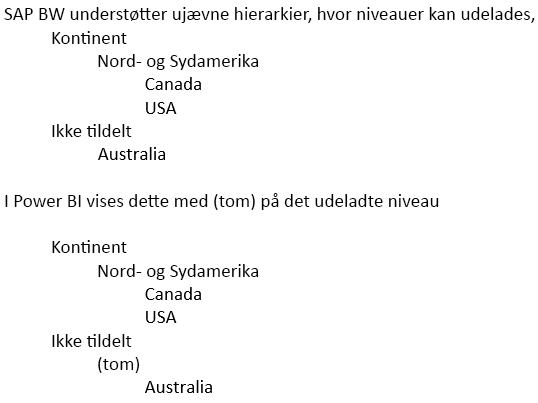

# Opret forbindelse til SAP Business Warehouse ved hjælp af DirectQuery i Power BI
Du kan oprette forbindelse til **SAP Business Warehouse (BW)** -datakilder direkte ved hjælp af **DirectQuery**. Da der arbejdes med OLAP/flere dimensioner i SAP BW, er der mange vigtige forskelle mellem DirectQuery via SAP BW og relationskilder som SQL Server. Disse forskelle kan opsummeres på følgende måde:

* I **DirectQuery** via relationsdatakilder er der et sæt forespørgsler (som defineret i dialogboksen **Hent data** eller **Forespørgselseditor**), der på en logisk måde definerer de data, der er tilgængelige på feltlisten. Dette er *ikke* tilfældet, når der oprettes forbindelse til en OLAP-kilde, f.eks. SAP BW. Når der oprettes forbindelse til SAP-serveren med **Hent data**, er det i stedet bare Infocube- eller BEx-forespørgslen, der vælges. Derefter vil alle nøgletal og dimensioner for den valgte Infocube-/BEx-forespørgsel være tilgængelige på feltlisten.   
* På samme måde er der ingen **forespørgselseditor**, når du opretter forbindelse til SAP BW. Du kan ændre indstillingerne for datakilden (f.eks. servernavn) ved at vælge **Rediger forespørgsler > Indstillinger for datakilde**. Du kan ændre indstillingerne for alle parametre ved at vælge **Rediger forespørgsler > Administrer parametre**.
* På grund af OLAP-kildernes helt særlige karakter gælder der yderligere begrænsninger (både for udformning og visualiseringer) ud over de normale begrænsninger, der gælder i forbindelse med DirectQuery. Disse begrænsninger beskrives senere i denne artikel.

Det er desuden *meget vigtigt* at forstå, at der er mange funktioner i SAP BW, som ikke understøttes i Power BI, og at der på grund af funktionsmåden for den offentlige grænseflade i SAP BW er vigtige tilfælde, hvor de resultater, der registreres via Power BI, ikke stemmer overens med dem, der registreres ved hjælp af et SAP-værktøj. Disse begrænsninger beskrives senere i denne artikel. Disse forskelle i begrænsninger og funktionsmåde skal gennemses omhyggeligt for at sikre, at de resultater, der registreres via Power BI, og som returneres af den offentlige SAP-grænseflade, fortolkes korrekt.  

> [!NOTE]
> Funktionaliteten ved at bruge DirectQuery via SAP BW var en prøveversion indtil opdateringen i marts 2018 til Power BI Desktop. I prøveversionen medførte feedback og forslag til forbedringer en ændring, der påvirkede rapporter, som blev oprettet ved hjælp af denne prøveversion. Nu hvor DirectQuery via SAP BW er generel tilgængelig, *skal* du kassere alle eksisterende rapporter, der er baseret på prøveversionen og oprettet ved hjælp af DirectQuery via SAP BW fra før den blev generel tilgængelig. I rapporter, som blev oprettet ved hjælp af prøveversionen af DirectQuery via SAP BW, vil der opstå fejl, når de opdateres, idet metadataene forsøges opdateret med ændringer af den underliggende SAP BW-kube. Du skal genoprette disse rapporter ud fra en tom rapport ved hjælp af versionen af DirectQuery via SAP BW, der er generel tilgængelig. 

## Yderligere begrænsninger for udformning
De primære yderligere begrænsninger for udformning, der gælder, når der oprettes forbindelse til SAP BW ved hjælp af DirectQuery i Power BI, er følgende:

* **Ingen understøttelse af beregnede kolonner:** Muligheden for at oprette beregnede kolonner er deaktiveret. Det betyder også, at gruppering og clustering, som opretter beregnede kolonner, ikke er tilgængelig.
* **Yderligere begrænsninger for målinger:** Der er yderligere begrænsninger i DAX-udtryk, som kan bruges i målinger, der afspejler den samme understøttelse som den, der tilbydes af SAP BW.
* **Ingen understøttelse af definerende relationer:** Relationerne er indbygget i den eksterne SAP-kilde, og der kan ikke defineres yderligere relationer i modellen.
* **Ingen datavisning:** **Datavisningen** viser som regel dataene på detaljeniveau i tabeller. På grund af funktionsmåden for OLAP-kilder, f.eks. SAP BW, er denne visning ikke tilgængelig via SAP BW.
* **Kolonne- og måleoplysninger er faste:** Listen over kolonner og mål, der er registreret på feltlisten, er fastsat af den underliggende kilde og kan ikke ændres. Det er f.eks. ikke muligt at slette en kolonne eller at ændre datatypen (den kan dog omdøbes).
* **Yderligere begrænsninger i DAX:** Der er flere begrænsninger for DAX, der kan bruges i definitioner af målinger til at afspejle begrænsningerne i kilden. Det er f.eks. ikke muligt at bruge en aggregeringsfunktion via en tabel.

## Yderligere visualiseringsbegrænsninger
De primære yderligere begrænsninger for visualisering, der gælder, når der oprettes forbindelse til SAP BW ved hjælp af DirectQuery i Power BI, er følgende:

* **Ingen aggregering af kolonner:** Det er ikke muligt at ændre aggregeringen for en kolonne på en visualisering. Det er altid *Opsummer ikke*
* **Filtrering af måling er deaktiveret:** Filtrering af måling er deaktiveret for at afspejle den understøttelse, der leveres i SAP BW.
* **Flere markeringer og inkluder/udelad:** Muligheden for at foretage flere markeringer af datapunkter i et visuelt element er deaktiveret, hvis punkterne repræsenterer værdier fra mere end én kolonne. Hvis et søjlediagram f.eks. viser Sales by Country med kategori på forklaringen, er det ikke muligt at vælge punktet for (USA, Bikes) og (France, Clothes). På samme måde er det ikke muligt at vælge punktet for (USA, Bikes) og udelade det fra det visuelle element. Begge begrænsninger er angivet for at afspejle den understøttelse, der leveres i SAP BW.

## Understøttelse af SAP BW-funktioner
I følgende tabel vises alle SAP BW-funktioner, der ikke understøttes fuldt ud, eller som fungerer anderledes, når du bruger Power BI.   

| Funktion | Beskrivelse |
| --- | --- |
| Lokale beregninger |Lokale beregninger, der er defineret i en BEx-forespørgsel, ændrer de tal, som vises via værktøjer som BEx Analyzer. De afspejles dog ikke i de tal, der returneres fra SAP, på den offentlige MDX-grænseflade.     **Derfor stemmer de tal, der vises i et visuelt Power BI-element, ikke nødvendigvis overens med tallene for et tilsvarende visuelt element i et SAP-værktøj.**     Når der f.eks. oprettes forbindelse til en forespørgselskube fra en BEx-forespørgsel, der angiver, at aggregeringen skal være akkumuleret (dvs. løbende sum), modtager Power BI de grundlæggende tal, og denne indstilling ignoreres.  En analytiker kan derefter anvende en beregning af løbende sum lokalt i Power BI, men er nødt til at være forsigtig, når tallene fortolkes, hvis dette ikke er udført. |
| Aggregeringer |I nogle tilfælde (især når det drejer sig om flere valutaer) stemmer de aggregerede tal, der returneres af SAPs offentlige grænseflade, ikke overens med dem, der vises af SAP-værktøjer.     **Derfor stemmer de tal, der vises i et visuelt Power BI-element, ikke nødvendigvis overens med tallene for et tilsvarende visuelt element i et SAP-værktøj.**     Totaler med forskellige valutaer kan f.eks. vises som "*" i BEx Analyzer, men totalen returneres af SAPs offentlige grænseflade uden oplysninger om, at et sådant aggregeret tal er meningsløst. Dermed vises tallet (f.eks. aggregeringen $, EUR og AUD) af Power BI. |
| Formatering af valuta |Enhver valutaformatering (f.eks. $2,300 eller 4000 AUD) afspejles ikke i Power BI. |
| Måleenhed |Måleenheder (f.eks. 230 KG) afspejles ikke i Power BI. |
| Nøgle i forhold til tekst (kort, mellem, lang) |For en SAP BW-egenskab, f.eks. CostCenter, viser feltlisten en enkelt kolonne, Cost Center.  Hvis denne kolonne bruges, vises standardteksten.  Ved at vise skjulte felter er det også muligt at se kolonnen med det entydige navn (der returnerer det entydige navn, som er tilknyttet af SAP BW og grunden til, at det er entydigt).     Nøglen og alle andre tekstfelter er ikke tilgængelige. |
| Flere hierarkier for en egenskab |I **SAP** kan en egenskab have flere hierarkier. Når en egenskab derefter medtages i en forespørgsel i værktøjer som BEx Analyzer, kan brugeren vælge det hierarki, der skal bruges.     I **Power BI** kan de forskellige hierarkier ses på feltlisten som forskellige hierarkier på den samme dimension.  Men hvis du vælger flere niveauer fra to forskellige hierarkier på den samme dimension, medfører det, at der returneres tomme data af SAP. |
| Behandling af ujævne hierarkier | |
| Skaleringsfaktor/vend fortegn |I SAP kan et nøgletal have en skaleringsfaktor (f.eks. 1000) defineret som en formateringsfunktion, hvilket betyder, at alt det, der vises, skaleres med den pågældende faktor.     Det kan på samme måde indeholde et egenskabssæt, der vender fortegnet. Hvis du bruger dette nøgletal i Power BI (i et visuelt element eller som en del af en beregning), medfører det, at det ikke-skalerede tal bruges (og fortegnet vendes ikke). Den underliggende skaleringsfaktor er ikke tilgængelig. I visuelle elementer i Power BI kan du styre skalaenheder, der vises på aksen (K,M,B), som en del af den visuelle formatering. |
| Hierarkier, når niveauer vises/forsvinder dynamisk |Når du i starten opretter forbindelse til SAP BW, hentes oplysningerne på niveauerne i et hierarki, hvorved der oprettes et sæt felter på feltlisten. Dette cachelagres, og hvis niveauerne ændres, ændres felterne ikke, før opdateringen er aktiveret.     Dette er kun muligt i **Power BI Desktop**. En sådan opdatering, der skal afspejle ændringer af niveauerne, kan ikke aktiveres i Power BI-tjenesten efter udgivelsen. |
| Standardfilter |En BEx-forespørgsel kan indeholde standardfiltre, som automatisk anvendes af SAP BEx Analyzer. Disse filtre vises ikke, og derfor vil den tilsvarende brug i Power BI ikke som standard anvende de samme filtre. |
| Skjulte nøgletal |En BEx-forespørgsel kan styre synligheden af nøgletal, og dem, der er skjulte, vises ikke i SAP BEx Analyzer. Dette afspejles ikke i den offentlige API, og derfor vises sådanne skjulte nøgletal stadig på feltlisten. De kan dog skjules i Power BI. |
| Numerisk formatering |Enhver numerisk formatering (antal decimaltal, decimaltegn osv.) afspejles ikke automatisk i Power BI. Det er dog muligt at styre denne formatering fra Power BI. |
| Hierarkiversioner |I SAP BW kan der vedligeholdes forskellige versioner af et hierarki, f.eks. hierarkiet for omkostningssted i 2007 i forhold til 2008. Det er kun den seneste version, der er tilgængelig i Power BI, da oplysninger om versioner ikke vises af den offentlige API. |
| Tidsafhængige hierarkier |Når du bruger Power BI, evalueres tidsafhængige hierarkier til dags dato. |
| Valutakonvertering |SAP BW understøtter valutakonvertering baseret på satser, der findes i kuben. Disse funktioner eksponeres ikke af den offentlige API og er derfor ikke tilgængelige i Power BI. |
| Sorteringsrækkefølge |Sorteringsrækkefølgen (efter tekst eller efter nøgle) for en egenskab kan defineres i SAP. Denne sorteringsrækkefølge afspejles ikke i Power BI. For eksempel kan måneder vises som "April", "August" osv.     Det er ikke muligt at ændre denne sorteringsrækkefølge i Power BI. |
| Tekniske navne |I **Hent data** vises der både navne på egenskaber/målinger (beskrivelser) og tekniske navne. Feltlisten indeholder kun navne på egenskaber/målinger (beskrivelser). |
| Attributter |Det er ikke muligt at få adgang til attributterne for en egenskab i Power BI. |
| Slutbrugerens sprogindstilling |Den landestandard, der bruges til at oprette forbindelse til SAP BW, er angivet som en del af forbindelsesoplysningerne, og den afspejler ikke landestandarden for den endelige forbruger af rapporten. |
| Tekstvariabler |I SAP BW kan feltnavne indeholde pladsholdere for variabler (f.eks. "$YEAR$ Actuals"), der erstattes med den valgte værdi. Feltet vises f.eks. som "2016 Actuals" i BEx-værktøjer, hvis året 2016 er valgt som variabel.     Kolonnenavnet i Power BI ændres ikke afhængigt af variabelværdien, og det vises derfor som "$YEAR$ Actuals".  Men kolonnenavnet kan derefter ændres i Power BI. |
| Kundehookvariabler | Kundehookvariabler fremvises ikke af den offentlige API og understøttes derfor ikke af Power BI. |
| Karakteristiske strukturer | Eventuelle karakteristiske strukturer i den underliggende SAP BW-kilde vil resultere i, at der bliver fremvist en "eksplosion" af målinger i Power BI. Fire målinger vil f.eks. blive fremvist ved to målinger "Sales" og "Costs" og en karakteristisk struktur, der indeholder "Budget" og "Actual": Sales.Budget, Sales.Actual, Costs.Budget, Costs.Actual. |

## Næste trin
Du kan finde flere oplysninger om DirectQuery i følgende ressourcer:

* [DirectQuery i Power BI](desktop-directquery-about.md)
* [Datakilder, der understøttes af DirectQuery](power-bi-data-sources.md)
* [DirectQuery og SAP HANA](desktop-directquery-sap-hana.md)
