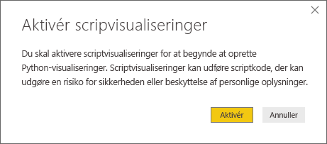
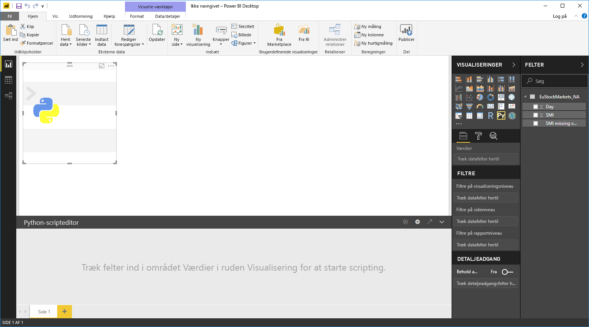
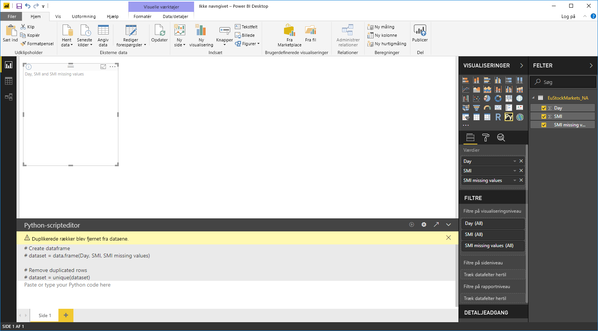
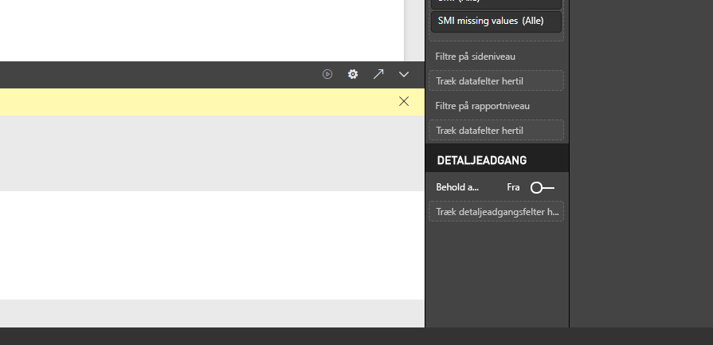

# Brug et eksternt Python-IDE sammen med Power BI
Du kan bruge dit eksterne Python IDE (Integrated Development Environment) sammen med **Power BI Desktop** til at oprette og tilpasse Python scripts og derefter bruge de pågældende scripts i Power BI.

## Aktivér et eksternt Python-IDE
Du kan starte dit eksterne Python-IDE fra **Power BI Desktop** og automatisk få dine data importeret og vist i Python-IDE'et. Herfra kan du ændre scriptet i det eksterne Python-IDE og derefter indsætte det i **Power BI Desktop** igen for at oprette Power BI-visuals og -rapporter.

Du kan angive, hvilket Python-IDE, du vil bruge, og få det startet automatisk fra **Power BI Desktop**.

### Krav
Hvis du vil bruge denne funktion, skal du installere et **Python-IDE** på din lokale computer. Python-programmet er ikke indeholdt, udrullet eller installeret i **Power BI Desktop**, så du skal installere **Python** separat på din lokale computer. Du kan vælge, hvilket Python-IDE du vil bruge, med følgende indstillinger:

* Du kan installere dit foretrukne Python-IDE, hvoraf mange er gratis, f.eks. [overførselssiden for Visual Studio Code](https://code.visualstudio.com/download/).
* **Power BI Desktop** understøtter også **Visual Studio**.
* Du kan også installere et andet Python-IDE og få **Power BI Desktop** til at starte det pågældende **Python-IDE** ved at gøre et af følgende:
  
  * Du kan knytte **.PY**-filer til det eksterne IDE, som **Power BI Desktop** skal starte.
  * Du kan angive den .exe-fil, **Power BI Desktop** skal starte, ved at vælge *Andre* i afsnittet **Indstillinger for Python-script** i dialogboksen **Indstillinger**. Du kan få vist dialogboksen **Indstillinger** ved at gå til **Fil > Indstillinger > Indstillinger**.
    
    

Hvis du har installeret flere Python-IDE'er, kan du angive, hvilket af dem der skal startes, ved at vælge det på rullelisten *Fundne Python-IDE'er* i dialogboksen **Indstillinger**.

Som standard starter **Power BI Desktop** **Visual Studio Code** som det eksterne Python-IDE, hvis programmet er installeret på din lokale computer. Hvis **Visual Studio Code** ikke er installeret, og du har **Visual Studio**, startes dette program i stedet. Hvis ingen af disse Python-IDE'er er installeret, startes det program, som er knyttet til **.PY**-filer.

Og hvis der ikke findes nogen **.PY**-filtilknytning, er det muligt at angive en sti til et brugerdefineret IDE i afsnittet *Browse to your preferred Python IDE* (Søg efter dit foretrukne Python-IDE) i dialogboksen **Indstillinger** dialog. Du kan også starte et andet Python-IDE ved at vælge tandhjulsikonet **Indstillinger** ud for pileikonet **Launch Python IDE** (Start Python-IDE) i **Power BI Desktop**.

## Start et Python-IDE fra Power BI Desktop
Benyt følgende fremgangsmåde for at starte et Python-IDE fra **Power BI Desktop**:

1. Indlæs data i **Power BI Desktop**.
2. Vælg nogle felter fra ruden **Felter**, som du vil arbejde med. Hvis du endnu ikke har aktiveret visuelle script-elementer, bliver du bedt om at gøre dette.
   
   
3. Når scriptvisuals er aktiveret, kan du vælge en Python-visual i ruden **Visualiseringer**, hvilket bevirker, at der oprettes en tom Python-visual, der er klar til at vise resultaterne af scriptet. Ruden **Phyton Scripteditor** vises også.
   
   
4. Nu kan du vælge de felter, som du ønsker at bruge i Python-scriptet. Når du vælger et felt, opretter feltet **Phyton Scripteditor** automatisk script-kode, der er baseret på det eller de felter, du vælger. Du kan enten oprette (eller indsætte) Python-scriptet direkte i ruden **Phyton Scripteditor** eller lade feltet være tomt.
   
   
   
   > [!NOTE]
   > Standardsammenlægningstypen for Python-visuals er *Opsummer ikke*.
   > 
   > 
5. Du kan nu starte dit Python-IDE direkte fra **Power BI Desktop**. Vælg knappen **Launch Python-IDE** (Start Python-IDE), der findes til højre for titellinjen **Phyton Scripteditor**, som vist nedenfor.
   
   
6. Det angivne Python-IDE startes af Power BI Desktop, som det vises på følgende billede (på dette billede er **Visual Studio Code** standard-Python-IDE'et).
   
   
   
   > [!NOTE]
   > **Power BI Desktop** tilføjer de første tre linjer af scriptet, således at den kan importere dine data **Power BI Desktop**, når du kører scriptet.
   > 
   > 
7. De scripts, som du har oprettet i **ruden Phyton Scripteditor** i **Power BI Desktop**, vises med start i linje 4 i dit Python-IDE. Herefter kan du oprette Python-scriptet i Python-IDE'et. Når Python-scriptet er fuldført i dit Python-IDE, skal du kopiere det og sætte det tilbage i ruden **Phyton Scripteditor** i **Power BI Desktop** og *udelade* de første tre linjer i det script, som **Power BI Desktop** automatisk oprettede. Kopier ikke de første tre linjer af scriptet tilbage til **Power BI Desktop**. Disse linjer blev kun brugt til at importere dine data til Python-IDE'et fra **Power BI Desktop**.

### Kendte begrænsninger
Start af et Python-IDE direkte fra Power BI Desktop har nogle få begrænsninger:

* Automatisk eksport af dit script fra Python-IDE'et til **Power BI Desktop** understøttes ikke.

## Næste trin
Du kan finde yderligere oplysninger om Python i Power BI i følgende artikler.

* [Kørsel af Python-scripts i Power BI Desktop](desktop-python-scripts.md)
* [Opret Power BI-visuals med Python](desktop-python-visuals.md)

