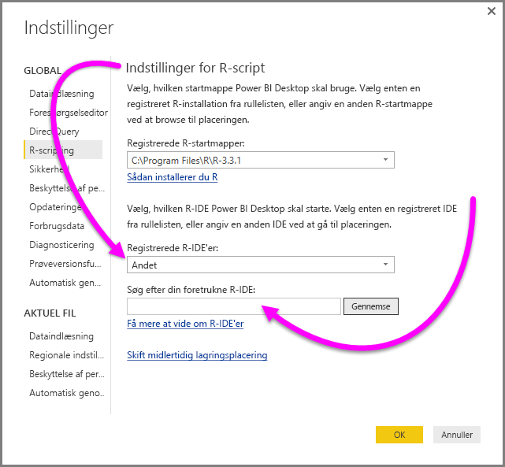
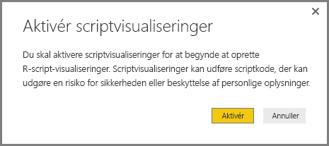
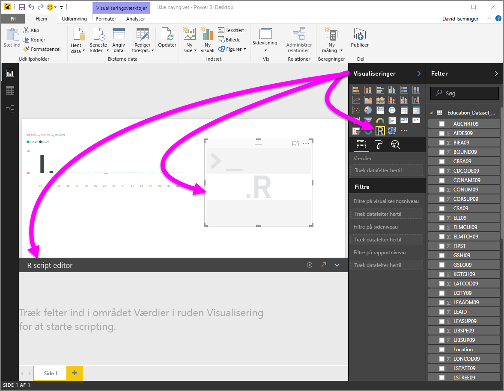
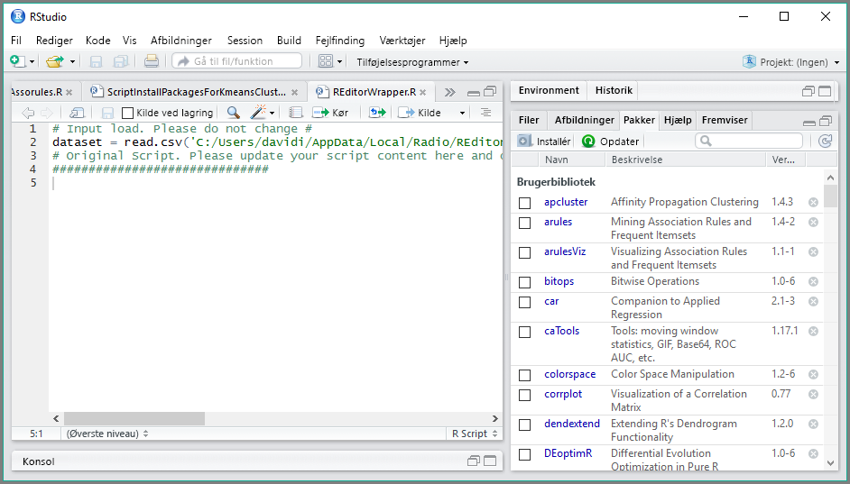

# Brug en ekstern R IDE med Power BI
Med **Power BI Desktop** kan du bruge dit eksterne R IDE (integreret udviklingsmiljø) til at oprette og afgrænse R scripts og derefter bruge disse scripts i Power BI.

## Aktivér et eksternt R IDE
Tidligere var du nødt til at bruge editoren til R-script i **Power BI Desktop** til at oprette og køre R scripts. Med denne version kan du starte din eksterne R-IDE fra **Power BI Desktop** og automatisk få dine data importeret og vist i R-IDE. Herfra kan du ændre scriptet i den eksterne R-IDE, og du kan sætte dem tilbage i **Power BI Desktop** for at oprette visuelle Power BI-elementer og -rapporter.

Fra og med september 2016-versionen af **Power BI Desktop** (version 2.39.4526.362), kan du angive, hvilken R-IDE, du vil bruge, og få den til at starte automatisk fra **Power BI Desktop**.

### Krav
Hvis du vil bruge denne funktion, skal du installere en **R-IDE** på din lokale computer. R-programmet er ikke indeholdt, udrullet eller installeret i **Power BI Desktop**, så du skal installere **R** separat på din lokale computer. Du kan vælge, hvilken R-IDE du vil bruge, med følgende indstillinger:

* Du kan installere din foretrukne R-IDE, hvoraf mange er gratis, som f.eks. [overførselssiden Revolution Open](https://mran.revolutionanalytics.com/download/), og [CRAN-lageret](https://cran.r-project.org/bin/windows/base/).
* **Power BI Desktop** understøtter også [R Studio](https://www.rstudio.com/) og **Visual Studio 2015** med [*R-værktøjer til Visual Studio*](/visualstudio/rtvs)-editorer.
* Du kan også installere en anden R-IDE og få **Power BI Desktop** til at starte denne **R-IDE** ved at gøre en af følgende ting:
  
  * Du kan knytte **. R**-filer til den eksterne IDE, som du ønsker **Power BI Desktop** skal starte.
  * Du kan angive den .exe, **Power BI Desktop** skal starte, ved at vælge *Andre* fra sektionen **Indstillinger for R-script** i dialogboksen **Indstillinger**. Du kan få vist dialogboksen **Indstillinger** ved at gå til **Fil > Indstillinger > Indstillinger**.
    
    

Hvis du har installeret flere R-IDE'er, kan du angive, hvilken, der skal startes, ved at vælge den på rullelisten *Fundne R-IDE'er* i dialogboksen **Indstillinger**.

Som standard starter **Power BI Desktop** **R Studio** som den eksterne R-IDE, hvis den er installeret på din lokale computer. Hvis **R Studio** ikke er installeret, og du har **Visual Studio 2015** med **R-værktøjer til Visual Studio**, startes dette i stedet. Hvis ingen af disse R-IDE'er er installeret, startes det program, som er knyttet til **. R**-filer.

Og hvis der ikke findes nogen **.R**-fil-tilknytning, er det muligt at angive en sti til en brugerdefineret IDE i sektionen *Søg efter din foretrukne R-IDE* i dialogboksen **Indstillinger**. Du kan også starte en anden R-IDE ved at vælge udstyrsikonet **Indstillinger** ud for pileikonet **Start R-IDE** i **Power BI Desktop**.

## Start en R-IDE fra Power BI Desktop
Benyt følgende fremgangsmåde for at starte en R-IDE fra **Power BI Desktop**:

1. Indlæs data i **Power BI Desktop**.
2. Vælg nogle felter fra ruden **Felter**, som du vil arbejde med. Hvis du endnu ikke har aktiveret visuelle script-elementer, bliver du bedt om at gøre dette.
   
   
3. Når visuelle script-elementer er aktiveret, kan du vælge et visuelt R-element fra ruden **Visualiseringer**, som opretter et tomt visuelt R-element, der er klart til at vise resultaterne af scriptet. Ruden **R-scripteditor** vises også.
   
   
4. Nu kan du vælge de felter, som du ønsker at bruge i R-scriptet. Når du vælger et felt, opretter feltet **R-scripteditor** automatisk script-kode, der er baseret på det eller de felter, du vælger. Du kan enten oprette (eller indsætte) R-scriptet direkte i ruden **R-scripteditor** eller lade feltet være tomt.
   
   
   
   > [!NOTE]
   > Standardsammenlægningstypen for R-visualiseringer er *Opsummer ikke*.
   > 
   > 
5. Du kan nu starte din R-IDE direkte fra **Power BI Desktop**. Vælg knappen **Start R-IDE**, der findes til højre for titellinjen **R-scripteditor**, som vist nedenfor.
   
   
6. Den angivne R-IDE startes af Power BI Desktop, som det vises på følgende billede (på dette billede er **RStudio** standard-R-IDE).
   
   
   
   > [!NOTE]
   > **Power BI Desktop** tilføjer de første tre linjer af scriptet, således at den kan importere dine data **Power BI Desktop**, når du kører scriptet.
   > 
   > 
7. De scripts, som du har oprettet i **R-scripteditor-ruden** på **Power BI Desktop**, vises med start på linje 4 i din R-IDE. Herefter kan du oprette R-scriptet i R-IDE'en. Når R-scriptet er fuldført i din R-IDE, skal du kopiere det og sætte det tilbage i **R-scripteditor**-ruden i **Power BI Desktop** og *udelade* de første tre linjer i det script, som **Power BI Desktop** automatisk genererede. Kopier ikke de første tre linjer af scriptet tilbage til **Power BI Desktop**. Disse linjer blev kun brugt til at importere dine data til din R-IDE fra **Power BI Desktop**.

### Kendte begrænsninger
Start af en R-IDE direkte fra Power BI Desktop har nogle få begrænsninger:

* Automatisk eksport af dit script fra din R-IDE til **Power BI Desktop** understøttes ikke.
* **R-klient**-editoren (RGui.exe) understøttes ikke, fordi selve editoren ikke understøtter åbning af filer.

## De næste trin
Du kan finde flere oplysninger om R i Power BI i følgende artikler.

* [Kørsel af R-scripts i Power BI Desktop](desktop-r-scripts.md)
* [Opret visuelle Power BI-elementer ved hjælp af R](../create-reports/desktop-r-visuals.md)
