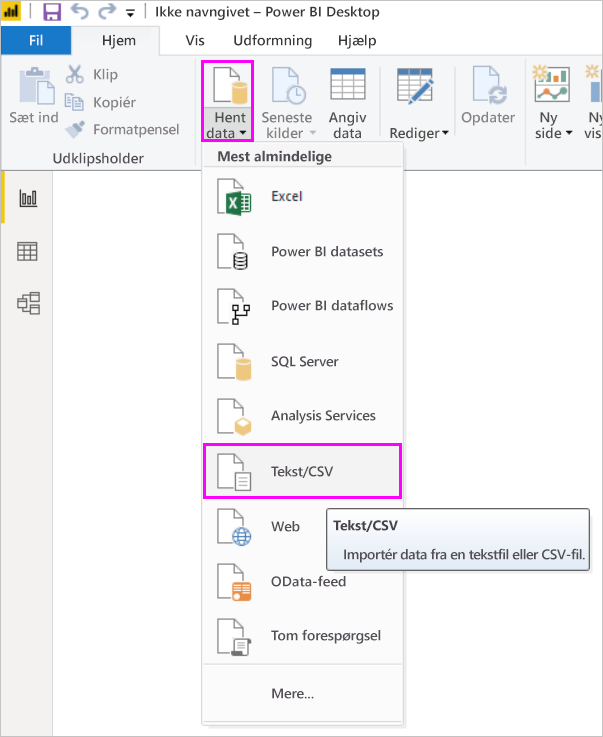
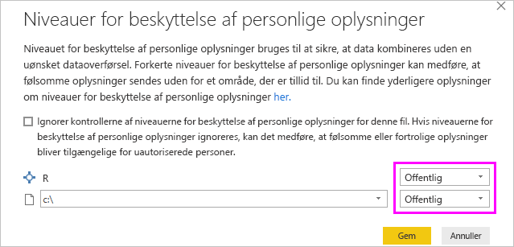
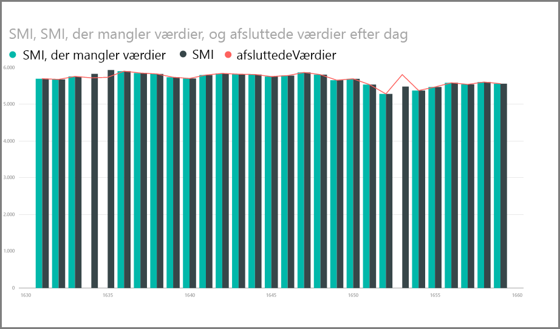
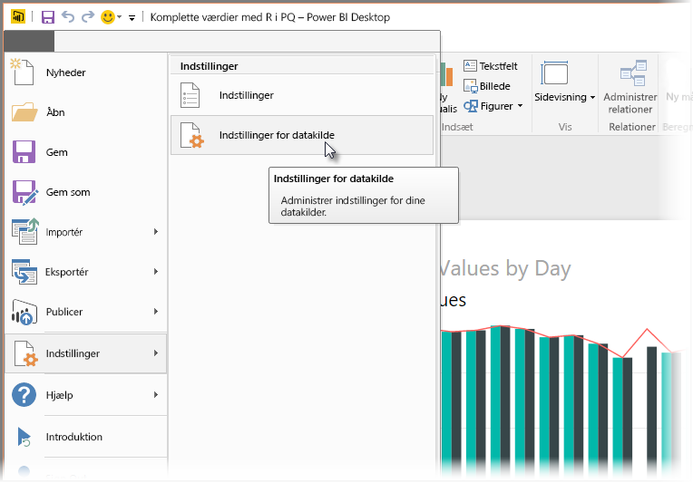

# <a name="use-r-in-power-query-editor"></a>Brug R i Forespørgselseditor i Power BI

[R-sproget](https://mran.microsoft.com/documents/what-is-r) er et effektivt programmeringssprog, som mange statistikere, dataeksperter og dataanalytikere bruger. Du kan bruge R i Power BI Desktops Power-forespørgselseditor til at:

* Forberede datamodeller.

* Oprette rapporter.

* Foretag rensning af data, avanceret dataudformning og analyse af datasæt, hvilket omfatter fuldførelse af manglende data, forudsigelser, klynger og meget mere.  

## <a name="install-r"></a>Installér R

Du kan downloade R gratis fra downloadsiden for [Revolution Open](https://mran.revolutionanalytics.com/download/) og [CRAN Repository](https://cran.r-project.org/bin/windows/base/).

## <a name="install-mice"></a>Installér mice

Du skal som forudsætning installere [mice-biblioteket](https://www.rdocumentation.org/packages/mice/versions/3.5.0/topics/mice) i dit R-miljø. Uden mice fungerer eksempelscriptkoden ikke korrekt. Med mice-pakken implementeres en metode til at håndtere manglende data.

Sådan installerer du mice-biblioteket:

1. Start R.exe-programmet (f.eks. C:\Program Files\Microsoft\R Open\R-3.5.3\bin\R.exe).  

2. Kør installationskommandoen fra R-prompten:

   ``` 
   install.packages('mice') 
   ```

## <a name="use-r-in-power-query-editor"></a>Brug R i Forespørgselseditor i Power BI

Til at demonstrere brugen af R i Power-forespørgselseditor bruger vi et datasæt, der er indeholdt i en CSV-fil, fra aktiemarkedet som eksempel og gennemgår følgende trin:

1. [Download filen EuStockMarkets_NA.csv](https://download.microsoft.com/download/F/8/A/F8AA9DC9-8545-4AAE-9305-27AD1D01DC03/EuStockMarkets_NA.csv). Husk, hvor du gemmer den.

1. Indlæs filen i Power BI Desktop. På fanen **Hjem** skal du vælge **Hent data** > **Tekst/CSV**.

   

1. Vælg filen EuStockMarkets_NA. csv, og vælg derefter **Åbn**. CSV-dataene vises i dialogboksen **Tekst/CSV**.

   

1. Vælg **Indlæs** for at indlæse dataene fra filen. Når Power BI har indlæst dataene, vises den nye tabel i ruden **Felter**.

   

1. Du åbner Power-forespørgselseditor ved at vælge **Rediger forespørgsler** på båndet **Hjem**.

   

1. Vælg **Kør R-script** på fanen **Transformér**. Editoren **Kør R-script** vises. Række 15 og 20 mangler data ligesom andre rækker, du ikke kan se på billedet. Trinnene nedenfor viser, hvordan R udfylder rækkerne for dig.

   

1. I dette eksempel skal du angive følgende scriptkode i feltet **Script** i vinduet **Kør R-script**. Sørg for at erstatte *&lt;Din filsti&gt;* med stien til EuStockMarkets_NA.csv i dit lokale filsystem, f.eks. C:/Users/John Doe/Documents/Microsoft/EuStockMarkets_NA.csv.

    ```r
       dataset <- read.csv(file="<Your File Path>/EuStockMarkets_NA.csv", header=TRUE, sep=",")
       library(mice)
       tempData <- mice(dataset,m=1,maxit=50,meth='pmm',seed=100)
       completedData <- complete(tempData,1)
       output <- dataset
       output$completedValues <- completedData$"SMI missing values"
    ```

    > [!NOTE]
    > Det kan være nødvendigt at overskrive en variabel kaldet *output* for at oprette det nye datasæt med filtrene anvendt.

7. Vælg **OK**. Der vises en advarsel om beskyttelse af personlige data i Power-forespørgselseditoren.

   
8. Vælg **Fortsæt** i advarselsmeddelelsen. I dialogboksen **Beskyttelsesniveauer**, der vises, skal du angive alle datakilder til **Offentlige**, for at R-scriptene fungerer korrekt i Power BI-tjenesten. 

   

   Du kan få flere oplysninger om indstillinger for beskyttelse af personlige oplysninger og deres konsekvenser under [Niveauer for beskyttelse af personlige oplysninger i Power BI Desktop](../admin/desktop-privacy-levels.md).

 9. Vælg **Gem** for at køre scriptet. 

   Bemærk den nye kolonne i ruden **Felter** ved navn **completedValues**. Der mangler et par dataelementer, f.eks. i række 15 og 18, i denne kolonne. Se, hvordan R håndterer dette, i næste afsnit.

   Med blot fem linjer R-script udfyldte Power-forespørgselseditoren de manglende værdier med en forudsigende model.

## <a name="create-visuals-from-r-script-data"></a>Opret visualiseringer på baggrund af data fra R-scripts

Vi kan nu oprette en visualisering for at se, hvordan R-scriptkoden afslutter de manglende værdier med mice-biblioteket.



Du kan gemme alle fuldførte visualiseringer i én PBIX-fil i Power BI Desktop og bruge datamodellen og dens R-scripts i Power BI-tjenesten.

> [!NOTE]
> Du kan [downloade en .pbix-fil](https://download.microsoft.com/download/F/8/A/F8AA9DC9-8545-4AAE-9305-27AD1D01DC03/Complete%20Values%20with%20R%20in%20PQ.pbix) med alle disse trin fuldført.

Når du har uploadet PBIX-filen til Power BI-tjenesten, skal du udføre yderligere trin for at aktivere opdatering af tjenestedata og opdaterede visualiseringer:  

* **Aktivér planlagt opdatering af datasættet**: Hvis du vil aktivere planlagt opdatering for den projektmappe, der indeholder dit datasæt med R-scripts, skal du se [Konfigurer planlagt opdatering](refresh-scheduled-refresh.md). Denne artikel indeholder også oplysninger om personlige gateways.

* **Installer en personlig gateway**: Du skal have en personlig gateway installeret på den computer, hvor filen og R er placeret. Power BI-tjenesten får adgang til den pågældende projektmappe og gengiver alle opdaterede visualiseringer igen. Du kan finde flere oplysninger under [Brug af personlig gateway i Power BI](service-gateway-personal-mode.md).

## <a name="limitations"></a>Begrænsninger

Der er nogle begrænsninger til forespørgsler, der indeholder R-scripts, der er oprettet i Power-forespørgselseditoren:

* Alle indstillinger for R-datakilden skal angives til **Offentlige**. Alle andre trin i en forespørgsel i Power-forespørgselseditoren skal også være offentlige. 

   Du henter indstillinger for datakilden ved at vælge **Fil** > **Indstillinger** > **Indstillinger for datakilde** i Power BI Desktop.

   

   Vælg en eller flere datakilder i dialogboksen **Indstillinger for datakilde**, og vælg derefter **Rediger tilladelser**. Angiv **Niveau for beskyttelse af personlige oplysninger** til **Offentlig**.

     
  
* Hvis du vil planlægge en opdatering af R-visualiseringerne eller datasættet, skal du aktivere en planlagt opdatering og installere en personlig gateway på den computer, der indeholder projektmappen og R. 

Der er forskellige ting, du kan foretage dig med R og brugerdefinerede forespørgsler. Udforsk og form dine data, præcis som du vil have dem vist.

## <a name="next-steps"></a>Næste trin

* [Introduktion til R](https://mran.microsoft.com/documents/what-is-r) 

* [Kør R-scripts i Power BI Desktop](desktop-r-scripts.md) 

* [Brug en ekstern R-IDE med Power BI](desktop-r-ide.md) 

* [Opret visualiseringer ved hjælp af R-pakker i Power BI-tjenesten](service-r-packages-support.md)
