# Selvstudium: Analysér Facebook-data ved hjælp af Power BI Desktop

I dette selvstudium lærer du, hvordan du importerer data fra Facebook og bruger dem i Power BI Desktop. Du kommer til at oprette forbindelse til og importere data fra Power BI's Facebook-side, anvende transformationer på de importerede data og bruge dataene i rapportvisualiseringer.

> [!WARNING]
> På grund af begrænsninger i Facebook-appen fungerer de connectorfunktioner, der beskrives i denne artikel, ikke korrekt i øjeblikket. Vi arbejder sammen med Facebook om at returnere denne funktionalitet hurtigst muligt.

## Opret forbindelse til en Facebook-side

I dette selvstudium bruges der data fra [Microsoft Power BI's Facebook-side](https://www.facebook.com/microsoftbi). Du behøver ikke nogen særlige legitimationsoplysninger for at oprette forbindelse og importere dataene fra denne side bortset fra en personlig Facebook-konto.

1. Åbn Power BI Desktop, og vælg **Hent data** i dialogboksen **Introduktion**. Du kan også vælge **Hent data** på fanen **Hjem** på båndet og derefter vælge **Mere**.
   
2. I dialogboksen **Hent data** skal du vælge **Facebook** i gruppen **Onlinetjenester** og derefter vælge **Opret forbindelse**.
   
   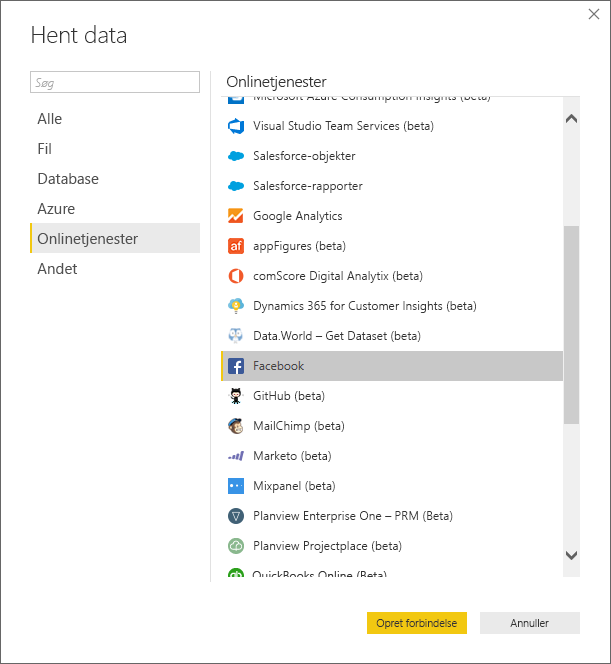
   
   Der vises en dialogboks med en advarsel om risikoen ved at bruge en tredjepartstjeneste.
   
   
   
3. Vælg **Fortsæt**. 
   
4. Skriv sidenavnet **microsoftbi** i dialogboksen **Facebook** som **brugernavnet**, vælg **Poster** på rullelisten **Forbindelse**, og vælg derefter **OK**.
   
   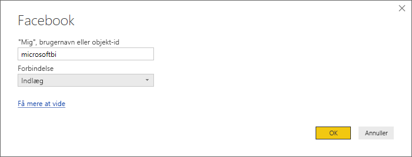
   
5. Når du bliver bedt om dine legitimationsoplysninger, skal du logge på med din egen Facebook-konto og give Power BI adgang via din konto.
   
   

   Når du har oprettet forbindelse til Power BI's Facebook-side, kan du se en eksempelvisning af sidens data med opslag. 
   
   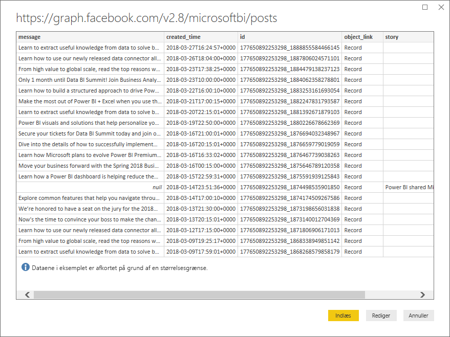
   
## Udform og transformér de importerede data

Lad os antage, at du gerne vil se og vise, hvilke opslag der har fået flest kommentarer i tidens løb, men du har bemærket, at dataene i **created_time** i eksempelvisningen af data er svære at læse og forstå, og at der slet ikke er nogen kommentarer. Du skal udføre og rense dataene for at få flest mulige oplysninger ud af dem. Det gør du ved at bruge Power-forespørgselseditor i Power BI Desktop til at redigere dataene, før eller efter du importerer dem i Power BI Desktop. 

### Opdel kolonnen med dato/klokkeslæt

Adskil først værdierne dato og tid i kolonnen **created_time**, så den bliver mere læsevenlig. 

1. Vælg **Rediger** i eksempelvisningen af Facebook-dataene. 
   
   
   
   Power-forespørgselseditor i Power BI Desktop åbner i et nyt vindue, og eksempelvisningen af dataene fra Power BI's Facebook-side vises. 
   
   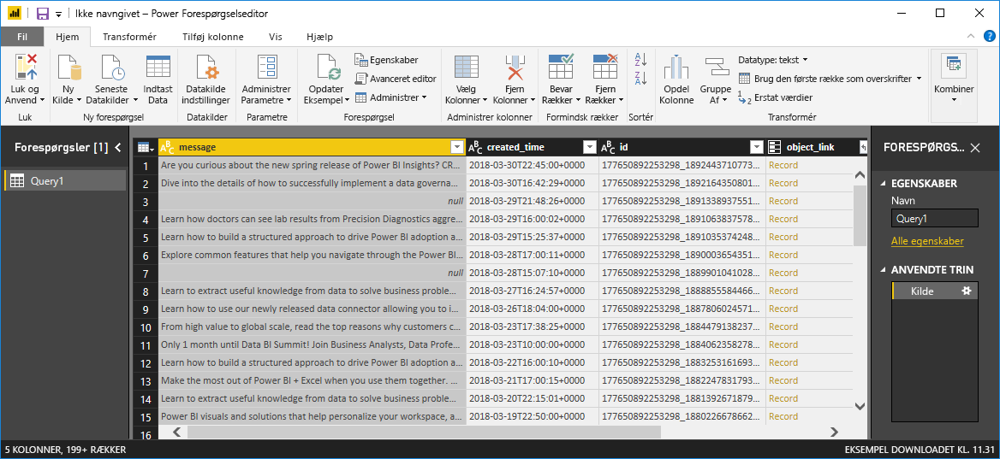
   
2. Vælg kolonnen **created_time**. Bemærk, at datatypen **Tekst** i øjeblikket anvendes, hvilket betegnes med et ikon af typen **ABC** i kolonneoverskriften. Højreklik på overskriften, og vælg **Opdel kolonne** > **Efter afgrænser** på rullelisten. Du kan også vælge **Opdel kolonne** > **Efter afgrænser** i gruppen **Transformér** på fanen **Hjem** på båndet.  
   
   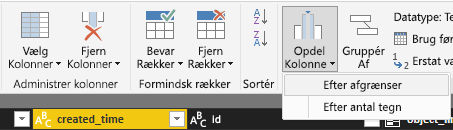
   
3. I dialogboksen **Opdel kolonne efter afgrænser** skal du vælge **Brugerdefineret** i rullemenuen, angive **T** (det tegn, der starter tidsdelen i værdien **created_time**) i inputfeltet og derefter vælge **OK**. 
   
   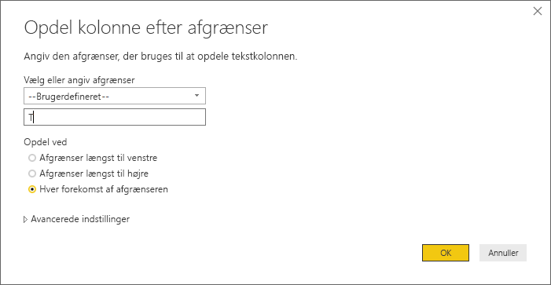
   
   Kolonnen opdeles i to kolonner, der indeholder strengene før og efter afgrænseren *T*. De nye kolonner er navngivet henholdsvis **created_time.1** og **created_time.2**. Power BI har automatisk registreret og ændret datatyperne til **Dato** for den første kolonne og **Tid** for den anden kolonne og formateret dato- og tidsværdierne, så de er mere læsevenlige.
   
4. Omdøb de to kolonner. Vælg kolonnen **created_time.1**, og vælg derefter **Omdøb** i gruppen **En hvilken som helst kolonne** på fanen **Transformér** på båndet. Du kan også dobbeltklikke på kolonneoverskriften og indtaste det nye kolonnenavn **created_date**. Gentag for kolonnen **created_time.2**, og omdøb den til **created_time**.
   
   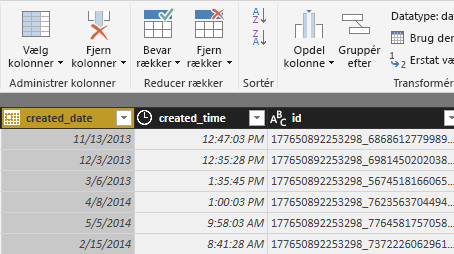
   
### Udvid den indlejrede kolonne

Nu hvor dataene for dato og tid er, som du ønsker, kan du få vist kommentarer ved at udvide en indlejret kolonne. 

1. Vælg  øverst i kolonnen **object_link** for at åbne dialogboksen **Udvid/sammenfat**. Vælg **forbindelser**, og vælg derefter **OK**. 
   
   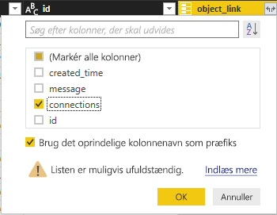
   
   Kolonneoverskriften ændres til **object_link.connections**.
2. Vælg  øverst i kolonnen **object_link.connections** igen, vælg **Kommentarer**, og vælg derefter **OK**. Kolonneoverskriften ændres til **object_link.connections.comments**.
   
3. Vælg  øverst i kolonnen **object_link.connections.comments**, og vælg denne gang **Sammenfat** i stedet for **Udvid** i dialogboksen. Vælg **# Antal id'er**, og vælg derefter **OK**. 
   
   
   
   Antallet af kommentarer for hver meddelelse vises nu i kolonnen. 
   
4. Omdøb kolonnen **Count of object_link.connections.comments.id** til **Number of comments**.
   
5. Vælg pilen i rullemenuen ved siden af overskriften på kolonnen **Antal kommentarer**, og vælg **Sortér faldende** for at se opslag sorteret efter flest til færrest kommentarer. 
   
   
   
### Gennemse forespørgselstrin

Når du udformer og transformerer data i Power-forespørgselseditor, registreres hvert trin i området **Anvendte trin** i ruden **Forespørgselsindstillinger** i højre side af vinduet **Power-forespørgselseditor**. Du kan gå tilbage gennem **Anvendte trin** for at se præcist, hvilke ændringer du har foretaget, og redigere, slette eller omarrangere dem, hvis det er nødvendigt. Vær forsigtig, når du redigerer disse trin, fordi ændring af foregående trin kan ødelægge efterfølgende trin. 

Efter du har anvendt datatransformationerne, bør dine **Anvendte trin** se ud på følgende måde:
   
   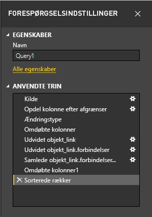
   
   >[!TIP]
   >Bag ved **Anvendte trin** ligger der formler, som er skrevet på [Power-forespørgselssproget M](https://docs.microsoft.com/powerquery-m/quick-tour-of-the-power-query-m-formula-language). Hvis du vil se og redigere formlerne, skal du vælge **Avanceret editor** i gruppen **Forespørgsel** under fanen **Hjem** på båndet. 

### Importér de transformerede data

Når du er tilfreds med dataene, skal du vælge **Luk og anvend** > **Luk og anvend** på fanen **Hjem** på båndet for at importere dem til Power BI Desktop. 
   
   
   
   Der vises en dialogboks med statussen for indlæsningen af data i Power BI Desktop-datamodellen. 
   
   
   
   Når dataene er indlæst, vises de i **Rapportvisningen** som en ny forespørgsel i ruden **Felter**.
   
   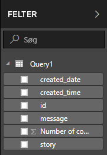
   
## Brug dataene i rapportvisualiseringer 

Nu, hvor du har importeret dataene fra Facebook-siden, kan du hurtigt og nemt få indsigt i dataene ved hjælp af visualiseringer. Det er nemt at oprette en visualisering. Du skal blot markere et felt eller trække det fra ruden **Felter** til rapportcanvasset.

### Opret et liggende søjlediagram

1. I **Rapportvisning** i Power BI Desktop skal du vælge **meddelelse** i ruden **Felter** eller trække den til canvasset. En tabel med alle opslagsmeddelelser vises på canvasset. 
   
   
   
2. Når du har markeret tabellen, skal du også markere **Antal kommentarer** i ruden **Felter** eller trække den ind i tabellen. 
   
3. Vælg ikonet **Stablet liggende søjlediagram** i ruden **Visualiseringer**. Tabellen ændres til et liggende søjlediagram med antallet af kommentarer pr. opslag. 
   
   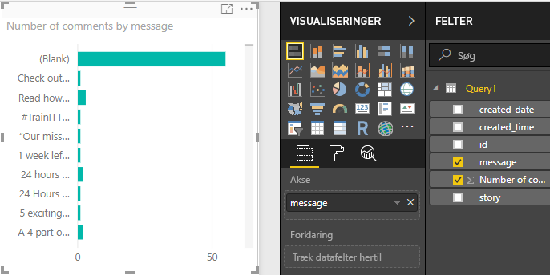
   
4. Vælg **Flere indstillinger** (...) ud for visualiseringen, og vælg derefter **Sortér efter** > **Antal kommentarer** for at sortere tabellen efter antal kommentarer i faldende rækkefølge. 

   Bemærk, at de fleste kommentarer er knyttet til **tomme** meddelelser. Disse opslag kan have været historier, links, videoer eller andet indhold, der ikke er tekst. 
   
5. Hvis du vil bortfiltrere tomme rækker, skal du vælge **meddelelse (alle)** i ruden **Filtre**, vælge **Markér alle** og derefter vælge **Tomme** for at fjerne markeringen af den. 

   Indtastningen i ruden **Filtre** ændres til **meddelelse er ikke (tom)** , og rækken **(Tom)** forsvinder fra diagramvisualiseringen.
   
   
   
### Formatér diagrammet

Visualiseringen bliver mere interessant, men du kan ikke se meget af teksten i opslagene i diagrammet. Gør følgende for at få vist mere af opslagene:

1. Brug håndtagene i diagramvisualiseringen til at tilpasse størrelsen af diagrammet, så det bliver så stort som muligt. 
   
2. Med diagrammet markeret skal du vælge **ikonet Formatér** (malerrullen) i ruden **Visualiseringer**.
   
3. Vælg pilen i rullemenuen ved siden af **Y-akse**, og træk skyderen ved siden af **Maksimumstørrelse** hele vejen til højre (**50 %** ). 
4. Reducer også **Tekststørrelsen** til **10 pkt.** , så der kan være mere tekst.
   
   
   
   Der vises nu mere af indholdet i opslagene i diagrammet. 
   
   
   
Der vises ikke nøjagtige værdier på diagrammets X-akse (antal kommentarer), og det ser lidt malplaceret ud nederst i diagrammet. Lad os bruge datamærkater i stedet: 

1. Vælg ikonet **Formatér**, og vælg derefter skyderen ved siden af **X-akse** for at slå den **Fra**. 
   
2. Skub skyderen **Datamærkater** til **Til**. 

   Nu vises det nøjagtige antal kommentarer for hvert opslag i diagrammet.
   
   
   
### Rediger datatypen

Det nærmer sig, men datamærkaterne har alle decimalen **,0**, hvilket er distraherende og misvisende, eftersom **antallet af opslag** skal være et heltal. Du skal ændre datatypen for kolonnen **Antal poster** til **Heltal**:

1. Højreklik på **Query1** i ruden **Felter**, eller peg på den, og vælg **Flere indstillinger** (...). 

2. Vælg **Rediger forespørgsel** i genvejsmenuen. Du kan også vælge **Rediger forespørgsler** > **Rediger forespørgsler** i gruppen **Eksterne data** på fanen **Hjem** på båndet. 
   
3. I vinduet **Power-forespørgselseditor** skal du vælge kolonnen **Antal kommentarer** og ændre datatypen ved at følge et af disse trin: 
   - Vælg ikonet **1.2** ved siden af kolonneoverskriften **Antal kommentarer**, og vælg **Heltal** i rullemenuen.
   - Højreklik på kolonneoverskriften, og vælg **Skift type** > **Heltal**.
   - Vælg **Datatype: decimaltal** i gruppen **Transformér** på fanen **Hjem** eller i gruppen **En hvilken som helst kolonne** på fanen **Transformér**, og vælg derefter **Heltal**.
   
   Ikonet i kolonneoverskriften ændres til **123**, hvilket betegner datatypen **Heltal**.
   
   
   
3. Du anvender ændringerne ved at vælge **Fil** > **Luk og anvend** eller **Fil** > **Anvend** for at holde vinduet **Power-forespørgselseditor** åbent. 

   Når ændringerne er blevet indlæst, bliver datamærkaterne i diagrammet heltal.
   
   
   
### Opret et dataudsnit

Lad os antage, at du vil visualisere antallet af kommentarer i løbet af en tidsperiode. Du kan oprette en visualisering med udsnit for at filtrere diagramdataene efter forskellige tidsrammer. 

1. Klik på et tomt område på canvasset, og vælg derefter **ikonet Udsnit** i ruden **Visualiseringer**. 

   En tom udsnitsvisualisering vises.
   
   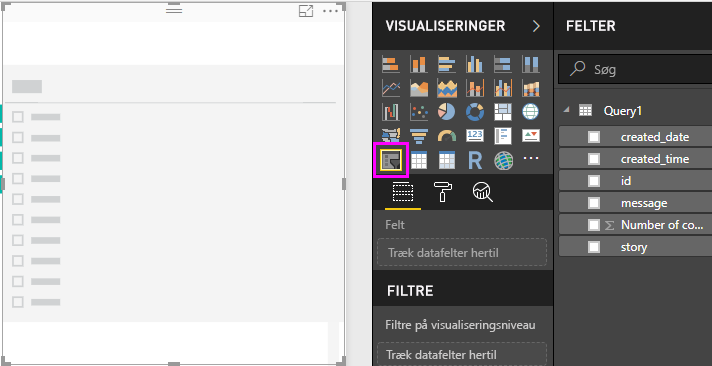
   
2. Vælg feltet **created_date** i ruden **Felter**, eller træk det til det nye udsnit. 

   Udsnittet ændres til et udsnit med et datointerval baseret på feltets datatype for **Dato**.
   
   
   
3. Flyt skyderhåndtagene for at vælge forskellige datointervaller, og bemærk, hvordan diagramdataene filtreres tilsvarende. Du kan også vælge datofelterne i udsnittet, og angive specifikke datoer, eller vælge dem i et pop op-vindue med en kalender.
    
   
   
### Formatér visualiseringerne

Giv diagrammet en mere beskrivende og spændende titel: 

1. Vælg **ikonet for formatér** i ruden **Visualiseringer**, og vælg derefter rullelistepilen ud for **Titel** for at udvide den.

2. Ret **Titelteksten** til **Kommentar pr. opslag**. 

3. Vælg rullelistepilen ud for **Skrifttypefarve**, og vælg derefter en grøn farve for at matche de grønne søjler i visualiseringerne.

4. Øg **Tekststørrelsen** til **10 pkt.** , og ret **Skrifttypefamilien** til **Segoe (Bold)** .

5. Eksperimentér med andre formateringsindstillinger for at ændre udseendet af visualiseringerne. 

   

## Opret flere visualiseringer

Som du kan se, er det nemt at tilpasse visualiseringer i din rapport, så dataene kan præsenteres på den måde, du vil. Prøv f.eks. at bruge de importerede Facebook-data til at oprette dette søjlediagram med antal kommentarer i løbet af en tidsperiode.

Med Power BI Desktop er det nemt at hente data fra en lang række forskellige datakilder og forme dem til dine analysebehov for at kunne visualisere disse data på omfattende og interaktive måder. Når din rapport er færdig, kan du [uploade den til Power BI-tjenesten](../create-reports/desktop-upload-desktop-files.md) og oprette dashboards ud fra den, som du derefter kan dele med andre Power BI-brugere.

## Næste trin
* [Læs andre selvstudier til Power BI Desktop](https://go.microsoft.com/fwlink/?LinkID=521937)
* [Se videoer om Power BI Desktop](https://go.microsoft.com/fwlink/?LinkID=519322)
* [Besøg Power BI-forummet](https://go.microsoft.com/fwlink/?LinkID=519326)
* [Læs Power BI-bloggen](https://go.microsoft.com/fwlink/?LinkID=519327)
