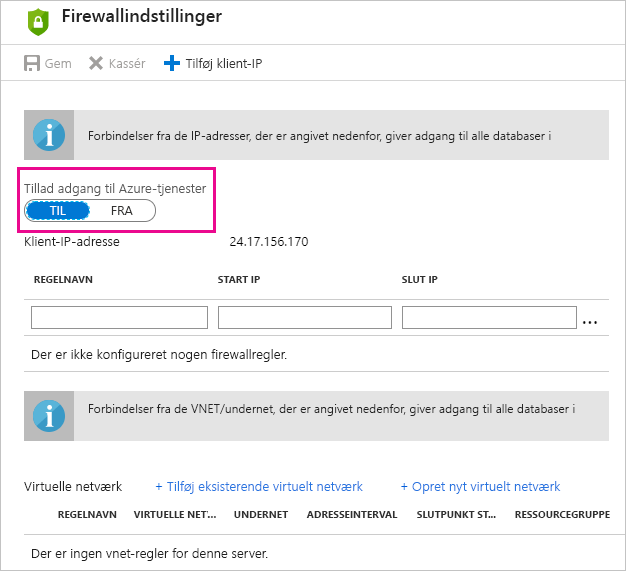

# Fejlfinding i forbindelse med planlagt opdatering af Azure SQL Databases i Power BI

Du kan finde detaljerede oplysninger om opdatering under [Opdater data i Power BI](refresh-data.md) og [Konfigurer planlagt opdatering](refresh-scheduled-refresh.md).

Hvis du får vist en fejl med fejlkoden 400, når du redigerer legitimationsoplysningerne, kan du under konfigurationen af den planlagte opdatering af Azure SQL-database prøve følgende for at konfigurere den relevante firewallregel:

1. Log på [Azure-portalen](https://portal.azure.com).

1. Gå til den Azure SQL-database, du konfigurerer opdateringen for.

1. Øverst i bladet **Oversigt** skal du vælge **Indstil serverfirewall**.

1. På bladet **Indstillinger for firewall** skal du kontrollere, at **Tillad adgang til Azure-tjenester** er indstillet til **ON**.

      

Har du flere spørgsmål? [Prøv at spørge Power BI-community'et](https://community.powerbi.com/)
