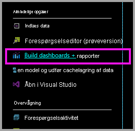
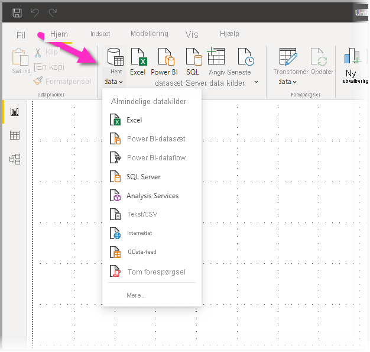
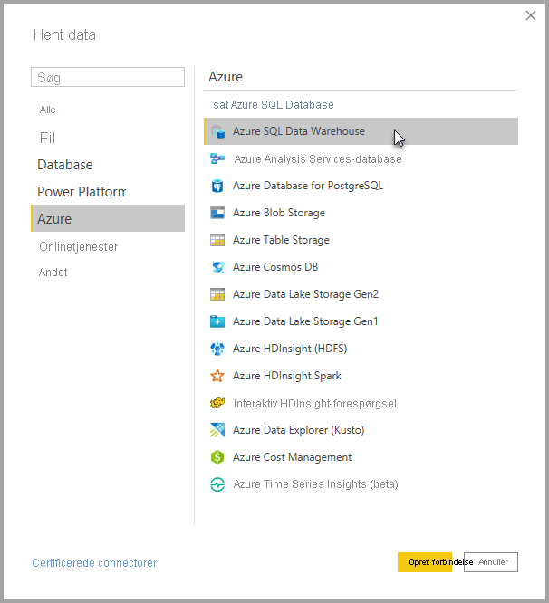
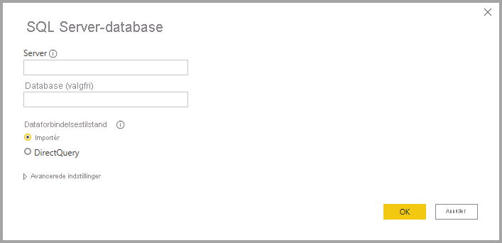
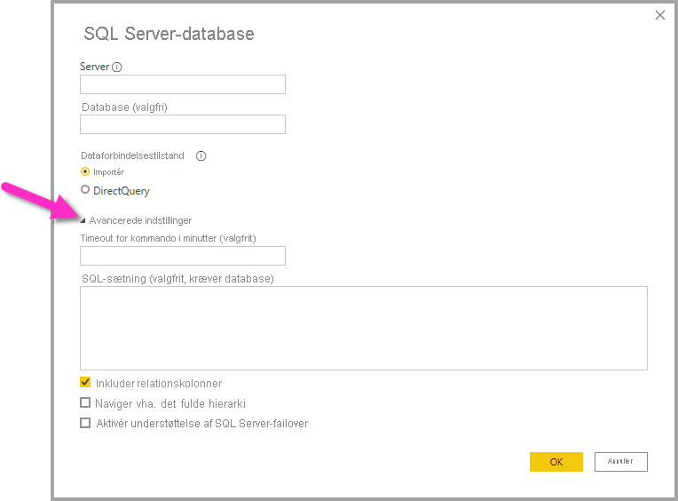
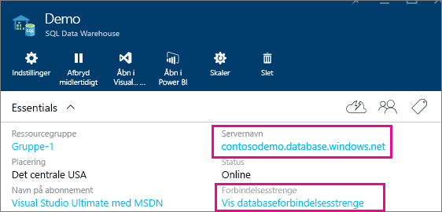

# Azure SQL Data Warehouse med DirectQuery

Med Azure SQL Data Warehouse med DirectQuery kan du oprette dynamiske rapporter, der er baseret på data og målinger, du allerede har i Azure SQL Data Warehouse. Med DirectQuery sendes forespørgsler tilbage til dit Azure SQL Data Warehouse i realtid, når du udforsker dataene. Forespørgsler i realtid, kombineret med skalaen for SQL Data Warehouse, gør det muligt for brugere at oprette dynamiske rapporter på få minutter med terabytes af data. Desuden giver linket **Byg dashboards og rapporter** brugerne mulighed for at oprette Power BI-rapporter ved hjælp af deres SQL Data Warehouse.

Når du bruger SQL Data Warehouse-forbindelsen:

* Angiv det fuldt kvalificerede servernavn, når du opretter forbindelse (se flere oplysninger nedenfor)
* Kontrollér, at firewallreglerne for serveren er konfigureret til at "Tillade adgang til Azure-tjenester"
* Hver handling, f.eks. markering af en kolonne eller tilføjelse af et filter, vil direkte forespørge Data Warehouse
* Felterne er angivet til at opdatere ca. hver 15 minutter, og opdateringen skal ikke planlægges.  Opdateringen kan tilpasses i Avancerede indstillinger, når du opretter forbindelse.
* Spørgsmål og svar er ikke tilgængelige for DirectQuery-datasæt
* Skemaændringer hentes ikke automatisk

Disse begrænsninger og noter kan ændres, efterhånden som vi fortsat forbedrer oplevelsen. Trinnene til at oprette forbindelse er beskrevet nedenfor.

## Byg dashboards og rapporter i Power BI

> [!Important]
> Vi har forbedret vores netværksmuligheder til Azure SQL Data Warehouse. For at få den bedste oplevelse og oprette forbindelse til din Azure SQL Data Warehouse-datakilde kan du bruge Power BI Desktop. Når du har bygget din model og rapport, kan du udgive den på Power BI-tjenesten. Den tidligere tilgængelige direkte forbindelse til Azure SQL Data Warehouse i Power BI-tjenesten er ikke længere tilgængelig.

Den nemmeste måde at flytte mellem dit SQL Data Warehouse og Power BI er at oprette rapporter i Power BI Desktop. Du kan bruge knappen **Byg dashboards og rapporter** i Azure Portal.

1. Download og installér Power BI Desktop for at komme i gang. Du kan finde flere oplysninger om, hvordan du downloader og installerer, i artiklen [Hent Power BI Desktop](../fundamentals/desktop-get-the-desktop.md) eller ved at gå direkte til næste trin.

2. Du kan også klikke på linket **Byg dashboards og rapporter** for at downloade Power BI Desktop.

    

## Opretter forbindelse via Power BI Desktop

Du kan oprette forbindelse til en SQL Data Warehouse ved hjælp af knappen **Hent data** i Power BI Desktop. 

1. Vælg knappen **Hent data** i menuen **Hjem**.  

    

2. Vælg **Flere...** for at se alle tilgængelige datakilder. I det vindue, der vises, skal du vælge **Azure** i ruden til venstre og derefter vælge **Azure SQL Data Warehouse** på listen over tilgængelige connectors i ruden til højre.

    

3. I det vindue, der vises, skal du angive din server og evt. angive en indstilling for den database, du vil oprette forbindelse til. Du kan også vælge din dataforbindelsestilstand: Import eller DirectQuery. Hvis du vil have adgang til oplysninger i din Azure SQL Data Warehouse i realtid, skal du bruge DirectQuery.

    

4. Du kan finde avancerede indstillinger for Azure SQL Data Warehouse-forbindelsen ved at vælge pil ned ud for **Avancerede indstillinger** for at få vist yderligere indstillinger for din forbindelse.

    

I det næste afsnit beskrives det, hvordan du finder parameterværdier for din forbindelse. 

## Find parameterværdier

Dit fulde gyldige servernavn og databasenavn kan findes på Azure-portalen. Bemærk, at SQL Data Warehouse i øjeblikket kun findes på Azure-portalen.

> [!NOTE]
> Hvis din Power BI-lejer befinder sig i det samme område som Azure SQL Data Warehouse, er der ingen gebyrer for udgående data. Du kan se, hvor din Power BI-befinder sig, ved hjælp af [disse instruktioner](https://docs.microsoft.com/power-bi/service-admin-where-is-my-tenant-located).

[!INCLUDE [direct-query-sso](../includes/direct-query-sso.md)]

## Næste trin

* [Om brug af DirectQuery i Power BI](desktop-directquery-about.md)
* [Hvad er Power BI?](../fundamentals/power-bi-overview.md)  
* [Hent data til Power BI](service-get-data.md)  
* [Azure SQL Data Warehouse](/azure/sql-data-warehouse/sql-data-warehouse-overview-what-is/)

Har du flere spørgsmål? [Prøv at spørge Power BI-community'et](https://community.powerbi.com/)
