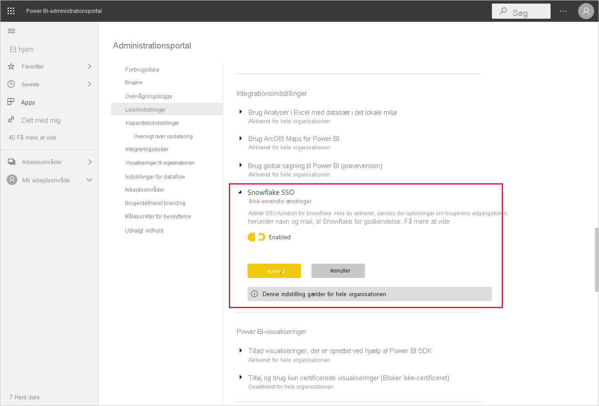
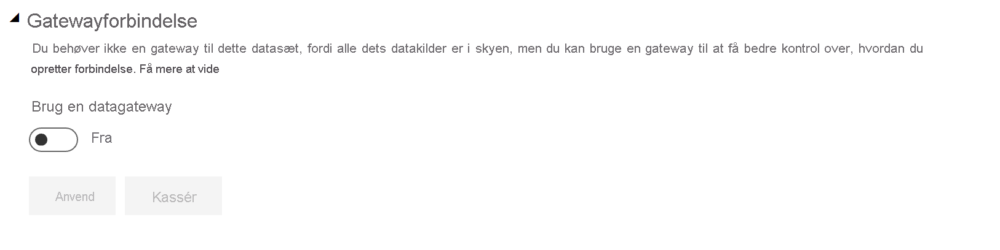
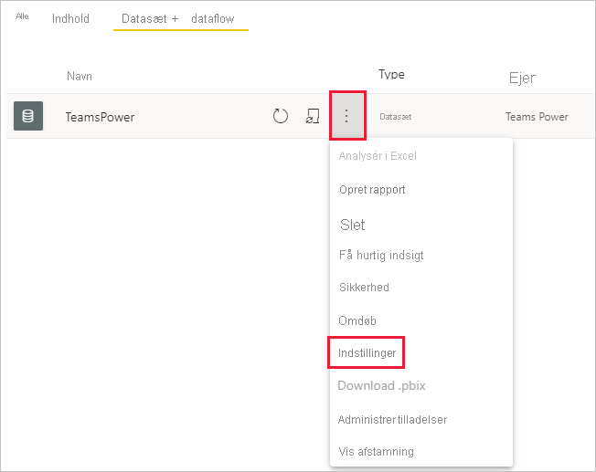
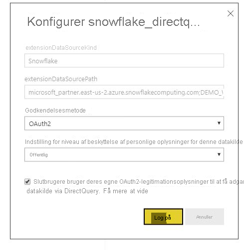

# Opret forbindelse til Snowflake i Power BI-tjenesten

## Introduktion

Oprettelse af forbindelse til Snowflake i Power BI-tjenesten adskiller sig kun fra andre connectors på én måde. Snowflake har en yderligere egenskab for Azure Active Directory (AAD) med mulighed for SSO. Dele af integrationen kræver forskellige administrative roller på tværs af Snowflake, Power BI og Azure. Du kan også vælge at aktivere AAD-godkendelse uden at bruge SSO. Grundlæggende godkendelse fungerer på samme måde som andre connectors i tjenesten.

Hvis du vil konfigurere AAD-integration og eventuelt aktivere SSO, skal du følge trinnene i denne artikel:

* Hvis du er Snowflake-administrator, skal du læse artiklen [Power BI SSO til Snowflake – introduktion](https://docs.snowflake.com/en/user-guide/oauth-powerbi.html) i dokumentationen til Snowflake.
* Hvis du er Power BI-administrator, kan du se [Konfiguration af Power BI-tjenesten – Administrationsportal](service-connect-snowflake.md#admin-portal) for at få mere at vide om, hvordan du aktiverer SSO.
* Hvis du er Power BI-datasætopretter, kan du se [Konfiguration af Power BI-tjenesten – Konfiguration af et datasæt med AAD](service-connect-snowflake.md#configuring-a-dataset-with-aad), så du kan få mere at vide om, hvordan du aktiverer SSO.

## Konfiguration af Power BI-tjeneste

### Administrationsportal

Hvis du vil aktivere SSO, skal en global administrator aktivere indstillingen i Power BI-administrationsportalen. Denne indstilling godkender afsendelse af AAD-legitimationsoplysninger til Snowflake med henblik på godkendelse for hele organisationen. Følg disse trin for at aktivere SSO:

1. [Log på Power BI](https://app.powerbi.com) ved hjælp af globale administratorlegitimationsoplysninger.
1. Vælg **Indstillinger** i sidehovedmenuen, og vælg derefter **Administrationsportal**.
1. Vælg **Lejerindstillinger**, og rul derefter for at finde **Integrationsindstillinger**.

   

4. Udvid **Snowflake SSO**, angiv indstillingen til **Aktiveret**, og vælg derefter **Anvend**.

Dette trin er påkrævet for at give samtykke til, at AAD-tokenet sendes til Snowflake-serverne. Når du har aktiveret indstillingen, kan det tage op til en time, før den træder i kraft.

Når SSO er aktiveret, kan du bruge rapporter med SSO.

### Konfiguration af et datasæt med AAD

Når en rapport, der er baseret på Snowflake-connectoren, publiceres i Power BI-tjenesten, skal opretteren af datasættet opdatere indstillinger for det relevante arbejdsområde, så det bruger SSO.

På grund af den måde, Power BI fungerer på, fungerer SSO kun, når der ikke køres nogen datakilder via datagatewayen i det lokale miljø. Begrænsningerne er angivet nedenfor:

* Hvis du kun bruger en Snowflake-kilde i din datamodel, kan du bruge SSO, hvis du vælger ikke at bruge datagatewayen i det lokale miljø.
* Hvis du bruger en Snowflake-kilde sammen og en anden kilde, kan du bruge SSO, hvis ingen af kilderne bruger datagatewayen i det lokale miljø.
* Hvis du bruger en Snowflake-kilde via datagatewayen i det lokale miljø, understøttes AAD-legitimationsoplysninger ikke i øjeblikket. Denne overvejelse kan være relevant, hvis du forsøger at få adgang til en VNet fra en enkelt IP-adresse, hvor gatewayen er installeret, i stedet for fra hele Power BI-IP-intervallet.
* Hvis du bruger en Snowflake-kilde og en anden kilde, der kræver en gateway, skal du også bruge Snowflake via datagatewayen i det lokale miljø. Du kan ikke bruge SSO i dette tilfælde.

Få mere at vide om, hvordan du bruger datagatewayen i det lokale miljø, i artiklen [Hvad er en datagateway i det lokale miljø?](service-gateway-onprem.md)

Hvis du ikke bruger gatewayen, er du klar. Hvis du har Snowflake-legitimationsoplysninger konfigureret i din datagateway i det lokale miljø, men kun bruger den pågældende datakilde i din model, kan du klikke på til/fra-knappen på siden Indstillinger for datasæt for at slå gatewayen for den pågældende datamodel fra.

Hvis du vil aktivere SSO for et datasæt, skal du følge disse trin:

1. [Log på Power BI](https://app.powerbi.com) ved hjælp af legitimationsoplysningerne for datasætopretteren.
1. Vælg det relevante arbejdsområde, og vælg derefter **Indstillinger** i menuen Flere indstillinger, der er placeret ud for navnet på datasættet.
  
1. Vælg **Legitimationsoplysninger for datakilde**, og log på. Datasættet kan logges på Snowflake med grundlæggende legitimationsoplysninger eller OAuth2-legitimationsoplysninger (AAD). Hvis du bruger AAD, kan du aktivere SSO i næste trin.
1. Vælg indstillingen **Slutbrugere kan tilgå denne datakilde med deres egne OAuth2-legitimationsoplysninger via DirectQuery**. Denne indstilling aktiverer AAD SSO. Uanset om den første bruger logger på med grundlæggende godkendelse eller OAuth2 (AAD), sendes AAD-legitimationsoplysningerne til SSO.

    

Efter disse trin skal eventuelle yderligere brugere automatisk bruge AAD-godkendelsen til at oprette forbindelse til data fra det pågældende Snowflake-datasæt.

Hvis du vælger ikke at aktivere SSO, anvender de brugere, der opdaterer rapporten, legitimationsoplysningerne for den bruger, der er logget på, som de fleste andre Power BI-rapporter.

### Fejlfinding

Hvis du støder på problemer med integrationen, skal du se [fejlfindingsvejledningen](https://docs.snowflake.com/en/user-guide/oauth-powerbi.html#troubleshooting) til Snowflake.

## Næste trin

* [Datakilder til Power BI-tjenesten](service-get-data.md)
* [Opret forbindelse til datasæt i Power BI-tjenesten fra Power BI Desktop](desktop-report-lifecycle-datasets.md)
* [Opret forbindelse til et Snowflake-databehandlingswarehouse](desktop-connect-snowflake.md)