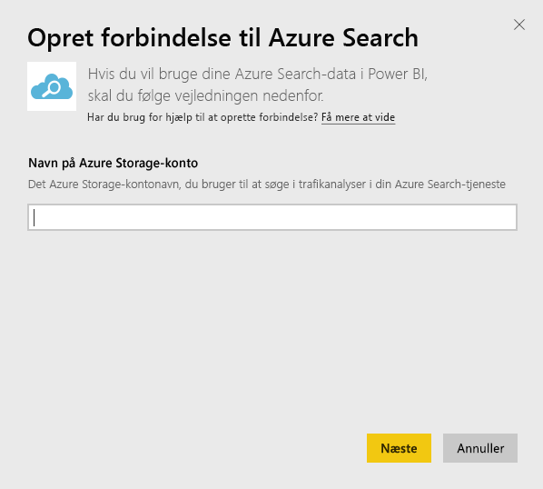
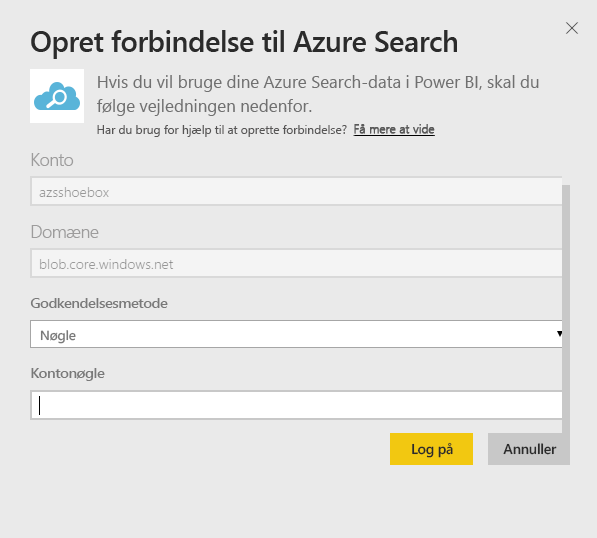
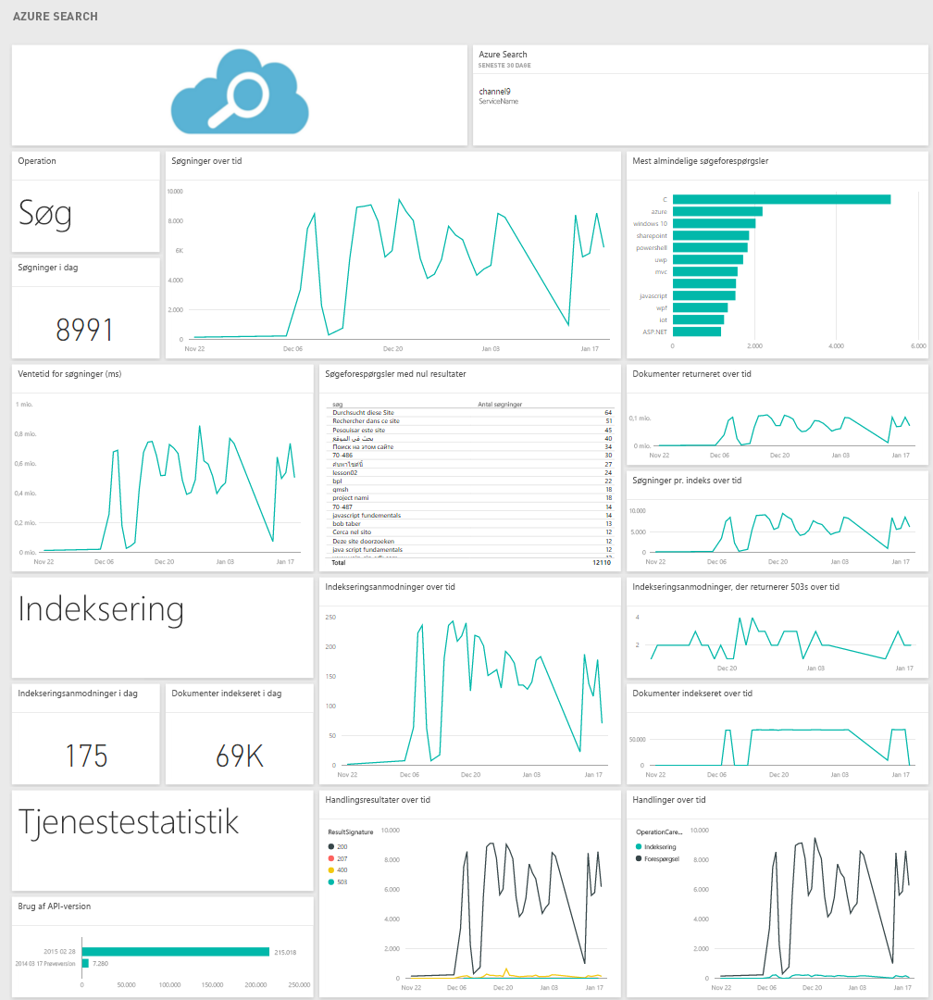

# Opret forbindelse til Azure Search med Power BI
Med Azure Search Traffic Analytics kan du overvåge og forstå trafikken til Azure Search-tjenesten. Azure Search-indholdspakken til Power BI giver detaljeret indsigt i dine Search-data, herunder søgning, indeksering, tjenestestatistik og ventetid fra de seneste 30 dage. Flere oplysninger finder du i [Azure-blogindlæg](https://azure.microsoft.com/blog/analyzing-your-azure-search-traffic/).

[!INCLUDE [include-short-name](../includes/service-deprecate-content-packs.md)]

Opret forbindelse til [Azure Search-indholdspakken](https://app.powerbi.com/getdata/services/azure-search) til Power BI.

## Sådan opretter du forbindelse
1. Vælg **Hent data** nederst i navigationsruden.
   
    
2. Markér **Hent** i feltet **Tjenester**.
   
    
3. Vælg **Azure Search** \> **Hent**.
   
   
4. Angiv navnet på den tabellagerkonto, hvor din Azure Search-analyse er gemt.
   
   
5. Vælg **Nøgle** som godkendelsesmetode, og angiv din nøgle til lagerkontoen. Klik på **Log på** for at starte indlæsningsprocessen.
   
   
6. Når indlæsningen er fuldført, vises der et nyt dashboard samt en ny rapport og model i navigationsruden. Vælg dashboardet for at få vist de importerede data.
   
    

**Hvad nu?**

* Prøv [at stille et spørgsmål i feltet Spørgsmål og svar](../consumer/end-user-q-and-a.md) øverst i dashboard'et
* [Rediger felterne](../create-reports/service-dashboard-edit-tile.md) i dashboard'et.
* [Vælg et felt](../consumer/end-user-tiles.md) for at åbne den underliggende rapport.
* Selvom dit datasæt opdateres dagligt, kan du ændre tidsplanen for opdatering eller prøve at opdatere det efter behov ved hjælp af **Opdater nu**

## Systemkrav
Azure Search-indholdspakken kræver, at Azure Search Traffic Analytics er aktiveret på kontoen.

## Fejlfinding
Kontrollér, at navnet på lagerkontoen er angivet korrekt sammen med den fulde adgangsnøgle. Navnet på lagerkontoen skal svare til den konto, der er konfigureret med Azure Search Traffic Analytics.

## Næste trin
[Hvad er Power BI?](../fundamentals/power-bi-overview.md)

[Grundlæggende begreber for designere i Power BI-tjenesten](../fundamentals/service-basic-concepts.md)
