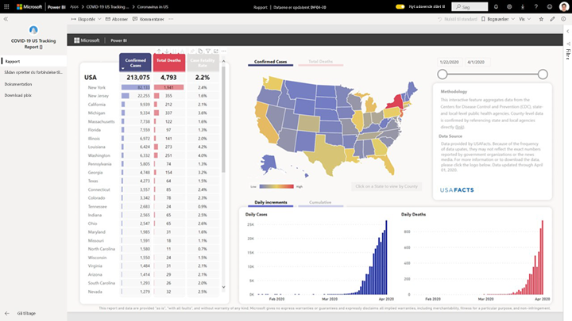
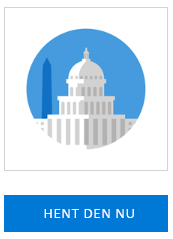
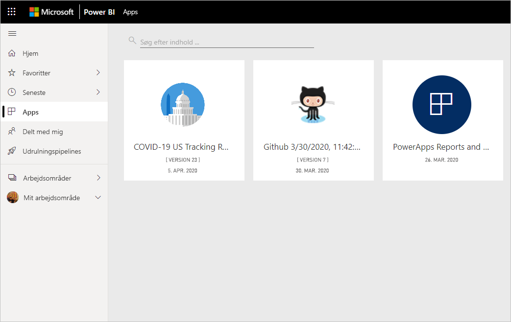
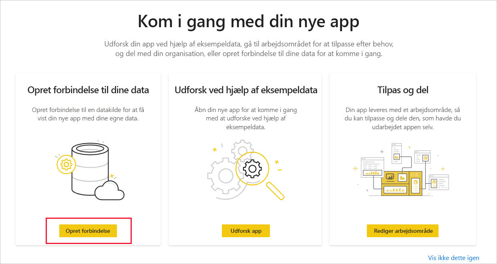
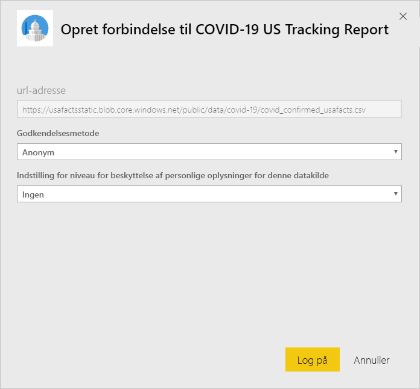
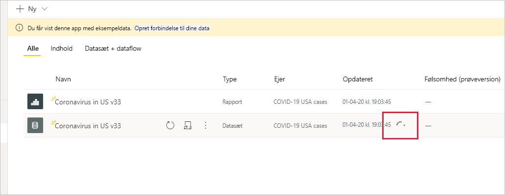

# Opret forbindelse til den amerikanske sporingsrapport for COVID-19
I denne artikel får du oplysninger om, hvordan du installerer skabelonappen til den amerikanske sporingsrapport for COVID-19, og hvordan du opretter forbindelse til datakilderne.

Hvis du vil have detaljerede oplysninger om selve rapporten, herunder ansvarsfraskrivelser og oplysninger om dataene, kan du se [eksemplet på sporingsrapport for COVID-19 til centralregeringen og delstatsregeringerne i USA](../create-reports/sample-covid-19-us.md).

Når du har installeret skabelonappen og oprettet forbindelse til datakilderne, kan du tilpasse rapporten i henhold til dine behov. Du kan derefter distribuere den som en app til kolleger i organisationen.

## Installér programmet

1. Klik på følgende link for at få adgang til appen: [Skabelonappen Amerikansk sporingsrapport for COVID-19](https://appsource.microsoft.com/en-us/product/power-bi/pbi-contentpacks.covid19ms)

1. Når du er på appens Appsource-side, skal du klikke på [**Hent den nu**](https://appsource.microsoft.com/en-us/product/power-bi/pbi-contentpacks.covid19ms).

    

1. Klik på **Installer**, når du bliver bedt om det. Når appen er installeret, kan du se den på siden med dine apps.

   

## Opret forbindelse til datakilder

1. Klik på ikonet på appsiden for at åbne appen.

1. Vælg **Opret forbindelse** på den velkomstskærm, der vises.

   

1. Der vises to dialogbokse til logon i træk. Angiv niveauet for beskyttelse af personlige oplysninger til Offentlig.

   

   Rapporten opretter forbindelse til datakilderne og udfyldes med opdaterede data. Aktivitetsovervågningen aktiveres i dette tidsrum.

   

## Planlæg rapportopdatering

Når dataene er blevet opdateret, er du i det arbejdsområde, der er knyttet til appen. Du kan [konfigurere en opdateringsplan](../refresh-scheduled-refresh.md) for at holde rapportdataene opdaterede.

## Tilpas og del

Se [Tilpas og del appen](../service-template-apps-install-distribute.md#customize-and-share-the-app) for at få flere oplysninger. Sørg for at gennemse [ansvarsfraskrivelserne for rapporten](../create-reports/sample-covid-19-us.md#disclaimers), før du udgiver eller distribuerer appen.

## Næste trin
* [Eksempel på sporing af COVID-19 til centralregeringen og delstatsregeringerne i USA](../create-reports/sample-covid-19-us.md)
* Har du spørgsmål? [Prøv at spørge Power BI-community'et](https://community.powerbi.com/)
* [Hvad er Power BI-skabelonapps?](../service-template-apps-overview.md)
* [Installér og distribuer skabelonapps i din organisation](../service-template-apps-install-distribute.md)
