# Opret forbindelse til rapport om eksisterende krisekommunikation

Denne Power BI-app er det rapport-/dashboardartefakt, der findes i Microsoft Power Platform-løsningen til krisekommunikation. Den sporer placeringen af medarbejdere for brugere af appen til krisekommunikation. Løsningen kombinerer funktioner i Power Apps, Power Automate, Teams, SharePoint og Power BI. Den kan bruges på internettet, mobilenheder eller i Teams.

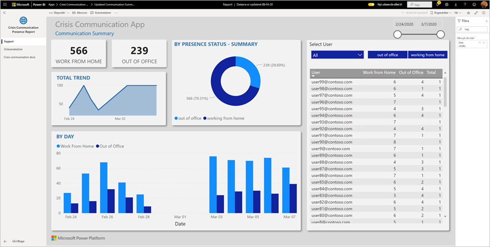

Dashboardet viser beredskabschefers samlede data på tværs af sundhedssystemet for at hjælpe dem med at træffe rettidige og korrekte beslutninger.

I denne artikel får du oplysninger om, hvordan du installerer appen, og hvordan du opretter forbindelse til datakilderne. Du kan finde flere oplysninger om appen til krisekommunikation under [Konfigurer og få mere at vide om eksempelskabelonen til krisekommunikation i Power Apps](https://docs.microsoft.com/powerapps/maker/canvas-apps/sample-crisis-communication-app)

Når du har installeret skabelonappen og oprettet forbindelse til datakilderne, kan du tilpasse rapporten i henhold til dine behov. Du kan derefter distribuere den som en app til kolleger i organisationen.

## Forudsætninger

Før du installerer denne skabelonapp, skal du først installere og konfigurere [krisekommunikationseksemplet](https://docs.microsoft.com/powerapps/maker/canvas-apps/sample-crisis-communication-app). Når du installerer denne løsning, oprettes de referencer til datakilden, der er nødvendige for at udfylde appen med data.

Når du installerer krisekommunikationseksemplet, skal du notere [stien til mappen med SharePoint-listen for "CI_Employee Status" og liste-ID](https://docs.microsoft.com/powerapps/maker/canvas-apps/sample-crisis-communication-app#monitor-office-absences-with-power-bi).

## Installér programmet

1. Klik på følgende link for at få adgang til appen: [Skabelonappen Rapport om eksisterende krisekommunikation](https://appsource.microsoft.com/en-us/product/power-bi/pbi-contentpacks.crisiscomms)

1. Vælg [**Hent den nu**](https://appsource.microsoft.com/en-us/product/power-bi/pbi-contentpacks.crisiscomms) på AppSource-siden for appen.

    [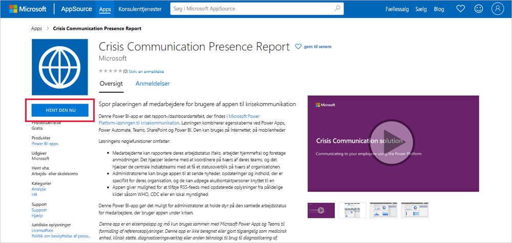](https://appsource.microsoft.com/en-us/product/power-bi/pbi-contentpacks.crisiscomms)

1. Læs oplysningerne i **Én ting mere**, og vælg **Fortsæt**.

    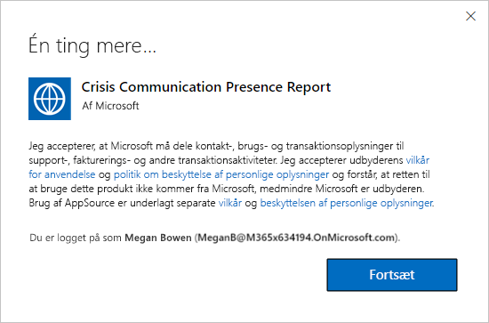

1. Vælg **Installér**. 

    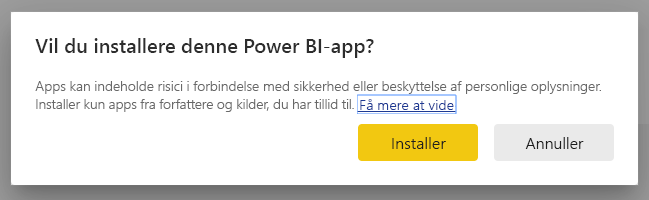

    Når appen er installeret, kan du se den på siden med dine apps.

   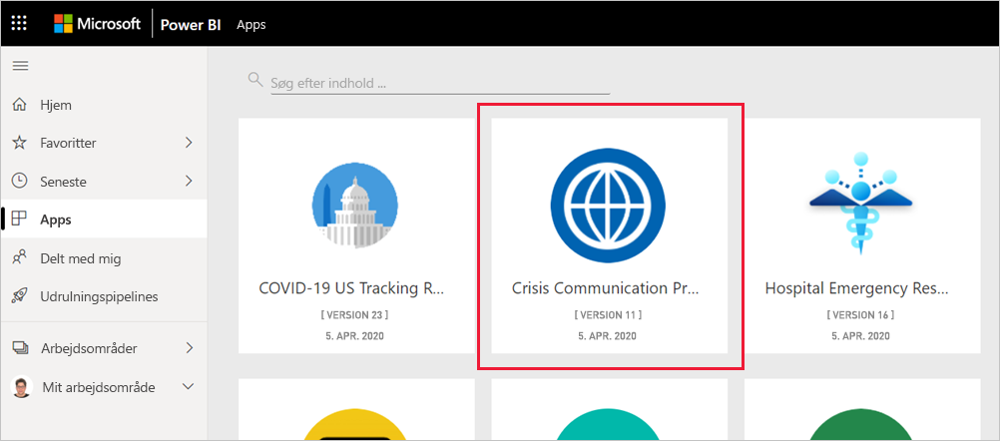

## Opret forbindelse til datakilder

1. Vælg ikonet på siden med apps for at åbne appen.

1. På velkomstskærmen skal du vælge **Udforsk**.

   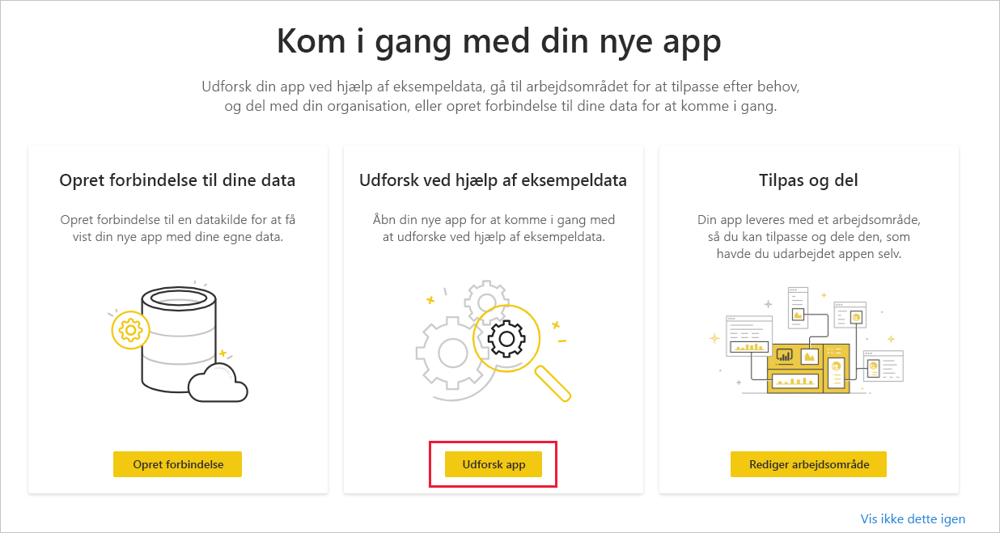

   Appen åbnes, og der vises eksempeldata.

1. Vælg linket **Opret forbindelse til dine data** på banneret øverst på siden.

   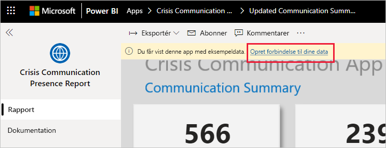

1. I dialogboksen:
   1. I feltet SharePoint_Folder skal du angive [stien til SharePoint-listen "CI_Employee Status"](https://docs.microsoft.com/powerapps/maker/canvas-apps/sample-crisis-communication-app#monitor-office-absences-with-power-bi).
   1. I feltet List_ID skal du angive det liste-id, du har fået fra listeindstillingerne. Klik på **Næste**, når du er færdig.

   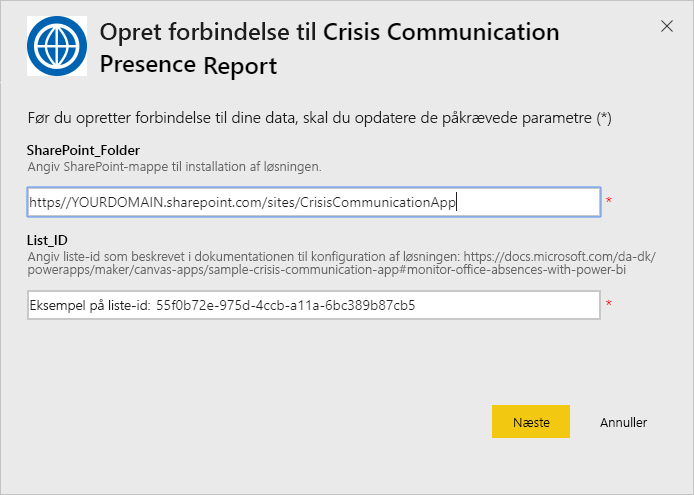

1. I den næste dialogboks, der vises, skal du angive godkendelsesmetoden til **OAuth2**. Du behøver ikke at foretage dig noget med indstillingen for beskyttelsesniveau.

   Vælg **Log på**.

   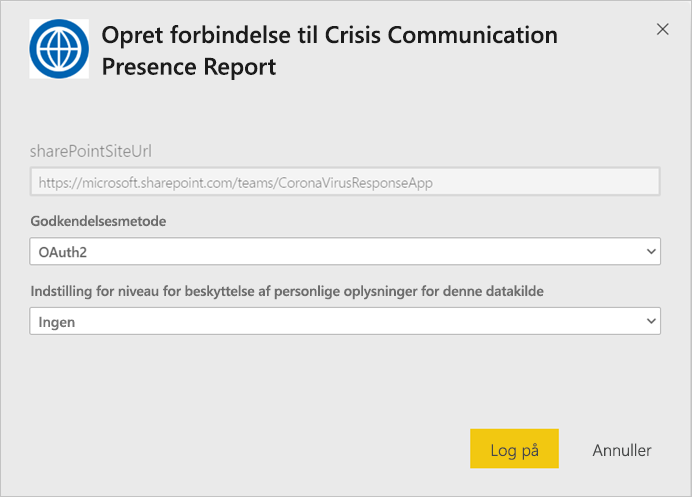

1. Log på Power BI, når du er logget på Microsoft.

   

   Når du har logget på, opretter rapporten forbindelse til datakilderne og udfyldes med opdaterede data. Aktivitetsovervågningen aktiveres i dette tidsrum.

   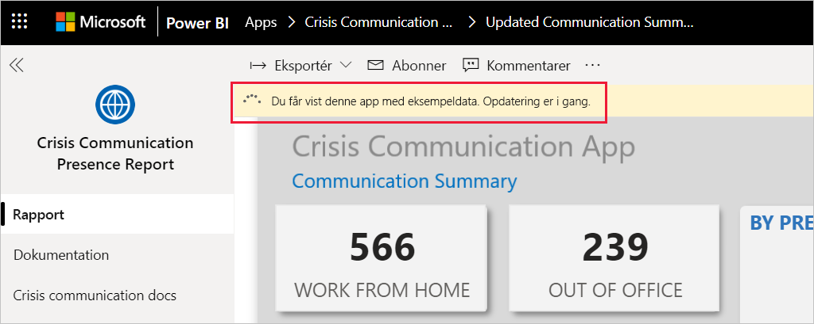

## Planlæg rapportopdatering

Når dataene er blevet opdateret, [kan du konfigurere en opdateringsplan](../connect-data/refresh-scheduled-refresh.md) for at holde rapportdataene opdateret.

1. Vælg **Power BI** på den øverste overskriftslinje.

   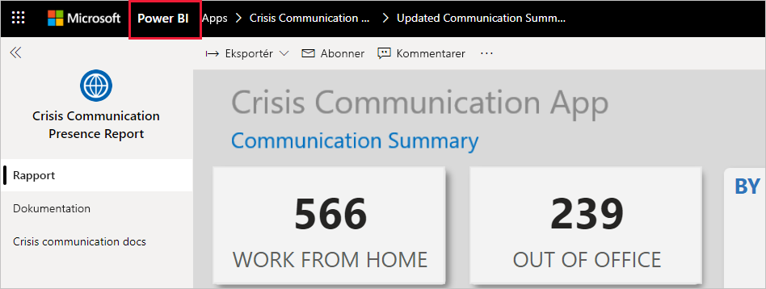

1. I navigationsruden til venstre skal du finde arbejdsområdet for Dashboard til understøttelse af beslutninger i forbindelse med hospitalernes akutberedskab under **Arbejdsområder** og følge instruktionerne, der er beskrevet i artiklen [Konfigurer planlagt opdatering](../connect-data/refresh-scheduled-refresh.md).

## Tilpas og del

Se [Tilpas og del appen](../connect-data/service-template-apps-install-distribute.md#customize-and-share-the-app) for at få flere oplysninger. Sørg for at gennemse [ansvarsfraskrivelserne for rapporten](../create-reports/sample-covid-19-us.md#disclaimers), før du udgiver eller distribuerer appen.

## Næste trin
* [Konfigurer og få mere at vide om skabelonen med eksempel på krisekommunikation i Power Apps](https://docs.microsoft.com/powerapps/maker/canvas-apps/sample-crisis-communication-app)
* Har du spørgsmål? [Prøv at spørge Power BI-community'et](https://community.powerbi.com/)
* [Hvad er Power BI-skabelonapps?](../connect-data/service-template-apps-overview.md)
* [Installér og distribuer skabelonapps i din organisation](../connect-data/service-template-apps-install-distribute.md)
