# Opret forbindelse til Dashboard til understøttelse af beslutninger i forbindelse med hospitalernes akutberedskab
Skabelonappen Dashboard til understøttelse af beslutninger i forbindelse med hospitalernes akutberedskab er rapporteringskomponenten i [Microsoft Power Platform-løsningen til akutberedskab](https://powerapps.microsoft.com/blog/emergency-response-solution-a-microsoft-power-platform-solution-for-healthcare-emergency-response/). Dashboardet viser beredskabschefers samlede data på tværs af sundhedssystemet for at hjælpe dem med at træffe rettidige og korrekte beslutninger.

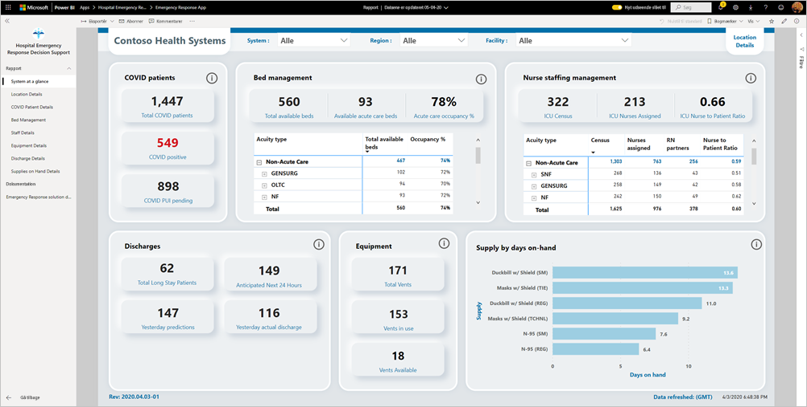

I denne artikel får du oplysninger om, hvordan du installerer appen, og hvordan du opretter forbindelse til datakilderne. Hvis du vil have mere at vide om, hvordan du bruger rapporten i denne app, kan du se [dokumentationen til Dashboard til understøttelse af beslutninger i forbindelse med hospitalernes akutberedskab](https://docs.microsoft.com/powerapps/sample-apps/emergency-response/deploy-configure#view-the-power-bi-dashboard).

Når du har installeret skabelonappen og har oprettet forbindelse til datakilderne, kan du tilpasse rapporten i henhold til dine behov. Du kan derefter distribuere den som en app til kolleger i organisationen.

## Forudsætninger

Før du installerer denne skabelonapp, skal du først installere og konfigurere [Power Platform-løsningen til hospitalernes akutberedskab](https://docs.microsoft.com/powerapps/sample-apps/emergency-response/deploy-configure). Når du installerer denne løsning, oprettes de referencer til datakilden, der er nødvendige for at udfylde appen med data.

Når du installerer Power Platform-løsningen til hospitalernes akutberedskab, kan du se [URL-adressen til din instans af Common Data Service-miljøet](https://docs.microsoft.com/powerapps/sample-apps/emergency-response/deploy-configure#publish-the-power-bi-dashboard). Du skal bruge den til at oprette forbindelse mellem skabelonappen og dataene.

## Installér programmet

1. Klik på følgende link for at få adgang til appen: [Skabelonappen Dashboard til understøttelse af beslutninger i forbindelse med hospitalernes akutberedskab](https://appsource.microsoft.com/en-us/product/power-bi/pbi-contentpacks.powerapps_healthcare)

1. Vælg [**Hent den nu**](https://appsource.microsoft.com/en-us/product/power-bi/pbi-contentpacks.powerapps_healthcare) på AppSource-siden for appen.

    [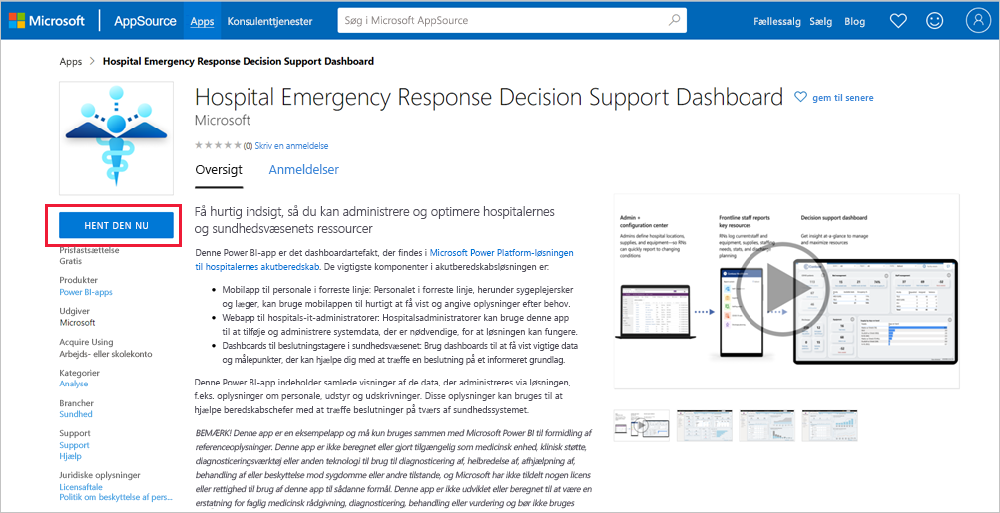](https://appsource.microsoft.com/en-us/product/power-bi/pbi-contentpacks.powerapps_healthcare)

1. Læs oplysningerne i **Én ting mere**, og vælg **Fortsæt**.

    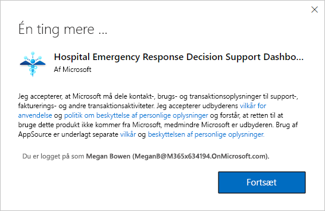

1. Vælg **Installér**. 

    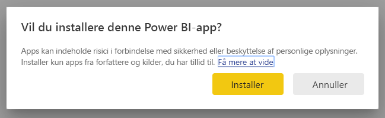

    Når appen er installeret, kan du se den på siden med dine apps.

   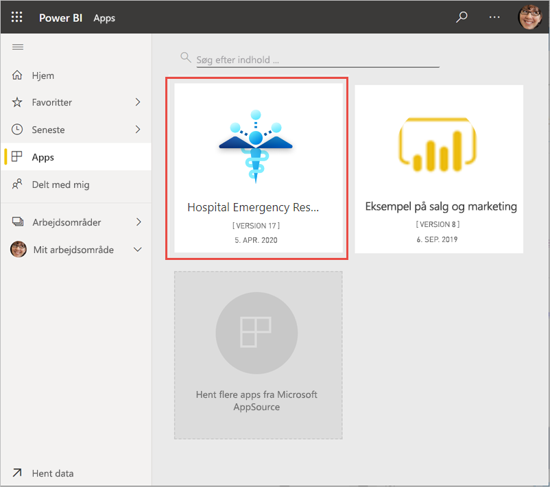

## Opret forbindelse til datakilder

1. Vælg ikonet på siden med apps for at åbne appen.

1. På velkomstskærmen skal du vælge **Udforsk**.

   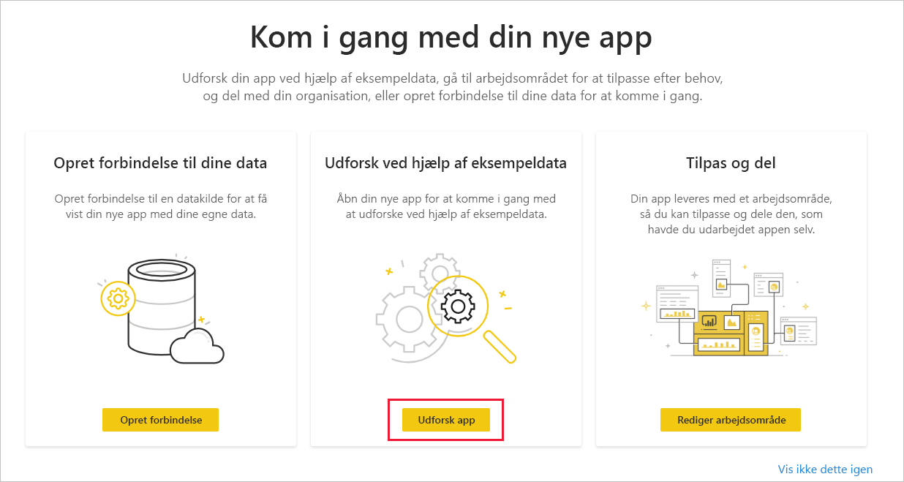

   Appen åbnes, og der vises eksempeldata.

1. Vælg linket **Opret forbindelse til dine data** på banneret øverst på siden.

   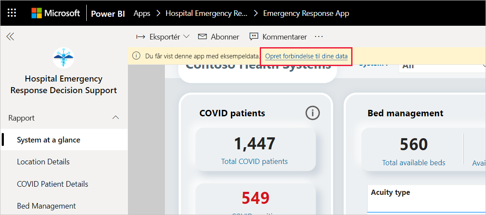

1. I dialogboksen:
   1. Angiv navnet på din organisation i feltet organisationsnavn, f.eks. "Contoso Health Systems". Feltet er valgfrit. Dette navn vises i øverste venstre hjørne af dashboardet.
   1. I feltet CDS_base_solution skal du angive [URL-adressen til din instans af Common Data Service-miljøet](https://docs.microsoft.com/powerapps/sample-apps/emergency-response/deploy-configure#publish-the-power-bi-dashboard). For eksempel: https://[myenv].crm.dynamics.com. Klik på **Næste**, når du er færdig.

   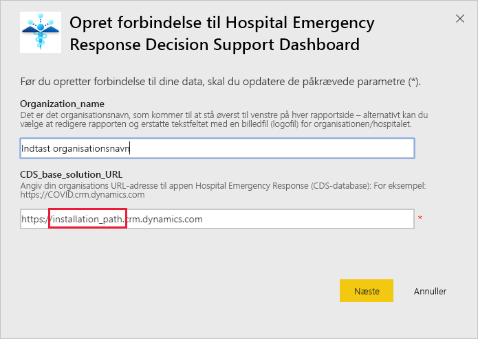

1. I den næste dialogboks, der vises, skal du angive godkendelsesmetoden til **OAuth2**. Du behøver ikke at foretage dig noget med indstillingen for beskyttelsesniveau.

   Vælg **Log på**.

   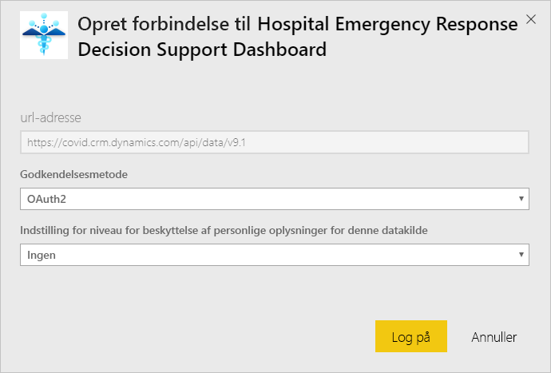

1. Log på Power BI, når du er logget på Microsoft.

   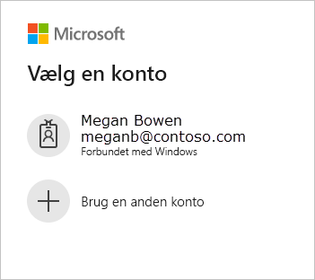

   Når du har logget på, opretter rapporten forbindelse til datakilderne og udfyldes med opdaterede data. Aktivitetsovervågningen aktiveres i dette tidsrum.

   

## Planlæg rapportopdatering

Når dataene er blevet opdateret, [kan du konfigurere en opdateringsplan](../connect-data/refresh-scheduled-refresh.md) for at holde rapportdataene opdateret.

1. Vælg **Power BI** på den øverste overskriftslinje.

   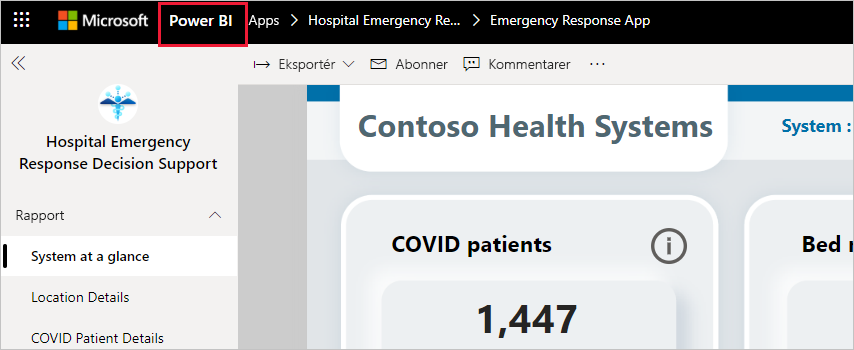

1. I navigationsruden til venstre skal du finde arbejdsområdet for Dashboard til understøttelse af beslutninger i forbindelse med hospitalernes akutberedskab under **Arbejdsområder** og følge instruktionerne, der er beskrevet i artiklen [Konfigurer planlagt opdatering](../connect-data/refresh-scheduled-refresh.md).

## Tilpas og del

Se [Tilpas og del appen](../connect-data/service-template-apps-install-distribute.md#customize-and-share-the-app) for at få flere oplysninger. Sørg for at gennemse [ansvarsfraskrivelserne for rapporten](../create-reports/sample-covid-19-us.md#disclaimers), før du udgiver eller distribuerer appen.

## Næste trin
* [Om rapporten Hospitalernes akutberedskab](https://docs.microsoft.com/powerapps/sample-apps/emergency-response/deploy-configure#view-the-power-bi-dashboard)
* [Konfigurer og få mere at vide om skabelonen med krisekommunikationseksemplet i Power Apps](https://docs.microsoft.com/powerapps/maker/canvas-apps/sample-crisis-communication-app)
* Har du spørgsmål? [Prøv at spørge Power BI-community'et](https://community.powerbi.com/)
* [Hvad er Power BI-skabelonapps?](../connect-data/service-template-apps-overview.md)
* [Installér og distribuer skabelonapps i din organisation](../connect-data/service-template-apps-install-distribute.md)
