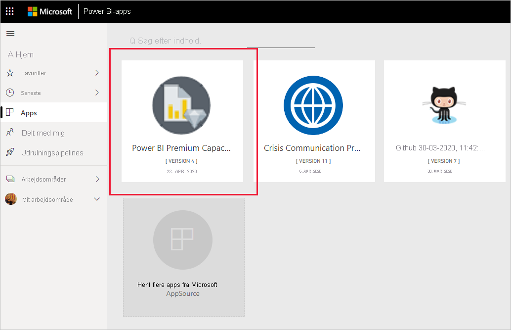
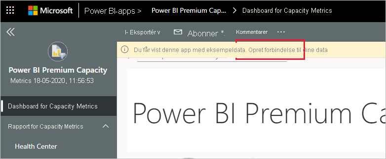
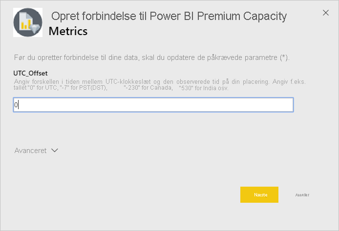
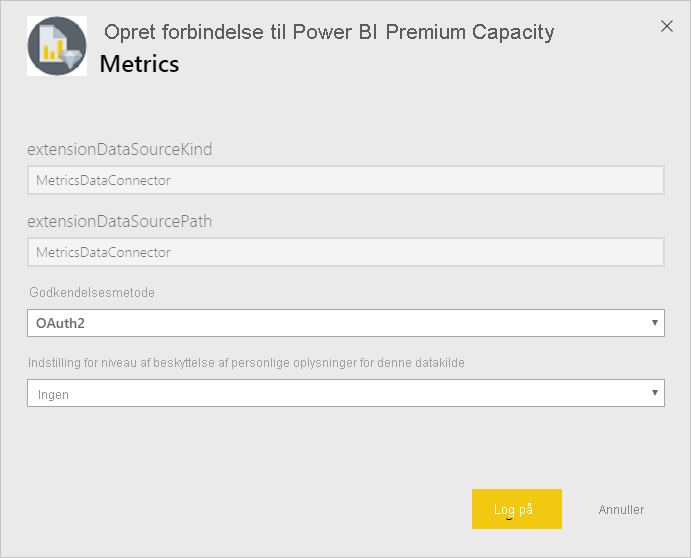
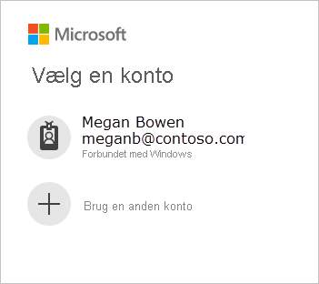
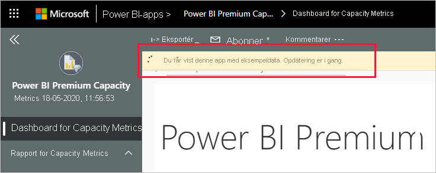
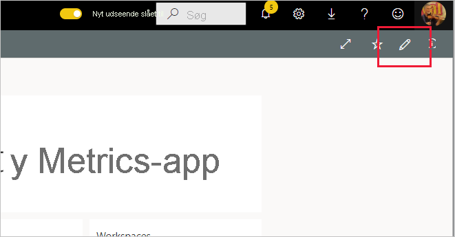

# Opret forbindelse til Power BI Premium Capacity Metrics
Overvågning af dine kapaciteter er afgørende for at træffe beslutninger om den bedste måde, du kan udnytte dine ressourcer i Premium-kapaciteten på. Appen Power BI Premium Capacity Metrics giver de mest detaljerede oplysninger om ydeevnen af dine kapaciteter.

Denne artikel indeholder en beskrivelse af, hvordan du installerer appen og opretter forbindelse til datakilder. Du kan finde oplysninger om indholdet af rapporter, og hvordan du bruger det i [Overvåg Premium-kapaciteter med appen](../service-admin-premium-monitor-capacity.md) og i [blogindlægget om appen Premium Capacity Metrics](https://powerbi.microsoft.com/blog/premium-capacity-metrics-app-new-health-center-with-kpis-to-explore-relevant-metrics-and-steps-to-mitigate-issues/).

Når du har installeret appen og oprettet forbindelse til datakilderne, kan du tilpasse rapporten til dine behov. Du kan derefter distribuere den til kolleger i organisationen.

> [!NOTE]
> Installation af skabelonapps kræver [tilladelser](./service-template-apps-install-distribute.md#prerequisites). Kontakt din lejeradministrator, hvis du oplever, at du ikke har tilstrækkelige tilladelser.

## Installér programmet

1. Klik på følgende link for at få adgang til appen: [Skabelonappen Power BI Premium Capacity Metrics](https://app.powerbi.com/groups/me/getapps/services/pbi_pcmm.capacity-metrics-dxt)

1. Vælg [**Hent den nu**](https://app.powerbi.com/groups/me/getapps/services/pbi_pcmm.capacity-metrics-dxt) på AppSource-siden for appen.

    

1. Vælg **Installér**. 

    

    > [!NOTE]
    > Hvis du tidligere har installeret appen, bliver du spurgt, om du vil [overskrive denne installation](./service-template-apps-install-distribute.md#update-a-template-app) eller installere i et nyt arbejdsområde.

    Når appen er installeret, kan du se den på siden med dine apps.

   

## Opret forbindelse til datakilder

1. Vælg ikonet på siden med apps for at åbne appen.

1. På velkomstskærmen skal du vælge **Udforsk**.

   

   Appen åbnes, og der vises eksempeldata.

1. Vælg linket **Opret forbindelse til dine data** på banneret øverst på siden.

   

1. I den viste dialogboks skal du angive UTC-forskydningen, dvs. den forskel i timer, der er mellem Coordinated Universal Time og din tidszone. Klik derefter på **Next** (Næste).
  
   

1. I den næste dialogboks, der vises, behøver du ikke at foretage dig noget. Du skal blot vælge **Log på**.

   

1. Log på Power BI, når du er logget på Microsoft.

   

   Når du har logget på, opretter rapporten forbindelse til datakilderne og udfyldes med opdaterede data. Aktivitetsovervågningen aktiveres i dette tidsrum.

   

   Dine rapportdata opdateres automatisk én gang om dagen, medmindre du deaktiverede dette under logonprocessen. Du kan også [konfigurere din egen opdateringsplan](./refresh-scheduled-refresh.md) for at holde rapportdataene opdateret, hvis du vil.

## Tilpas og del

Klik på blyantikonet i øverste højre hjørne for at begynde at tilpasse appen.

 

Se [Tilpas og del appen](./service-template-apps-install-distribute.md#customize-and-share-the-app) for at få flere oplysninger.

## Næste trin
* [Overvåg Premium-kapaciteter vha. appen](../admin/service-admin-premium-monitor-capacity.md)
* [Blogindlæg om appen Premium Capacity Metrics](https://powerbi.microsoft.com/blog/premium-capacity-metrics-app-new-health-center-with-kpis-to-explore-relevant-metrics-and-steps-to-mitigate-issues/)
* [Hvad er Power BI-skabelonapps?](./service-template-apps-overview.md)
* [Installér og distribuer skabelonapps i din organisation](./service-template-apps-install-distribute.md)
* Har du spørgsmål? [Prøv at spørge Power BI-community'et](https://community.powerbi.com/)