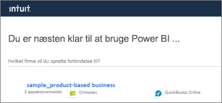

# Opret forbindelse til QuickBooks Online med Power BI
Når du opretter forbindelse til dine QuickBooks Online-data fra Power BI, får du straks et Power BI-dashboard og Power BI-rapporter, der giver indsigt i antallet af din virksomheds likviditet, lønsomhed, kunder m.m. Brug dashboardet og rapporterne, som de er, eller tilpas dem for at fremhæve de oplysninger, som betyder mest for dig. Dataene opdateres automatisk én gang dagligt.

Opret forbindelse til [QuickBooks Online-skabelonappen](https://dxt.powerbi.com/getdata/services/quickbooks-online) til Power BI.

>[!NOTE]
>Hvis du vil importere dine QuickBooks Online-data i Power BI, skal du være administrator på din QuickBooks Online-konto og logge på med din administratorkonto. Du kan ikke bruge denne connector til QuickBooks Desktop-softwaren. 

## Sådan opretter du forbindelse

[!INCLUDE [powerbi-service-apps-get-more-apps](../includes/powerbi-service-apps-get-more-apps.md)]

3. Vælg **QuickBooks Online**, og vælg derefter **Hent**.
   
   

4. Vælg **Installér** under **Installér denne Power BI-app?** .

    

4. Vælg feltet **QuickBooks** i ruden **App**.

   

6. Under **Kom i gang med din nye app** skal du vælge **Opret forbindelse**.

    

4. Vælg **oAuth2** som Godkendelsesmetode, og vælg derefter **Log på**. 
5. Når du bliver spurgt, skal du angive dine legitimationsoplysninger til QuickBooks Online og følge QuickBooks Online-godkendelsesprocessen. Hvis du er allerede er logget på QuickBooks Online i din browser, bliver du muligvis ikke spurgt om legitimationsoplysninger.
   >[!NOTE]
   >Du skal bruge administratorlegitimationsoplysninger til din QuickBooks Online-konto.
6. Vælg det firma, du vil forbinde til Power BI, på det næste skærmbillede.
   
   

7. Vælg **Godkend** i det næste skærmbillede for at starte importprocessen. Processen kan tage et par minutter, afhængigt af størrelsen på virksomhedens data. 
   
   
   
8. Når Power BI har importeret dataene, vises der en indholdsliste for QuickBooks-appen: et nyt dashboard, en ny rapport og et nyt datasæt.
9. Vælg dashboardet for QuickBooks for at starte udforskningsprocessen. Power BI oprettede dette dashboard automatisk for at vise dine importerede data.

    

**Hvad nu?**

* Prøv [at stille et spørgsmål i feltet Spørgsmål og svar](../consumer/end-user-q-and-a.md) øverst i dashboard'et
* [Rediger felterne](../create-reports/service-dashboard-edit-tile.md) i dashboard'et.
* [Vælg et felt](../consumer/end-user-tiles.md) for at åbne den underliggende rapport.
* Selvom dit datasæt opdateres dagligt, kan du ændre tidsplanen for opdatering eller prøve at opdatere det efter behov ved hjælp af **Opdater nu**

## Fejlfinding
**Ups! Der er opstået en fejl"**

Hvis du får vist denne meddelelse, når du har valgt **Godkend**:

"Ups! Der opstod en fejl." Luk dette vindue, og prøv igen.

En anden bruger abonnerer allerede på dette program til denne virksomhed. Kontakt [administratormail] for at foretage ændringer af abonnementet."

... denne fejl betyder, at en anden administrator i din virksomhed allerede har forbindelse til dine firmadata med Power BI. Bed denne administrator om at dele dashboardet med dig. I øjeblikket kan kun én administrator oprette forbindelse et bestemt QuickBooks Online-firmadatasæt til Power BI. Når Power BI har oprettet dashboardet, kan administratoren dele det med flere kolleger på de samme Power BI-lejere.

**"Denne app er ikke konfigureret til at tillade forbindelser fra dit land"**

Power BI understøtter i øjeblikket kun amerikanske versioner af QuickBooks Online. 

## Næste trin
[Hvad er Power BI?](../fundamentals/power-bi-overview.md)

[Grundlæggende begreber for designere i Power BI-tjenesten](../fundamentals/service-basic-concepts.md)
