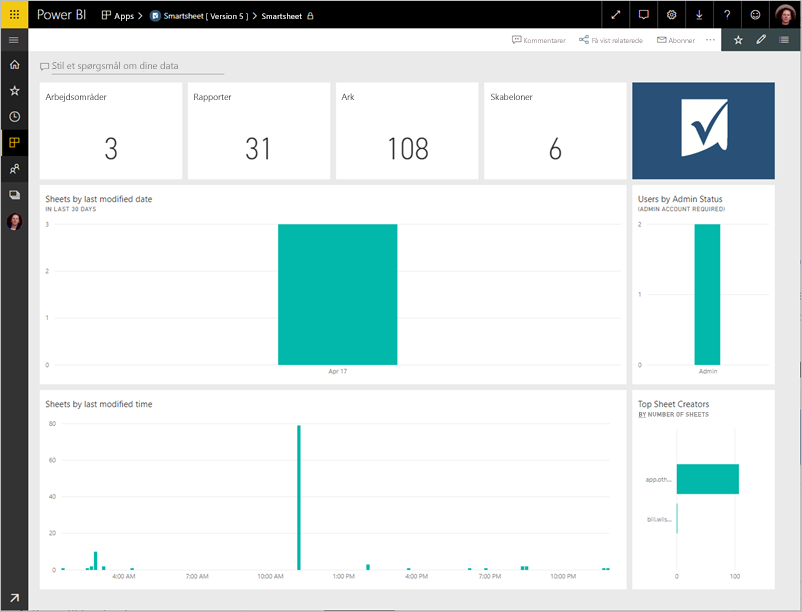
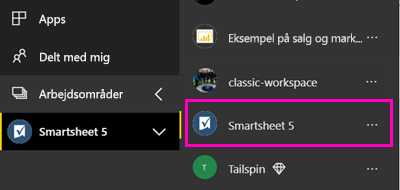
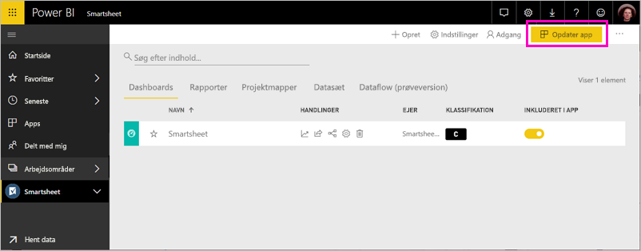

# Opret forbindelse til Smartsheet med Power BI
I denne artikel gennemgår vi, hvordan du trækker data fra din Smartsheet-konto med en skabelonapp i Power BI. Smartsheet byder på en nem platform til samarbejde og fildeling. Smartsheet-skabelonappen til Power BI indeholder et dashboard, rapporter og datasæt, som viser en oversigt over din Smartsheet-konto. Du kan også bruge [Power BI Desktop](desktop-connect-to-data.md) til at oprette forbindelse direkte til individuelle ark i din konto. 

Når du har installeret skabelonappen, kan du ændre dashboardet og rapporten. Du kan derefter distribuere den som en app til kolleger i organisationen.

Opret forbindelse til [Smartsheet-skabelonappen](https://app.powerbi.com/groups/me/getapps/services/pbi-contentpacks.pbiapps-smartsheet) til Power BI.

>[!NOTE]
>En Smartsheet-administratorkonto er at foretrække til oprettelse af forbindelse og indlæsning af Power BI-skabelonappen, da den har ekstra adgang.

## Sådan opretter du forbindelse

[!INCLUDE [powerbi-service-apps-get-more-apps](../includes/powerbi-service-apps-get-more-apps.md)]

3. Vælg **Smartsheet** \> **Hent nu**.
4. Vælg **Installér** under **Installér denne Power BI-app?** .
4. Vælg feltet **Smartsheet** i ruden **App**.

    

6. Under **Kom i gang med din nye app** skal du vælge **Opret forbindelse**.

    

4. Til Godkendelsesmetode skal du vælge **oAuth2\> Log på**.
   
   Når du bliver spurgt, skal du angive dine legitimationsoplysninger til Smartsheet og følge godkendelsesprocessen.
   
   
   
   

5. Når Power BI importerer dataene, åbnes Smartsheet-dashboardet.
   
   

## Rediger og distribuer din app

Du har installeret Smartsheet-skabelonappen. Det betyder, at du også har oprettet Smartsheet-apparbejdsområdet. I arbejdsområdet kan du ændre rapporten og dashboardet og derefter distribuere den som en *app* til kolleger i din organisation. 

1. Hvis du vil have vist alt indholdet i dit nye Smartsheet-arbejdsområde, skal du vælge **Arbejdsområder** > **Smartsheet**. 

    

    Denne visning er indholdslisten for arbejdsområdet. I øverste højre hjørne kan du se **Opdater app.** Når du er klar til at distribuere din app til dine kolleger, er det her, du starter. 

    

2. Vælg **rapporter** og **Datasæt** for at få vist andre elementer i arbejdsområdet.

    Læs, hvordan du [distribuerer apps](../collaborate-share/service-create-distribute-apps.md) til dine kolleger.

## Det følgende er inkluderet
Smartsheet-skabelonappen til Power BI indeholder et overblik over din Smartsheet-konto, f.eks det antal arbejdsområder, rapporter og ark, du har, når disse er blevet redigeret osv. Administratorer kan også se nogle oplysninger om brugerne i deres system, f.eks. dem, der opretter flest ark.  

Du kan også bruge Smartsheet-forbindelseskomponenten i [Power BI Desktop](desktop-connect-to-data.md) til at oprette direkte forbindelse til individuelle ark i din konto.  

## Næste trin

* [Opret nye arbejdsområder i Power BI](../collaborate-share/service-create-the-new-workspaces.md)
* [Installér og brug apps i Power BI](../consumer/end-user-apps.md)
* [Opret forbindelse til Power BI-apps til eksterne tjenester](service-connect-to-services.md)
* Har du spørgsmål? [Prøv at spørge Power BI-community'et](https://community.powerbi.com/)