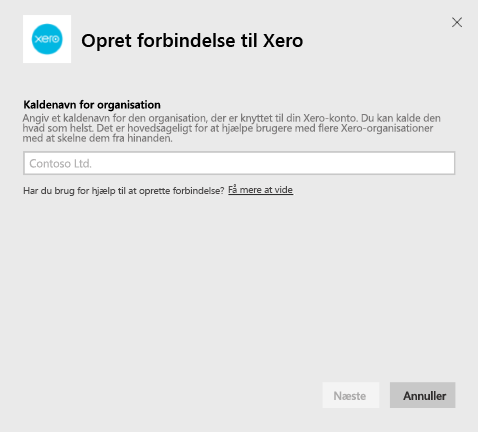
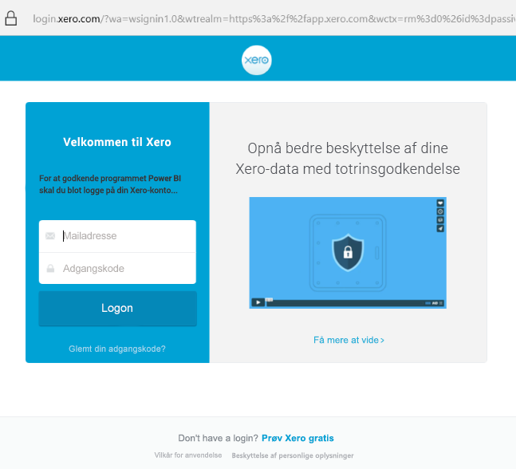

# Opret forbindelse til Xero med Power BI
Xero er et brugervenligt online regnskabsprogram, der er udviklet specielt til små virksomheder. Opret overbevisende visualiseringer baseret på din bogføring i Xero med denne Power BI-skabelonapp. Standarddashboardet indeholder mange metrikværdier for små virksomheder, f.eks. likviditet, indtægter i forhold til udgifter, avancetendens, debitordage og afkastningsgrad.

Opret forbindelse til [Xero-skabelonappen](https://app.powerbi.com/getdata/services/xero) til Power BI, eller få mere at vide om integration af [Xero og Power BI](https://help.xero.com/Power-BI).

## Sådan opretter du forbindelse

[!INCLUDE [powerbi-service-apps-get-more-apps](../includes/powerbi-service-apps-get-more-apps.md)]

3. Vælg **Xero** \> **Hent nu**.
4. Vælg **Installér** under **Installér denne Power BI-app?** .

    

4. Vælg feltet **Xero** i ruden **App**.

   

6. Under **Kom i gang med din nye app** skal du vælge **Opret forbindelse**.

    

4. Angiv et kaldenavn for den organisation, der er knyttet til din Xero-konto. Du kan kalde den hvad som helst. Det er hovedsageligt for at hjælpe brugere med flere Xero-organisationer med at skelne dem fra hinanden. Se oplysninger om [at finde parametre](#FindingParams) senere i denne artikel.

    

5. Vælg **OAuth** for **Godkendelsesmetode**. Når du bliver bedt om det, skal du logge på din Xero-konto og vælge den organisation, du vil oprette forbindelse til. Når logonprocessen er fuldført, skal du vælge **Log på** for at starte indlæsningsprocessen.
   
    
   
    
6. Efter godkendelsen startes importprocessen automatisk. Når processen er fuldført, vises der et nyt dashboard samt en ny rapport og model i navigationsruden. Vælg dashboardet for at få vist de importerede data.
   
     

**Hvad nu?**

* Prøv [at stille et spørgsmål i feltet Spørgsmål og svar](../consumer/end-user-q-and-a.md) øverst i dashboard'et
* [Rediger felterne](../create-reports/service-dashboard-edit-tile.md) i dashboard'et.
* [Vælg et felt](../consumer/end-user-tiles.md) for at åbne den underliggende rapport.
* Selvom dit datasæt opdateres dagligt, kan du ændre tidsplanen for opdatering eller prøve at opdatere det efter behov ved hjælp af **Opdater nu**

## Det følgende er inkluderet
Skabelonappens dashboard indeholder felter og metrikværdier, der dækker en lang række områder med tilsvarende rapporter, hvor man kan få flere oplysninger:  

| Område | Dashboardfelter | Rapport |
| --- | --- | --- |
| Penge |Dagligt Cashflow  Indbetal  Udbetal  Ultimosaldo efter konto  Closing balance today |Konti |
| Kunde |Faktureret salg  Faktureret salg efter kunde  Faktureret Salgsvækst tendens  Fakturaer forfalden  Udestående tilgodehavender  Forfalden tilgodehavender |Kunde  Lager |
| Leverandør |Køb faktureres  Faktureret indkøb efter leverandør  Køb faktureres væksttendens   Fakturaer forfaldsdato  Udestående skyldige beløb  Overskredne skyldige beløb |Leverandører  Lager |
| Lager |Månedlige salgsbeløb efter produkt |Lager |
| Resultatopgørelse |Månedlige resultatopgørelse  Overskud dette regnskabsår  Overskud denne måned  Mest populære udgift konti |Resultatopgørelse |
| Balancen |Samlede aktiver  Samlede passiver  Lighed |Balancen |
| Tilstand |Likviditetsgrad  Bruttoavance procentdel   Returner af samlede aktiver  Samlede passiver aktie forholdet mellem |Tilstand  Ordliste og tekniske noter |

Datasættet indeholder også følgende tabeller til at tilpasse dine rapporter og dashboards:  

* Adresser  
* Alerts  
* Bank-sætningen daglig saldo  
* Bank-sætninger.  
* Kontakter  
* Udgift krav  
* Linje Fakturaelementer  
* Fakturaer  
* Elementer  
* Slutningen af måneden  
* Organisation  
* Generelle kontooversigt  
* Xero-konti

## Systemkrav
Følgende roller er påkrævet for at få adgang til Xero-skabelonappen: "Standard + Rapporter" eller "Rådgiver".

## Søgning efter parametre
Angiv et navn på din organisation, der skal spores i Power BI. Et navn giver dig mulighed for at oprette forbindelse til flere forskellige organisationer. Du kan ikke oprette forbindelse til den samme organisation flere gange, da det påvirker den planlagte opdatering.   

## Fejlfinding
* Xero-brugere skal have følgende roller for at få adgang til Xero-skabelonappen til Power BI: "Standard + Rapporter" eller "Rådgiver". Skabelonappen er afhængig af de brugerbaserede tilladelser til at få adgang til rapportdata via Power BI.
* Under indlæsningen er felterne på dashboardet i en generisk indlæsningstilstand. De forbliver på den måde, indtil hele indlæsningen er fuldført. Hvis du får en meddelelse om, at din indlæsning er fuldført, men felterne stadig er under indlæsning, skal du prøve at opdatere dashboardfelterne ved hjælp af den ... i øverste højre hjørne af dashboardet.
* Hvis din skabelonapp ikke opdateres, skal du kontrollere, om du har oprettet forbindelse til den samme organisation mere end én gang i Power BI. Xero tillader kun en enkelt aktiv forbindelse til en organisation, og du kan få vist en fejl, der angiver, at dine legitimationsoplysninger er ugyldige, hvis du opretter forbindelse til den samme mere end én gang.  
* Hvis du har problemer med at oprette forbindelse til Xero-skabelonappen til Power BI, f.eks. fejlmeddelelser eller meget langsom indlæsning, skal du først rydde din cache/cookies og genstarte browseren, og derefter skal du oprette forbindelse til Power BI igen.  

Hvis du oplever andre problemer, eller hvis problemet er vedvarende, skal du oprette en supportanmodning på https://support.powerbi.com.

## Næste trin
[Kom i gang med Power BI](../fundamentals/service-get-started.md)

[Hent data i Power BI](service-get-data.md)
