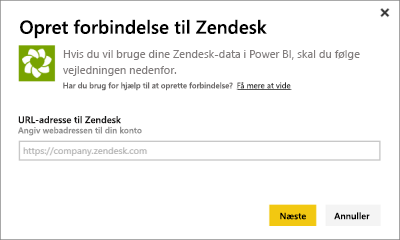
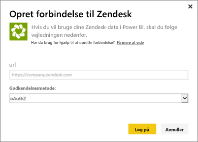
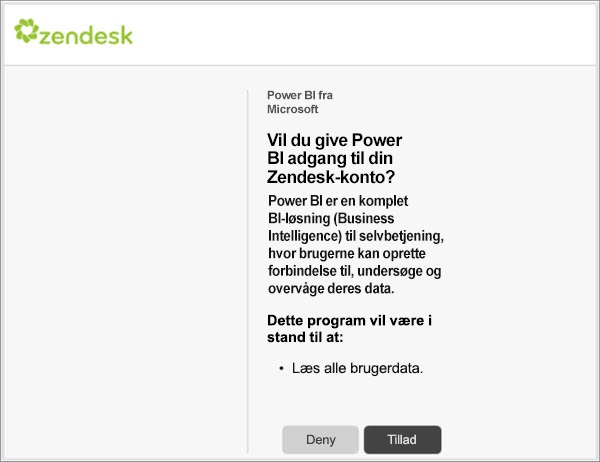
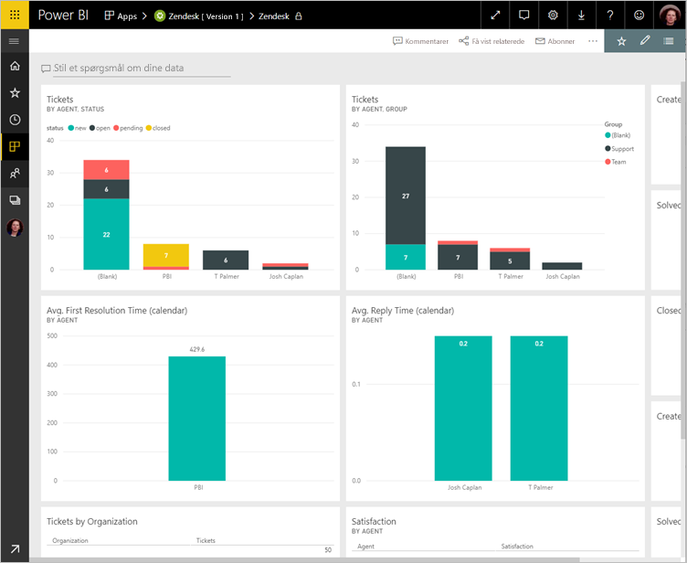
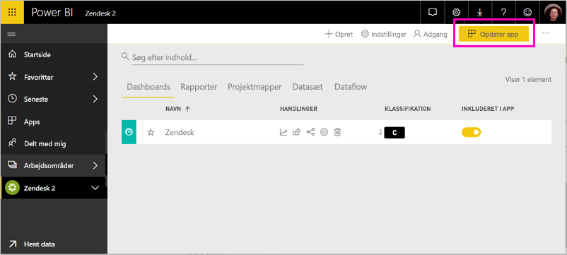

# Opret forbindelse til Zendesk med Power BI

I denne artikel gennemgår vi, hvordan du trækker data fra din Zendesk-konto med en skabelonapp i Power BI. Zendesk-appen indeholder et Power BI-dashboard og et sæt Power BI-rapporter, der giver indsigt i dine billetvolumener og agentydeevne. Dataene opdateres automatisk én gang dagligt. 

Når du har installeret skabelonappen, kan du tilpasse dashboardet og rapporten for at fremhæve de oplysninger, du interesserer dig mest for. Du kan derefter distribuere den som en app til kolleger i organisationen.

Opret forbindelse til [Zendesk-skabelonappen](https://app.powerbi.com/getdata/services/zendesk), eller læs mere om [Zendesk-integrationen](https://powerbi.microsoft.com/integrations/zendesk) med Power BI.

Når du har installeret skabelonappen, kan du ændre dashboardet og rapporten. Du kan derefter distribuere den som en app til kolleger i organisationen.

>[!NOTE]
>Du skal bruge en Zendesk-administratorkonto for at oprette forbindelse. Der er flere oplysninger om [kravene](#system-requirements) nedenfor.

>[!WARNING]
>Før den 15. oktober 2019 tillod Zendesk Support Search-API modtagelsen af 200.000 resultater i alt via sideinddeling af store forespørgsler. For at justere søgeforbruget med det tilsigtede omfang begrænser Zendesk nu det maksimale antal resultater, der returneres, til 1.000 resultater i alt, med et maksimum på 100 resultater pr. side. Den aktuelle Power BI Zendesk-connector kan dog stadig oprette API-kald, der overskrider disse nye grænser, hvilket resulterer i potentielt misvisende resultater.

## Sådan opretter du forbindelse

[!INCLUDE [powerbi-service-apps-get-more-apps](../includes/powerbi-service-apps-get-more-apps.md)]

3. Vælg **Zendesk** \> **Hent nu**.
4. Vælg **Installér** under **Installér denne Power BI-app?** .
4. Vælg feltet **Zendesk** i ruden **App**.

    

6. Under **Kom i gang med din nye app** skal du vælge **Opret forbindelse**.

    

4. Angiv den URL-adresse, som er knyttet til din konto. URL-adressen ser sådan ud **https://company.zendesk.com** . Herunder kan du se detaljer om, hvordan du [finder de pågældende parametre](#finding-parameters).
   
   

5. Angiv dine Zendesk-legitimationsoplysninger, når du bliver bedt om dem.  Vælg **oAuth 2** som Godkendelsesmetode, og klik på **Log på**. Følg Zendesk-godkendelsesprocessen. (Hvis du er allerede er logget på Zendesk i din browser, bliver du muligvis ikke bedt om legitimationsoplysninger).
   
   > [!NOTE]
   > Denne skabelonapp kræver, at du opretter forbindelse med en Zendesk-administratorkonto. 
   > 
   
   
6. Klik på **Tillad** for at tillade, at Power BI får adgang til dine Zendesk-data.
   
   
7. Klik på **Opret forbindelse** for at starte importprocessen. 
8. Når Power BI har importeret dataene, vises der en indholdsliste for Zendesk-appen: et nyt dashboard, en ny rapport og et nyt datasæt.
9. Vælg dashboardet for at starte udforskningsprocessen.

    
   
## Rediger og distribuer din app

Du har installeret Zendesk-skabelonappen. Det betyder, at du også har oprettet Zendesk-arbejdsområdet. I arbejdsområdet kan du ændre rapporten og dashboardet og derefter distribuere den som en *app* til kolleger i din organisation. 

1. Hvis du vil have vist alt indholdet i dit nye Zendesk-arbejdsområde, skal du vælge **Arbejdsområder** > **Zendesk**. 

    

    Denne visning er indholdslisten for arbejdsområdet. I øverste højre hjørne kan du se **Opdater app.** Når du er klar til at distribuere din app til dine kolleger, er det her, du starter. 

    

2. Vælg **rapporter** og **Datasæt** for at få vist andre elementer i arbejdsområdet.

    Læs, hvordan du [distribuerer apps](../collaborate-share/service-create-distribute-apps.md) til dine kolleger.

## Systemkrav
Der kræves en Zendesk-administratorkonto for at få adgang til Zendesk-skabelonappen. Hvis du er agent eller slutbruger og er interesseret i at få vist dine Zendesk-data, kan du tilføje et forslag og gennemgå Zendesk-connectoren i [Power BI Desktop](desktop-connect-to-data.md).

## Søgning efter parametre
URL-adressen til Zendesk skal være den samme som den URL-adresse, du bruger til at logge på din Zendesk-konto. Hvis du ikke er sikker på din Zendesk URL-adresse, kan du bruge [hjælp til logon](https://www.zendesk.com/login/) i Zendesk.

## Fejlfinding
Hvis du har problemer med at oprette forbindelse, skal du kontrollere din Zendesk URL-adresse og bekræfte, at du bruger en Zendesk-administratorkonto.

## Næste trin

* [Opret nye arbejdsområder i Power BI](../collaborate-share/service-create-the-new-workspaces.md)
* [Installér og brug apps i Power BI](../consumer/end-user-apps.md)
* [Opret forbindelse til Power BI-apps til eksterne tjenester](service-connect-to-services.md)
* Har du spørgsmål? [Prøv at spørge Power BI-community'et](https://community.powerbi.com/)
