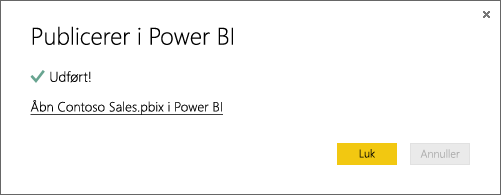

# Hent data fra Power BI Desktop-filer

**Power BI Desktop** gør business intelligence og rapportering let. Uanset om du opretter forbindelse til mange forskellige datakilder, forespørger om og transformerer data, modellerer dine data og opretter effektive og dynamiske rapporter, gør **Power BI Desktop** business intelligence-opgaver intuitive og hurtige. Hvis du ikke har erfaring med **Power BI Desktop**, kan du se under [Introduktion til Power BI Desktop](../fundamentals/desktop-getting-started.md).

Når du overfører data til **Power BI Desktop** og opretter nogle få rapporter, skal du hente den gemte fil ind i **Power BI-tjenesten**.

## Det gør en forskel, hvor du gemmer din fil
**Lokalt** – Hvis du gemmer din fil på et lokalt drev på din computer eller på en anden placering i din organisation, kan du *importere* filen, eller du kan *publicere* fra Power BI Desktop for at hente dens data og rapporter ind i Power BI. Filen forbliver på den lokale harddisk, så det er ikke hele filen, der reelt flyttes til Power BI. Der sker det, at et nyt datasæt oprettes i Power BI, og data og datamodellen fra Power BI Desktop-filen indlæses i datasættet. Hvis filen indeholder rapporter, vises de på Power BI-webstedet under Rapporter.

**OneDrive – erhverv** – Hvis du har OneDrive for Business, og du logger på med den samme konto, du bruger til at logge på Power BI, er det den klart mest effektive metode til at holde dit arbejde i Power BI Desktop synkroniseret med datasæt, rapporter og dashboards i Power BI. Da både Power BI og OneDrive findes i cloudmiljøet, opretter Power BI *forbindelse* til din fil på OneDrive ca. hver time. Hvis der findes ændringer, opdateres datasættet, rapporter og dashboards automatisk i Power BI.

**OneDrive – personlig** – Hvis du gemmer dine filer på din egen OneDrive-konto, får du mange af de samme fordele som med OneDrive for Business. Den største forskel er, at når du første gang opretter forbindelse til din fil (med funktionen Hent data > Filer > OneDrive - personlig), skal du logge på OneDrive med din Microsoft-konto, som normalt er forskellig fra, hvad du bruger til at logge på Power BI. Når du logger på med OneDrive med din Microsoft-konto, skal du sørge for at vælge indstillingen Forbliv logget på. På denne måde kan Power BI oprette forbindelse til din fil ca. hver time og sikre, at dit datasæt i Power BI er synkroniseret.

**SharePoint – teamwebsteder** – Lagring af dine Power BI Desktop-filer på SharePoint – Teamwebsteder er stort set det samme som at gemme på OneDrive for Business. Den største forskel er, hvordan du opretter forbindelse til filen fra Power BI. Du kan angive en URL-adresse, eller du kan oprette forbindelse til rodmappen. Du kan også <a href="https://support.microsoft.com/office/sync-sharepoint-and-teams-files-with-the-onedrive-sync-app-6de9ede8-5b6e-4503-80b2-6190f3354a88">konfigurere en synkroniseringsmappe</a>, der peger på SharePoint-mappen. Filer i denne mappe synkroniseres med masterkopien på SharePoint.

## Importér eller opret forbindelse til en Power BI Desktop-fil fra Power BI
>[!IMPORTANT]
>Den maksimale filstørrelse, du kan importere til Power BI, er 1 GB.

1. I Power BI skal du klikke på **Hent data** i navigationsruden.
   
   
2. Under **Filer** skal du klikke på **Hent**.
   
   
3. Find din fil. Power BI Desktop-filer har filtypeendelsen .PBIX.
   
   

## Publicer en fil fra Power BI Desktop på dit Power BI-websted
Brugen af Publicer fra Power BI Desktop fungerer på samme måde som funktionen Hent Data i Power BI, når det gælder import af dine fildata fra et lokalt drev eller oprettelse af forbindelse til dem på OneDrive. Der er dog forskel: Hvis du uploader fra et lokalt drev, skal du opdatere dataene ofte for at sikre, at online og lokale versioner af dataene stemmer overens. 

Her er en kort vejledning, men du kan se under [Publicer fra Power BI Desktop](../create-reports/desktop-upload-desktop-files.md) for at få mere at vide.

1. I Power BI Desktop skal du klikke på **Filer** > **Publicer** > **Publicer på Power BI** eller klikke på **Publicer** på båndet.
   
   
2. Log på Power BI. Det skal du kun gøre første gang.
   
   Når du er færdig, får du et link, du kan bruge til at åbne rapporten på Power BI-webstedet.
   
   

## Næste trin
**Udforsk dine data** – Når du har hentet data og rapporter fra din fil til Power BI, er det tid til at udforske dem. Hvis din fil allerede indeholder rapporter, vises de i navigationsruden **Rapporter**. Hvis din fil kun indeholder data, kan du oprette nye rapporter. Du skal bare højreklikke på det nye datasæt og derefter klikke på **Udforsk**.

**Opdater eksterne datakilder** – Hvis din Power BI Desktop-fil opretter forbindelse til eksterne datakilder, kan du konfigurere planlagt opdatering for at sikre dig, at datasættet altid er ajour. Konfigurationen af planlagt opdatering er i de fleste tilfælde meget nem at udføre, men de nærmere detaljer ligger uden for emnet af denne artikel. Se [Opdatering af data i Power BI](refresh-data.md) for at få mere at vide.
