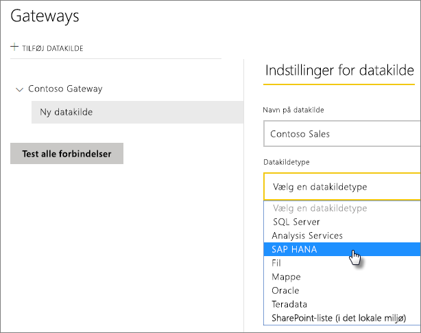
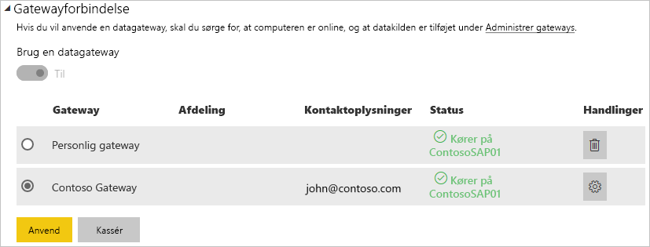

# Administrer din datakilde – SAP HANA

[!INCLUDE [gateway-rewrite](../includes/gateway-rewrite.md)]

Når du har [installeret datagatewayen i det lokale miljø](/data-integration/gateway/service-gateway-install), skal du [tilføje datakilder](service-gateway-data-sources.md#add-a-data-source), der kan bruges sammen med gateway'en. Denne artikel indeholder oplysninger om, hvordan du arbejder med gateways og SAP HANA-datakilder, der enten bruges til planlagte opdateringer eller DirectQuery.

## Tilføj en datakilde

Du kan finde flere oplysninger om, hvordan du tilføjer en datakilde i [Tilføj en datakilde](service-gateway-data-sources.md#add-a-data-source). Under **Datakildetype** skal du vælge **SAP HANA**.

Når du har valgt datakildetypen SAP HANA, skal du derefter udfylde oplysninger om **Server**, **Brugernavn** og **Adgangskode** for datakilden.

> [!NOTE]
> Alle forespørgsler til datakilden kører ved hjælp af disse legitimationsoplysninger. Hvis du vil have mere at vide om, hvor legitimationsoplysningerne gemmes, skal du se [Lagring af krypterede legitimationsoplysninger i cloudmiljøet](service-gateway-data-sources.md#store-encrypted-credentials-in-the-cloud).

Når du har udfyldt alt, skal du vælge **Tilføj**. Du kan nu bruge denne datakilde til planlagt opdatering eller DirectQuery mod en SAP HANA-server, der er i det lokale miljø. Du får vist *Forbindelsen blev oprettet*, hvis det lykkes.

### Avancerede indstillinger

Du kan eventuelt konfigurere niveauet for beskyttelse af personlige oplysninger for datakilden. Denne indstilling styrer, hvordan data kan kombineres. Det bruges kun for planlagte opdateringer. Indstillingen for beskyttelse af personlige oplysninger gælder ikke for DirectQuery. Hvis du vil vide mere om niveauer for beskyttelse af personlige oplysninger, skal du se [Niveauer for beskyttelse af personlige oplysninger (Power-forespørgsel)](https://support.office.com/article/Privacy-levels-Power-Query-CC3EDE4D-359E-4B28-BC72-9BEE7900B540).

## Brug datakilden

Når du opretter datakilden, er den tilgængelig til brug med enten DirectQuery-forbindelser eller via en planlagt opdatering.

> [!NOTE]
> Server- og databasenavne skal matche mellem Power BI Desktop og datakilden i datagatewayen i det lokale miljø.

Forbindelsen mellem dit datasæt og datakilden i gatewayen er baseret på dit servernavn og databasenavn. Disse navne skal være ens. Hvis du f.eks. angiver en IP-adresse for servernavnet i Power BI Desktop, skal du bruge IP-adressen for datakilden i konfigurationen af gatewayen. Hvis du bruger *SERVER\INSTANCE* i Power BI Desktop, skal du også bruge det i den datakilde, der er konfigureret for gateway'en.

Dette krav gælder både for DirectQuery og planlagt opdatering.

### Brug datakilden med DirectQuery-forbindelser

Sørg for, at servernavnet og databasenavnet matcher mellem Power BI Desktop og den konfigurerede datakilde for gatewayen. Du skal også at sørge for, at din bruger er angivet under fanen **Brugere** i datakilden for at kunne udgive DirectQuery-datasæt. Valget til DirectQuery sker i Power BI Desktop, når du importerer data første gang. Du kan finde flere oplysninger om, hvordan du bruger DirectQuery under [Brug DirectQuery i Power BI Desktop](desktop-use-directquery.md).

Når du publicerer fra enten Power BI Desktop eller **Hent Data**, bør dine rapporter begynde at fungere. Det kan tage flere minutter, efter du har oprettet datakilden i gateway'en, før forbindelsen kan bruges.

### Brug datakilden med planlagt opdatering

Hvis du er angivet under fanen **Brugere** i den datakilde, der er konfigureret i gatewayen, og servernavnet og databasenavnet stemmer overens, får du vist gatewayen som en mulighed, der kan bruges sammen med en planlagt opdatering.

## De næste trin

* [Fejlfinding af datagateway i lokalt miljø](/data-integration/gateway/service-gateway-tshoot)
* [Foretag fejlfinding af gateways – Power BI](service-gateway-onprem-tshoot.md) 

Har du flere spørgsmål? [Prøv at spørge Power BI-community'et](https://community.powerbi.com/).
