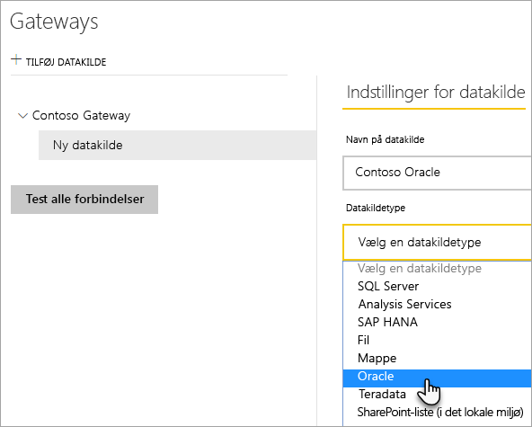
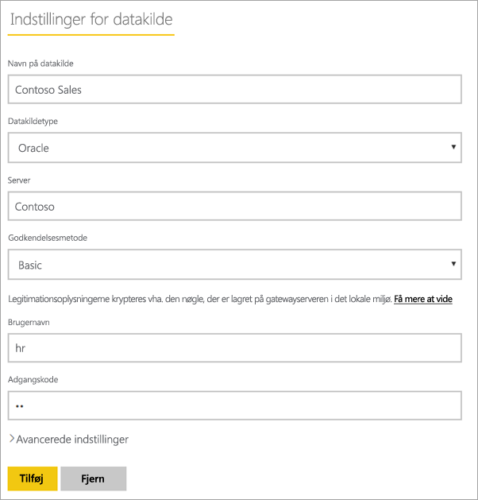
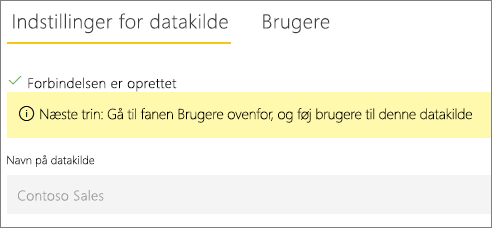

# Administrer din datakilde – Oracle

[!INCLUDE [gateway-rewrite](../includes/gateway-rewrite.md)]

Når du har [installeret datagatewayen i det lokale miljø](/data-integration/gateway/service-gateway-install), skal du [tilføje datakilder](service-gateway-data-sources.md#add-a-data-source), der kan bruges sammen med gateway'en. Denne artikel indeholder oplysninger om, hvordan du arbejder med gateways og Oracle-datakilder, der enten bruges til planlagte opdateringer eller DirectQuery.

## Opret forbindelse til en Oracle-database
Hvis du vil oprette forbindelse til en Oracle-database med datagatewayen i det lokale miljø, skal den korrekte Oracle-klientsoftware være installeret på den computer, der kører gatewayen. Hvilken Oracle-klientsoftware du bruger, afhænger af versionen af Oracle-serveren, men vil altid kunne bruges sammen med 64-bit gatewayen.

Understøttede Oracle-versioner: 
- Oracle Server 9 og nyere
- ODAC-software (Oracle Data Access Client) 11.2 og nyere

## Installér Oracle-klienten
- [download og installér 64-bit Oracle-klienten](https://www.oracle.com/database/technologies/odac-downloads.html).

> [!NOTE]
> Vælg en version af ODAC (Oracle Data Access Client), som er kompatibel med din Oracle-server. ODAC 12.x understøtter f.eks. ikke altid Oracle Server version 9.
> Vælg Windows-installationsprogrammet til Oracle-klienten.
> Under installationen af Oracle-klienten skal du sørge for, at du aktiverer *Konfigurer ODP.NET- og/eller Oracle-providere for ASP.NET på maskinens niveau* ved at markere det tilsvarende afkrydsningsfelt i installationsguiden. I nogle versioner af Oracle-klientguiden markeres afkrydsningsfeltet som standard, i andre gøres det ikke. Sørg for, at afkrydsningsfelt er markeret, så Power BI kan oprette forbindelse til din Oracle-database.
 
Når klienten er installeret, og ODAC er konfigureret korrekt, anbefaler vi, at du bruger PowerBI Desktop eller en anden testklient til at kontrollere en korrekt installation og konfiguration på gatewayen.

## Tilføj en datakilde

Du kan finde flere oplysninger om, hvordan du tilføjer en datakilde i [Tilføj en datakilde](service-gateway-data-sources.md#add-a-data-source). Under **Datakildetype** skal du vælge **Oracle**.

Når du har valgt Oracle-datakildetypen, skal du udfylde oplysningerne om datakilden, hvilket omfatter **Server** og **Database**. 

Under **Godkendelsesmetode** kan du vælge enten **Windows**  eller **Basic**. Vælg **Basic**, hvis du har planer om at bruge en konto, der er oprettet i Oracle, i stedet for Windows-godkendelse. Angiv derefter de legitimationsoplysninger, der skal bruges til denne datakilde.

> [!NOTE]
> Alle forespørgsler til datakilden kører ved hjælp af disse legitimationsoplysninger. Hvis du vil have mere at vide om, hvor legitimationsoplysningerne gemmes, skal du se [Lagring af krypterede legitimationsoplysninger i cloudmiljøet](service-gateway-data-sources.md#store-encrypted-credentials-in-the-cloud).

Når du har udfyldt alt, skal du vælge **Tilføj**. Du kan nu bruge denne datakilde til planlagt opdatering eller DirectQuery mod en Oracle-server, der er i det lokale miljø. Du får vist *Forbindelsen blev oprettet*, hvis det lykkes.

### Avancerede indstillinger

Du kan eventuelt konfigurere niveauet for beskyttelse af personlige oplysninger for datakilden. Denne indstilling styrer, hvordan data kan kombineres. Det bruges kun for planlagte opdateringer. Indstillingen for beskyttelse af personlige oplysninger gælder ikke for DirectQuery. Hvis du vil vide mere om niveauer for beskyttelse af personlige oplysninger, skal du se [Niveauer for beskyttelse af personlige oplysninger (Power-forespørgsel)](https://support.office.com/article/Privacy-levels-Power-Query-CC3EDE4D-359E-4B28-BC72-9BEE7900B540).

## Brug datakilden

Når du opretter datakilden, er den tilgængelig til brug med enten DirectQuery-forbindelser eller via en planlagt opdatering.

> [!WARNING]
> Server- og databasenavne skal matche mellem Power BI Desktop og datakilden i datagatewayen i det lokale miljø.

Linket mellem dit datasæt og datakilden i gatewayen er baseret på dit servernavn og databasenavn. Disse navne skal være ens. Hvis du f.eks. angiver en IP-adresse for servernavnet i Power BI Desktop, skal du bruge IP-adressen for datakilden i konfigurationen af gatewayen. Dette navn skal også stemme overens med et alias defineret i filen tnsnames.ora. Se flere oplysninger om filen tnsnames.ora i [Installér Oracle-klienten](#install-the-oracle-client).

Dette krav gælder både for DirectQuery og planlagt opdatering.

### Brug datakilden med DirectQuery-forbindelser

Sørg for, at servernavnet og databasenavnet matcher mellem Power BI Desktop og den konfigurerede datakilde for gatewayen. Du skal også at sørge for, at din bruger er angivet under fanen **Brugere** i datakilden for at kunne udgive DirectQuery-datasæt. Valget til DirectQuery sker i Power BI Desktop, når du importerer data første gang. Du kan finde flere oplysninger om, hvordan du bruger DirectQuery under [Brug DirectQuery i Power BI Desktop](desktop-use-directquery.md).

Når du publicerer fra enten Power BI Desktop eller **Hent Data**, bør dine rapporter begynde at fungere. Det kan tage flere minutter, efter du har oprettet datakilden i gateway'en, før forbindelsen kan bruges.

### Brug datakilden med planlagt opdatering

Hvis du er angivet under fanen **Brugere** i den datakilde, der er konfigureret i gatewayen, og servernavnet og databasenavnet stemmer overens, får du vist gatewayen som en mulighed, der kan bruges sammen med en planlagt opdatering.

## Fejlfinding

Du kan støde på en af flere fejl fra Oracle, når navngivningssyntaksen enten er forkert eller ikke konfigureret korrekt:

* ORA-12154: TNS: Den angivne forbindelsesidentifikator kunne ikke løses.
* ORA-12514: TNS: Lyttefunktionen kender i øjeblikket ikke til den anmodede tjeneste i forbindelsesbeskrivelsen.
* ORA-12541: TNS: Ingen lyttefunktion.
* ORA-12170: TNS: Der opstod timeout for forbindelsen.
* ORA-12504: TNS: Lyttefunktionen fik ikke SERVICE_NAME i CONNECT_DATA.

Disse fejl kan opstå, hvis Oracle-klienten enten ikke er installeret eller konfigureret korrekt. Hvis den er installeret, skal du bekræfte, at filen tnsnames.ora er konfigureret korrekt, og at du bruger det korrekte net_service_name. Du skal også sikre, at net_service_name er det samme for den maskine, der bruger Power BI Desktop, og den maskine, der kører gatewayen. Du kan finde flere oplysninger under [Installér Oracle-klienten](#install-the-oracle-client).

Du støder måske også på et kompatibilitetsproblem mellem Oracle-serverversionen og Oracle Data Access Client-versionen. Det anbefales, at disse versioner matcher, da nogle kombinationer er inkompatible. ODAC 12.x understøtter f.eks. ikke Oracle Server version 9.

Vi anbefaler, at du installerer en klient (f.eks. PowerBI Desktop eller Oracle ODBC Test) på gatewaymaskinen, hvis du vil diagnosticere forbindelsesproblemer mellem datakildeserveren og gatewaymaskinen. Du kan bruge klienten til at kontrollere forbindelsen til datakildeserveren.

Du kan finde yderligere oplysninger om fejlfinding i forbindelse med gatewayen i [Fejlfinding af datagatewayen i det lokale miljø](/data-integration/gateway/service-gateway-tshoot).

## Næste trin

* [Foretag fejlfinding af gateways – Power BI](service-gateway-onprem-tshoot.md)
* [Power BI Premium](../admin/service-premium-what-is.md)

Har du flere spørgsmål? Prøv at spørge [Power BI-community'et](https://community.powerbi.com/).
