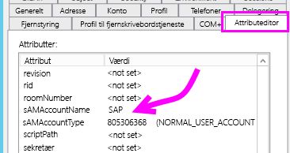
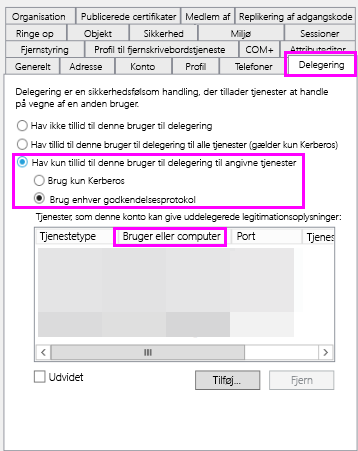
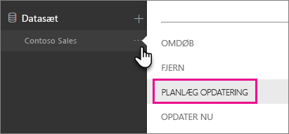
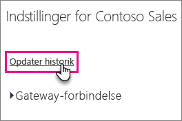
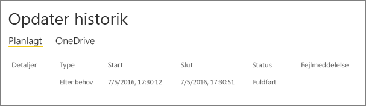

# <a name="troubleshoot-gateways---power-bi"></a>Foretag fejlfinding af gateways – Power BI

[!INCLUDE [gateway-rewrite](../includes/gateway-rewrite.md)]

I denne artikel beskrives nogle af de almindelige problemer, der kan opstå, når du bruger datagatewayen i det lokale miljø med Power BI. Hvis du støder på et problem, der ikke er angivet her, kan du bruge Power BI [Community](https://community.powerbi.com)-webstedet. Alternativt kan du oprette en [supportanmodning](https://powerbi.microsoft.com/support).

## <a name="configuration"></a>Konfiguration

### <a name="error-power-bi-service-reported-local-gateway-as-unreachable-restart-the-gateway-and-try-again"></a>Fejl: Power BI-tjenesten rapporterede, at den lokale gateway ikke er tilgængelig. Genstart gatewayen, og prøv igen.

I slutningen af konfigurationen kaldes Power BI-tjenesten igen for at bekræfte gatewayen. Power BI-tjenesten rapporterer ikke gatewayen som live. Kommunikationen kan muligvis gennemføres, hvis Windows-tjenesten genstartes. For at få flere oplysninger kan du indsamle og gennemse loggene, som beskrevet i [Indsaml logge fra datagateway-appen i det lokale miljø](/data-integration/gateway/service-gateway-tshoot#collect-logs-from-the-on-premises-data-gateway-app).

## <a name="data-sources"></a>Datakilder

### <a name="error-unable-to-connect-details-invalid-connection-credentials"></a>Fejl: Der kan ikke oprettes forbindelse. Detaljer: Legitimationsoplysningerne for forbindelsen er ugyldige.

I **Vis detaljer** vises den fejlmeddelelse, der blev modtaget fra datakilden. Hvis du bruger SQL Server, får du vist noget, der ligner nedenstående:

    Login failed for user 'username'.

Bekræft, at du har det rigtige brugernavn og den rigtige adgangskode. Bekræft også, at der kan oprettes forbindelse til datakilden med disse legitimationsoplysninger. Sørg for, at den konto, der bruges, stemmer overens med godkendelsesmetoden.

### <a name="error-unable-to-connect-details-cannot-connect-to-the-database"></a>Fejl: Der kan ikke oprettes forbindelse. Detaljer: Der kan ikke oprettes forbindelse til databasen.

Du kunne oprette forbindelse til serveren, men ikke til den database, der var angivet. Kontrollér navnet på databasen, og at legitimationsoplysningerne for brugeren er den korrekte tilladelse til at få adgang til databasen.

I **Vis detaljer** vises den fejlmeddelelse, der blev modtaget fra datakilden. Hvis du bruger SQL Server, får du vist noget, der ligner nedenstående:

    Cannot open database "AdventureWorks" requested by the login. The login failed. Login failed for user 'username'.

### <a name="error-unable-to-connect-details-unknown-error-in-data-gateway"></a>Fejl: Der kan ikke oprettes forbindelse. Detaljer: Ukendt fejl i datagateway.

Denne fejl kan opstå af forskellige årsager. Sørg for at kontrollere, at du kan oprette forbindelse til datakilden fra den computer, som er vært for gatewayen. Denne situation kan skyldes, at serveren ikke er tilgængelig.

I **Vis detaljer** får du vist fejlkoden **DM_GWPipeline_UnknownError**.

Du kan også se i **Hændelseslogfiler** > **Logfiler for programmer og tjenester** > **Datagatewaytjeneste i det lokale miljø** for at få flere oplysninger.

### <a name="error-we-encountered-an-error-while-trying-to-connect-to-server-details-we-reached-the-data-gateway-but-the-gateway-cant-access-the-on-premises-data-source"></a>Fejl: Der opstod en fejl under forsøget på at oprette forbindelse til \<server\>. Detaljer: Vi har nået den ønskede datagateway, men gatewayen kan ikke få adgang til datakilden i det lokale miljø.

Du kunne ikke oprette forbindelse til den angivne datakilde. Sørg for at kontrollere de oplysninger, der er angivet for denne datakilde.

I **Vis detaljer** får du vist fejlkoden **DM_GWPipeline_Gateway_DataSourceAccessError**.

Hvis den underliggende fejlmeddelelse ligner nedenstående, betyder det, at den konto, du bruger til datakilden, ikke er serveradministrator for denne Analysis Services-forekomst. Du kan finde flere oplysninger i [Tildel serveradministratorrettigheder til en Analysis Services-forekomst](https://docs.microsoft.com/sql/analysis-services/instances/grant-server-admin-rights-to-an-analysis-services-instance).

    The 'CONTOSO\account' value of the 'EffectiveUserName' XML for Analysis property is not valid.

Hvis den underliggende fejlmeddelelse ligner nedenstående, kan det betyde, at tjenestekontoen til Analysis Services mangler mappeattributten [token-groups-global-and-universal](/windows/win32/adschema/a-tokengroupsglobalanduniversal) (TGGAU).

    The username or password is incorrect.

Domæner med kompatibilitetsadgang fra før Windows 2000 har TGGAU-attributten aktiveret. De fleste domæner, der senest er oprettet, aktiverer ikke denne attribut som standard. Hvis du vil have flere oplysninger, skal du se [Nogle programmer og API'er kræver adgang til godkendelsesoplysninger om kontoobjekter](https://support.microsoft.com/kb/331951).

Følg disse trin for at kontrollere, om attributten er aktiveret.

1. Opret forbindelse til Analysis Services-computeren i SQL Server Management Studio. Medtag EffectiveUserName for den pågældende bruger i egenskaberne for avanceret forbindelse, og se, om denne tilføjelse gengiver fejlen.
2. Du kan bruge værktøjet dsacls Active Directory til at kontrollere, om attributten er angivet. Dette værktøj findes på en domænecontroller. Du skal kende det entydige domænenavn for kontoen og videregive dette navn til værktøjet.

        dsacls "CN=John Doe,CN=UserAccounts,DC=contoso,DC=com"

    Du ønsker at få vist noget, der ligner nedenstående, i resultaterne:

            Allow BUILTIN\Windows Authorization Access Group
                                          SPECIAL ACCESS for tokenGroupsGlobalAndUniversal
                                          READ PROPERTY

For at løse problemet skal du aktivere TGGAU på den konto, der bruges til Windows-tjenesten Analysis Services.

#### <a name="another-possibility-for-the-username-or-password-is-incorrect"></a>En anden årsag kan være "forkert brugernavn eller adgangskode."

Denne fejl kan også forekomme, hvis Analysis Services-serveren findes i et andet domæne end brugerne, og der er ikke er etableret et tovejstillidsforhold.

Samarbejd med domæneadministratorerne om at bekræfte tillidsforholdet mellem domæner.

#### <a name="unable-to-see-the-data-gateway-data-sources-in-the-get-data-experience-for-analysis-services-from-the-power-bi-service"></a>Det var ikke muligt at få vist datagatewayens datakilder under Hent Data for Analysis Services fra Power BI-tjenesten

Sørg for, at din konto er angivet under fanen **Brugere** i datakilden i konfigurationen af gatewayen. Hvis du ikke har adgang til gatewayen, kan du kontakte administratoren af gatewayen og bede dem om at bekræfte. Det er kun konti på listen **Brugere**, der kan se datakilden på Analysis Services-listen.

### <a name="error-you-dont-have-any-gateway-installed-or-configured-for-the-data-sources-in-this-dataset"></a>Fejl: Du har ikke nogen gateway, der er installeret eller konfigureret til datakilderne i dette datasæt.

Kontrollér, at du har føjet en eller flere datakilder til gatewayen, som beskrevet i [Tilføj en datakilde](service-gateway-data-sources.md#add-a-data-source). Hvis gatewayen ikke vises på administrationsportalen under **Administrer gateways**, skal du rydde browsercachen eller logge af tjenesten og derefter logge på igen.

## <a name="datasets"></a>Datasæt

### <a name="error-there-is-not-enough-space-for-this-row"></a>Fejl: Der er ikke tilstrækkelig plads til denne række.

Denne fejl opstår, hvis du har en enkelt række, der er større end 4 MB. Afgør, hvilken række der er fra din datakilde, og forsøg at filtrere den ud eller mindske den pågældende rækkes størrelse.

### <a name="error-the-server-name-provided-doesnt-match-the-server-name-on-the-sql-server-ssl-certificate"></a>Fejl: Det servernavn, du har angivet, stemmer ikke overens med servernavnet på SQL Server SSL-certifikatet.

Denne fejl kan ske, når det angivne certifikats fælles navn er for serverens fuldt kvalificerede domænenavn (FQDN), men du kun har angivet serverens NetBIOS-navn. Denne situation medfører en uoverensstemmelse for certifikatet. For at løse dette problem skal du få servernavnet i gatewayens datakilde og PBIX-filen til at bruge serverens fuldt kvalificerede navn.

### <a name="error-you-dont-see-the-on-premises-data-gateway-present-when-you-configure-scheduled-refresh"></a>Fejl: Du kan ikke se datagatewayen i det lokale miljø, når du konfigurerer en planlagt opdatering.

Der er et par forskellige scenarier, som kan være ansvarlige for denne fejl:

- Navnet på serveren og databasen stemmer ikke overens med det, der er angivet i Power BI Desktop, og den datakilde, der er konfigureret for gatewayen. Disse navne skal være ens. Der er ikke forskel på store og små bogstaver.
- Din konto er ikke angivet under fanen **Brugere** i datakilden i konfigurationen af gatewayen. Du skal føjes til listen af administratoren af gatewayen.
- Din Power BI Desktop-fil indeholder flere datakilder, og det er ikke alle disse datakilder, der er konfigureret i gatewayen. Hvis gatewayen skal vises i Planlagt opdatering, skal hver enkelt datakilde være defineret sammen med gatewayen.

### <a name="error-the-received-uncompressed-data-on-the-gateway-client-has-exceeded-the-limit"></a>Fejl: De modtagne ikke-komprimerede data på gatewayklienten overstiger grænsen.

Den nøjagtige begrænsning er 10 GB ikke-komprimerede data pr. tabel. Hvis du støder på dette problem, er der indstillinger, der er velegnet til at optimere og undgå det. Du skal især reducere brugen af meget konstante, lange strengværdier og i stedet bruge en normaliseret nøgle. Alternativt kan du fjerne kolonnen, hvis den ikke er en hjælp.

## <a name="reports"></a>Rapporter

### <a name="error-report-could-not-access-the-data-source-because-you-do-not-have-access-to-our-data-source-via-an-on-premises-data-gateway"></a>Fejl: Rapporten kunne ikke få adgang til datakilden, fordi du ikke har adgang til vores datakilde via en datagateway i det lokale miljø.

Fejlen skyldes som regel et af nedenstående forhold:

- Oplysningerne om datakilden matcher ikke de oplysninger, der findes i det underliggende datasæt. Navn på server og database skal stemme overens mellem den datakilde, der er defineret for datagatewayen i det lokale miljø, og det, du angiver i Power BI Desktop. Hvis du bruger en IP-adresse i Power BI Desktop, skal datakilden for datagatewayen i det lokale miljø også bruge en IP-adresse.
- Der er ingen tilgængelig datakilde på nogen gateway i din organisation. Du kan konfigurere datakilden på en ny eller eksisterende datagateway i det lokale miljø.

### <a name="error-data-source-access-error-please-contact-the-gateway-administrator"></a>Fejl: Adgangsfejl i datakilden. Kontakt gatewayadministratoren.

Hvis denne rapport gør brug af en direkte forbindelse til Analysis Services, kan du komme ud for et problem med en værdi, der overføres til EffectiveUserName, der enten ikke er gyldig, eller som ikke har tilladelser på Analysis Services-computeren. Problemer med godkendelse skyldes som regel, at den værdi, der overføres for EffectiveUserName, ikke stemmer overens med en lokal brugers hovednavn (UPN).

Følg disse trin for at bekræfte det effektive brugernavn.

1. Find det effektive brugernavn i [gatewaylogfilerne](/data-integration/gateway/service-gateway-tshoot#collect-logs-from-the-on-premises-data-gateway-app).
2. Når du har den værdi, der sendes, skal du bekræfte, at den er korrekt. Hvis det er din bruger, kan du bruge følgende kommando fra en kommandoprompt til at se UPN-værdien. UPN-værdien ligner en mailadresse.

        whoami /upn

Du kan eventuelt se, hvad Power BI henter fra Azure Active Directory.

1. Gå til [https://developer.microsoft.com/graph/graph-explorer](https://developer.microsoft.com/graph/graph-explorer).
2. Vælg **Log på** i øverste højre hjørne.
3. Kør følgende forespørgsel. Du får vist et ret stort JSON-svar.

        https://graph.windows.net/me?api-version=1.5
4. Søg efter **userPrincipalName**.

Hvis dit Azure Active Directory-UPN ikke stemmer overens med dit lokale Active Directory-UPN, kan du bruge funktionen [Tilknyt brugernavne](service-gateway-enterprise-manage-ssas.md#map-user-names-for-analysis-services-data-sources) til at erstatte det med en gyldig værdi. Du kan også arbejde sammen med enten din lejeradministrator eller den lokale Active Directory-administrator om at få ændret dit UPN.

## <a name="kerberos"></a>Kerberos

Hvis den underliggende databaseserver og datagateway'en i det lokale miljø ikke er konfigureret korrekt til [begrænset Kerberos-delegering](service-gateway-sso-kerberos.md), kan du aktivere [detaljeret logføring](/data-integration/gateway/service-gateway-performance#slow-performing-queries) på gateway'en. Derefter skal du undersøge, om der er fejl eller sporinger i gateway'ens logfiler som udgangspunkt for fejlfinding. Hvis du vil indsamle logge for gatewayen for at få dem vist, skal du se [Indsaml logge fra programmet til datagatewayen i det lokale miljø](/data-integration/gateway/service-gateway-tshoot#collect-logs-from-the-on-premises-data-gateway-app).

### <a name="impersonationlevel"></a>ImpersonationLevel

ImpersonationLevel er relateret til SPN-konfigurationen eller den lokale politikindstilling.

```
[DataMovement.PipeLine.GatewayDataAccess] About to impersonate user DOMAIN\User (IsAuthenticated: True, ImpersonationLevel: Identification)
```

**Løsning**

Følg disse trin til at løse problemet.

1. Konfigurer et SPN for gatewayen i det lokale miljø.
2. Konfigurer begrænset delegering i dit Active Directory.

### <a name="failedtoimpersonateuserexception-failed-to-create-windows-identity-for-user-userid"></a>FailedToImpersonateUserException: Kunne ikke oprette Windows-identiteten for bruger-id'et

FailedToImpersonateUserException sker, hvis du ikke kan repræsentere på vegne af en anden bruger. Denne fejl kan også ske, hvis den konto, du forsøger at repræsentere, er fra et andet domæne end det, som domænet for gatewaytjenesten er på. Dette er en begrænsning.

**Løsning**

* Bekræft, at konfigurationen er korrekt i henhold til trinnene i det forrige afsnit "ImpersonationLevel".
* Kontrollér, at det bruger-id, der gøres forsøg på at repræsentere, er til en gyldig Active Directory-konto.

### <a name="general-error-1033-error-while-you-parse-the-protocol"></a>Generel fejl: 1033-fejl, mens du fortolker protokollen

Du får vist 1033-fejlen, når dit eksterne id, som er konfigureret i SAP HANA, ikke matcher det pågældende logon, hvis brugeren repræsenteres ved hjælp af UPN (alias@domain.com). Øverst i logfilerne ses "Original UPN 'alias@domain.com' er erstattet med et nyt UPN 'alias@domain.com'" som vist nedenfor:

```
[DM.GatewayCore] SingleSignOn Required. Original UPN 'alias@domain.com' replaced with new UPN 'alias@domain.com.'
```

**Løsning**

* SAP HANA kræver, at den repræsenterede bruger anvender attributten sAMAccountName i Active Directory (brugeralias). Hvis denne attribut ikke er korrekt, får du vist 1033-fejlen.

    

* I loggene kan du se sAMAccountName (alias) og ikke UPN, som er aliasset efterfulgt af domænet (alias@doimain.com).

    

```xml
      <setting name="ADUserNameReplacementProperty" serializeAs="String">
        <value>sAMAccount</value>
      </setting>
      <setting name="ADServerPath" serializeAs="String">
        <value />
      </setting>
      <setting name="CustomASDataSource" serializeAs="String">
        <value />
      </setting>
      <setting name="ADUserNameLookupProperty" serializeAs="String">
        <value>AADEmail</value>
```

### <a name="sap-aglibodbchdb-dllhdbodbc-communication-link-failure-10709-connection-failed-rte-1-kerberos-error-major-miscellaneous-failure-851968-minor-no-credentials-are-available-in-the-security-package"></a>[SAP AG][LIBODBCHDB DLL][HDBODBC] Communication link failure:-10709 Connection failed (RTE:[-1] Kerberos error. Major: "Miscellaneous failure [851968]." Mindre: "No credentials are available in the security package."

Du får vist meddelelsen "-10709 Connection failed", hvis din delegering ikke er konfigureret korrekt i Active Directory.

**Løsning**

* Sørg for, at SAP Hana-serveren findes under fanen Delegering i Active Directory for gatewaytjenestekontoen.

   

## <a name="refresh-history"></a>Opdater historik

Når du bruger gateway'en til en planlagt opdatering, kan **Opdateringshistorik** hjælpe dig med at se, hvilke fejl der er opstået. Den kan også indeholde nyttige data, hvis du har brug for at oprette en supportanmodning. Du kan få vist planlagte opdateringer og opdateringer efter behov. Følgende trin viser, hvordan du kommer til opdateringshistorikken.

1. Vælg et datasæt i **Datasæt** i Power BI-navigationsruden. Åbn menuen, og vælg **Planlæg opdatering**.

    

2. I **Indstillinger for...** &gt; **Planlæg opdatering** skal du vælge **Opdater historik**.

    

    

Du kan finde flere oplysninger om fejlfinding af opdateringsscenarier i [Scenarier i forbindelse med fejlfinding af opdatering](refresh-troubleshooting-refresh-scenarios.md).

## <a name="fiddler-trace"></a>Fiddler-sporing

[Fiddler](https://www.telerik.com/fiddler) er et gratis værktøj fra Telerik, der overvåger HTTP-trafik. Du kan se det, der sendes frem og tilbage vha. Power BI-tjenesten fra klientcomputeren. Denne trafikliste kan vise fejl og andre relaterede oplysninger.


## <a name="next-steps"></a>Næste trin

* [Foretag fejlfinding af datagatewayen i det lokale miljø](/data-integration/gateway/service-gateway-tshoot)
* [Konfigurer proxyindstillinger for datagatewayen i det lokale miljø](/data-integration/gateway/service-gateway-proxy)  
* [Administrer din datakilde – Analysis Services](service-gateway-enterprise-manage-ssas.md)  
* [Administrer din datakilde – SAP HANA](service-gateway-enterprise-manage-sap.md)  
* [Administrer din datakilde – SQL Server](service-gateway-enterprise-manage-sql.md)  
* [Administrer din datakilde – Import/planlagt opdatering](service-gateway-enterprise-manage-scheduled-refresh.md)  

Har du flere spørgsmål? Prøv at spørge [Power BI-community'et](https://community.powerbi.com/).
