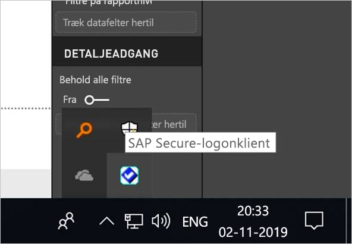
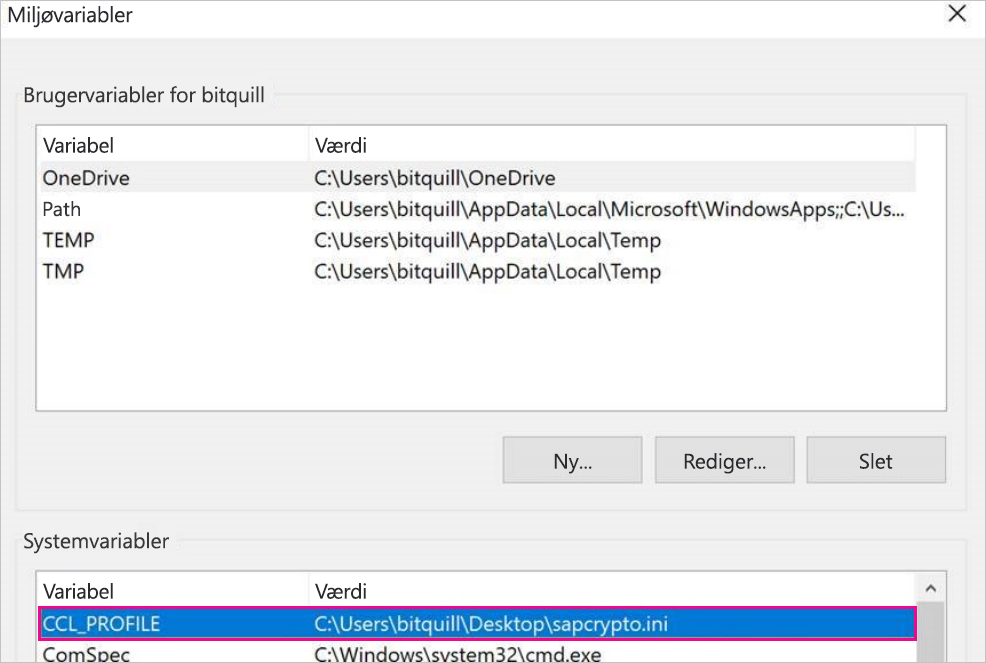
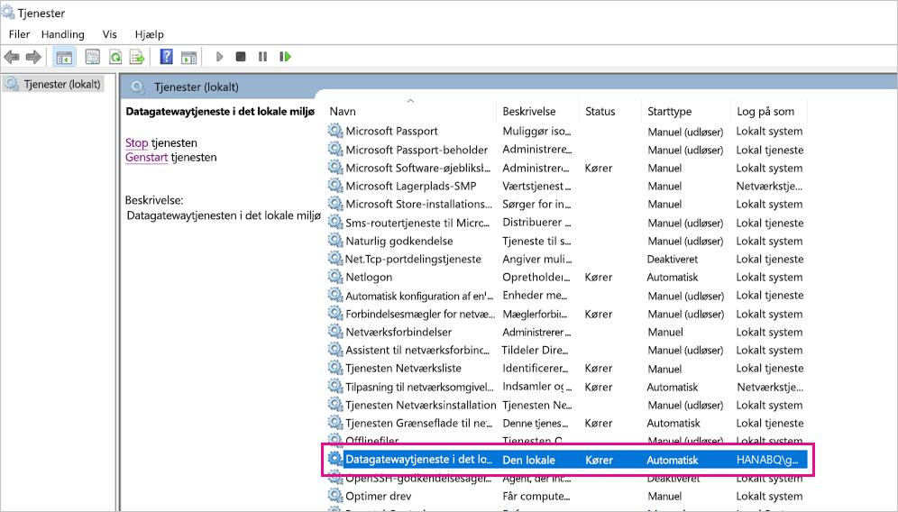
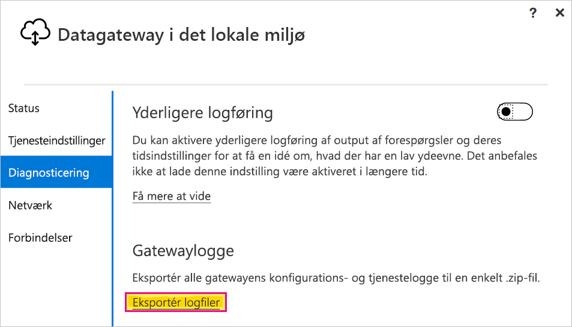

# <a name="use-kerberos-single-sign-on-for-sso-to-sap-bw-using-commoncryptolib-sapcryptodll"></a>Brug enkeltlogon (SSO) i Kerberos til SAP BW ved hjælp af CommonCryptoLib (sapcrypto.dll)

Denne artikel indeholder en beskrivelse af, hvordan du konfigurerer din SAP BW-datakilde for at aktivere SSO fra Power BI-tjenesten ved hjælp af CommonCryptoLib (sapcrypto.dll).

> [!NOTE]
> Før du forsøger at opdatere en SAP BW-baseret rapport, der bruger Kerberos SSO, skal du fuldføre begge trin i denne artikel og trinnene under [Konfigurer Kerberos SSO](service-gateway-sso-kerberos.md). Ved hjælp af CommonCryptoLib som dit SNC-bibliotek aktiveres SSO-forbindelser for både SAP BW-programservere og SAP BW-meddelelsesservere.

## <a name="configure-sap-bw-to-enable-sso-using-commoncryptolib"></a>Konfigurer SAP BW for at aktivere SSO ved hjælp af CommonCryptoLib

> [!NOTE]
> Datagatewayen i det lokale miljø er 64-bit software og kræver derfor 64-bit versionen af CommonCryptoLib (sapcrypto. dll) for at udføre BW SSO. Hvis du planlægger at teste SSO-forbindelsen til din SAP BW-server i SAP GUI, før du forsøger at oprette en SSO-forbindelse via gatewayen (anbefales), skal du også bruge 32-bit versionen af CommonCryptoLib, da SAP GUI er 32-bit-software.

1. Sørg for, at din BW-server er konfigureret korrekt til SSO i Kerberos ved hjælp af CommonCryptoLib. Hvis det er tilfældet, kan du bruge SSO til at få adgang til BW-serveren (enten direkte eller via en SAP BW-meddelelsesserver) med et SAP-værktøj som SAP GUI, der er konfigureret til at bruge CommonCryptoLib. 

   Du kan finde flere oplysninger om [konfigurationstrin under SAP Single Sign-on: Godkend med Kerberos/SPNEGO](https://blogs.sap.com/2017/07/27/sap-single-sign-on-authenticate-with-kerberosspnego/). Din BW-server skal bruge CommonCryptoLib som SNC-bibliotek og have et SNC-navn, der starter med *CN=* , f.eks. *CN=BW1*. Du kan finde flere oplysninger om krav til SNC-navne (helt konkret parameteren snc/identity/as) under [SNC-parametre til konfiguration af Kerberos](https://help.sap.com/viewer/df185fd53bb645b1bd99284ee4e4a750/3.0/360534094511490d91b9589d20abb49a.html).

1. Hvis du ikke allerede har gjort det, skal du installere x64-versionen af [SAP.net Connector](https://support.sap.com/en/product/connectors/msnet.html) på den computer, hvor gatewayen er installeret. 
   
   Du kan kontrollere, om komponenten er installeret, ved at forsøge at oprette forbindelse til din BW-server i Power BI Desktop fra gatewaycomputeren. Hvis du ikke kan oprette forbindelse ved hjælp af implementeringen af version 2.0, er .NET Connector ikke installeret, eller også er den installeret til GAC'en.

1. Sørg for, at SAP Secure logon Client (SLC) ikke kører på den computer, hvor gatewayen er installeret. 

   SLC cachelagrer Kerberos-billetter på en måde, der kan forstyrre gatewayens mulighed for at bruge Kerberos til SSO. 

1. Hvis SLC er installeret, skal du fjerne den eller sørge for, at du afslutter logonklienten SAP Secure. Højreklik på ikonet på proceslinjen, og vælg **Log af** og **Afslut**, før du forsøger at oprette en SSO-forbindelse ved hjælp af gatewayen. 

   SLC understøttes ikke til brug på Windows Server-maskiner. Du kan finde flere oplysninger under [SAP Note 2780475](https://launchpad.support.sap.com/#/notes/2780475) (s-bruger påkrævet).

   

1. Hvis du fjerner SLC eller vælger **Log af** og **Afslut**, skal du åbne et cmd-vindue og angive `klist purge` for at fjerne alle cachelagrede Kerberos-billetter, før du forsøger at oprette en SSO-forbindelse via gatewayen.

1. Download 64-bit versionen af CommonCryptoLib (sapcrypto.dll) *8.5.25 eller nyere* fra SAP Launchpad, og kopiér den til en mappe på din gatewaycomputer. I den samme mappe, hvortil du kopierede sapcrypto.dll, skal du oprette en fil med navnet sapcrypto.ini med følgende indhold:

    ```
    ccl/snc/enable_kerberos_in_client_role = 1
    ```

    Ini-filen indeholder konfigurationsoplysninger, der kræves af CommonCryptoLib for at aktivere SSO i gateway-scenariet.

    > [!NOTE]
    > Disse filer skal gemmes på samme placering. Med andre ord skal _/path/to/sapcrypto/_ indeholde både sapcrypto.ini og sapcrypto.dll.

    Både brugeren af gatewaytjenesten og brugeren af Active Directory (AD), som brugeren af tjenesten repræsenterer, skal have læse- og udførelsestilladelser til begge filer. Det anbefales, at du tildeler tilladelser til både .ini- og .dll-filer til gruppen Godkendte brugere. Med henblik på test kan du også eksplicit tildele disse tilladelser til både brugeren af gatewaytjenesten og brugeren af Active Directory, som du anvender til testen. På nedenstående skærmbillede har vi tildelt gruppen Godkendte brugere **Læse- &amp; Udførelses**-tilladelser til sapcrypto.dll:

    

1. Hvis du ikke allerede har en SAP BW-datakilde, der er knyttet til den gateway, som SSO-forbindelsen skal gå igennem, skal du tilføje en på siden **Administrer gateways** i Power BI-tjenesten. Hvis du allerede har en sådan datakilde, skal du redigere den: 
    - Vælg **SAP Business Warehouse** som **Datakildetype**, hvis du vil oprette en SSO-forbindelse til en BW-programserver. 
    - Vælg **Sap Business Warehouse-meddelelsesserver**, hvis du vil oprette en SSO-forbindelse til en BW-meddelelsesserver.

1. Som **SNC-bibliotek** skal du vælge en af miljøvariablerne **SNC\_LIB** eller **SNC\_LIB\_64** eller **Brugerdefineret**. 

   - Hvis du vælger **SNC\_LIB**, skal du angive værdien af miljøvariablen **SNC\_LIB\_64** på gatewaycomputeren til den absolutte sti til 64-bit kopien af sapcrypto.dll på gatewaycomputeren. Eksempelvis *C:\Users\Test\Desktop\sapcrypto.dll*.

   - Hvis du vælger **Brugerdefineret**, skal du indsætte den absolutte sti til *sapcrypto.dll* i feltet Sti til brugerdefineret SNC-bibliotek, der vises på siden **Administrer gateways**. 

1. Som **SNC-partnernavn** skal du angive SNC-navnet på BW-serveren. Under **Avancerede indstillinger** skal du sikre, at afkrydsningsfeltet **Brug SSO via Kerberos til DirectQuery-forespørgsler** er markeret. Udfyld de andre felter, ligesom hvis du etablerede en forbindelse via Windows-godkendelse fra PBI Desktop.

1. Opret en systemmiljøvariabel af typen **CCL\_PROFILE**, angiv dens værdi til stien til sapcrypto.ini.

    

    sapcrypto.dll- og .ini-filerne skal være på samme placering. I ovenstående eksempel er sapcrypto.ini og sapcrypto.dll begge placeret på skrivebordet.

1. Genstart gatewaytjenesten.

    

1. [Kør en Power BI-rapport](service-gateway-sso-kerberos.md#run-a-power-bi-report)

## <a name="troubleshooting"></a>Fejlfinding

Hvis du ikke kan opdatere rapporten i Power BI-tjenesten, kan du bruge gatewaysporing, sporing af CPIC og sporing af CommonCryptoLib til at diagnosticere problemet. Da sporing af CPIC og CommonCryptoLib er SAP-produkter, kan Microsoft ikke yde support til dem.

### <a name="gateway-logs"></a>Gatewaylogge

1. Genskab problemet.

2. Åbn [gatewayprogrammet](https://docs.microsoft.com/data-integration/gateway/service-gateway-app), og vælg **Eksportér logge** under fanen **Diagnosticering**.

      

### <a name="cpic-tracing"></a>Sporing af CPIC

1. Indstil to miljøvariabler for at aktivere sporing af CPIC: **CPIC\_TRACE** og **CPIC\_TRACE\_DIR**. 

   Den første variabel angiver sporingsniveauet, og den anden variabel angiver mappen med sporingsfilen. Mappen skal være en placering, som medlemmerne af gruppen Godkendte brugere kan skrive til. 
 
2. Angiv **CPIC\_TRACE** til *3* og **CPIC\_TRACE\_DIR** til lige præcis den mappe, du vil have skrevet sporingsfilerne til. Eksempel:

   

3. Genskab problemet, og kontrollér, at **CPIC\_TRACE\_DIR** indeholder sporingsfilerne.
 
    Ved hjælp af CPIC-sporing kan problemer på højere niveau diagnosticeres, f.eks. problemer med at indlæse sapcrypto.dll-biblioteket. Her er f.eks. et stykke fra en CPIC-sporingsfil, hvor der opstod en fejl under indlæsning af en .dll-fil:

    ```
    [Thr 7228] *** ERROR => DlLoadLib()==DLENOACCESS - LoadLibrary("C:\Users\test\Desktop\sapcrypto.dll")
    Error 5 = "Access is denied." [dlnt.c       255]
    ```

    Hvis du oplever sådan en fejl, men du har angivet læse- og udførelsesrettigheder til sapcrypto.dll og sapcrypto.ini, som beskrevet [i afsnittet ovenfor](#configure-sap-bw-to-enable-sso-using-commoncryptolib), skal du prøve at angive de samme læse- og udførelsesrettigheder for den mappe, der indeholder filerne.

    Hvis du stadig ikke kan indlæse .dll-filen, kan du prøve at aktivere [overvågning for filen](/windows/security/threat-protection/auditing/apply-a-basic-audit-policy-on-a-file-or-folder). Hvis du undersøger de resulterende overvågningslogge i Windows Logbog, kan det muligvis hjælpe dig med at fastslå, hvorfor filen ikke kan indlæses. Kig efter en fejlpost, der er startet af den repræsenterede Active Directory-bruger. For den repræsenterede bruger `MYDOMAIN\mytestuser` vil en fejl i overvågningsloggen f.eks. se sådan ud:

    ```
    A handle to an object was requested.

    Subject:
        Security ID:        MYDOMAIN\mytestuser
        Account Name:       mytestuser
        Account Domain:     MYDOMAIN
        Logon ID:       0xCF23A8

    Object:
        Object Server:      Security
        Object Type:        File
        Object Name:        <path information>\sapcrypto.dll
        Handle ID:      0x0
        Resource Attributes:    -

    Process Information:
        Process ID:     0x2b4c
        Process Name:       C:\Program Files\On-premises data gateway\Microsoft.Mashup.Container.NetFX45.exe

    Access Request Information:
        Transaction ID:     {00000000-0000-0000-0000-000000000000}
        Accesses:       ReadAttributes
                
    Access Reasons:     ReadAttributes: Not granted
                
    Access Mask:        0x80
    Privileges Used for Access Check:   -
    Restricted SID Count:   0
    ```

### <a name="commoncryptolib-tracing"></a>Sporing af CommonCryptoLib 

1. Aktivér sporing af CommonCryptoLib ved at føje disse linjer til den sapcrypto.ini-fil, du oprettede tidligere:

    ```
    ccl/trace/level=5
    ccl/trace/directory=<drive>:\logs\sectrace
    ```

2. Skift indstillingen `ccl/trace/directory` til en placering, som medlemmerne af gruppen Godkendte brugere kan skrive til. 

3. Alternativt kan du oprette en ny .ini-fil for at ændre denne funktion. Oprette en fil med navnet sectrace.ini i den samme mappe som sapcrypto.ini og sapcrypto.dll med følgende indhold. Erstat indstillingen `DIRECTORY` med en placering på din computer, som medlemmerne af gruppen Godkendte brugere kan skrive til:

    ```
    LEVEL = 5
    DIRECTORY = <drive>:\logs\sectrace
    ```

4. Genskab problemet, og bekræft, at den placering, der peges på af **DIRECTORY**, indeholder sporingsfiler. 

5. Slå sporing af CPIC og CCL fra, når du er færdig.

    Du kan finde flere oplysninger om sporing af CommonCryptoLib i [SAP-note 2491573](https://launchpad.support.sap.com/#/notes/2491573) (s-bruger til SAP er påkrævet).

## <a name="next-steps"></a>Næste trin

Du kan finde flere oplysninger om datagatewayen i det lokale miljø og DirectQuery i følgende ressourcer:

* [Hvad er en datagateway i det lokale miljø?](/data-integration/gateway/service-gateway-onprem)
* [DirectQuery i Power BI](desktop-directquery-about.md)
* [Datakilder, der understøttes af DirectQuery](power-bi-data-sources.md)
* [DirectQuery og SAP BW](desktop-directquery-sap-bw.md)
* [DirectQuery og SAP HANA](desktop-directquery-sap-hana.md)
