# Installér og distribuer skabelonapps i din organisation

Er du Power BI-analytiker? Hvis du er det, forklares det i denne artikel, hvordan du installerer [skabelonapps](service-template-apps-overview.md) for at oprette forbindelse til mange af de tjenester, du bruger til at drive din forretning, f.eks. Salesforce, Microsoft Dynamics og Google Analytics. Du kan derefter ændre skabelonappens færdigbyggede dashboard og rapporter, så de opfylder din organisations behov, og derefter distribuere dem til dine kolleger som [apps](../consumer/end-user-apps.md). 

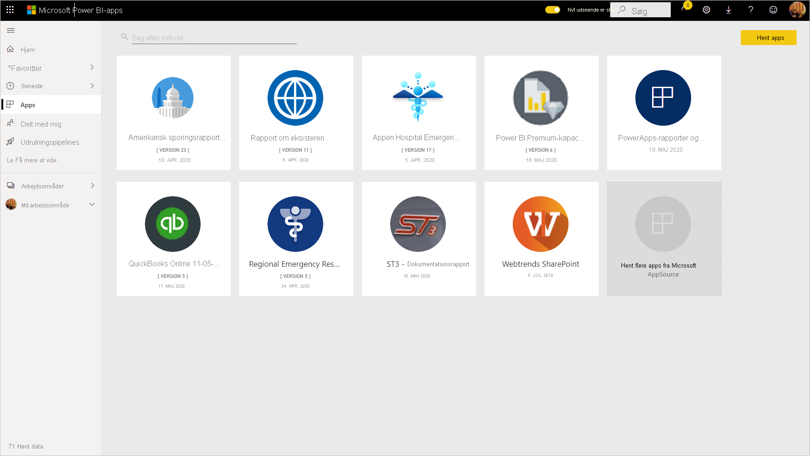

Hvis du er interesseret i selv at oprette skabelonprogrammer til distribution uden for organisationen, skal du se [Opret en skabelonapp i Power BI](service-template-apps-create.md). Power BI-partnere kan med lidt eller ingen kodning opbygge Power BI-apps og gøre dem tilgængelige for Power BI-kunder. 

## Forudsætninger  

Hvis du vil installere, tilpasse og distribuere en skabelonapp, skal du have følgende: 

* En [Power BI Pro-licens](../fundamentals/service-self-service-signup-for-power-bi.md).
* Tilladelse til at installere skabelonapps i din lejer.
* Et gyldigt installationslink til appen, som du enten får fra AppSource eller fra appopretteren.
* Et godt kendskab til de [grundlæggende begreber i Power BI](../fundamentals/service-basic-concepts.md).

## Installér et skabelonprogram

1. Vælg **Programmer** > **Hent programmer** i navigationsruden i Power BI-tjenesten.

    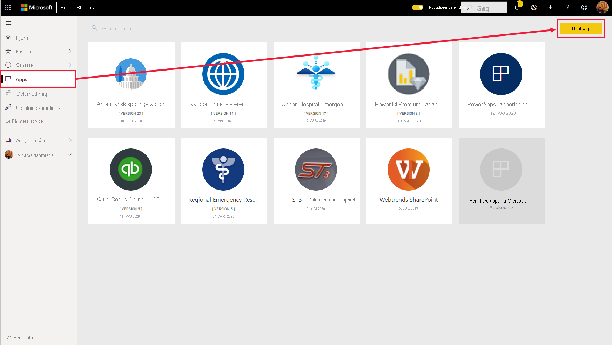

1. Vælg **Apps** i vinduet AppSource, der vises. Gennemse, eller søg efter den ønskede app, og vælg derefter **Hent den nu**.

    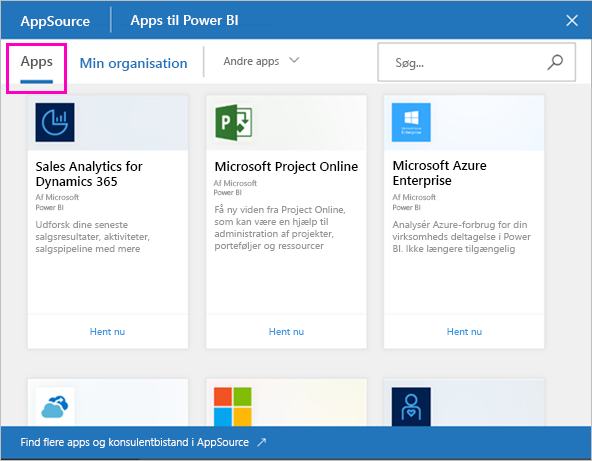

1. Vælg **Installér** i den dialogboks, der vises.

    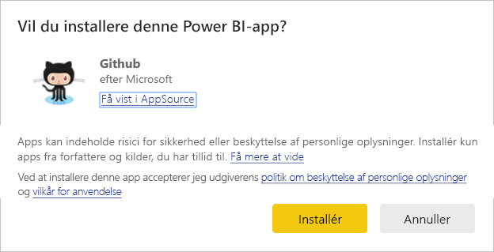
    
    Appen installeres sammen med et tilknyttet arbejdsområde. **Hvis du beslutter at tilpasse appen, kan du gøre det i dette tilknyttede arbejdsområde**.

    > [!NOTE]
    > Hvis du bruger et installationslink for en app, der ikke er angivet i AppSource, får du vist en valideringsdialogboks, hvor du skal bekræfte dit valg.
    >
    >Hvis du vil installere en skabelonapp, der ikke er angivet i AppSource, skal du anmode din administrator om de relevante tilladelser. Se [Skabelonappens indstillinger](../admin/service-admin-portal.md#template-apps-settings) i Power BI-administrationsportalen for at få flere oplysninger.

    Når installationen er fuldført, får du besked om, at din nye app er klar.

    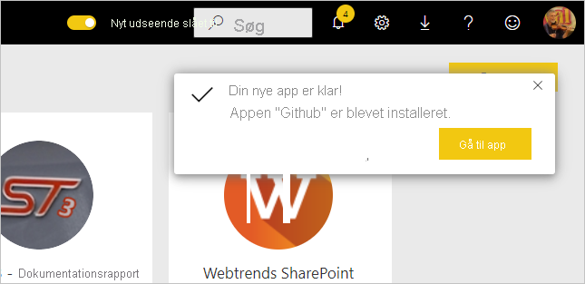

## Opret forbindelse til data

1. Vælg **Gå til program**.

1. I vinduet **Kom i gang med din nye app** skal du vælge **Udforsk**.

   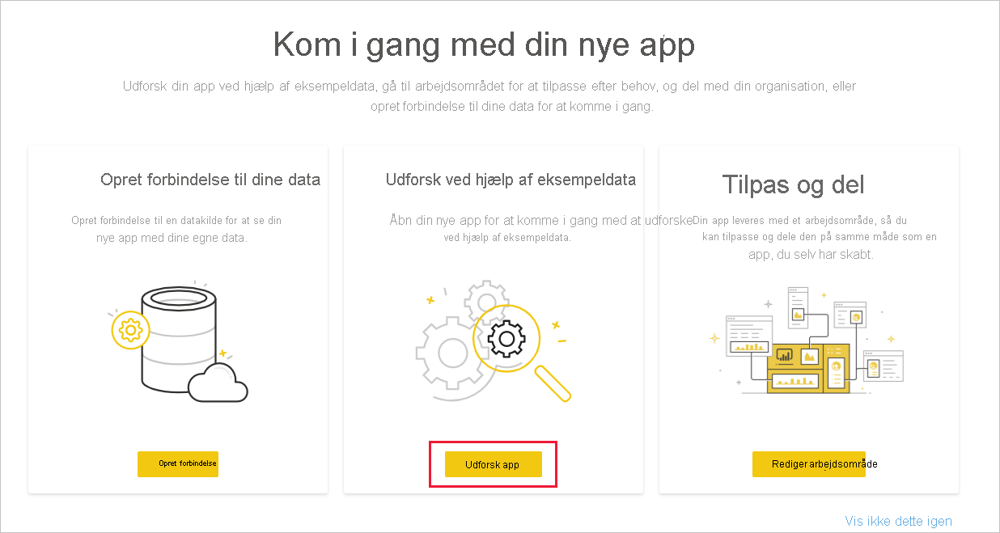

   Appen åbnes, og der vises eksempeldata.

1. Vælg linket **Opret forbindelse til dine data** på banneret øverst på siden.

   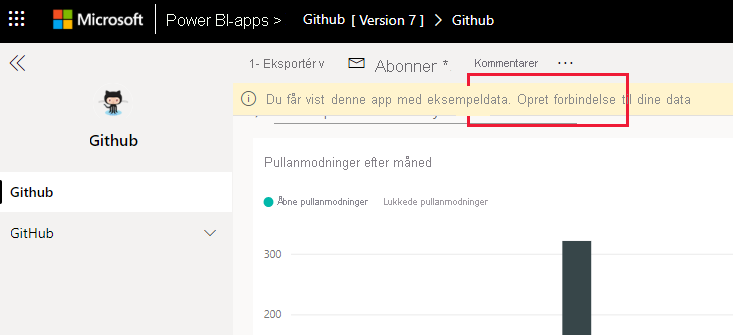

    
    Derved åbnes en dialogboks eller en række dialogbokse, hvor du ændrer datakilden fra eksempeldataene til din egen datakilde. Dette betyder normalt, at du omdefinerer parametrene for datasæt og legitimationsoplysningerne for datakilden. Se [Kendte begrænsninger](service-template-apps-overview.md#known-limitations).
    
    I eksemplet nedenfor kræves der to dialogbokse for at oprette forbindelse til data.

   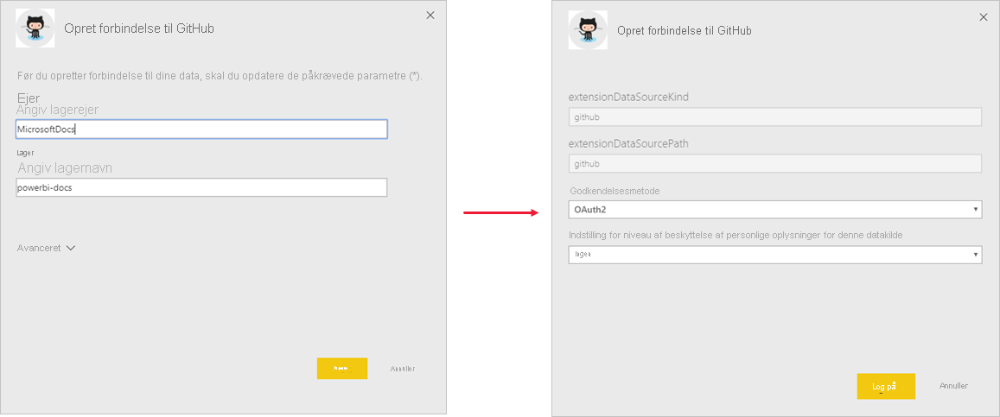

    Når du er færdig med at udfylde forbindelsesdialogboksene, starter processen til oprettelse af forbindelse. Et banner informerer dig om, at dataene opdateres, og at du i mellemtiden får vist eksempeldata.

    

   Dine rapportdata opdateres automatisk én gang om dagen, medmindre du deaktiverede dette under logonprocessen. Du kan også [konfigurere din egen opdateringsplan](./refresh-scheduled-refresh.md) for at holde rapportdataene opdateret, hvis du vil.

## Tilpas og del appen

Når du har oprettet forbindelse til dine data, og dataopdateringen er fuldført, kan du tilpasse alle de rapporter og dashboards, som appsene indeholder, samt dele appen med dine kolleger. Du skal dog huske på, at eventuelle ændringer, du foretager, overskrives, når du opdaterer appen med en ny version, medmindre du gemmer de elementer, du har ændret, under et andet navn. [Se flere oplysninger om, hvordan du overskriver](#overwrite-behavior).

Du tilpasser og deler din app ved at vælge blyantikonet i øverste højre hjørne af siden.

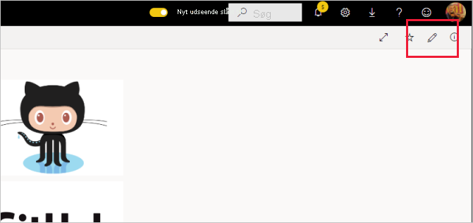

Du kan finde oplysninger om redigering af artefakter i arbejdsområdet under
* [Præsentation af rapporteditoren i Power BI](../create-reports/service-the-report-editor-take-a-tour.md)
* [Grundlæggende begreber for designere i Power BI-tjenesten](../fundamentals/service-basic-concepts.md)

Når du er færdig med at foretage ændringer af artefakterne i arbejdsområdet, er du klar til at publicere og dele appen. Se [Publicer din app](../collaborate-share/service-create-distribute-apps.md#publish-your-app) for at få mere at vide om, hvordan du gør det.

## Opdater en skabelonapp

Fra tid til anden offentliggør oprettere af skabelonapps nye forbedrede versioner af deres skabelonapps enten via AppSource, direkte links eller begge dele.

Hvis du oprindeligt har downloadet appen fra AppSource, får du besked på to måder, når en ny version af skabelonappen bliver tilgængelig:
* Der vises et opdateringsbanner i Power BI-tjenesten, der informerer dig om, at der er en ny appversion tilgængelig.
  
* Du modtager en meddelelse i meddelelsesruden i Power BI.

  

>[!NOTE]
>Hvis du oprindeligt fik appen via et direkte link og ikke via AppSource, skal du kontakte opretteren af skabelonappen for at få oplysninger om, hvornår en ny version er tilgængelig.

  Hvis du vil installere opdateringen, skal du enten klikke på **Hent den** på meddelelsesbanneret eller i meddelelsescentret eller finde appen igen i AppSource og vælge **Hent den nu**. Hvis du har fået et direkte link til opdateringen af opretteren af skabelonappen, skal du blot klikke på linket.
  
  Du bliver spurgt, om du vil overskrive den aktuelle version, eller om du vil installere den nye version i et nyt arbejdsområde. "Overskriv" er valgt som standard.

  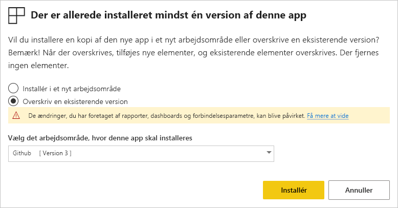

- **Overskriv en eksisterende version:** Det eksisterende arbejdsområde overskrives med den opdaterede version af skabelonappen. [Se flere oplysninger om, hvordan du overskriver](#overwrite-behavior).

- **Installér i et nyt arbejdsområde:** Installerer en ny version af arbejdsområdet og appen, som du skal omkonfigurere (dvs. oprette forbindelse til data samt definere navigation og tilladelser).

### Funktionsmåden for overskrivning

* I forbindelse med overskrivning opdateres rapporter, dashboards og datasæt i arbejdsområdet og ikke i appen. Navigation i, konfiguration af og tilladelser for appen ændres ikke i forbindelse med overskrivning.
* Når du har opdateret arbejdsområdet, skal du **opdatere appen for at anvende ændringer fra arbejdsområdet i appen**.
* Konfigurerede parametre og godkendelse bevares i forbindelse med overskrivning. Efter opdateringen startes en automatisk opdatering af datasættet. **I forbindelse med denne opdatering vises der eksempeldata i appen, rapporterne og dashboards**.

  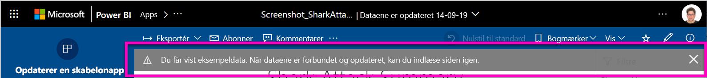

* I forbindelse med overskrivning vises eksempeldata altid, indtil opdateringen er fuldført. Hvis forfatteren af skabelonappen har foretaget ændringer af datasættet eller parametrene, kan brugerne af arbejdsområdet og appen ikke se de nye data, før opdateringen er fuldført. I stedet får de fortsat vist eksempeldata i denne periode.
* Nye rapporter eller dashboards, du har føjet til arbejdsområdet, slettes aldrig i forbindelse med overskrivning. De oprindelige rapporter og dashboards overskrives kun med ændringer fra den oprindelige forfatter.

>[!IMPORTANT]
>Husk, at [opdatere appen](#customize-and-share-the-app) efter overskrivning for at anvende ændringerne af rapporten og dashboardet for brugerne af din organisationsapp.

## Næste trin

[Opret arbejdsområder med dine kolleger i Power BI](../collaborate-share/service-create-the-new-workspaces.md)
