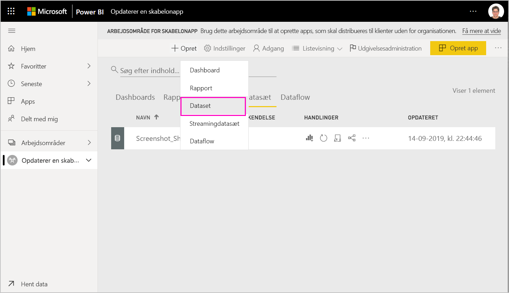
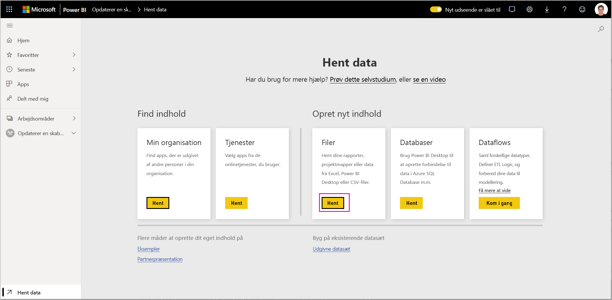
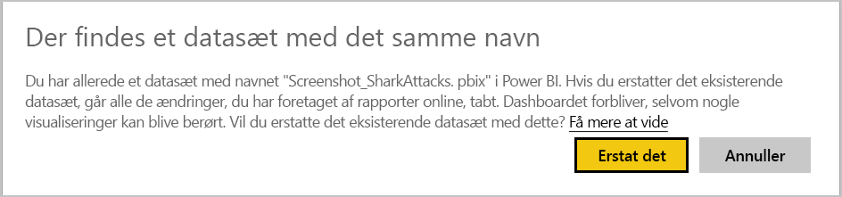

# Opdater, slet og udtræk en skabelonapp

Nu, hvor programmet er i produktion, kan du starte forfra i testfasen uden at afbryde programmet i produktion.
## Opret dit program

Hvis du har foretaget ændringer i Power BI Desktop, skal du starte med trin (1). Hvis du ikke har foretaget ændringer i Power BI Desktop, skal du starte med trin (4).

1. Upload det opdaterede datasæt, og overskriv det eksisterende datasæt. **Sørg for at bruge nøjagtigt det samme navn på datasættet**. Hvis du bruger et andet navn, oprettes det et nyt datasæt for brugere, der opdaterer appen.

1. Importér PBIX-filen fra din computer.

1. Bekræft overskrivningen.

1. I ruden **Udgivelsesadministration** skal du vælge **Opret program**.
1. Gå tilbage gennem oprettelsesprocessen for programmet.
1. Når du har angivet **Branding**, **Indhold**, **Kontrolelement** og **Adgang**, skal du vælge **Opret app** igen.
1. Vælg **Luk**, og gå tilbage til **Udgivelsesadministration**.

   Du kan nu se, at du har to versioner: Versionen i produktion samt en ny version i test.

    

1. Når du er klar til at hæve dit program til præproduktion med henblik på yderligere test uden for din lejer, skal du gå tilbage til ruden Udgivelsesadministration og vælge **Send app videre** ud for **Test**.

   Du har nu en version i produktion og en version i præproduktion.

   

   Dit link er nu live. **Bemærk, at knappen Send app videre i præproduktionsfasen er nedtonet**. Dette gøres for at forhindre, at linket til liveproduktionen overskrives ved et uheld til den aktuelle appversion, før Cloud-partnerportalen har valideret og godkendt den nye appversion.

1. Send dit link til Cloud-partnerportalen (CCP) igen ved at følge trinnene for [opdatering af tilbud på Power BI-app](https://docs.microsoft.com/azure/marketplace/cloud-partner-portal/power-bi/cpp-update-existing-offer). Du skal **publicere** dit tilbud igen i Cloud-partnerportalen og også have det valideret og godkendt igen.

   Når dit tilbud er godkendt, bliver knappen Send app videre, aktiv igen. 
1. Send din app videre til produktionsfasen.
   
### Funktionsmåde ved opdatering

1. Når du opdaterer appen, kan installationsprogrammet for skabelonappen [opdatere en skabelonapp](service-template-apps-install-distribute.md#update-a-template-app) i det allerede installerede arbejdsområde uden at miste forbindelsen til konfigurationen.
1. Se installationsprogrammets [funktionsmåde for overskrivning](service-template-apps-install-distribute.md#overwrite-behavior) for at få mere at vide om, hvordan ændringer i datasættet påvirker den installerede skabelonapp.
1. Når du opdaterer (overskriver) en skabelonapp, vender den først tilbage til eksempeldata og genopretter derefter automatisk forbindelsen til brugerens konfiguration (parametre og godkendelse). Indtil opdateringen er fuldført, vises eksemplet på databanneret i rapporterne, på dashboards og i organisationsappen.
1. Hvis du har føjet en ny forespørgselsparameter til det opdaterede datasæt, der kræver brugerinput, skal du markere afkrydsningsfeltet *påkrævet*. Så sendes der en forespørgsel til installationsprogrammet med forbindelsesstrengen, når appen er opdateret.
 

## Udtræk arbejdsområde
Det er nu lettere end nogensinde før at gå tilbage til den tidligere version af en skabelonapp med funktionen til udtrækning. I følgende trin udtrækkes en bestemt version af en app fra forskellige versionsfaser til et nyt arbejdsområde:

1. I ruden til administration af versioner skal du trykke på **(...)**  og derefter på **Udtræk**.

    
2. Angiv et navn til det udtrukne arbejdsområde i dialogboksen. der tilføjes et nyt arbejdsområde.

Den nye version af dit arbejdsområde nulstilles, og du kan fortsætte med at udvikle og distribuere skabelonappen fra det arbejdsområde, der er udtrukket for nylig.

## Slet version af skabelonapp
En skabelon for arbejdsområdet er kilden til en aktiv, distribueret skabelonapp. For at beskytte brugere af skabelonappen er det ikke muligt at slette et arbejdsområde uden først at fjerne alle oprettede versioner af appen i arbejdsområdet.
Hvis du sletter en appversion, sletter du også URL-adressen til appen, og den vil ikke længere fungere.

1. I ruden til administration af versioner skal du vælge ellipsen **(...)**  og derefter **Slet**.
 
 

>[!NOTE]
>Sørg for, at du ikke sletter den appversion, der anvendes af kunder eller **AppSource**. Hvis du gør det, virker de ikke længere.

## Næste trin

Se, hvordan dine kunder kan interagere med dit skabelonprogram under [Installér, tilpas og distribuer skabelonprogrammer i din organisation](service-template-apps-install-distribute.md).

Du kan se yderligere oplysninger om, hvordan du distribuerer dit program under [Power BI-programtilbud](https://docs.microsoft.com/azure/marketplace/cloud-partner-portal/power-bi/cpp-power-bi-offer).
