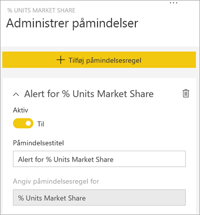

# Selvstudium: Angiv beskeder i dashboards i Power BI

[!INCLUDE[consumer-appliesto-yynn](../includes/consumer-appliesto-yynn.md)]

[!INCLUDE [power-bi-service-new-look-include](../includes/power-bi-service-new-look-include.md)]

Angiv beskeder i Power BI-tjenesten, så du får besked, når dataene i dashboards ændres ud over de grænser, du har angivet. Der kan kun angives beskeder på felter, der er fastgjort via rapportvisualiseringer, og kun på målere, KPI'er og kort. 

Beskeder kan oprettes i dashboards:
- du har oprettet og gemt i **Mit arbejdsområde**
- der er blevet delt med dig i en [Premium-kapacitet](end-user-license.md). 
- i et arbejdsområde, som du kan få adgang til, hvis du har en Power BI Pro-licens.    

Beskeder fungerer kun i forbindelse med opdaterede data. Når data opdateres, kontrolleres det via Power BI, om der er angivet en besked for disse data. Hvis dataene har nået grænsen for en besked, udløses der en besked. 

Denne funktion er stadig under udvikling, og du kan få flere oplysninger i afsnittet [Tip og fejlfinding nedenfor](#tips-and-troubleshooting).

Det er kun dig, der kan se de angivne beskeder, selvom du deler dashboardet. Databeskeder er fuldt synkroniseret på tværs af platforme. Angiv og få vist databeskeder [i Power BI-mobilapps](mobile/mobile-set-data-alerts-in-the-mobile-apps.md) og i Power BI-tjenesten. 

> [!WARNING]
> Disse beskeder indeholder oplysninger om dine data. Hvis du får vist dine data i Power BI på en mobilenhed, og enheden bliver stjålet, anbefaler vi, at du bruger Power BI-tjenesten til at slå alle beskeder fra.
> 

Denne artikel omhandler følgende:
> [!div class="checklist"]
> * Hvem kan indstille beskeder
> * Hvilke visuals understøtter beskeder
> * Hvem kan indstille beskeder
> * Virker beskeder i Power BI Desktop og Mobil
> * Sådan opretter du en besked
> * Hvor modtager jeg mine beskeder

## Forudsætninger

Hvis du ikke er tilmeldt Power BI, kan du [tilmelde dig en gratis prøveversion](https://app.powerbi.com/signupredirect?pbi_source=web), før du begynder.

1. I dette eksempel bruges et dashboardkort fra Eksempel på salg og marketing. Åbn Power BI-tjenesten (app.powerbi.com), log på, og åbn **Mit arbejdsområde**.    
    

2. Vælg **Hent data** i nederste venstre hjørne.

    

3. Vælg **Eksempler** på siden Hent data, der vises.

4. Vælg Eksempel på salg og marketing, og vælg derefter **Opret forbindelse**.

    

5. Når Power BI har oprettet forbindelse til eksemplet, skal du vælge **Gå til dashboard** fra den dialogboks, der vises.     
    

## Føj en besked til et dashboardfelt

1. Vælg ellipsen i en dashboardmåler, et KPI eller et kortfelt.
   
   

2. Vælg ikonet Vigtig besked  eller **Administrer beskeder** for at tilføje en eller flere beskeder for kortet **Markedsandel**.

   

   
1. I ruden **Administrer beskeder** skal du vælge **+ Tilføj påmindelsesregel**.  Kontrollér, at skyderen er angivet til **Til**, og giv beskeden en titel. Titler hjælper dig med let at genkende dine beskeder.
   
   
4. Rul ned, og angiv oplysninger om beskederne.  I dette eksempel opretter vi en besked, som skal sendes til os én gang om dagen, hvis markedsandelen når over 40. Beskederne vises i [Meddelelsescenter](end-user-notification-center.md). Vi får også Power BI til at sende os en mail.
   
   

5. Vælg **Gem og luk**.
 

   > 

## Modtag beskeder
Når de sporede data når en af de angivne tærskelværdier, sker der flere ting. Først tjekker Power BI, om der er gået mere end én time eller mere end et døgn (afhænger af den valgte indstilling), siden den seneste besked blev sendt. Du får en besked, så længe dataene har overskredet grænsen.

Derefter sendes en besked til meddelelsescenteret og evt. en mail via Power BI. Hver enkelt besked indeholder et direkte link til dine data. Vælg linket for at se det relevante felt.  

1. Hvis du har indstillet beskeden til at sende en mail til dig, modtager du mail i din indbakke. Dette er en vigtig besked, vi angiver for kortet **Synspunkt**.
   
   
2. Power BI føjer også en meddelelse til **Meddelelsescenter**.
   
   
3. Åbn dit meddelelsescenter for at få vist oplysningerne for beskeder.
   
    
   
  

## Administration af beskeder

Der er mange måder, du kan administrere dine beskeder på: fra selve dashboardfeltet, fra menuen Indstillinger for Power BI og på et individuelt felt i [Power BI-mobilappen på iPhone](mobile/mobile-set-data-alerts-in-the-mobile-apps.md) eller i [Power BI-mobilappen til Windows 10](mobile/mobile-set-data-alerts-in-the-mobile-apps.md).

### Fra selve feltet

1. Hvis du vil ændre eller fjerne en besked fra et felt, skal du genåbne vinduet **Administrer beskeder** ved at vælge ikonet Vigtig besked . Alle de beskeder, du har angivet for dette felt, vises.
   
    .
2. Hvis du vil redigere en besked, skal du vælge pilen til venstre for beskednavnet.
   
    .
3. Hvis du vil slette en besked, skal du vælge skraldespanden til højre for beskednavnet.
   
      

### I menuen Indstillinger for Power BI

1. Vælg tandhjulsikonet på menulinjen i Power BI.
   
    .
2. Under **Indstillinger** skal du vælge **Beskeder**.
   
    
3. Her kan du slå beskeder til og fra, åbne vinduet **Administrer beskeder** for at ændre eller slette beskeden.

## Tip og fejlfinding 

* Hvis du ikke kan angive en besked for en måler, en KPI eller et kort, skal du kontakte din lejeradministrator eller it-helpdesk for at få hjælp. Nogle gange er beskeder slået fra eller utilgængelige for dit dashboard eller for bestemte typer dashboardfelter.
* Beskeder fungerer kun i forbindelse med opdaterede data. De fungerer ikke med statistiske data. De fleste af de eksempler, der leveres af Microsoft, er statiske. 
* Muligheden for at modtage og få vist delt indhold kræver en Power BI Pro- eller Premium-licens. Du kan få flere oplysninger ved at læse [Hvilken licens har jeg?](end-user-license.md)
* Beskeder kan angives på visuelle elementer, der er oprettet ud fra streamingdatasæt, som er fastgjort fra en rapport til et dashboard. Der kan ikke angives beskeder for streamingfelter, der er oprettet direkte på dashboardet ved hjælp af **Tilføj felt** > **Brugerdefinerede streamingdata**.

## Fjern ressourcer
Fremgangsmåden til sletning af beskeder er beskrevet ovenfor. Vælg tandhjulsikonet på menulinjen i Power BI. Vælg **Beskeder** under **Indstillinger**, og slet beskeden.

> [!div class="nextstepaction"]
> [Angiv databeskeder på din mobilenhed](mobile/mobile-set-data-alerts-in-the-mobile-apps.md)

