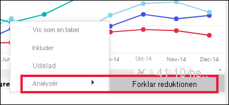
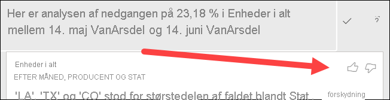
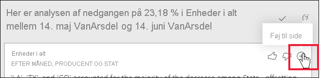

# Brug funktionen Analysér til at forklare udsving i rapportvisuals

[!INCLUDE[consumer-appliesto-yynn](../includes/consumer-appliesto-yynn.md)]

Ofte ser du i rapportvisuals en stor stigning og derefter et kraftigt fald i værdier og undrer dig over, hvad årsagen til sådanne udsving er. Med **Analysér** i **Power BI-tjenesten** kan du se mere om årsagen med blot nogle få klik.

Du kan f. eks. overveje følgende visual, der viser *Enheder i alt* efter *Måned* og *Producent*. VanArsdel klarer sig bedre end konkurrenterne, men oplever et stort dyk i juni 2014. I sådanne tilfælde kan du udforske dataene for at finde en forklaring på ændringen. 

Du kan bede Power BI-tjenesten om at forklare stigninger, fald eller en usædvanlig fordeling i visuals og få hurtige og automatiske indsigtsanalyser om dine data. Højreklik på et datapunkt, og vælg **Analysér > Forklar reduktionen** (eller forøgelsen, hvis den tidligere linje var lavere) eller **Analysér > Find de steder, hvor distributionen skiller sig ud**, hvorefter indsigten vises i et brugervenligt vindue.

Funktionen Analysér er kontekstafhængig og er baseret på det nærmeste forrige datapunkt – f.eks. den forrige søjle eller kolonne.

> [!NOTE]
> Denne funktion leveres som prøveversion og ændres måske. Indsigtsfunktionen er aktiveret og slået til som standard (du behøver ikke at markere et afkrydsningsfelt for eksempelvisning for at aktivere den).

### Valgte faktorer og kategorier

Efter at have undersøgt forskellige kolonner vælger og viser Power BI de faktorer, der har den største ændring i forhold til deres bidrag. De værdier, som havde den væsentligste ændring i bidraget, fremhæves i beskrivelsen. De værdier, der havde de største faktiske stigninger og fald, fremhæves også.

Hvis du vil se alle de indsigter, der genereres af Power BI, skal du bruge rullepanelet. Rækkefølgen er rangordnet, så den største bidragyder vises først. 

## Brug af indsigt
Hvis du vil bruge indsigt til at forklare tendenser, der ses i visuals, skal du højreklikke på et datapunkt i et søjle- eller kurvediagram og vælge **Analysér**. Vælg derefter den indstilling, der vises: **Forklar forøgelsenr**, **Forklar reduktionen** eller **Forklar forskellen**.

Power BI Desktop kører derefter algoritmerne for maskinlæring via dataene, og derefter udfyldes et vindue med et visuelt element og en beskrivelse af, hvilke kategorier der er mest påvirket af forøgelsen, reduktionen eller forskellen.  I dette eksempel er den første indsigt f.eks. et vandfaldsdiagram.

Ved at vælge små ikoner nederst i vandfaldet kan du vælge at få indsigt til at vise et punktdiagram, et stablet søjlediagram eller et bånddiagram.

Du kan bruge ikonerne med *tommel op* og *tommel ned* øverst på siden til at give feedback på visual'et og funktionen.  

Du kan bruge indsigt, når rapporten er i Læse- eller Redigeringsvisning, hvilket betyder, at du både kan analysere data og oprette visuals, som du nemt kan føje til dine rapporter. Hvis du har en rapport åben i Redigeringsvisning, får du vist et plusikon ud for tommelikonerne. Vælg plusikonet for at føje indsigt til din rapport som et nyt visual. 

## Oplysninger om de returnerede resultater

De oplysninger, der returneres fra indsigter, skal fremhæve forskellene mellem de to tidsperioder, så du bedre kan forstå ændringerne mellem dem.  

Algoritmen kan betragtes, som om den tager alle andre kolonner i modellen og beregne opdelingen efter den kolonne for tidsperioderne *før* og *efter* for at fastslå, hvor stor en ændring der var i den opdeling, hvorefter der returneres de kolonner, hvor der er den største ændring. *State* blev f.eks. valgt i vandfaldsindsigten ovenfor, da bidraget fra Louisiana, Texas og Colorado, faldt 13 % til 19 % fra juni til juli og bidrog mest til at reducere *Enheder i alt*.  

For hver kolonne, der returneres, kan der vises fire visuals. Tre af disse visualiseringer er beregnet til at fremhæve ændringer af bidraget mellem de to perioder. Det kan f.eks. være en forklaring af stigningen fra *Qtr 2* til *Qtr 3*. På bånddiagrammet vises ændringerne både før og efter det valgte datapunkt.

### Punktdiagrammet

Punktdiagrammet viser værdien af målingen i den første periode (på x-aksen) i forhold til værdien af målingen i den anden periode (på y-aksen) for hver værdi i kolonnen (i dette tilfælde *State*). Datapunkter er i det grønne område, hvis de er steget, og i det røde område, hvis de er faldet. 

Den stiplede linje viser dem, der passer bedst, og de datapunkter, som er placeret over denne linje, steg mere end den overordnede tendens, mens dem under linjen steg mindre.  

Datapunkter, som var tomme i en af perioderne, vises ikke i punktdiagrammet.

### 100 % stablet søjlediagram

I visualet, der består af et 100 % stablet søjlediagram, viser bidragets værdi i totalen (100%) for det valgte datapunkt og det forrige. Det gør det nemt at sammenligne bidraget for de enkelte datapunkter. I dette eksempel viser værktøjstippene viser det faktiske bidrag for den valgte værdi for Texas. Da listen over stater er lang, kan du bruge værktøjstip til at få vist detaljerne. Når du bruger værktøjstippene, kan du se, at Texas bidrog med ca. den samme procent i forhold til det samlede antal enheder (31 % og 32 %), men det faktiske antal samlede enheder er faldet fra 89 til 71. Husk, at Y-aksen er en procentdel, ikke en total, og at hvert enkelt kolonnefelt er en procentdel, ikke en værdi. 

### Bånddiagrammet

I det visual, der består af et bånddiagrammet kan du se værdien af målingen før og efter. Det er især praktisk til at vise ændringer i bidragene, når *rækkefølgen* af bidragyderne er blevet ændret (f.eks. hvis *LA* er faldet fra den næststørste bidragyder til nummer elleve).  Selvom *TX* repræsenteres af et bredt bånd øverst, hvilket betyder, at det er den største bidragyder før og efter, viser faldet, at værdien af bidraget faldt både i den valgte periode og efter.

### Vandfaldsdiagram

Det fjerde visual er et vandfaldsdiagram, som viser de faktiske stigninger eller fald mellem perioderne. I visual'et vises én stor bidragyder til faldet i juni 2014 – i dette tilfælde **State**. Og detaljerne om **State**s indflydelse på det samlede antal enheder viser, at fald i Louisiana, Texas og Colorado spiller den største rolle.      

 

## Overvejelser og begrænsninger
Da disse indsigter er baseret på ændringen fra det tidligere datapunkt, er de ikke tilgængelige, når du vælger det første datapunkt i en visualisering. 

**Analysér** er ikke tilgængelig for alle visualtyper. 

Følgende liste er en samling af de scenarier, der ikke understøttes i øjeblikket for **Analysér – forklaring af stigning/fald**:

* TopN-filtre
* Medtag/udelad filtre
* Målingsfiltre
* Ikke-numeriske målinger
* Brug af "Vis værdi som"
* Filtrerede målinger – Filtrerede målinger er beregninger på visuelt niveau med et bestemt filter anvendt, f.eks. *Samlet salg i Frankrig*, og de bruges på nogle af de visualiseringer, som blev oprettet af indsigtsfunktionen
* Kategoriske kolonner på x-aksen, medmindre det definerer en sortering efter kolonne, der kan skaleres. Hvis du bruger et hierarki, skal alle kolonner i det aktive hierarki opfylde denne betingelse

## Næste trin
[Vandfaldsdiagrammer](../visuals/power-bi-visualization-waterfall-charts.md)    
[Punktdiagrammer](../visuals/power-bi-visualization-scatter.md)    
[Søjlediagrammer](../visuals/power-bi-report-visualizations.md)    
[Bånddiagrammer](../visuals/desktop-ribbon-charts.md)
