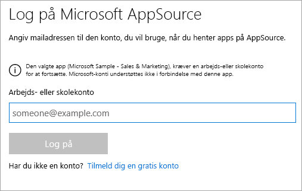
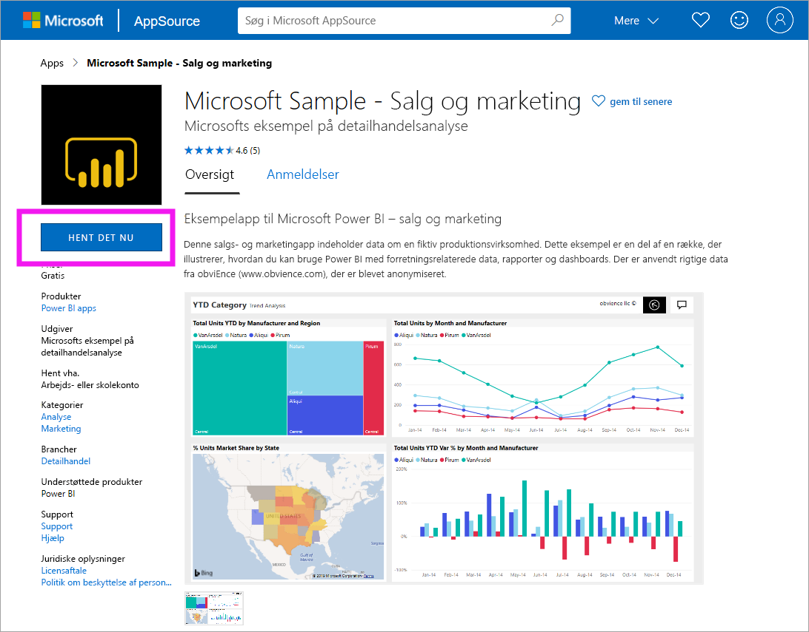
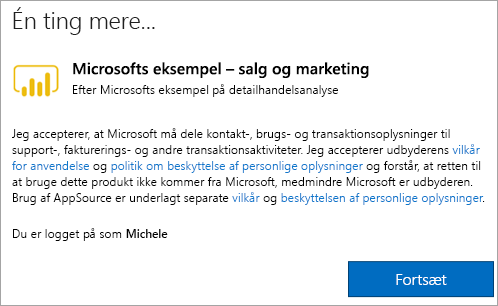

# Installér og brug appeksemplet Sales & Marketing i Power BI-tjenesten
Nu, hvor du har en [grundlæggende forståelse af, hvordan du får Power BI-indhold](end-user-app-view.md), skal vi hente appen Sales & Marketing fra Microsoft AppSource (appsource.com). 

## Microsoft AppSource (appsource.com)
Her er linket til appen: [Appen Sales & Marketing](https://appsource.microsoft.com/product/power-bi/microsoft-retail-analysis-sample.salesandmarketingsample?tab=Overview). Hvis du vælger dette link, åbnes downloadsiden for denne app på Microsoft AppSource. 

1. Du bliver muligvis bedt om at logge på, før du kan hente appen. Log på med den samme mailadresse, som den du bruger til Power BI. 

    

2. Vælg **Hent det nu**. 

    

3. Hvis det er første gang, du logger på AppSource, skal du acceptere vilkårene for anvendelse. 

    

4. Power BI-tjenesten åbnes. Bekræft, at du vil installere denne app.

    

5. I Power BI-tjenesten vises en meddelelse, når appen er blevet installeret. Vælg **Gå til app** for at åbne appen. Afhængigt af hvordan designeren oprettede appen, vises enten appdashboardet eller apprapporten.

    

    Du kan også åbne appen direkte fra din appindholdsliste ved at vælge **Apps** og **Sales & Marketing**.

    

6. Vælg, om du vil udforske eller tilpasse og dele din nye app. Da vi har valgt en Microsoft-eksempelapp, kan vi begynde med at udforske den. 

    

7.  Din nye app åbnes med et dashboard. *Appdesigneren* kunne have konfigureret, at appen skulle åbne i en rapport i stedet for.  

    

## Interager med dashboards og rapporter i appen
Brug lidt tid på at udforske dataene i de dashboards og rapporter, der udgør appen. Du har adgang til alle almindelige Power BI-interaktioner som filtrering, fremhævning, sortering og analyse.  Er du stadig lidt forvirret over forskellen mellem dashboards og rapporter?  Læs [artiklen om dashboards](end-user-dashboards.md) og [artiklen om rapporter](end-user-reports.md).  

## Næste trin
* [Tilbage til oversigten over apps](end-user-apps.md)
* [Få vist en Power BI-rapport](end-user-report-open.md)
* [Andre måder, indhold deles med dig på](end-user-shared-with-me.md)
