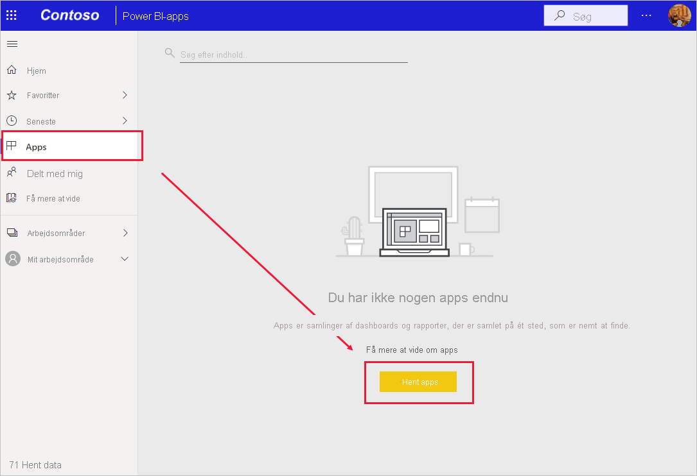
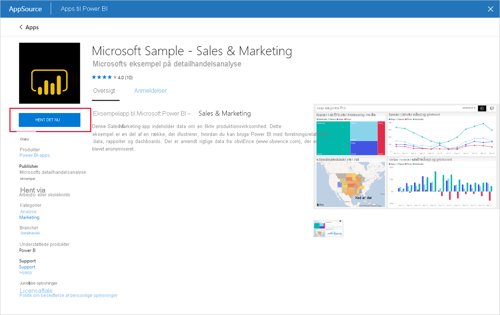
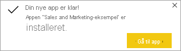
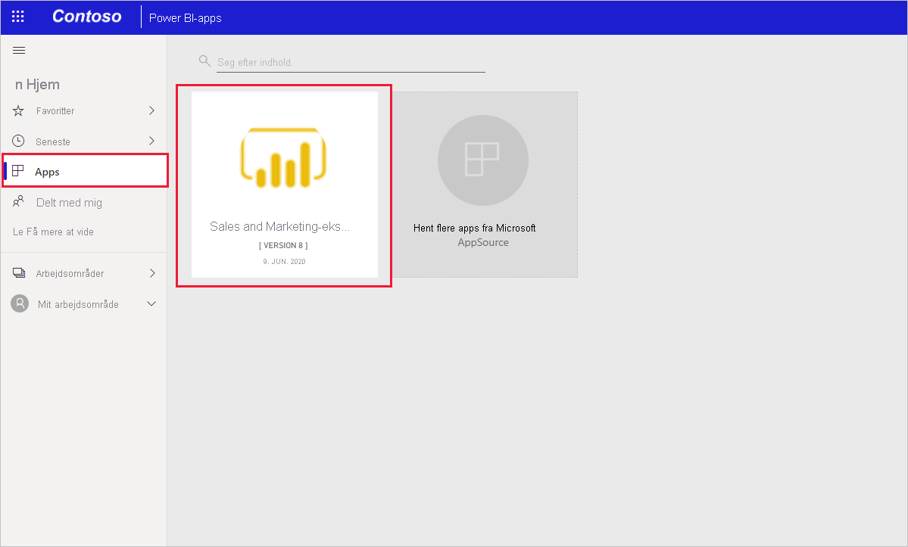
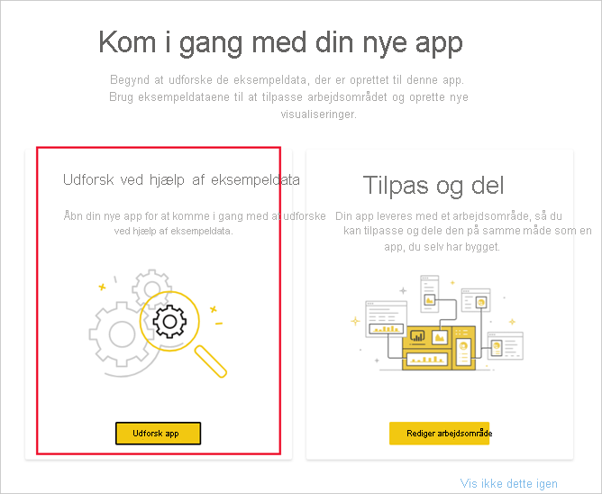

# Installér og brug appeksemplet Sales & Marketing i Power BI-tjenesten

[!INCLUDE[consumer-appliesto-yyny](../includes/consumer-appliesto-yyny.md)]

Nu, hvor du har en [grundlæggende forståelse af, hvordan du får Power BI-indhold](end-user-app-view.md), skal vi hente appen Sales & Marketing fra Microsoft AppSource (appsource.com). 

## Hent appen på markedspladsen for Power BI-apps

1. [Log på Power BI-tjenesten](./end-user-sign-in.md), hvis du ikke allerede er logget på. 

1. Vælg **Apps > Hent apps**, når du er i Power BI. 

    

1. Markedspladsen for Power BI-apps åbnes. Find appen til salg og marketing. Hvis du ikke kan se den, kan du prøve at skrive "Salg" i søgefeltet.

    

1. Klik på app-delen. App-tilbuddet på AppSource åbnes. Klik på **HENT DEN NU**.

   

1. Bekræft, at du vil installere denne app.

   

5. Der vises en meddelelse i Power BI-tjenesten, når appen er blevet installeret. Vælg **Gå til app** for at åbne appen. Afhængigt af hvordan designeren oprettede appen, vises enten appdashboardet eller apprapporten.

    

    Du kan også åbne appen direkte fra din appindholdsliste ved at vælge **Apps** og **Sales & Marketing**.

    

6. Vælg, om du vil udforske eller tilpasse og dele din nye app. Da vi har valgt en Microsoft-eksempelapp, kan vi begynde med at udforske den. 

    

7.  Din nye app åbnes med et dashboard. *Appdesigneren* kunne have konfigureret, at appen skulle åbne i en rapport i stedet for.  

    

## Interager med dashboards og rapporter i appen
Brug lidt tid på at udforske dataene i de dashboards og rapporter, der udgør appen. Du har adgang til alle almindelige Power BI-interaktioner som filtrering, fremhævning, sortering og analyse.  Er du stadig lidt forvirret over forskellen mellem dashboards og rapporter?  Læs [artiklen om dashboards](end-user-dashboards.md) og [artiklen om rapporter](end-user-reports.md).  

## Næste trin
* [Tilbage til oversigten over apps](end-user-apps.md)
* [Få vist en Power BI-rapport](end-user-report-open.md)
* [Andre måder, indhold deles med dig på](end-user-shared-with-me.md)
