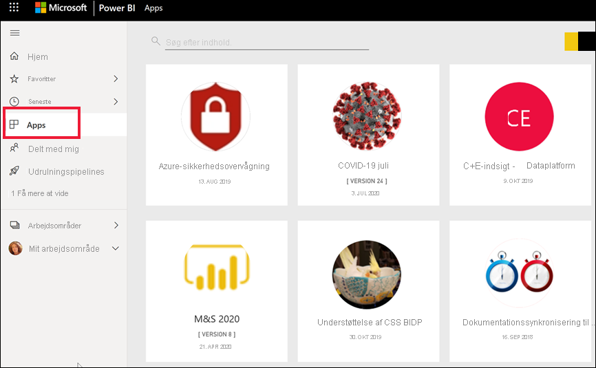
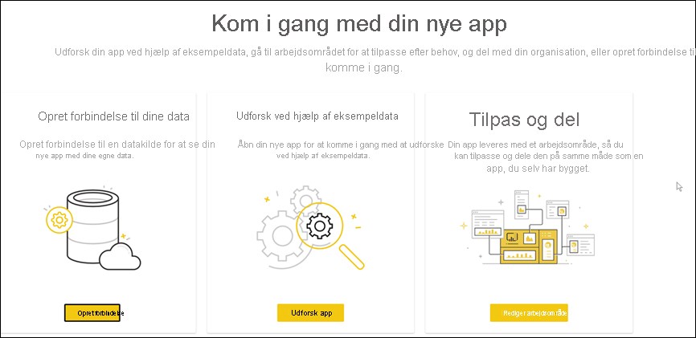
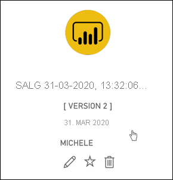

# Installér og brug apps med dashboards og rapporter i Power BI

[!INCLUDE[consumer-appliesto-ynny](../includes/consumer-appliesto-ynny.md)]

[!INCLUDE [power-bi-service-new-look-include](../includes/power-bi-service-new-look-include.md)]

Nu hvor du har en [grundlæggende forståelse af apps](end-user-apps.md), skal vi se på, hvordan du kan åbne og interagere med apps. 

## Måder at få en ny app på
Der er flere måder at få en ny app på:
* Du kan hente den på markedspladsen til Power BI-apps i Power BI.
* Du kan bruge et direkte link til en app, som du har modtaget fra appdesigneren. 
* En appdesigner i organisationen kan installere appen automatisk på din Power BI-konto.

I Power BI-mobil kan du kun installere en app fra et direkte link. Hvis appdesigneren installerer appen automatisk, kan du se den på din liste over apps.

## Apps og licenser
Det er ikke alle Power BI-brugere, der kan få vist og interagere med apps. 
- Hvis du har en gratis licens, kan du åbne apps, der er gemt i en Premium-kapacitet, og som er delt med dig.  
- Hvis du har en Pro-licens, kan du åbne apps, der er blevet delt med dig.

## Hent appen på markedspladsen til Power BI-apps

Du kan finde og installere apps på markedspladsen til Power BI-apps. På markedspladsen til apps kan du få både organisationsapps og skabelonapps.

- En *organisationsapp* er tilgængelig til Power BI-brugere i din organisation. Disse apps omfatter også færdigbyggede dashboards og rapporter, som du kan bruge, som de er, eller som du kan tilpasse og dele. Din organisation kan have apps til sporing af salg, måling af præstation eller analyse af vellykkede ansættelser.
- Der medfølger færdigbyggede dashboards og rapporter til en *skabelonapp*, som du kan bruge til at oprette forbindelse til mange af de tjenester, du bruger til at drive din forretning, f.eks. SalesForce, Microsoft Dynamics og Google Analytics.

1. [Log på Power BI-tjenesten](./end-user-sign-in.md), hvis du ikke allerede er logget på. 

1. Når Power BI-tjenesten er åben, skal du vælge **Apps > Hent apps**. 

    

1. Markedspladsen til Power BI-apps åbnes.

   

   Der er tre tilgængelige faner:
   * **Alle apps** – gennemse både skabelonapps og alle de organisationsapps, der er tilgængelige for dig. Skabelonapps er markeret med et indkøbsposeikon i øverste højre hjørne.
   * **Organisationsapps** – gennemse organisationsapps, der er blevet delt med dig. 
   * **Skabelonapps** – gennemse skabelonapps, der hostes på AppSource.

   Du kan også bruge søgefeltet til at få vist et filtreret udvalg af apps. Hvis du skriver en del af navnet på en app eller en kategori, f. eks. økonomi, analyse, marketing osv., bliver det nemmere at finde det element, du leder efter. 

   Søgefeltet er følsomt over for den fane, du har åbnet – der returneres kun apps af den valgte type. Hvis fanen **Alle apps** er åben, returneres både organisations- og skabelonapps. Det kan være forvirrende, når en organisationsapp og en skabelonapp har samme navn. Husk blot, at skabelonappfelterne har et indkøbsposeikon i øverste højre hjørne.

Når du finder den ønskede app, skal du vælge **Hent nu** for at installere den.

   

* Hvis du installerer en organisationsapp, føjes den straks til din liste over apps.
* Hvis du installerer en skabelonapp, får du vist skabelonapptilbuddet i AppSource. Se [et eksempel](end-user-app-marketing.md) på, hvordan du henter og installerer en eksempelskabelonapp fra markedspladsen til Power BI-apps. Appen installeres sammen med et arbejdsområde med samme navn.

   > [!NOTE]
   > Hvis du bruger en gratis brugerlicens, kan du downloade apps, men du kan ikke få dem vist, medmindre du opgraderer til en Power BI Pro-konto, eller appen gemmes i en delt Premium-kapacitet. Du kan finde flere oplysninger under [Licenser til virksomhedsbrugere](end-user-license.md).

## Installér en app fra et direkte link
Du kan også installere en organisationsapp fra et direkte link i en mail fra appdesigneren.  

**På computeren** 

Når du vælger linket i mailen, åbner Power BI-tjenesten ([https://app.powerbi.com](https://app.powerbi.com)) appen i din browser. 

**På iOS- eller Android-mobilenhed** 

Når du vælger linket i mailen på din mobilenhed, installeres appen automatisk og åbnes i mobilappen. Du skal muligvis logge på først. 

## Interager med dashboards og rapporter i appen
Brug lidt tid på at udforske dataene i de dashboards og rapporter, der udgør appen. Du har adgang til alle almindelige Power BI-interaktioner som filtrering, fremhævning, sortering og analyse.  Er du stadig lidt forvirret over forskellen mellem dashboards og rapporter?  Læs [artiklen om dashboards](end-user-dashboards.md) og [artiklen om rapporter](end-user-reports.md).  

### Åbn en app

Du har installeret en app eller modtaget en app fra en kollega. Hvis du vil have vist denne app, skal du åbne indholdslisten over apps ved at vælge **Apps** i navigationsruden.

Hold over appen, og vælg den for at åbne den. Afhængigt af appen kan du få vist en meddelelse, der ligner denne:

Du kan finde en vejledning i, hvilken indstilling du skal vælge, under [Installér skabelonapps](../connect-data/service-template-apps-install-distribute.md).

Hold over appen for at få vist detaljer, og vælg appkortet for at åbne appen.

Appen åbnes. Alle apps ser forskellige ud – forskelligt layout og forskellige visualiseringer, farver og indstillinger. Men alle apps har nogle fælles funktioner.

1. Navn på appen og seneste opdateringstidspunkt. Vælg rullepilen for at finde ejeren og kontakten i forbindelse med hjælp.
1. Vælg **Power BI** for at vende tilbage til [Hjem](end-user-home.md).
1. Din handlingslinje. 
1. Lærredet på rapportsiden.
1. Navigationsruden i appen.  Under navnet på appen er der en liste over rapportsider. Vælg et navn på rapportsiden for at åbne den. I øjeblikket er siden *Rentesats* åben. 
1. Vælg pilen for at udvide ruden **Filtre**.

Du kan også udforske det tilknyttede arbejdsområde. [Få mere at vide om arbejdsområder](end-user-workspaces.md) Vælg **Power BI** (nummer 2) for at vende tilbage til **startsiden**, og vælg **Arbejdsområder**. 

## Opdater en app 

Af og til udgiver appdesignere nye versioner af deres apps. Hvordan du får den nye version, afhænger af, hvordan du har modtaget originalen. 

* Hvis du har fået appen fra din organisation, er opdateringen til den nye version helt gennemsigtig – du behøver ikke at foretage dig noget. 

* Hvis du fik appen fra AppSource, vises der et meddelelsesbanner, næste gang du åbner appen. Under meddelelsen kan du se, at der er en ny version tilgængelig. 

    1. Vælg **Hent** for at opdatere.  

        <!-- -->

    2. Når du bliver bedt om at installere den opdaterede app, skal du vælge **Installér**. 

         

    3. Da du allerede har en version af denne app, skal du beslutte, om du vil erstatte den eksisterende version, eller om du vil installere den opdaterede app i et nyt arbejdsområde.   

         

     > [!NOTE] 
     > Hvis du installerer en ny version, overskrives alle de ændringer, du har foretaget af rapporter og dashboards. Hvis du vil beholde dine opdaterede rapporter og dashboards, kan du gemme dem med et andet navn eller på en anden placering, før du installerer dem. 

    4. Når du har installeret den opdaterede version, skal du vælge **Opdater app** for at fuldføre opdateringsprocessen. 

## Overvejelser og fejlfinding

- Muligheden for at installere apps kan slås til og fra af din Power BI-administrator. Kontakt it-afdelingen eller helpdesk, hvis du har brug for at få denne funktion aktiveret.    
- Brugen af apps kræver enten en Pro-licens, eller at appen er gemt i en delt Premium-kapacitet. [Få mere at vide om licenser](end-user-license.md).

## Næste trin
* [Tilbage til oversigten over apps](end-user-apps.md)
* [Få vist en Power BI-rapport](end-user-report-open.md)
* [Andre måder, indhold deles med dig på](end-user-shared-with-me.md)

