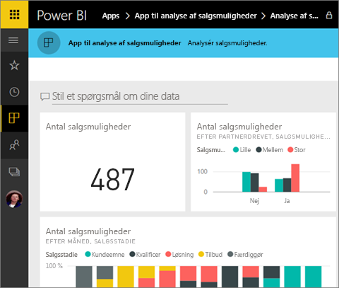
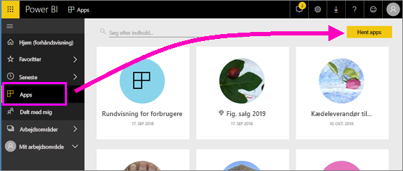
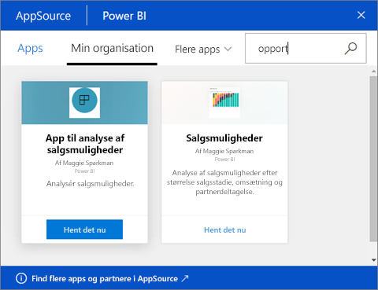

# Installér og brug apps med dashboards og rapporter i Power BI
Nu hvor du har en [grundlæggende forståelse af apps](end-user-apps.md), skal vi se på, hvordan du kan åbne og interagere med apps. 

## Måder at få en ny app på
Husk, at der er flere måder at få en ny app på. En kollega, der designer en rapport, kan installere appen automatisk på din Power BI-konto eller sende dig et direkte link til en app. Og du kan gå til AppSource og søge efter apps, der er tilgængelige for dig fra både i og uden for din virksomhed. 

I Power BI på din mobilenhed kan du kun installere en app fra et direkte link og ikke fra AppSource. Hvis appens forfatter installerer appen automatisk, kan du se den på listen over apps.

## Installér en app fra et direkte link
Den nemmeste måde selv at installere en ny app på er ved at få et direkte link fra appens forfatter.  

**På computeren** 

Når du vælger linket i mailen, åbnes Power BI-tjenesten ([https://powerbi.com](https://powerbi.com)) i en browser. Bekræft, at du vil installere applikationen, hvorefter Power BI åbnes på programmets landingsside.

**På iOS- eller Android-mobilenhed** 

Når du vælger linket i mailen på din mobilenhed, installeres appen automatisk og åbner appens indholdsliste i mobilappen. 

## Hent appen fra Microsoft AppSource
Du kan også finde og installere apps fra Microsoft AppSource. Der vises kun programmer, du har adgang til, dvs. programudvikleren har givet dig eller alle tilladelse.

1. Vælg **Apps**  > **Hent apps**. 
   
     
2. I AppSource under **Min organisation** kan du søge for at begrænse resultatet og finde den app, du leder efter.
   
     
3. Vælg **Hent den nu** for at føje den til din appindholdsliste. 

## Interager med dashboards og rapporter i appen
Nu kan du udforske dataene i dashboardene og rapporterne i appen. Du har adgang til alle almindelige Power BI-interaktioner som filtrering, fremhævning, sortering og analyse. Du kan også [eksportere dataene til Excel ](end-user-export-data.md) fra en tabel eller en anden visualisering i en rapport. Læs om at [interagere med rapporter i Power BI](end-user-reading-view.md). 

## Næste trin
* [Power BI-apps til eksterne tjenester](end-user-connect-to-services.md)
* Har du spørgsmål? [Prøv at spørge Power BI-community'et](http://community.powerbi.com/)

