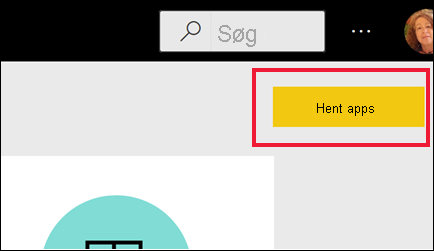
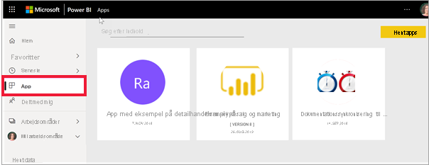

# Apps i Power BI

[!INCLUDE[consumer-appliesto-ynny](../includes/consumer-appliesto-ynny.md)]

[!INCLUDE [power-bi-service-new-look-include](../includes/power-bi-service-new-look-include.md)]

## Hvad er en Power BI-app?
En *app* er en Power BI-indholdstype, der kombinerer relaterede dashboards og rapporter på ét sted. En app kan have et eller flere dashboards og en eller flere rapporter, der alle er samlet. Apps oprettes af Power BI-*designere*, der distribuerer og deler apps med deres kolleger. Der er mange forskellige måder, en *designer* kan dele indhold på. Du kan få mere at vide i afsnittet **Hent en ny app** nedenfor. 

## App*designere* og app*brugere*
Afhængigt af din rolle kan du være en person, der opretter apps (*designer*) til eget brug eller til at dele med kolleger. Eller du kan være en person, der modtager og downloader apps (*virksomhedsbruger*), der er oprettet af andre. Denne artikel er målrettet *virksomhedsbrugere*.

Hvis du vil se og åbne en app, er det nødvendigt med visse tilladelser. Modtageren skal enten have en Power BI Pro-licens, eller appen skal deles med modtageren i en bestemt type cloudlager, der kaldes **Premium-kapacitet**. Du kan få mere at vide om licenser og Premium-kapacitet i [Licenser til Power BI-tjenesten](end-user-license.md).

## Fordele ved apps
Apps er en nem måde for *designere* at dele forskellige typer indhold på samtidig. *Appdesignere* kan oprette dashboards og rapporter og samle dem i en app. *Designerne* deler eller publicerer derefter appen på en placering, hvor du, *virksomhedsbrugeren*, kan få adgang til den. Eftersom relaterede dashboards og rapporter er samlet, er det nemmere for dig at finde og installere den i Power BI-tjenesten ([https://powerbi.com](https://powerbi.com)) og på din mobilenhed. Når du har installeret en app, behøver du ikke huske navnene på mange forskellige dashboards eller rapporter, fordi de alle er samlet i én app, i webbrowseren eller på din mobilenhed.

Med apps ser du automatisk ændringerne, hver gang appens forfatteren udgiver opdateringer. Forfatteren styrer også, hvor ofte dataene er planlagt til opdatering, så du ikke skal bekymre dig om at holde dem opdateret. 

<!-- add conceptual art -->
## Hent en ny app
Der er flere forskellige måder at få en ny app på. Du kan søge efter, finde og installere apps, og appdesignere kan dele apps med dig. 

### Find og installer apps på markedspladsen for Power BI-apps
Én måde at finde apps på er at vælge **Hent app** på skærmen **Apps** i Power BI. 

Gennemse listen over apps på markedspladsen for Power BI-apps, indtil du finder en, du vil installere. Vælg mellem **organisationsapps**, som kun er tilgængelige for medarbejdere i din virksomhed, eller **skabelonapps**, der udgives af Microsoft og community'et, så de kan installeres af alle Power BI-brugere. 

Der er andre måder at hente apps på. Nogle af disse måder er angivet nedenfor. Du kan dog finde detaljerede trinvise instruktioner til, hvordan du henter og udforsker en app i [Åbn og interager med en app](end-user-app-view.md).

* Appdesigneren kan installere appen automatisk på din Power BI-konto, og næste gang du åbner Power BI-tjenesten, får du vist den nye app på **appindholdslisten**. 
* Appdesigneren kan sende dig et direkte link til en app via mail. Hvis du vælger linket, åbner appen i Power BI-tjenesten.
* Du kan kun installere en app fra et direkte link i Power BI på din mobilenhed og ikke fra markedspladsen for apps. Hvis appens forfatter installerer appen automatisk, kan du se den på listen over apps. 

Dine apps er organiseret på **appindholdslisten**. Du skal blot vælge **Apps** for at få vist dine apps. Peg på en app for at få vist datoen for den seneste opdatering og ejeren. 

## Næste trin
* [Åbn og interager med en app](end-user-app-view.md)
* [Andre måder at dele indhold på](end-user-shared-with-me.md)

