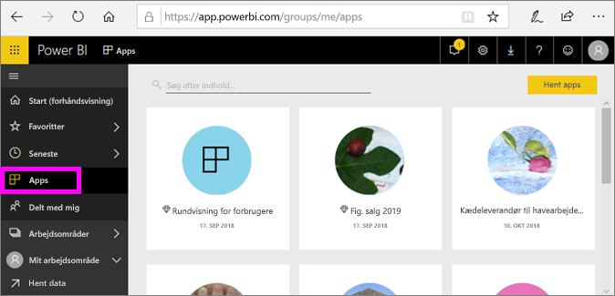
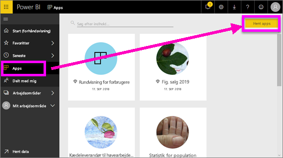
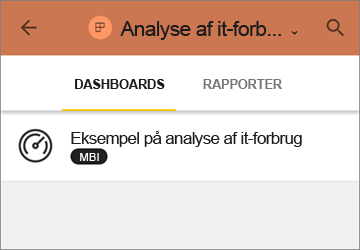
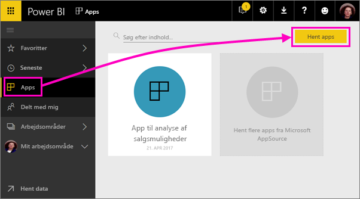
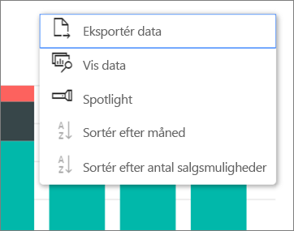

# Installer og brug apps med dashboards og rapporter i Power BI
I Power BI samler *apps* relaterede dashboards og rapporter på ét sted. Personer i din organisation oprette og distribuere apps med vigtige forretningsoplysninger. [Eksterne tjenester](../service-connect-to-services.md), du muligvis allerede bruger, f.eks. Google Analytics og Microsoft Dynamics CRM, tilbyder også Power BI-apps. 

Det er nemt at finde og installere apps i Power BI-tjenesten og på din mobilenhed. Når du har installeret en app, behøver du ikke huske navnene på mange forskellige dashboards, fordi de alle er samlet i én app, i webbrowseren eller på din mobilenhed.

Med apps ser du automatisk ændringerne, hver gang appens forfatteren udgiver opdateringer. Forfatteren styrer også, hvor ofte dataene er planlagt til opdatering, så du ikke skal bekymre dig om at holde dem opdateret. 

## Hent en ny app
Du kan hente apps på nogle forskellige måder. Appforfatteren kan installere appen automatisk i din Power BI-konto eller sende dig et direkte link til en app, eller du kan søge efter den i AppSource, hvor du kan se alle de apps, du har adgang til. I Power BI på din mobilenhed kan du kun installere den fra et direkte link, og ikke fra AppSource. Hvis appens forfatter installerer appen automatisk, kan du se den på listen over apps.

### Installer en app fra et direkte link
Den nemmeste måde selv at installere en ny app på er at få et direkte link fra appens forfatter. Power BI opretter et installationslink, som forfatteren kan sende til dig.

**På computeren** 

Vælg linket i mailen for at åbne Power BI-tjenesten ([https://powerbi.com](https://powerbi.com)) i en browser. Bekræft, at du vil installere appen, så åbnes den på appens landingsside.

**På iOS- eller Android-mobilenhed** 

Når du vælger linket i mailen på din mobilenhed, installeres appen automatisk og åbner appens indholdsliste i mobilappen. 

### Hent appen fra Microsoft AppSource
Du kan også søge efter og installere apps, du har adgang til fra Microsoft AppSource. 

1. Vælg **Apps**  > **Hent apps**. 
   
     
2. I AppSource under **Min organisation** kan du udføre en søgning for at afgrænse resultatet og finde den app, du leder efter.
   
     
3. Vælg **Hent det nu** for at føje den til siden Apps. 

## Interager med dashboards og rapporter i appen
Nu kan du udforske dataene i dashboardene og rapporterne i appen. Du har adgang til alle almindelige Power BI-interaktioner som filtrering, fremhævning, sortering og analyse. Læs om at [interagere med rapporter i Power BI](end-user-reading-view.md). 

## Næste trin
[Power BI-apps til eksterne tjenester](../service-connect-to-services.md)

