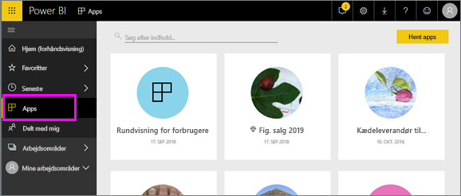

# Apps i Power BI
## Hvad er en Power BI-app?
En *app* er en Power BI-indholdstype, der kombinerer relaterede dashboards og rapporter på ét sted. En app kan have et eller flere dashboards og en eller flere rapporter, der alle er samlet. Apps oprettes af *Power BI-designere*, der distribuerer og deler apps med *forbrugere* som dig. 

Dine apps er organiseret på **appindholdslisten**.

## ***Appdesignere*** og ***appforbrugere***
Afhængigt af din rolle kan du være en person, der opretter apps (designer) til eget brug eller til at dele med kolleger. Eller du kan være en person, der modtager og downloader apps (forbruger), der er oprettet af andre. Denne artikel henvender sig til *appforbrugere*.

## Fordele ved apps
Det er nemt at finde og installere apps i Power BI-tjenesten ([https://powerbi.com](https://powerbi.com)) og på din mobilenhed. Når du har installeret en app, behøver du ikke huske navnene på mange forskellige dashboards, fordi de alle er samlet i én app, i webbrowseren eller på din mobilenhed.

Med apps ser du automatisk ændringerne, hver gang appens forfatteren udgiver opdateringer. Forfatteren styrer også, hvor ofte dataene er planlagt til opdatering, så du ikke skal bekymre dig om at holde dem opdateret. 

<!-- add conceptual art -->
## Hent en ny app
Du kan hente apps på nogle forskellige måder. 
- Appforfatteren kan installere appen automatisk på din Power BI-konto, og næste gang du åbner Power BI, får du vist den nye app på **appindholdslisten**. 
- Appforfatteren kan sende en mail til dig med et direkte link til en app. Hvis du vælger linket, åbner appen i Power BI.
- Du kan søge efter apps i AppSource, hvor du kan se alle de apps, du kan få adgang til. AppSource indeholder apps, der er udgivet af rapportdesignere både i og uden for din virksomhed. Du kan f.eks. finde en app på AppSource til en tjeneste, som du allerede bruger, f.eks Google Analytics, GitHub eller Microsoft Dynamics. 
- I Power BI på din mobilenhed kan du kun installere en app fra et direkte link og ikke fra AppSource. Hvis appens forfatter installerer appen automatisk, kan du se den på listen over apps.

## Næste trin
* [Åbn og interager med en app](end-user-app-view.md)

