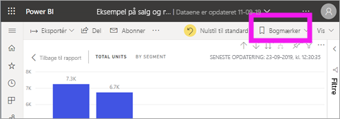
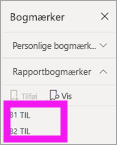
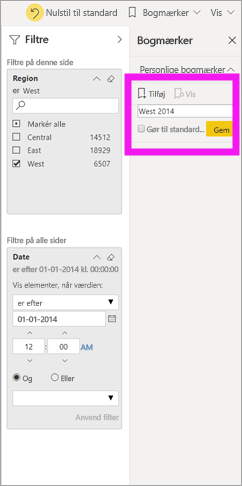
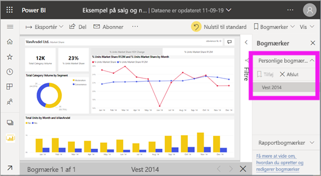
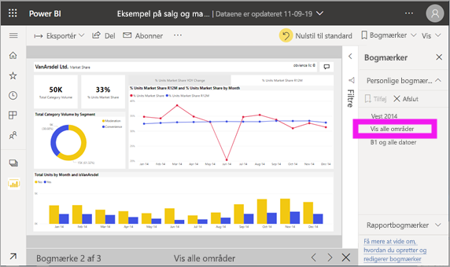

# Hvad er bogmærker?

[!INCLUDE [power-bi-service-new-look-include](../includes/power-bi-service-new-look-include.md)]

Bogmærker henter den aktuelt konfigurerede visning af en rapportside, herunder filtre, udsnitsværktøjer og tilstanden for visuals. Når du vælger et bogmærke, sender Power BI dig tilbage til den pågældende visning. Der er to typer bogmærker – dem, du selv opretter, og dem, der oprettes af *rapportdesignere*.

## Brug bogmærker til at dele indsigt og oprette historier i Power BI 
Bogmærker kan bruges til mange ting. Lad os sige, at du opdager en interessant indsigt og ønsker at bevare den – opret et bogmærke, så du kan vende tilbage til den senere. Hvis du skal afsted, men ønsker at bevare dit aktuelle arbejde, kan du oprette et bogmærke. Du kan også gøre et bogmærke til din standardvisning af rapporten, så hver gang du vender tilbage, åbnes denne visning af rapportsiden først. 

Du kan også oprette en samling af bogmærker, arrangere dem i den ønskede rækkefølge og efterfølgende gennemgå hvert bogmærke i en præsentation for at fremhæve en række indsigter, der fortæller en historie.  

## Åbn bogmærker
Hvis du vil åbne ruden Bogmærker, skal du vælge **Bogmærker** > **Vis flere bogmærker** på menulinjen. Hvis du vil vende tilbage til den oprindelige publicerede visning af rapporten, skal du vælge **Nulstil til standard**.

### Rapportbogmærker
Hvis *rapportdesigneren* har medtaget rapportbogmærker, kan du finde dem under overskriften **Rapportbogmærker**. Denne rapportside har to bogmærker, B1 og B2. 

Vælg et bogmærke for at skifte til den pågældende rapportvisning. 

### Personlige bogmærker

Når du opretter et bogmærke, gemmes følgende elementer sammen med bogmærket:

* Den aktuelle side
* Filtre
* Udsnit, herunder udsnitstypen (f.eks. rulleliste eller rullemenu) og udsnitstilstand
* Tilstand for visuel markering (f.eks. tværgående fremhævningsfiltre)
* Sorteringsrækkefølgen
* Placering af detailudledning
* Synlighed (for et objekt i ruden **Markering**)
* Tilstanden Fokus eller **Spotlight** for et synligt objekt

Konfigurer en rapportside, som du ønsker, den skal vises i bogmærket. Når din rapportside og dine visuelle elementer er arrangeret, som du ønsker det, skal du vælge **Tilføj** i ruden **Bogmærker** for at tilføje et bogmærke. I dette eksempel har vi tilføjet nogle filtre for område og dato. 

**Power BI** opretter et personligt bogmærke og giver det et standardnavn eller et navn, du angiver. Du kan *omdøbe*, *slette* eller *opdatere* dit bogmærke ved at vælge ellipsen ud for bogmærkets navn og derefter vælge en handling i den viste menu.

Når du har et bogmærke, kan du få vist det ved ganske enkelt at vælge bogmærket i ruden **Bogmærker**. 

<!--
## Arranging bookmarks
As you create bookmarks, you might find that the order in which you create them isn't necessarily the same order you'd like to present them to your audience. No problem, you can easily rearrange the order of bookmarks.

In the **Bookmarks** pane, simply drag-and-drop bookmarks to change their order, as shown in the following image. The yellow bar between bookmarks designates where the dragged bookmark will be placed.

The order of your bookmarks can become important when you use the **View** feature of bookmarks, as described in the next section. 

-->

## Bogmærker som et slideshow
Hvis du vil vise eller se bogmærker i en bestemt rækkefølge, skal du vælge **Vis** i ruden **Bogmærker** for at starte et diasshow.

I tilstanden **Vis** er der nogle funktioner, du skal lægge mærke til:

- Navnet på bogmærket vises på bogmærkets titellinje, der vises nederst på lærredet.
- Bogmærkets titellinje har pile, som du kan bruge til at flytte til næste eller forrige bogmærke.
- Du kan afslutte tilstanden **Vis** ved at vælge **Afslut** i ruden **Bogmærker** eller ved at vælge krydset (**X**) i bogmærkets titellinje.

Når du er i tilstanden **Vis**, kan du lukke ruden **Bogmærker** (ved at klikke på krydset (X) i ruden) for at give mere plads til præsentationen. Mens du er i tilstanden **Vis**, er alle visualiseringer interaktive og tilgængelige for tværgående fremhævning, ligesom når du interagerer med dem. 

<!--
## Visibility - using the Selection pane
With the release of bookmarks, the new **Selection** pane is also introduced. The **Selection** pane provides a list of all objects on the current page and allows you to select the object and specify whether a given object is visible. 

You can select an object using the **Selection** pane. Also, you can toggle whether the object is currently visible by clicking the eye icon to the right of the visual. 

When a bookmark is added, the visible status of each object is also saved based on its setting in the **Selection** pane. 

It's important to note that **slicers** continue to filter a report page, regardless of whether they are visible. As such, you can create many different bookmarks, with different slicer settings, and make a single report page appear very different (and highlight different insights) in various bookmarks.

## Bookmarks for shapes and images
You can also link shapes and images to bookmarks. With this feature, when you click on an object, it will show the bookmark associated with that object. This can be especially useful when working with buttons; you can learn more by reading the article about [using buttons in Power BI](desktop-buttons.md). 

To assign a bookmark to an object, select the object, then expand the **Action** section from the **Format Shape** pane, as shown in the following image.

Once you turn the **Action** slider to **On** you can select whether the object is a back button, a bookmark, or a Q&A command. If you select bookmark, you can then select which of your bookmarks the object is linked to.

There are all sorts of interesting things you can do with object-linked bookmarking. You can create a visual table of contents on your report page, or you can provide different views (such as visual types) of the same information, just by clicking on an object.

When you are in editing mode you can use ctrl+click to follow the link, and when not in edit mode, simply click the object to follow the link. 

## Bookmark groups

Beginning with the August 2018 release of **Power BI Desktop**, you can create and use bookmark groups. A bookmark group is a collection of bookmarks that you specify, which can be shown and organized as a group. 

To create a bookmark group, hold down the CTRL key and select the bookmarks you want to include in the group, then click the ellipses beside any of the selected bookmarks, and select **Group** from the menu that appears.

**Power BI Desktop** automatically names the group *Group 1*. Fortunately, you can just double-click on the name and rename it to whatever you want.

With any bookmark group, clicking on the bookmark group's name only expands or collapses the group of bookmarks, and does not represent a bookmark by itself. 

When using the **View** feature of bookmarks, the following applies:

* If the selected bookmark is in a group when you select **View** from bookmarks, only the bookmarks *in that group* are shown in the viewing session. 

* If the selected bookmark is not in a group, or is on the top level (such as the name of a bookmark group), then all bookmarks for the entire report are played, including bookmarks in any group. 

To ungroup bookmarks, just select any bookmark in a group, click the ellipses, and then select **Ungroup** from the menu that appears. 

Note that selecting **Ungroup** for any bookmark from a group takes all bookmarks out of the group (it deletes the group, but not the bookmarks themselves). So to remove a single bookmark from a group, you need to **Ungroup** any member from that group, which deletes the grouping, then select the members you want in the new group (using CTRL and clicking each bookmark), and select **Group** again. 
-->

## Begrænsninger og overvejelser
I denne version af **bogmærker** er der nogle få begrænsninger og overvejelser at tage betragtning.

* De fleste brugerdefinerede visuals fungerer fint sammen med bogmærker. Hvis du oplever problemer med et bogmærke og en brugerdefineret visual, kan du kontakte forfatteren af denne visual og bede om at få føjet understøttelse af bogmærker til deres visuals. 
* Hvis du tilføjer et visuelt element på en rapportside, når du har oprettet et bogmærke, vises det visuelle element i standardtilstanden. Det betyder også, at hvis du vil indføre et udsnitsværktøj på en side, hvor du tidligere har oprettet bogmærker, optræder udsnittet i standardtilstanden.
* Normalt har det ingen indflydelse på dine bogmærker, hvis *rapportdesigneren* opdaterer eller publicerer rapporten igen. Men hvis designeren foretager større ændringer i rapporten, f.eks. fjerner felter, der bruges af et bogmærke, modtager du en fejlmeddelelse, næste gang du forsøger at åbne bogmærket. 

<!--
## Next steps
spotlight?
-->
