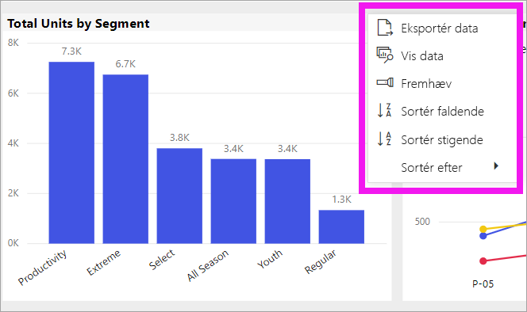
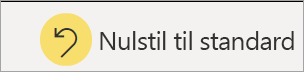
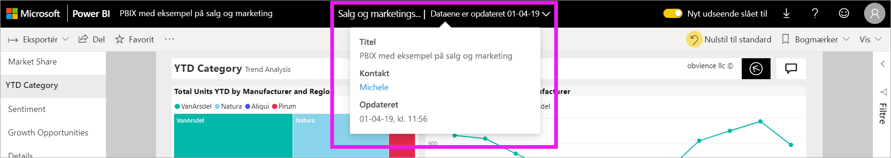

# Rediger, hvordan et diagram sorteres i en rapport i Power BI

[!INCLUDE [power-bi-service-new-look-include](../includes/power-bi-service-new-look-include.md)]

> [!IMPORTANT]
> **Denne artikel henvender sig til Power BI brugere, der ikke har redigeringstilladelser til rapporten eller datasættet. Hvis du vil have mere detaljerede instruktioner til sortering, skal du læse [Sortér efter kolonne i Power BI Desktop](../desktop-sort-by-column.md)** .

I Power BI-tjenesten kan du ændre, hvordan en visualisering ser ud, ved at sortere den efter forskellige datafelter. Hvis du ændrer, hvordan du sorterer en visualisering, kan du fremhæve de oplysninger, du vil formidle.

Visuals på et dashboard kan ikke sorteres, men i en Power BI-rapport kan du sortere de fleste visualiseringer 

Uanset om du bruger numeriske data (f.eks. salgstal) eller tekstdata (f.eks. navne på stater), kan du sortere visualiseringerne efter behov. Power BI indeholder mange sorteringsmuligheder og genvejsmenuer, som du kan bruge. 

## Kom i gang

For at komme i gang skal du vælge et visual og vælge **Flere handlinger** (...).  Der er tre sorteringsindstillinger: **Sortér faldende**, **Sortér stigende**, og **Sortér efter**. 
    

### Sortér alfabetisk eller numerisk

Visuals kan sorteres alfabetisk efter navnene på kategorierne i visual'et eller efter de numeriske værdier for hver kategori. Dette diagram er f.eks. sorteret alfabetisk efter kategorien **Store Name** på X-aksen.

Det er nemt at ændre sorteringen fra en kategori (gem navn) til en værdi (salg pr. kvadratfod) i stedet. Vælg **Flere handlinger** (...), og vælg **Sortér efter**. Vælg en numerisk værdi, der bruges i visual'et.  I dette eksempel har vi valgt **Sales Per Sq Ft**.

Hvis det er nødvendigt, kan du ændre sorteringsrækkefølgen mellem stigende og faldende.  Vælg **Flere handlinger** (...) igen, og vælg **Sortér faldende** eller **Sortér stigende**. Det felt, der bruges til at sortere efter, er med fed skrift og har en gul linje.

   

> [!NOTE]
> Det er ikke alle visualiseringer, der kan sorteres. Følgende visualiseringer kan f.eks. ikke sorteres: træstruktur, kort (map), kartogram, punkt, måler, kort (card) og vandfald.

## Gem dine ændringer af sorteringsrækkefølgen
Power BI-rapporter bevarer filtre, udsnit, sortering og andre ændringer af datavisning. Hvis du navigerer væk fra en rapport og vender tilbage igen senere, er dine sorteringsændringer blevet gemt.  Hvis du vil ændre indstillingerne tilbage til de indstillinger, som rapportens designer oprindeligt valgte, skal du vælge **Nulstil til standard** på den øverste menulinje. 

Hvis knappen **Nulstil til standard** er nedtonet, betyder det, at rapportens *designer* har deaktiveret muligheden for at gemme (bevare) dine egne ændringer.

## Overvejelser og fejlfinding

### Sortering ved hjælp af andre kriterier
Der kan nogle gange være behov for at sortere en visualisering ved hjælp af et andet felt (der ikke er inkluderet i visualiseringen) eller andre kriterier.  Det kan f.eks. være, at du vil sortere efter måned i sekventiel rækkefølge (og ikke i alfabetisk rækkefølge), eller at du vil sortere efter hele tal i stedet for cifre (f.eks. 0, 1, 9, 20 og ikke 0, 1, 20, 9).  Kun den person, der har designet rapporten, kan foretage disse ændringer for dig. Du kan finde kontaktoplysninger for *designeren* ved at vælge rapportens navn på overskriftslinjen.

## Næste trin
Få mere at vide om [Visualiseringer i Power BI-rapporter](end-user-visualizations.md).

[Power BI – Grundlæggende begreber](end-user-basic-concepts.md)
