# Føj kommentarer til et dashboard eller en rapport
Tilføj en personlig kommentar, eller start en samtale om et dashboard eller en rapport med dine kolleger. **Kommentarfunktionen** er bare én af de måder, en *forbruger* kan samarbejde med sine kolleger på. 

## Sådan bruges kommentarfunktionen
Kommentarer kan føjes til et helt dashboard, til individuelle visualiseringer på et dashboard, til en rapportside, til en sideinddelt rapport og til individuelle visualiseringer på en rapportside. Tilføj en generel kommentar eller en kommentar, der er målrettet bestemte kolleger.  

Når du føjer en kommentar til en rapport, henter Power BI de aktuelle værdier for filter og udsnit. Det betyder, at når du vælger eller reagerer på en kommentar, så kan en rapportside eller en visualisering i rapporten blive ændret for at vise dig den filtrerede værdi eller det udsnit, der var aktivt, da kommentaren blev tilføjet.  

Hvorfor er det vigtigt? Forestil dig, at en kollega har anvendt et filter, der viste en interessant indsigt, som vedkommende vil dele med teamet. Hvis filteret ikke er valgt, giver kommentaren måske ikke mening.

Hvis du bruger en sideinddelt rapport, kan du kun angive en generel kommentar om din rapport.  Det er ikke muligt at angive kommentarer om de enkelte visualiseringer i rapporter.

### Føj en generel kommentar til et dashboard eller en rapport
Processerne for at føje kommentarer til et dashboard eller en rapport er ens.  I dette eksempel bruger vi et dashboard. 

1. Åbn et Power BI-dashboard eller en rapport, og vælg ikonet **Kommentarer**. Herefter åbnes dialogboksen Kommentarer.

    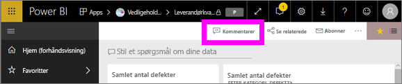

    Her kan vi se, at opretteren af dashboardet allerede har tilføjet en generel kommentar.  Alle, der har adgang til dette dashboard, kan se denne kommentar.

    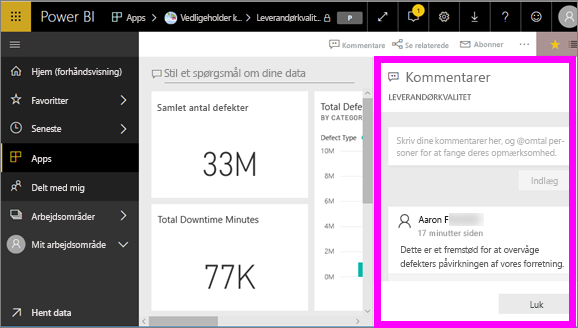

2. Hvis du vil besvare kommentaren, skal du vælge **Besvar**, skrive dit svar og vælge **Send**.  

    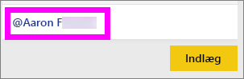

    Power BI sender som standard dit svar til den kollega, der begyndte kommentartråden, i dette tilfælde Aaron F. 

    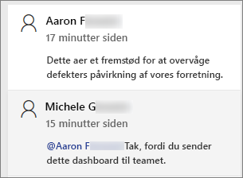

 3. Hvis du vil tilføje en kommentar, der ikke er en del af en eksisterende tråd, skal du angive din kommentar i det øverste tekstfelt.

    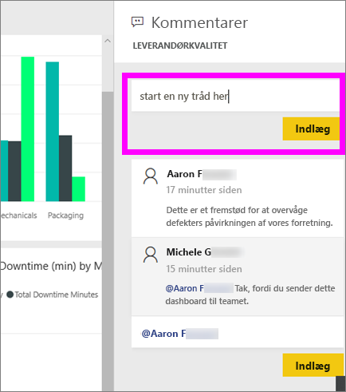

    Kommentarerne til dette dashboard ser nu sådan ud.

    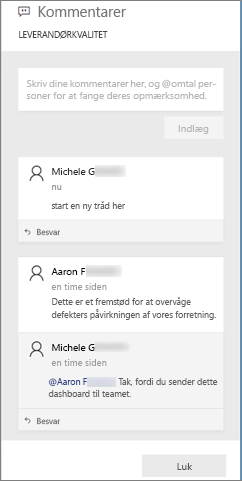

### Føj en kommentar til en specifik visualisering på et dashboard eller i en rapport
Ud over at du kan føje kommentarer til et helt dashboard eller en hel rapport, kan du også føje kommentarer til et enkelt dashboardfelt eller en enkelt visualisering i en rapport. Processerne er ens, og i dette eksempel bruger vi en rapport.

1. Hold musemarkøren over det visuelle element, og vælg ellipsen (...).    
2. Vælg **Tilføj en kommentar** på rullelisten.

    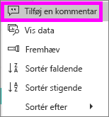  

3.  Dialogboksen **Kommentarer** åbnes, og de andre visualiseringer på siden nedtones. Dette visuelle element har endnu ikke nogen kommentarer. 

    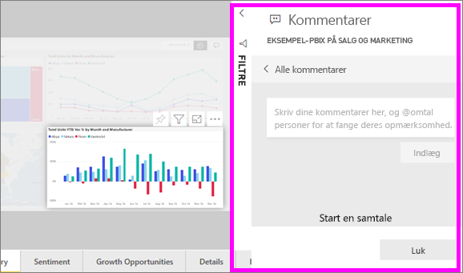  

4. Skriv din kommentar, og vælg derefter **Post**.

    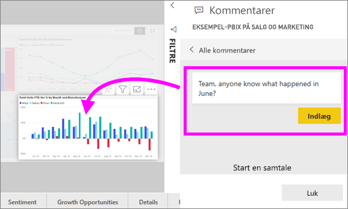  

    - Hvis du vælger en kommentar på en rapportside, som oprindeligt var skrevet til en visualisering, så fremhæves denne visualisering (se ovenfor).

    - På et dashboard viser diagramikonet  os, at der er knyttet en kommentar til en specifik visualisering. Kommentarer, der gælder for hele dashboardet, har ikke et særligt ikon. Når du vælger diagramikonet, fremhæves den relaterede visualisering på dashboardet.

        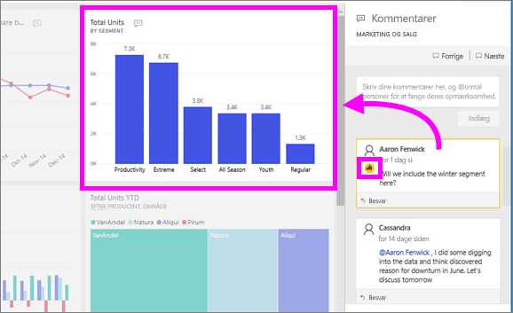

5. Vælg **Luk** for at vende tilbage til dashboardet eller rapporten.

### Få dine kollegers opmærksomhed ved hjælp af @-tegnet
Uanset om du opretter en kommentar til et dashboard, en rapport, et felt eller en visualisering, kan du få dine kollegers opmærksomhed ved at bruge "\@"-symbolet.  Når du skriver "\@"-symbolet, åbnes der en rulleliste i Power BI, hvor du kan søge efter og vælge personer i din organisation. Bekræftede navne med "\@"-symbolet foran vises med blå skrift. 

Her er en samtale, jeg har med visualiserings*designeren*. De bruger @-symbolet til at sikre, at jeg ser kommentaren. Jeg ved, at denne kommentar er til mig. Når jeg åbne dette appdashboard i Power BI, vælger jeg **Kommentarer** i overskriften. Ruden **Kommentarer** viser vores samtale.

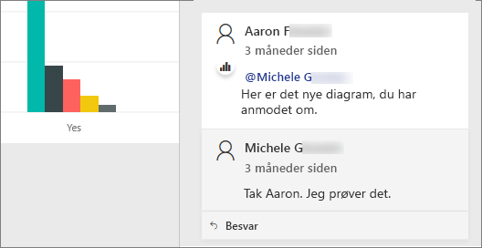  

## Næste trin
Tilbage til [visualiseringer til forbrugere](end-user-visualizations.md)    
<!--[Select a visualization to open a report](end-user-open-report.md)-->
