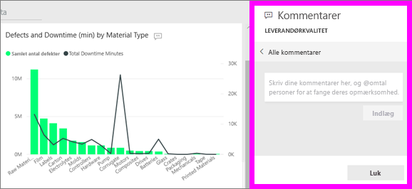
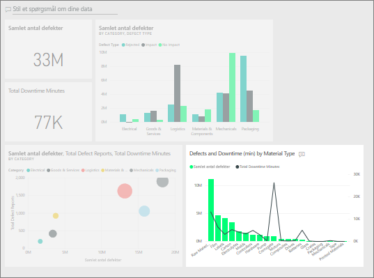

# Føj kommentarer til et dashboard
Tilføj en personlig kommentar, eller start en samtale om et dashboard med dine kolleger. **Kommentarfunktionen** er bare én af de måder, en *forbruger* kan samarbejde med sine kolleger på. 

## Sådan bruges kommentarfunktionen
Kommentarer kan føjes til et helt dashboard eller til individuelle visuelle elementer på et dashboard. Tilføj en generel kommentar eller en kommentar, der er målrettet bestemte kolleger.  

### Føj en generel kommentar til et dashboard
1. Åbn et Power BI-dashboard, og vælg ikonet **Kommentarer**. Herefter åbnes dialogboksen Kommentarer.

    

    Her kan vi se, at opretteren af dashboardet allerede har tilføjet en generel kommentar.  Alle, der har adgang til dette dashboard, kan se denne kommentar.

    

2. Hvis du vil besvare kommentaren, skal du vælge **Besvar**, skrive dit svar og vælge **Send**.  

    

    Power BI sender som standard dit svar til den kollega, der begyndte kommentartråden, i dette tilfælde Aaron F. 

    

 3. Hvis du vil føje en kommentar til et dashboard, der ikke er en del af en eksisterende tråd, skal du angive din kommentar i det øverste tekstfelt.

    

    Kommentarerne til dette dashboard ser nu sådan ud.

    

### Føj en kommentar til et bestemt visuelt element på et dashboard
1. Hold musemarkøren over det visuelle element, og vælg ellipsen (...).    
2. Vælg **Tilføj en kommentar** på rullelisten.

      

3.  Dialogboksen **Kommentarer** åbnes. Dette visuelle element har endnu ikke nogen kommentarer. 

      

4. Skriv din kommentar, og vælg derefter **Post**.

      

    Ikonet Diagram  giver os mulighed for at angive, at denne kommentar er knyttet til et bestemt visuelt element. Vælg ikonet for at fremhæve det relaterede visuelle element på dashboardet.

    

5. Vælg **Luk** for at vende tilbage til dashboardet eller rapporten.

### Få dine kollegers opmærksomhed ved hjælp af @-tegnet
Uanset om du opretter dashboardkommentarer eller kommenterer et bestemt visuelt element, kan du få dine kollegers opmærksomhed ved hjælp af symbolet "@".  Når du skriver symbolet "@", åbner Power BI en rulleliste, hvor du kan søge efter og vælge personer i din organisation. Bekræftede navne, som begynder med symbolet "@", vises med blå skrifttype. 

Her er en samtale, jeg har med visualiserings*designeren*. Han bruger symbolet @ for at sikre, at jeg kan se kommentaren. Jeg ved, at denne kommentar er til mig. Når jeg åbne dette appdashboard i Power BI, vælger jeg **Kommentarer** i overskriften. Ruden **Kommentarer** viser vores samtale.

  

## Næste trin
Tilbage til [visualiseringer til forbrugere](end-user-visualizations.md)    
<!--[Select a visualization to open a report](end-user-open-report.md)-->