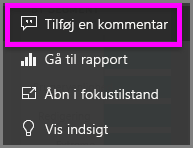
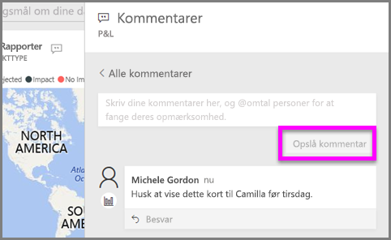
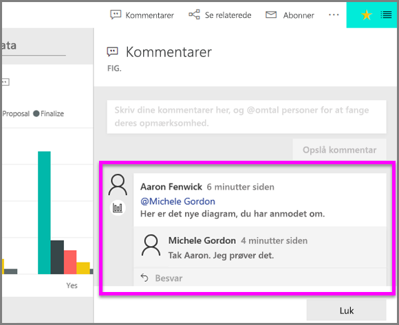

# Føj kommentarer til en visualisering
Tilføj en personlig kommentar, eller start en samtale om en visualisering med dine kolleger. **Kommentar**funktionen er bare én af måder, en *forbruger* kan interagere med en visualisering på. 

## Sådan bruges kommentarfunktionen

1. Hold musemarkøren over visualiseringen, og vælg ellipsen (...).    
2. Vælg **Tilføj en kommentar** på rullelisten.

      

3.  Skriv din kommentar, og vælg derefter **Opslå kommentar**. Dette er en kommentar til mig selv, komplet med stavefejl.

      

4. Her er en samtale, jeg har med visualiserings*designeren*. Han bruger symbolet @ for at sikre, at jeg kan se kommentaren. Jeg ved, at denne kommentar er til mig. Når jeg åbne dette appdashboard i Power BI, vælger jeg **Kommentarer** i overskriften. Ruden **Kommentarer** viser vores samtale. 

      

5. Klik på **Luk** at vende tilbage til dashboardet eller rapporten.

## Næste trin
Tilbage til [visualiseringer til forbrugere](end-user-visualizations.md)    
<!--[Select a visualization to open a report](end-user-open-report.md)-->