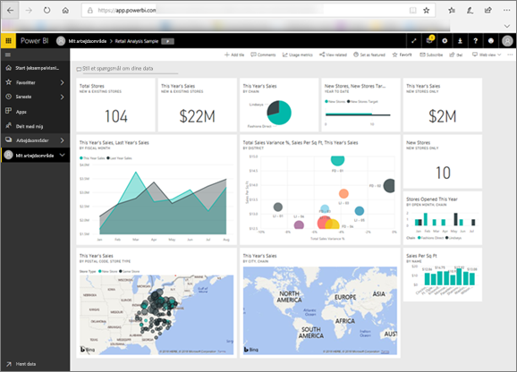

<!-- fold this topic into existing topics -->
# Power BI til forbrugere
Den måde, du interagerer med Power BI på, afhænger af din jobfunktion. Som *slutbruger* eller *forbruger* er du den person, der modtager dashboards, rapporter og apps fra kolleger. Du arbejder i ***Power BI-tjenesten*** for at gennemse og interagere med dette indhold for at kunne træffe forretningsbeslutninger.

Hvis du ikke kender til Power BI, anbefaler vi, at du først læser [oversigten over Power BI](../power-bi-overview.md). Der lærer du om de forskellige værktøjer, som findes i Power BI.

Som forbruger har du ikke adgang til alle funktioner i Power BI – og er det helt fint, da det ikke er din opgave at oprette dashboards og rapporter. Din opgave er at bruge Power BI til analyse, overvågning, udforskning og beslutningstagning.

Når du læser artiklerne for forbrugere, lærer du terminologien at kende, du får en præsentation af Power BI-tjenesten, du finder ud af, hvordan du navigerer til indhold, og du lærer, hvordan du interagerer med det pågældende indhold.  Lad os komme i gang!

## Næste trin

[Terminologi og begreber for Power BI-*forbrugere*](end-user-basic-concepts.md)

<!-- [Get started guide for *consumers*] -->
[Kom godt i gang med at bruge Power BI-tjenesten](../service-get-started.md)

