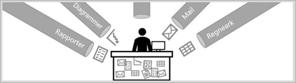
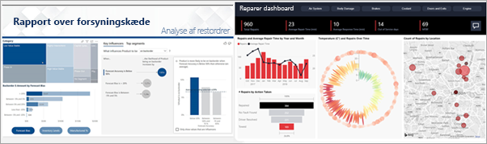
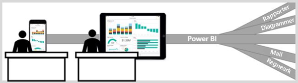

# Power BI-tjenesten til forbrugere

[!INCLUDE[consumer-appliesto-ynny](../includes/consumer-appliesto-ynny.md)]

Du bor i en datakultur, hvor forretningsbeslutningerne er baseret på fakta og ikke holdninger. Du skal bruge data til at træffe disse beslutninger, og dine kolleger svigter dig ikke.     
 
De sender dig alle typer rapporter, regneark, mails med diagrammer og endda trykte kopier. I takt med at dataene hober sig op, bliver det sværere og sværere at finde det, du har brug for, og du kan være bekymret for, at du ikke bruger de nyeste oplysninger.  
 

## Power BI-tjenesten til *forbrugere*

Power BI gør dit arbejde både lettere og mere virkningsfuldt. Alle disse data bliver til diagrammer og grafer, der kan visualisere dine data for dig. I stedet for lange lister eller tabeller med tal og ord er din dataindsigt ***smukke*** , farverige og overbevisende visuelle elementer, der fortæller historier om indsigten i dine data. 

 
Du skal blot åbne Power BI-tjenesten i en browser eller på en mobilenhed. Du og dine kolleger arbejder fra de samme dashboards og rapporter, der er tillid til, som opdateres automatisk, så du altid arbejder med det nyeste indhold.   

Da indholdet ikke er statisk, kan du se nærmere på dataene, lede efter tendenser, indsigt og anden business intelligence. Opdel indholdet, og stil selv spørgsmål til det med dine egne ord. Eller læn dig tilbage, og lad dine data finde interessant indsigt for dig: Give dig besked, når data ændres, og sende rapporter til dig via mail efter en tidsplan, som du har angivet. Alle dine data, når som helst, i cloudmiljøet eller i det lokale miljø og fra alle enheder. Det er kun begyndelsen på det, Power BI kan gøre. 

## Er jeg en Power BI-*forbruger*?

Den måde, du interagerer med Power BI på, afhænger af din jobfunktion. Som slutbruger eller *forbruger* er du den person, der modtager indhold (dashboards, rapporter og apps) fra kolleger. Du arbejder i online- eller mobilversionen af Power BI, som kaldes Power BI-tjenesten, og gennemgår og interagerer med dette indhold, så du kan træffe forretningsbeslutninger. 
   
Som forbruger har du ikke adgang til alle funktioner i Power BI – og det er helt fint, da det ikke er din opgave at oprette dashboards og rapporter. Din opgave er at bruge Power BI til analyse, overvågning, udforskning og beslutningstagning. 

Du hører uden tvivl udtrykket "Power BI Desktop" eller blot "Desktop". Dette er et separat værktøj, som bruges af *designere*, der udarbejder og deler dashboards og rapporter med dig.  Det er vigtigt, at du er klar over, at der er andre Power BI-værktøjer derude, men så længe du er en forbruger, vil du kun arbejde med Power BI-tjenesten. 

Eftersom du arbejder med *delt* indhold, har du brug for en Power BI Pro- eller Premium-licens. [Hvilken licens har jeg?](end-user-license.md)

## Sikker interaktion med indhold 
Du behøver ikke bekymre dig, når du filtrerer, laver udsnit, abonnerer og eksporterer – dit arbejde påvirker ikke det underliggende datasæt eller det oprindelige delte indhold (dashboards, rapporter og apps).  

Du kan ikke ødelægge dine data.  Power BI er et fantastisk sted at udforske og eksperimentere, uden at du behøver at bekymre dig om at ødelægge noget.  
 
Det betyder ikke, at du ikke kan gemme dine ændringer. Det kan du. Men disse ændringer påvirker kun din visning af indholdet. Og det er lige så let som at klikke på en knap at vende tilbage til den oprindelige standardvisning.  

## Næste trin

[Få en præsentation af Power BI-tjenesten for forbrugere](end-user-reading-view.md)    
[Uddannelse i Power BI-tjenesten for forbrugere](https://docs.microsoft.com/learn/paths/consume-data-with-power-bi/)    
[Terminologi og begreber for Power BI-*forbrugere*](end-user-basic-concepts.md)    

