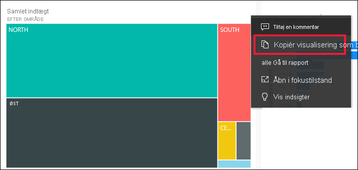
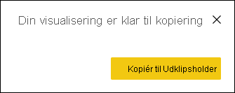
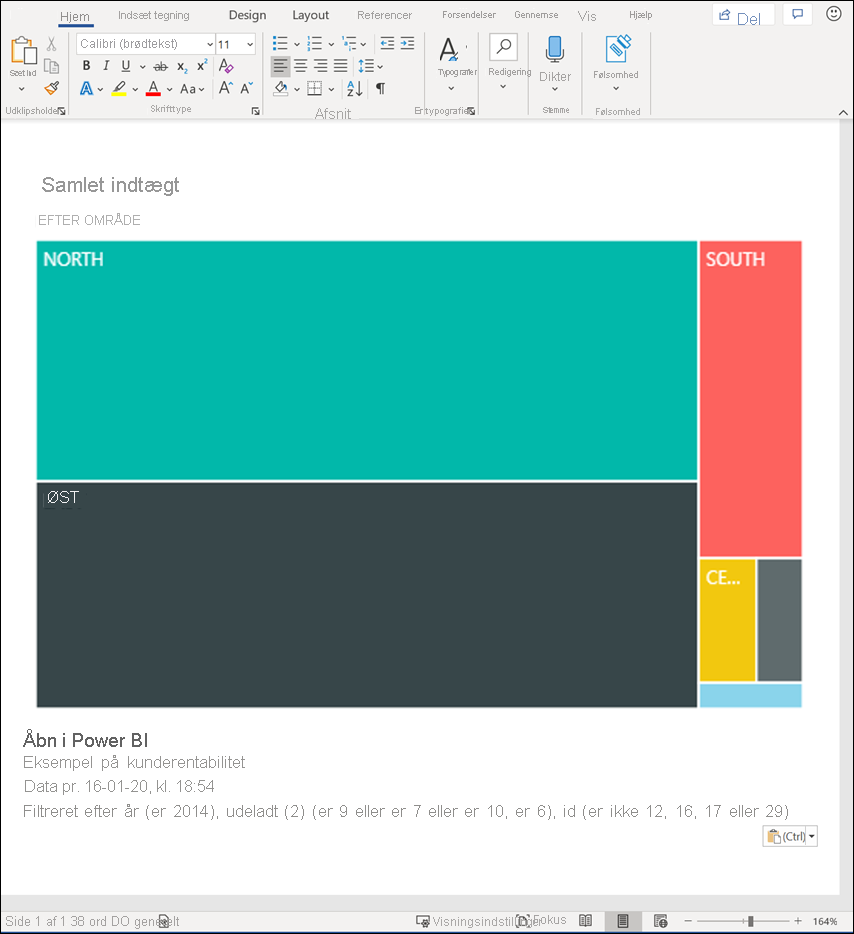
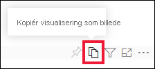
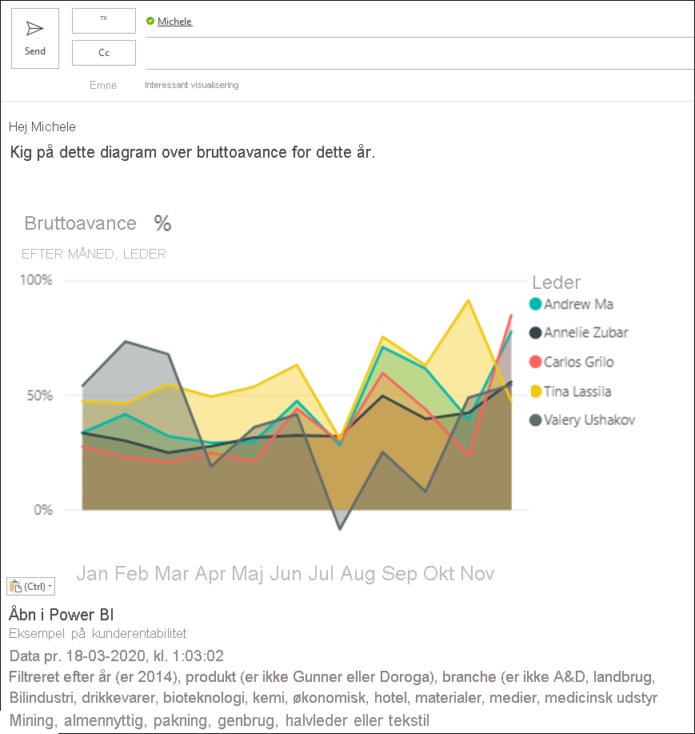
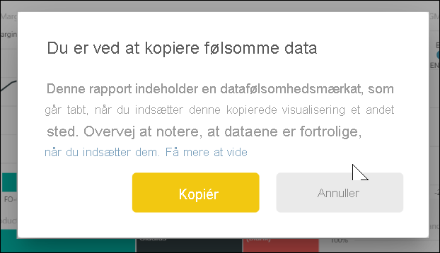
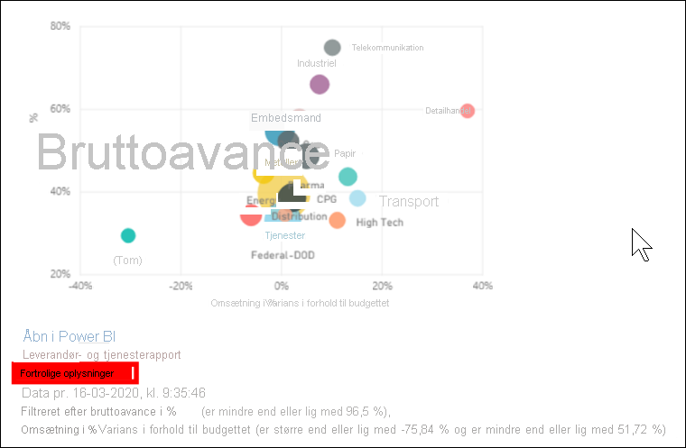
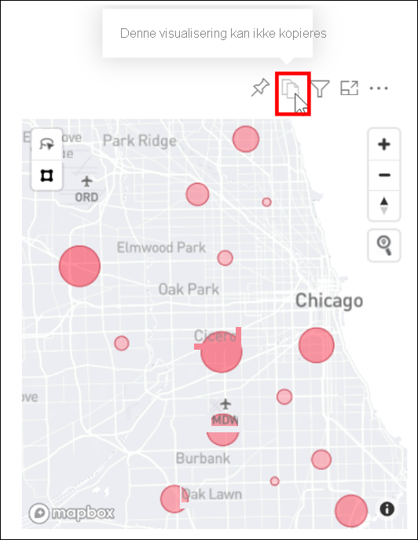

# Kopiér en visualisering som et billede til Udklipsholder

[!INCLUDE[consumer-appliesto-yyyn](../includes/consumer-appliesto-yyyn.md)]

Har du nogensinde ønsket at dele et billede fra en Power BI-rapport eller et dashboard? Du kan nu kopiere visualiseringen og indsætte den i et hvilket som helst andet program, der understøtter indsættelse. 

Når du kopierer et statisk billede af en visualisering, får du en kopi af visualiseringen sammen med metadataene. Dette omfatter:
* et link, der fører tilbage til Power BI-rapporten eller -dashboardet
* titlen på rapporten eller dashboardet
* bemærk, om billedet indeholder fortrolige oplysninger
* tidsstempel for seneste opdatering
* filtre anvendt på visualiseringen

### Kopiér fra et dashboardfelt

1. Naviger til det dashboard, du vil kopiere fra.

2. I øverste højre hjørne i visualiseringen skal du vælge **Flere handlinger (...)** og vælge **Kopiér visualisering som billede**. 

    

3. Når dialogboksen **Din visualisering er klar til kopiering** vises, skal du vælge **Kopiér til Udklipsholder**.

    

4. Når visualiseringen er kopieret, skal du indsætte den i et andet program ved hjælp af **Ctrl + V** eller **højreklik** > **Indsæt**. På skærmbilledet nedenfor har vi indsat visualiseringen i Microsoft Word. 

    

### Kopiér fra en visualisering i en rapport 

1. Naviger til den rapport, du vil kopiere fra.

2. I øverste højre hjørne i visualiseringen skal du vælge ikonet for **Kopiér visualisering som billede**. 

    

3. Når dialogboksen **Din visualisering er klar til kopiering** vises, skal du vælge **Kopiér til Udklipsholder**.

    

4. Når visualiseringen er kopieret, skal du indsætte den i et andet program ved hjælp af **Ctrl + V** eller **højreklik** > **Indsæt**. På skærmbilledet nedenfor har vi indsat visualiseringen i en mail.

    

5. Hvis der er anvendt en følsomhedsmærkat for dataene i rapporten, får du vist en advarsel, når du vælger ikonet for kopiering.  

    

    Og der føjes en følsomhedsmærkat til metadataene under den indsatte visualisering. 

    

## Overvejelser og fejlfinding

   

Spørgsmål: Hvorfor er ikonet Kopiér deaktiveret på en visualisering?    
Svar: Vi understøtter i øjeblikket oprindelige Power BI-visualiseringer og certificerede brugerdefinerede visualiseringer. Der er begrænset understøttelse af bestemte visualiseringer, herunder: 
- ESRI og andre kortvisualiseringer 
- Python-visualiseringer 
- R-visualiseringer 
- Visualiseringer i PowerApps   

Svar: Muligheden for at kopiere et visuelt element kan slås fra af IT-afdelingen eller Power BI-administratoren.

Spørgsmål: Hvorfor indsættes min visualisering ikke korrekt?    
Svar: Der er begrænsninger for brugerdefinerede visualiseringer og animerede visualiseringer. 

## Næste trin
Få mere at vide om [Visualiseringer i Power BI-rapporter](end-user-visual-type.md)

Hvis du har redigeringstilladelser i en rapport, kan du [kopiere og indsætte visualiseringer i den pågældende rapport](../visuals/power-bi-visualization-copy-paste.md). 

Har du flere spørgsmål? [Prøv at spørge Power BI-community'et](https://community.powerbi.com/)

