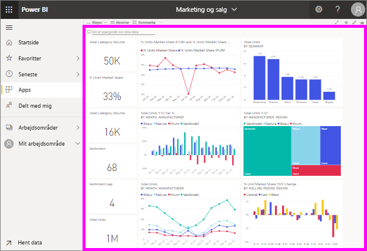

# Få vist et dashboard

[!INCLUDE[consumer-appliesto-ynny](../includes/consumer-appliesto-ynny.md)]

[!INCLUDE [power-bi-service-new-look-include](../includes/power-bi-service-new-look-include.md)]

Power BI-*forbrugere* bruger meget tid på at se på dashboards. Dashboards er designet til at fremhæve bestemte oplysninger fra de underliggende rapporter og datasæt. Power BI-forbrugerne bruger disse oplysninger til sporing, overvågning, besvarelse af spørgsmål, test og meget mere for at kunne tage datadrevne forretningsbeslutninger.

En Power BI Pro-licens er påkrævet både for at dele et dashboard og få vist et delt dashboard. [Hvilken licens har jeg?](end-user-license.md) 

## Åbn et dashboard

|              |         |
|------------|--------------------------------|
|      |Dashboards kan åbnes fra mange forskellige steder i Power BI-tjenesten.   Kig kun efter dette dashboardikon. Når du har identificeret et  dashboard, er det nemt at åbne det. Du skal bare vælge det, og så udfylder dashboardet Power BI-lærredet. |
|                    |          |

Du kan finde dashboards i alle objektbeholderne i navigationsruden. 

- **Startside** 
- **Favoritter** – Hvis du har [angivet et dashboard som favorit](end-user-favorite.md)
- **Seneste** – Hvis du har besøgt et dashboard for nylig
- **Apps** – De fleste apps indeholder både dashboards og rapporter
- **Delt med mig** – Hvis en kollega har [delt et dashboard med dig](end-user-shared-with-me.md)
- **Mit arbejdsområde** – Hvis du har downloadet nogle [Power BI-eksempler](../sample-datasets.md)

## De næste trin
* Bliv fortrolig med dashboards ved at se præsentationen af et af vores [eksempler på et dashboard](../sample-tutorial-connect-to-the-samples.md).    
* Få mere at vide om [dashboardfelter](end-user-tiles.md), og hvad der sker, når du vælger et.