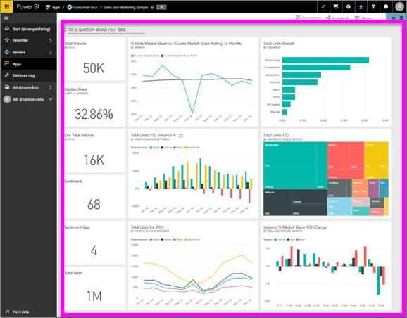

# Få vist et dashboard
Power BI-forbrugere bruger meget tid på at få vist dashboards. Dashboards er designet til at fremhæve bestemte oplysninger fra de underliggende rapporter og datasæt. Power BI-forbrugerne bruger disse oplysninger til sporing, overvågning, besvarelse af spørgsmål, test og meget mere for at kunne tage datadrevne forretningsbeslutninger.

Power BI Pro er påkrævet både for at dele et dashboard og få vist et delt dashboard.

## Åbn et dashboard
Dashboards kan åbnes fra mange forskellige steder i Power BI-tjenesten.  Det vigtige er at finde ud af, hvilket indhold der udgør et dashboard (i forhold til f.eks. en rapport). Når du har identificeret et dashboard, er det nemt at åbne det. Du skal blot klikke, så udfylder dashboardet dit Power BI-lærred.

|              |         |
|------------|--------------------------------|
|      |Den nemmeste måde at identificere et dashboard på er ved at kigge efter dette  dashboardikon. Når du har fundet indhold med dette ikon, skal du vælge det for at åbne dashboardet. |
|                    |          |

 

<!--insert aGIF-->

Du kan finde dashboards i alle objektbeholderne på den venstre navigationslinje. 
- **Start** (prøveversion)
- **Favoritter** – Hvis du har [angivet et dashboard som favorit](end-user-favorite.md)
- **Seneste** – Hvis du har besøgt et dashboard for nylig
- **Apps** – De fleste apps indeholder både dashboards og rapporter
- **Delt med mig** – Hvis en kollega har [delt et dashboard med dig](end-user-shared-with-me.md)
- **Mit arbejdsområde** – Hvis du har downloadet nogle [Power BI-eksempler](../sample-datasets.md)

## Næste trin
* Bliv fortrolig med dashboards ved at se præsentationen af et af vores [eksempler på et dashboard](../sample-tutorial-connect-to-the-samples.md).
* Få mere at vide om [dashboardfelter](end-user-tiles.md), og hvad der sker, når du vælger et.
* Vil du holde øje med et enkelt dashboardfelt og modtage en mail, når den når en bestemt grænse? [Opret beskeder for felterne](end-user-alerts.md).
* Stil spørgsmål om dit dashboard. Få mere at vide om, hvordan du bruger [Spørgsmål og svar i Power BI](end-user-q-and-a.md) til at stille et spørgsmål om dine data og få svar i form af en visualisering. 