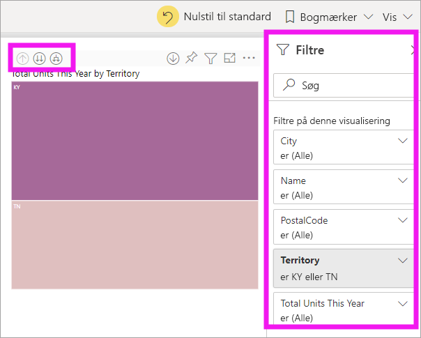
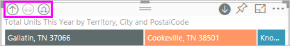
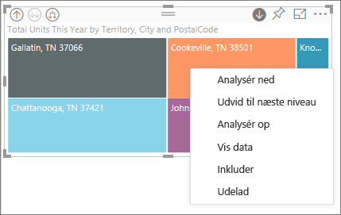
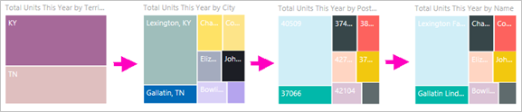
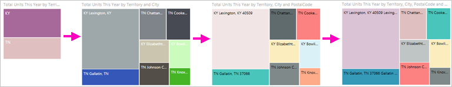
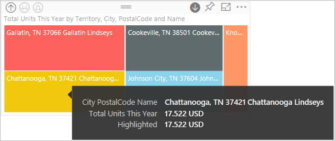

# Analysetilstand i en visualisering i Power BI

[!INCLUDE[consumer-appliesto-yyny](../includes/consumer-appliesto-yyny.md)]

[!INCLUDE [power-bi-service-new-look-include](../includes/power-bi-service-new-look-include.md)]

I denne artikel gennemgår vi, hvordan man foretager detailudledning i en visualisering i Microsoft Power BI-tjenesten. Når du får vist flere eller færre detaljer for dine datapunkter, kan du udforske detaljerede oplysninger om dine data. 

## Analysetilstand kræver et hierarki

Når et visuelt element har et hierarki, kan du foretage detailudledning for at finde flere detaljer. Du har f.eks. en visualisering, der kigger på optælling af olympiske medaljer ud fra et hierarki, der består af sport, disciplin og begivenhed. Som standard viser visualiseringen medaljeoptælling ud fra sportsgren – gymnastik, skiløb, vandsport osv. Men eftersom den har et hierarki, vises et stadigt mere detaljeret billede, når der vælges visuelle elementer (f.eks. et liggende søjlediagram, linjediagram eller boblediagram). Vælg elementet **vandsport** for at få vist data for svømning, udspring og vandpolo.  Vælg elementet **udspring** for at få vist detaljer for vippe, platform og discipliner med synkronudspring.

Datoer er en unik type i hierarkiet.  Rapportdesignere tilføjer ofte datohierarkier i visuelle elementer. Et almindeligt datohierarki er et, der indeholder år, kvartal, måned og dag. 

## Find ud af, hvilke visualiseringer der kan analyseres
Ved du, hvilke Power BI-visualiseringer der indeholder et hierarki? Peg på en visualisering. Hvis du får vist en kombination af disse analysekontrolelementer øverst, har visualiseringen et hierarki.

  

## Få mere at vide om, hvordan du zoomer ind på og ud fra detaljeniveauet

I dette eksempel bruger vi en træstruktur, der har et hierarki, der består af område, by, postnummer og butiksnavn. Træstrukturen viser de samlede enheder, der er solgt dette år efter område, før du foretager detailudledning. 

  

### To måder at få adgang til analysefunktionerne på

Du har to måder at få adgang til funktionerne til at zoome ind på og ud fra detaljeniveauet og udvide for de visualiseringer, som har hierarkier. Prøv dem begge to, og vælg den, du synes bedst om.

- Den første måde: Peg på en visualisering for at få vist og bruge ikonerne.  

    

- Den anden måde: Højreklik på en visualisering for at få vist og bruge menuen.

    

## Stier for analyse

### Brug detailudledning på alle felter på en gang

Der er flere måder, hvorpå du kan få vist flere detaljer i din visualisering. Hvis du vælger ikonet til detailudledning, føres du til næste niveau i hierarkiet. Hvis du kigger på niveauet **Område** for Kentucky og Tennessee, kan du foretage detailudledning for at gå til bynavnet for begge stater, derefter postnummerniveau for begge stater og til sidst niveauet for butiksnavn for begge stater. Hvert trin på stien viser nye oplysninger.

Vælg ikonet for færre detaljer  indtil du kommer tilbage til Samlet antal enheder dette år efter område.

### Udvid alle felter på én gang

**Udvid** føjer et ekstra hierarkiniveau til den aktuelle visning. Hvis du kigger på niveauet **Område**, kan du udvide og føje oplysninger om by, postnummer og navn til din træstruktur. Hvert trin på stien viser de samme oplysninger og tilføjer et niveau med nye oplysninger.

Du kan også vælge at bruge detailudledning eller at udvide ét felt ad gangen.

### Detailudledning på ét felt ad gangen

1. Vælg ikonet for detailudledning for at aktivere funktionen .

    Nu kan du bruge detailudledning for **ét felt ad gangen** ved at vælge et visuelt element. Eksempler på visuelle elementer er: liggende søjlediagram, boblediagram og blad.

    

    Hvis du ikke aktiverer detailudledning, finder der ingen detailudledning sted, når du vælger et visuelt element (f.eks. et søjlediagram, boblediagram eller blad). I stedet for krydsfiltreres de andre diagrammer på rapportsiden.

1. Vælg bladet for **TN**. Din træstruktur viser nu alle de byer i Tennessee, hvor der er en butik.

    

1. På nuværende tidspunkt kan du:

    1. Fortsætte med at detailudlede for Tennessee.

    1. Detailudlede for en bestemt by i Tennessee.

    1. Udvid i stedet.

    Lad os fortsætte med detailudledning på ét felt ad gangen.  Vælg **Knoxville, TN**. Din træstruktur viser postnummeret for din butik i Knoxville.

    

    Bemærk, at titlen ændres, når du foretager detailudledning eller fjerner detaljerne igen.

### Udvid alle, og udvid ét felt ad gangen

Det er ikke så informativt at have en træstruktur, der kun viser et postnummer.  Lad os *udvide* ét niveau ned i hierarkiet.  

1. Med træstrukturen aktiveret kan du vælge ikonet *udvid ned*. Nu vises to niveauer af hierarkiet i træstrukturen: postnummer og butiksnavn.

    

1. Hvis du vil have vist alle fire hierarkiniveauer for Tennessee, skal du vælge pilen for at gå et niveau op, indtil du kommer til det andet niveau, **Samlet antal enheder i år efter område og by**, i træstrukturen.

    

1. Sørg for, at detailudledning stadig er slået til,  og vælg ikonet *udvid ned*. Din træstruktur viser nu det samme antal blade (felter), men hvert blad har flere detaljer. I stedet for kun at vise by og stat vises postnummer også.

    

1. Vælg ikonet *udvid ned* en gang til for at få vist alle fire hierarkiniveauer med detaljer for Tennessee i træstrukturen. Peg på et blad for at få vist flere detaljer.

    

## Vis dataene under detailudledning
Brug **Vis data** for at få et overblik over, hvad der sker bag kulisserne. Hver gang du foretager detailudledning eller udvider, viser **Vis data** de data, der bruges til at bygge det visuelle element. Det kan hjælpe dig med at forstå, hvordan hierarkier, analyser og udvidelser fungerer sammen til at bygge visuelle elementer. 

Vælg **Flere indstillinger** (...) i øverste højre hjørne, og vælg **Vis data**. 

I følgende tabel vises resultaterne af detailudledning af alle felter på én gang fra område til butiksnavn.  

Bemærk, at totalerne er de samme for **By**, **Postnummer** og **Navn**. Dette vil ikke altid være tilfældet.  Men for disse data er der kun én butik i hvert postnummer og i hver by.  

## Overvejelser og begrænsninger
- Detailudledning filtrerer ikke andre visualiseringer i en rapport som standard. Rapportdesigneren kan dog ændre denne standardfunktionsmåde. Når du foretager detailudledning, kan du se, om der filtreres eller fremhæves på tværs af de andre visualiseringer på siden.

- Du skal have en Power BI Pro- eller Premium-licens for at få vist en rapport, der er blevet delt med dig. [Hvilken licens har jeg?](end-user-license.md)

## De næste trin

[Visualiseringer i Power BI-rapporter](../visuals/power-bi-report-visualizations.md)

[Power BI-rapporter](end-user-reports.md)

[Power BI – Grundlæggende begreber](end-user-basic-concepts.md)

Har du flere spørgsmål? [Prøv at spørge Power BI-community'et](https://community.powerbi.com/)
