# Analysetilstand i en visualisering i Power BI

## Analysetilstand kræver et hierarki
Når et visuelt element har et hierarki, kan du foretage detailudledning for at finde flere detaljer. Du har f.eks. en visualisering, der kigger på optælling af olympiske medaljer ud fra et hierarki udgjort af sport, disciplin og begivenhed. Som standard viser visualiseringen medaljeoptælling ud fra sportsgren – gymnastik, skiløb, vandsport osv. Men eftersom den har et hierarki, vises et stadigt mere detaljeret billede, når der vælges visuelle elementer (f.eks. søjle, linje eller boble). Vælg elementet **vandsport** for at få vist data for svømning, udspring og vandpolo.  Vælg elementet **udspring** for at få vist detaljer for vippe, platform og discipliner med synkronudspring.

Du kan føje hierarkier til rapporter, som du ejer, men ikke til rapporter, der deles med dig.
Hvilke Power BI-visualiseringer indeholder et hierarki?  Hold musen over en visualisering, og hvis du får vist disse kontrolknapper for detailudledning i de øverste hjørner, har din visualisering et hierarki.

    
   

Datoer er en entydig type i hierarkiet. Når du føjer et datofelt til en visualisering, tilføjer Power BI automatisk et tidshierarki, der indholder år, kvartal, måned og dag. Du kan finde flere oplysninger under [Funktionsmåde for visuelle hierarkier og detailudledning](../guided-learning/visualizations.yml?tutorial-step=18) eller se videoen herunder.

  <iframe width="560" height="315" src="https://www.youtube.com/embed/MNAaHw4PxzE?list=PL1N57mwBHtN0JFoKSR0n-tBkUJHeMP2cP" frameborder="0" allowfullscreen></iframe>

> [!NOTE]
> Hvis du vil vide mere om at oprette hierarkier ved hjælp af Power BI Desktop, kan du se videoen [Sådan oprettes og tilføjes hierarkier](https://youtu.be/q8WDUAiTGeU)
> 

## Forudsætninger

1. I Power BI-tjenesten eller Power BI Desktop kræver analysetilstand en visualisering med et hierarki. 
   
2. For at komme videre skal du [åbne eksemplet med detailanalyse](../sample-datasets.md) og oprette en træstruktur, der kigger på **Samlet antal enheder dette år** (værdier) efter **Område**, **By**, **Postnummer** og **Navn** (gruppe).  Træstrukturen har et hierarki bestående af område, by, postnummer og bynavn. Hvert område har en eller flere byer, hver by har et eller flere postnumre osv. Som standard viser visualiseringen kun områdedata, fordi *Område* vises først på listen.
   
   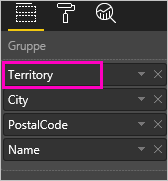

2. Det kan være svært at forstå, hvordan de forskellige ikoner til analyse arbejder sammen, så lad os filtrere træstrukturen, så den kun viser 2 af de mindste områder: **KY** og **TN**. Vælg træstrukturen, og under **Filtre på visualiseringsniveau** skal du udvide **Område** og vælge **KY** og **TN**.

    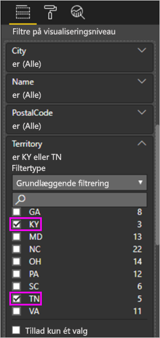    

   Nu vises der kun to områder i træstrukturen.

   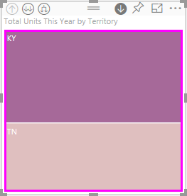

## Tre måder at få adgang til funktionerne til analyse
Du har flere muligheder for at få adgang til detailudledning, få vist flere detaljer og udvide de funktioner til visualisering, som har hierarkier. I denne artikel kan du se, hvordan du bruger den første mulighed nedenfor. Når du har en grundlæggende forståelse af detailudledning og udvidelse, vil du opdage, at alle tre metoder udfører det samme. Du kan prøve dem af for at finde den, du synes bedst om.

- Peg på en visualisering for at få vist og bruge ikonerne.  

    

- Højreklik på en visualisering for at få vist og bruge menuen.
    
    

- På menulinjen i Power BI skal du vælge knappen **Udforsk**.

   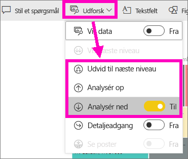

## Stier for analyse
### Detailudledning
Der er flere måder, hvorpå du kan få vist flere detaljer i din visualisering. ***Detailudledning*** fører dig til næste niveau i hierarkiet, så hvis du ser på niveauet **Område**, kan du gå ned til niveauet By, derefter Postnummer og til sidst til Navn. Hvert trin på stien viser nye oplysninger.

### Udvid

***Udvid*** føjer et ekstra hierarkiniveau til den aktuelle visning. Hvis du kigger på niveauet **Område**, kan du udvide og tilføje detaljer om by, postnummer og navn til din træstruktur. Hvert trin på stien viser de samme oplysninger og tilføjer et niveau med nye oplysninger.

Du kan også vælge at bruge detailudledning eller at udvide for ét felt ad gangen eller alle felter på en gang. 

## Brug detailudledning på alle felter på en gang

1. Start på det øverste niveau i træstrukturen for at få vist data for KY og TN. Udvid træstrukturen ved at vælge et af håndtagene og trække mod højre. 

    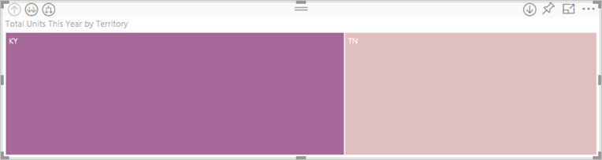 .

2. Hvis du vil bruge detailudledning på ***alle felter på en gang***, skal du vælge dobbeltpilen i øverste venstre hjørne af visualiseringens  . Din træstruktur viser nu bydata for Kentucky og Tennessee. 

    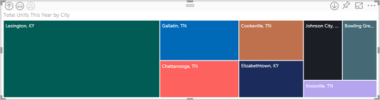
   
5. Brug detailudledning én gang mere til postnummerniveauet i hierarkiet.

    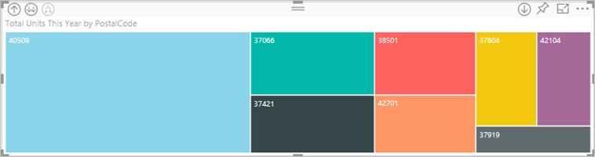

3. Hvis du vil gå et niveau op igen, skal du vælge pil op i øverste venstre hjørne af visualiseringen .

## Detailudledning på ét felt ad gangen
Denne metode bruger ikonet for detailudledning, som vises i øverste højre hjørne af selve visualiseringen. 

1. Vælg ikonet for detailudledning for at aktivere det . Nu kan du bruge detailudledning for ***ét felt ad gangen***. 
   
   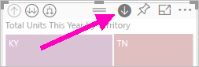

   Hvis du ikke aktiverer detailudledning, sker der ikke detailudledning men krydsfiltrering af de andre diagrammer på rapportsiden, når der vælges en visualisering (f.eks en søjle eller boble).

2. Vælg *bladet* for **TN**. Din træstruktur viser nu alle de byer i Tennessee, hvor der er en butik. 

    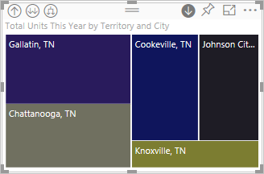

2. Her kan du fortsætte detailudledning for Tennesee, eller du kan foretage detailudledning for en bestemt by i Tennesee, eller du kan i stedet udvide (se **Udvid alle felter på en gang** nedenfor). Lad os fortsætte med detailudledning på ét felt ad gangen.  Vælg **Knoxville, TN**. Din træstruktur viser postnummeret for din butik i Knoxville. 

   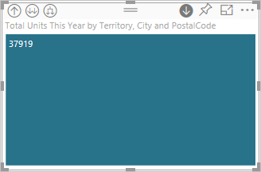

    Bemærk, at titlen ændres, når du foretager detailudledning eller fjerner detaljerne igen.  

## Udvid alle, og udvid ét felt ad gangen
Det er ikke så praktisk at have en træstruktur, der kun viser et postnummer.  Så lad os udvide ét niveau ned i hierarkiet.  

1. Med træstrukturen aktiveret kan du vælge ikonet *udvid ned* . Din træstruktur viser nu 2 niveauer af vores hierarki: postnummer og butiksnavn. 

    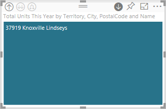

2. Hvis du vil se alle fire hierarkiniveauer for Tennesee, skal du vælge pilen til at gå et niveau op, indtil du kommer til niveau to, **Samlet antal enheder i år efter område og by**, i træstrukturen. 

    

3. Sørg for, at detailudledning stadig er slået til på  , og vælg ikonet *udvid ned* . Din træstruktur viser nu nogle flere detaljer. I stedet for kun at vise by og stat vises postnummer også. 

    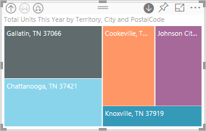

4. Vælg ikonet *udvid ned* en gang mere for at få vist alle fire hierarkiniveauer med detaljer for Tennesee i din træstruktur. Peg på et blad for at få vist flere detaljer.

   

## Analyse filtrerer andre visualiseringer
Når du arbejder med analysetilstand, skal du beslutte, hvordan detailudledning og udvidelse påvirker andre visualiseringer på siden. 

Som standard vil detailudledning ikke filtrere andre visualiseringer i en rapport. Men funktionen kan aktiveres i Power BI Desktop og Power BI-tjenesten. 

1. I Desktop skal du vælge fanen **Format** og derefter markere afkrydsningsfeltet **Detailudledning filtrerer andre visualiseringer**.

    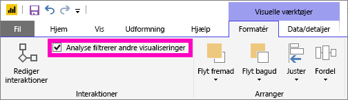

2. Når du nu udfører detailudledning (eller får vist flere detaljer eller udvider) i en visualisering med et hierarki, vil handlingen filtrere de øvrige visualiseringer på siden. 

    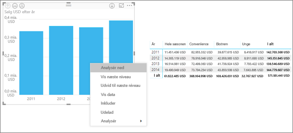

    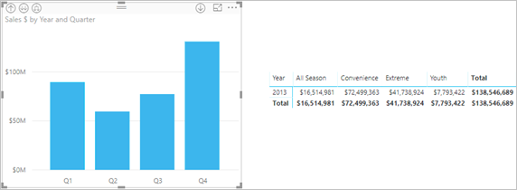

> [!NOTE]
> Hvis du vil aktivere dette i Power BI-tjenesten, skal du vælge **Interaktioner mellem visualiseringer> Detailudledning filtrerer andre visualiseringer**.
>
> 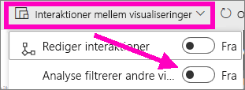

## Om hierarkiaksen og hierarkigruppen
Du kan tænke på hierarkiaksen og hierarkigruppen som de mekanismer, du kan bruge til at øge og reducere detaljeringsgraden af de data, du vil have vist. Alle data, der kan organiseres i kategorier og underkategorier, er kvalificeret til at have et hierarki. Det inkluderer, selvfølgelig, datoer og klokkeslæt.

Du kan oprette en visualisering i Power BI for at få et hierarki ved at vælge et eller flere datafelter, der skal føjes til enten brønden **Akse** eller brønden **Gruppe** sammen med de data, du vil undersøge som datafelter i brønden **Værdier**. Du ved, om dine data er hierarkiske, hvis ikonerne for *Analysetilstand* vises i øverste venstre og højre hjørne af visualiseringen. 

I bund og grund er det praktisk at tænke på to typer hierarkiske data:
- Dato- og klokkeslætsdata – Hvis du har et datafelt med en DateTime-datatype, har du allerede hierarkiske data. I Power BI oprettes automatisk et hierarki ti eventuelle datafelter, hvis værdier kan fortolkes i en [DateTime](https://msdn.microsoft.com/library/system.datetime.aspx)-struktur. Du skal kun bruge ét DateTime-felt til brønden **Akse** eller **Gruppe**.
- Kategoridata – Hvis dine data er afledt af samlinger, der indeholder undersamlinger, eller de på anden vis har rækker af data, der deler fælles værdier, har du hierarkiske data.

Power BI gør det muligt for dig at udvide med et eller alle undersæt. Du kan analysere dine data for at se et enkelt undersæt på hvert niveau eller for at se alle undersæt samtidigt på hvert enkelt niveau. Du kan f.eks. analysere et bestemt år eller få vist alle resultater for hvert enkelt år, når du arbejder dig ned igennem hierarkiet. Du kan også gøre det omvendt.

I følgende sektioner beskrives, hvordan du analyserer fra hhv. den højeste, midterste og laveste visning.

### Hierarkiske data og klokkeslætsdata
I dette eksempel skal du følge med vha. [eksemplet på detailhandelsanalyse](../sample-datasets.md) og oprette en visualisering med et stablet søjlediagram, der ser på **Måned** (akse) efter **SamletSalg** (værdier).  

Selvom datafeltet Akse er **Måned**, opretter det stadigt en kategori af typen **År** i brønden **Akse**. Det er fordi, Power BI giver den komplette DateTime-struktur for alle de værdier, der læses. Øverst i hierarkiet vises årets data.

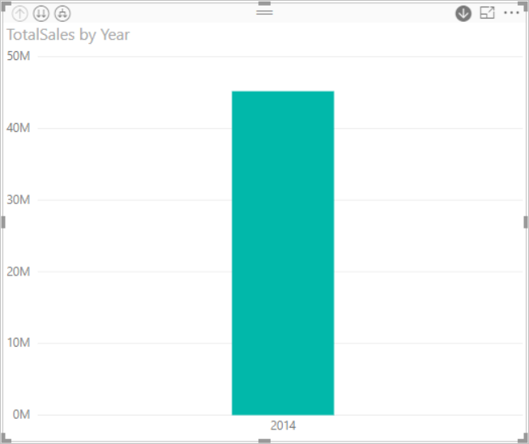

Når tilstanden Analysér ned er slået til, skal du klikke på søjlen i diagrammet for at gå ét niveau ned i hierarkiet. Du får vist tre søjler med dataene for de tilgængelige kvartaler. Derefter skal du vælge **Udvid alle ét niveau ned i hierarkiet** i ikonerne øverst til venstre. Derefter skal du gøre det samme igen for at få vist hierarkiets nederste niveau, der viser resultater for hver enkelt måned.

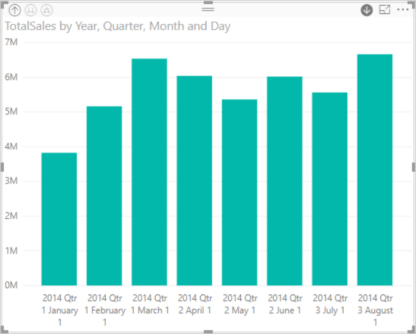

Bortset fra visualiseringen kan vi se hierarkiet afspejlet i de data, der gengives for hver enkelt rapport. I følgende tabel vises resultaterne for **Vis data** i en rapportanalyse for en enkelt måned eller for alle måneder. 

Bemærk, at dataene er de samme for kvartals- og årsrapporter, men når du analyserer ned til detaljeniveauet for **Værdier**, kan du se, hvordan den enkelte rapport bliver mere specifik, og rapporten for "alle måneder" indeholder flere data.

|Udvidelsestilstand|År|Kvartal|Måned|Dag|
| ---|:---:|:---:|:---:|---|
|Enkelt|||||
|Alle|||||

### Hierarkiske kategoridata
Data, der er modelleret fra samlinger og undersamlinger, er hierarkiske. Det er placeringsdata et godt eksempel på. Overvej en tabel i en datakilde, hvor kolonnerne er Land, Stat, By og Postnummer. Data, der deler samme Land, Stat og By, er hierarkiske.

I dette eksempel skal du følge med vha. [eksemplet på detailhandelsanalyse](../sample-datasets.md). Opret en visualisering med et stablet søjlediagram, der viser **Samlede enheder dette år** (værdier) efter **Territorium**, **By**, **Postnummer** og **Navn** (gruppe).  

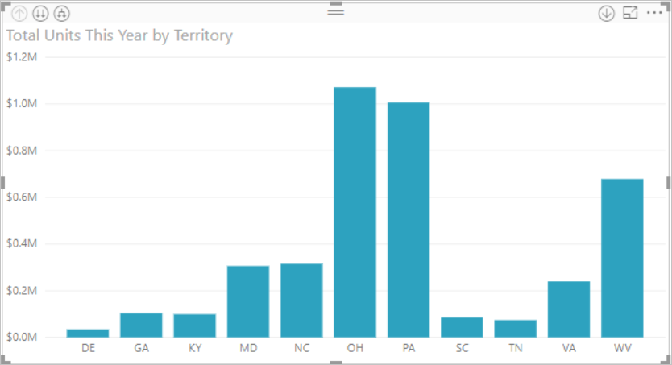

Når tilstanden Analysér ned er slået til, skal du vælge **Udvid alle ét niveau ned i hierarkiet** tre gange via ikonerne øverst til venstre.
Du skal være på det nederste niveau i hierarkiet, hvor du kan se resultaterne for Territorium, By og Postnummer.

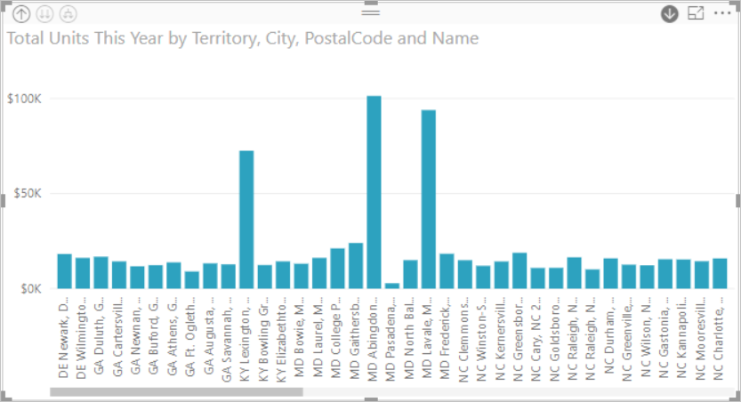

Bortset fra visualiseringen kan vi se hierarkiet afspejlet i de data, der gengives for hver enkelt rapport. I følgende tabel vises resultaterne for **Vis data** i en rapportanalyse for et enkelt territorium eller for alle territorier. Efterhånden som du analyserer, kan du se, hvordan den enkelte rapport bliver mere specifik, og rapporten for "alle territorier" indeholder flere data.

| Udvidelsestilstand|Distrikt|By|Postnummer|Navn|
| ---|:---:|:---:|:---:|---|
|Enkelt|||||
|Alle|||||

## Overvejelser og begrænsninger
* Hvis du ikke kan oprette et hierarki ved at føje et datofelt til en visualisering, kan det skyldes, at "datofeltet" slet ikke er gemt som en dato. Hvis du ejer datasættet, kan du åbne det i *Data*-visningen i Power BI Desktop, vælge den kolonne, der indeholder datoen og under fanen Modellering ændre **Datatypen** til **Dato** eller  **Dato/klokkeslæt**. Hvis rapporten er blevet delt med dig, kan du kontakte ejeren for at anmode om ændringen.  
  
  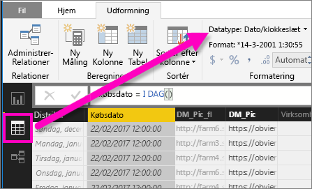

## Næste trin
[Visualiseringer i Power BI-rapporter](../visuals/power-bi-report-visualizations.md)

[Power BI-rapporter](end-user-reports.md)

[Power BI – Grundlæggende begreber](end-user-basic-concepts.md)

Har du flere spørgsmål? [Prøv at spørge Power BI-community'et](http://community.powerbi.com/)

