# Hurtig introduktion – Navigation i Power BI-tjenesten

Nu, hvor du kender de grundlæggende funktioner i Power BI, kan vi kigge på **Power BI-tjenesten**. Som tidligere nævnt kan en bruger i dit team bruge al sin tid i **Power BI Desktop** på at kombinere data og oprette rapporter for andre. Mens du på den anden side kan bruge al din tid i Power BI-tjenesten på at se og interagere med indhold, der er oprettet af andre (**brugs**oplevelse). I denne hurtige introduktion skal du importere eksempeldata og bruge disse data til at få mere at vide om Power BI-tjenesten. 
 
## Forudsætninger

- Hvis du ikke er tilmeldt Power BI, kan du [tilmelde dig en gratis prøveversion](https://app.powerbi.com/signupredirect?pbi_source=web), før du begynder.

- Læs om [grundlæggende begreber i Power BI-tjenesten](end-user-basic-concepts.md)

## Åbn Power BI-tjenesten, og hent nogle data
Vi tager nogle eksempeldata, som vi bruger til vores præsentation af Power BI-tjenesten. Vi giver dig alle mulige former for eksempeldata, som du kan udforske, og i dette eksempel bruger vi dataene om detailbutikker.    
1. Åbn app.powerbi.com, og vælg linket **Eksempler**. 

    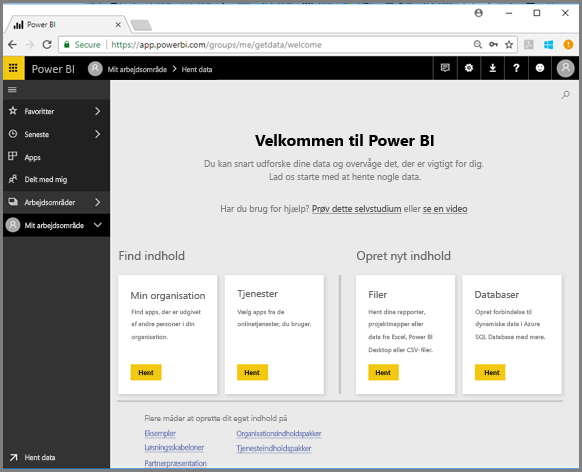

2. Vælg **Retail Analysis Sample > Opret forbindelse**.

    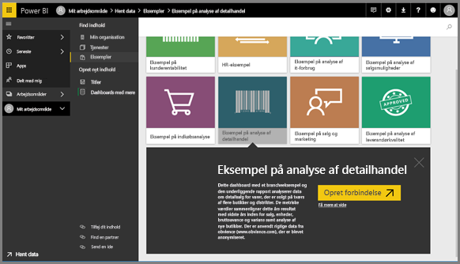

    Power BI-tjenesten importerer eksemplet og viser dashboardet. Dashboards er noget, der adskiller Power BI-tjenesten fra Power BI Desktop. Eksemplet indeholder også en rapport og et datasæt, som vi besøger senere.

    

Se Amanda give dig en rundvisning i den nye navigationsoplevelse i Power BI-tjenesten.  Følg derefter den trinvise vejledning under videoen for selv at udforske det.

<iframe width="560" height="315" src="https://www.youtube.com/embed/G26dr2PsEpk" frameborder="0" allowfullscreen></iframe>

## Vis indhold (dashboards, rapporter, projektmapper, datasæt, arbejdsområder, apps)
Lad os starte med at se på, hvordan det grundlæggende indhold (dashboards, rapporter, datasæt, projektmapper) er organiseret. Indhold vises i forbindelse med et arbejdsområde. På nuværende tidspunkt har du kun ét arbejdsområde, og det kaldes **Mit arbejdsområde**. Forbrugere har normalt ikke brug for eller benytter normalt ikke andre arbejdsområder. I Mit arbejdsområde gemmes alt det indhold, som du ejer. Tænk på det som din personlige sandkasse eller arbejdsområde til dit eget indhold. Mit arbejdsområde er der, hvor eksemplet med den detailhandelsanalyse, du lige har downloadet, er gemt. 

Under Mit arbejdsområde er dit indhold organiseret i 4 faner: Dashboards, Rapporter, Projektmapper og Datasæt.

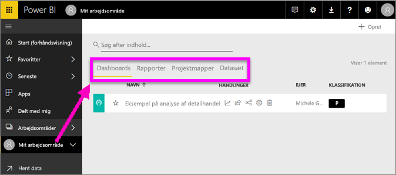

Vælg et arbejdsområde i venstre navigationsrude, og fanerne for det tilknyttede indhold (dashboards, rapporter, projektmapper, datasæt) udfylder Power BI-lærredet til højre.

Hvis du er ny bruger, kan du kun se ét arbejdsområde – **Mit arbejdsområde**.

Under disse faner (dvs. *indholdsvisninger*) får du vist oplysninger om indhold samt handlinger, som du kan udføre med dette indhold.  Fra fanen Dashboards kan du f.eks. åbne et dashboard, dele, slette, søge, sortere og meget mere.

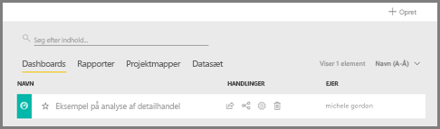

Åbn dashboardet ved at vælge navnet på dashboardet.

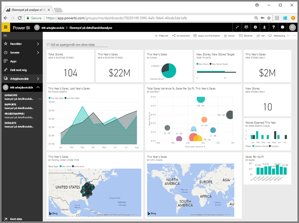

## Vælg et dashboard og en rapport som favorit
Med **Favoritter** kan du hurtigt få adgang til det indhold, der er vigtigst for dig.  

1. Mens dashboardet er åbent, skal du vælge **Favorit** i øverste højre hjørne.
   
   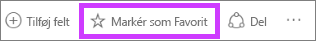
   
   **Favoritter** ændres til **Fjern fra Favoritter**, og stjerneikonet bliver gult.
   
   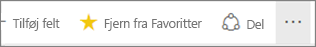

2. Du kan få vist en liste over alt det indhold, du har tilføjet som favoritter, ved i den venstre navigationsrude at vælge pilen til højre for **Favoritter**. Da den venstre navigationsrude er en permanent funktion i Power BI-tjenesten, har du adgang til denne liste overalt i Power BI-tjenesten.
   
    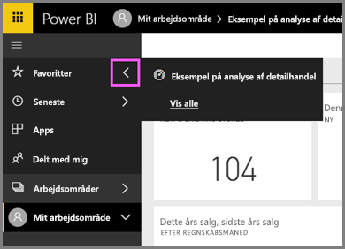
   
    Vi har kun én favorit indtil videre. Favoritter kan være dashboards, rapporter eller apps.  

1. En anden måde at markere et dashboard eller en rapport som en favorit er fra fanen **Dashboards** eller **Rapporter**.  Åbn fanen **Rapporter**, og vælg stjerneikonet til venstre for navnet på rapporten.
   
   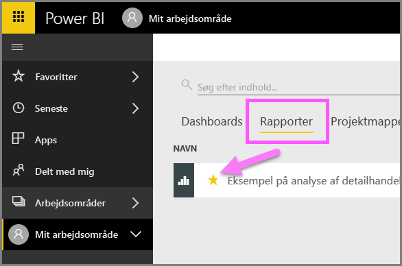

3. Åbn *ruden* **Favoritter** ved at vælge **Favoritter** i venstre navigationsrude eller ved at vælge stjerneikonet .
   
   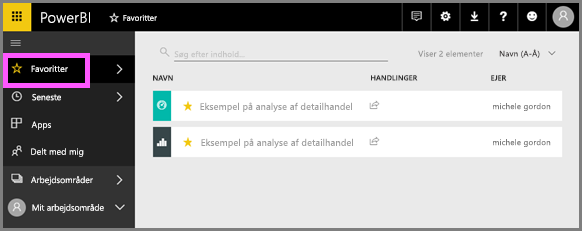
   
   Du har nu to favoritter, et dashboard og en rapport. Her kan du åbne og søge efter indhold, fjerne indhold fra favoritter eller dele indhold med kollegaer.

4. Vælg rapportens navn for at åbne rapporten i rapporteditoren.

    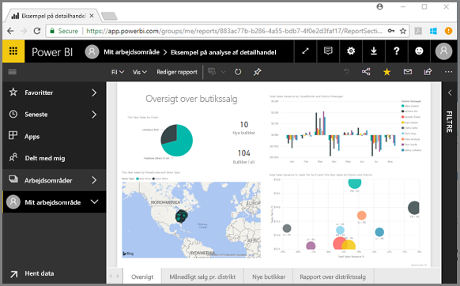

Du kan få flere oplysninger i [Favoritter](end-user-favorite.md)

## Find dit seneste indhold

1. På samme måde som med favoritter kan du hurtigt få adgang til dit seneste indhold overalt i Power BI-tjenesten ved at vælge pilen ud for **Seneste** i venstre navigationsrude.

   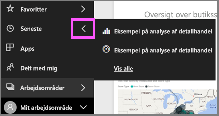

    I pop op-vinduet skal du vælge indhold for at åbne det.

2. Nogle gange ønsker du ikke blot at åbne det seneste indhold, men vil også have vist oplysninger eller udføre andre handlinger, f.eks. få vist Insights eller eksportere til Excel. I sådanne tilfælde skal du åbne ruden **Seneste** ved at vælge **Seneste** eller ved at klikke på ikonet i venstre navigationsrude. Hvis du havde mere end ét arbejdsområde, ville der være indhold fra alle dine arbejdsområder på denne liste.

   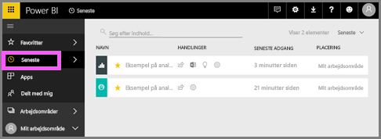

Hvis du vil vide mere, kan du se [Seneste i Power BI](end-user-recent.md)

### Søg og sortér indholdet
Indholdsvisningen gør det lettere at søge efter, filtrere og sortere dit indhold. Hvis du vil søge efter et dashboard, en rapport eller en projektmappe, skal du skrive i søgeområdet. Power BI filtrerer kun det indhold, der har søgestrengen som en del af navnet.

Da du kun har ét eksempel, er det ikke nødvendigt at søge og sortere.  Men når du har lange lister over dashboards, rapporter, projektmapper og datasæt, er det meget nyttigt at kunne søge og sortere.

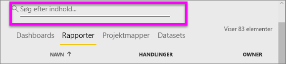

Du kan også sortere indholdet efter navn eller ejer. Læg mærke til pil op til højre for **Navn**. Vi sorterer i øjeblikket 83 emner alfabetisk efter navn i stigende rækkefølge. Hvis du vil ændre sorteringsrækkefølgen til faldende, skal du vælge **Navn**. Pil op ændres til en pil ned.

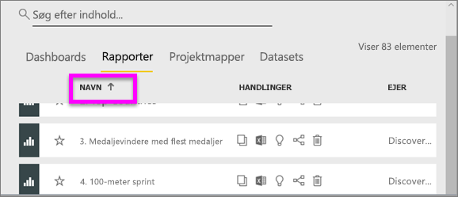

Ikke alle kolonner kan sorteres. Peg på kolonneoverskrifterne for at finde ud af, hvilke der kan sorteres.

Hvis du vil vide mere, kan du se [Power BI-navigation: søg og sortér](end-user-search-sort.md)

## Fjern ressourcer
Når du er færdig med denne hurtige introduktion, kan du slette dashboardet med eksemplet på detailhandelsanalysen samt tilhørende rapport og datasæt, hvis du vil.

1. Åbn Power BI-tjenesten (app.powerbi.com), og log på.    
2. Vælg **Arbejdsområder > Mit arbejdsområde** i navigationsruden til venstre.  
    Har du bemærket, at den gul stjerne angiver, at der er tale om en favorit?    
3. På fanen **Dashboards** skal du vælge skraldespandsikonet **Slet** ud for dashboardet Analyse af detailhandel.    

    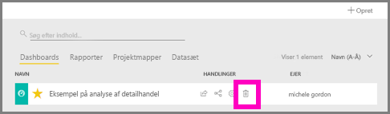

4. Vælg fanen **Rapporter**, og gør det samme for rapporten Analyse af detailhandel.
1. Vælg fanen **Datasæt**, og gør det samme for datasættet Detailhandelsanalyse.

## Næste trin

> [!div class="nextstepaction"]
> [Læsevisning i Power BI-tjenesten](end-user-reading-view.md)