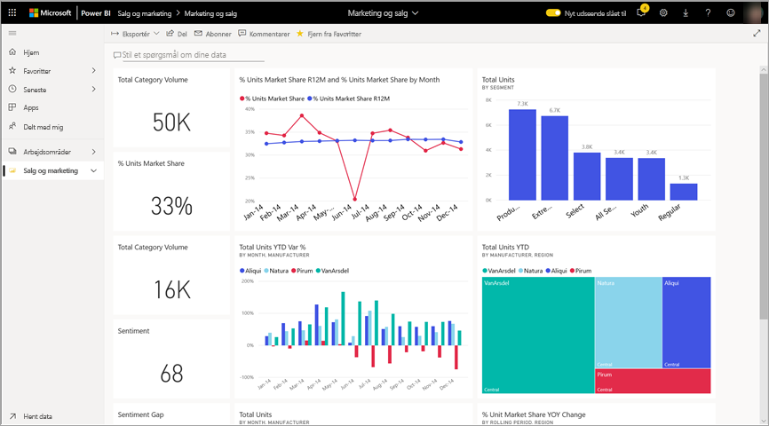
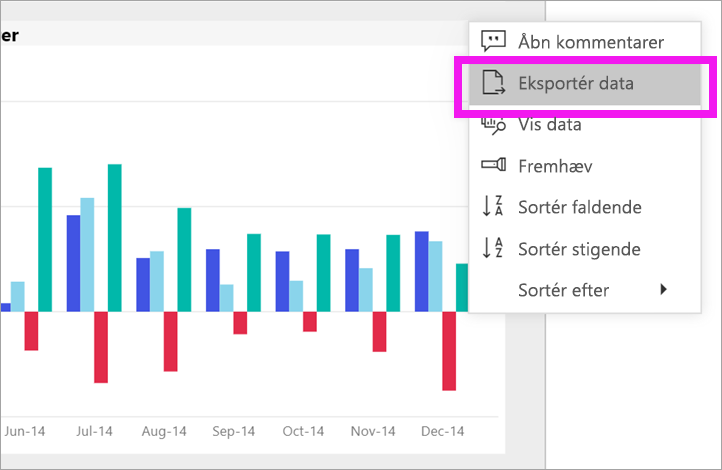
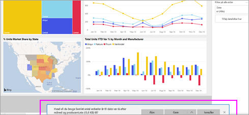

# Eksportér data fra et visuelt element

[!INCLUDE[consumer-appliesto-yyny](../includes/consumer-appliesto-yyny.md)]

[!INCLUDE [power-bi-service-new-look-include](../includes/power-bi-service-new-look-include.md)]

Hvis du gerne vil se de data, der bruges til at oprette en visualisering, [kan du få vist disse data i Power BI](end-user-show-data.md) eller eksportere dem til Excel. Indstillingen for eksport af dataene kræver en bestemt type eller en licens samt redigeringstilladelser til indholdet. Hvis du ikke kan eksportere, bedes du kontakte din Power BI-administrator. Eksport af data kræver en Power BI Pro-licens, enten en Pro-licens pr. bruger eller en Pro-licens pr. bruger i en organisation, der har en Premium-kapacitetslicens. Denne type licens bruges typisk af *rapportdesignere* og ikke *forbrugere*. Du kan få mere at vide under [Hvilken licens har jeg?](end-user-license.md).

## Fra en visualisering på et Power BI-dashboard

1. Start på et Power BI-dashboard. Her bruger vi dashboardet fra appen med ***marketing- og salgseksemplet***. Du kan [downloade denne app fra AppSource.com](https://appsource.microsoft.com/product/power-bi/microsoft-retail-analysis-sample.salesandmarketingsample-preview?flightCodes=e2b06c7a-a438-4d99-9eb6-4324ce87f282).

    

2. Hold over en visualisering for at se **Flere indstillinger** (...), og klik for at få vist handlingsmenuen.

    

3. Vælg **Eksportér til .csv**.

4. Den næste handling afhænger af, hvilken browser du bruger. Du bliver muligvis bedt om at gemme filen, eller du kan måske se et link til den eksporterede fil nederst i browseren. 

    

5. Åbn filen i Excel. 

    > [!NOTE]
    > Hvis du ikke har tilladelse til dataene, kan du ikke eksportere til eller åbne i Excel.  

    

## Fra en visualisering i en rapport
Du kan eksportere data fra en visualisering i en rapport i .csv- eller .xlsx-format (Excel). 

1. Vælg et felt på et dashboard for at åbne den underliggende rapport.  I dette eksempel vælger vi den samme visualisering som ovenfor, *Varians i % for Enheder i alt ÅTD*. 

    

    Da dette felt blev oprettet fra rapporten med *salgs- og marketingeksemplet*, er det denne rapport, der åbnes. Og den åbnes på den side, som indeholder den valgt feltvisualisering. 

2. Vælg dit visual i rapporten. Bemærk ruden **Filtre** til højre. Der er anvendt filtre på denne visualisering. Hvis du vil vide mere om filtre, skal du se [Brug filtre i en rapport](end-user-report-filter.md).

    

3. Vælg **Flere indstillinger (...)** i øverste højre hjørne af visualiseringen. Vælg **Eksportér data**.

    

4. Du kan se indstillinger for eksport af opsummerede data eller underliggende data. Hvis du bruger appen med *salgs- og marketingeksemplet*, er **underliggende data** deaktiveret. Men du kan støde på rapporter, hvor begge indstillinger er aktiveret. Her er en forklaring på forskellen.

    **Opsummerede data**: Vælg denne indstilling, hvis du vil eksportere data for det, du i øjeblikket ser i visualiseringen.  I denne type eksport vises kun de data, der blev brugt til at oprette den aktuelle tilstand af visualiseringen. Hvis der er anvendt filtre på visualiseringen, vil de data, du eksporterer, også blive filtreret. For denne visualisering indeholder eksporten f.eks. kun data for 2014 og det centrale område og kun data for fire af producenterne: VanArsdel, Natura, Aliqui og Pirum. Hvis din visualisering har sammenlægninger (sum, gennemsnit osv.), samles eksporten også. 
  

    **Underliggende data**: Vælg denne indstilling, hvis du vil eksportere data for det, du ser i visualiseringen, **og** yderligere data fra det underliggende datasæt.  Dette kan omfatte data, der findes i datasættet, men som ikke bruges i visualiseringen. Hvis der er anvendt filtre på visualiseringen, vil de data, du eksporterer, også blive filtreret.  Hvis din visualisering har sammenlægninger (sum, gennemsnit osv.), fjerner eksporten sammenlægningen. Dvs. at dataene udjævnes. 

    

5. Den næste handling afhænger af, hvilken browser du bruger. Du bliver muligvis bedt om at gemme filen, eller du kan måske se et link til den eksporterede fil nederst i browseren. 

    

    > [!NOTE]
    > Hvis du ikke har tilladelse til dataene, kan du ikke eksportere til eller åbne i Excel.  

6. Åbn filen i Excel. Sammenlign mængden af eksporterede data med de data, vi eksporterede fra den samme visualisering på dashboardet. Forskellen er, at denne eksport omfatter **underliggende data**. 

    

## Næste trin

[Vis de data, der er brugt til oprettelse af en visualisering](end-user-show-data.md)