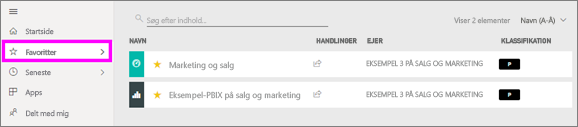
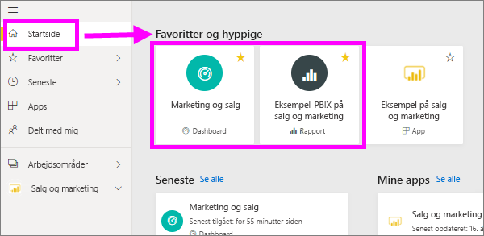
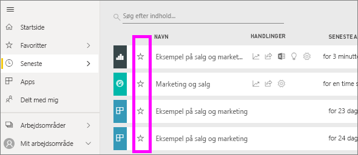
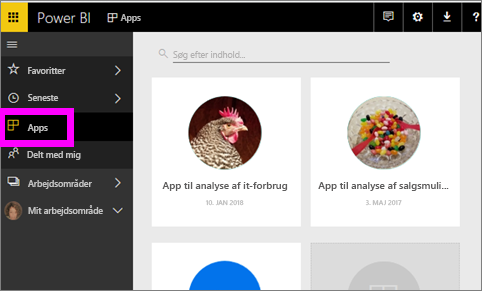
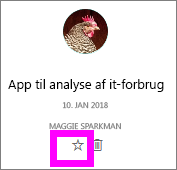
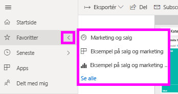
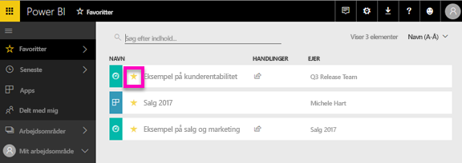

# Foretrukne dashboards, rapporter og apps i Power BI-tjenesten
Når du gør indhold en *foretrukne*, du vil kunne få adgang til den hurtigt fra den **Favoritter** indholdsliste og fra **Power BI hjem**  >   **Favoritter og frequents**.  Favoritter er normalt indhold, du besøger oftest og identificeres med en gul stjerne.

   

   

Du kan også vælge et enkelt dashboard som et [udvalgt dashboard](end-user-featured.md) i Power BI-tjenesten.

## Tilføj et dashboard eller en rapport som en *favorit*

1. Åbn et dashboard eller en rapport, som du ofte bruger. Selv indhold, der er blevet delt med dig, kan være en *favorit*.

2. På båndet øverst i Power BI-tjenesten, skal du vælge **foretrukne** eller stjerneikonet  ikonet.
   
   
   
   Du kan også foretrukne et dashboard eller en rapport fra hvor som helst du se ikonet stjerne, f.eks Home, seneste, Apps og delt med mig. 
   
   

## Tilføj en app som en *favorit*

1. I navigationsruden, vælge **Apps**.

   

2. Hold musen over en app til at få vist flere detaljer.  Vælg ikonet Stjerne   for at gøre det til favorit.
   
   

## Arbejd med *favoritter*
1. For at få adgang til dine favoritter, skal du vælge pilen til højre for **Favoritter**.  Herfra kan du vælge en favorit for at åbne den. Kun fem favoritter vises (alfabetisk). Hvis du har mere end fem, skal du vælge **se alle** for at åbne listen Favoritter indhold (se #. 2 herunder). 
   
   
2. Se **alle** det indhold, du har tilføjet som favoritter, i navigationsruden, vælge **Favoritter** eller Favoritter  ikonet.  
   
    
   
   Herfra kan du udføre forskellige handlinger: åbne, identificere ejere og tilmed dele med kolleger.

## Fjern markering af indhold som favorit
Bruger du ikke længere en rapport så ofte, som du plejede?  Du kan fjerne det fra favoritter. Når du fjerner indhold fra favoritter, fjernes det fra listen med dine favoritter, men ikke fra Power BI.

1. Vælg **Favoritter** i venstre navigationsrude for at åbne skærmbilledet **Favoritter**.
   
   
2. Vælg den gule stjerne ud for det indhold, der skal fjernes som favorit.

> [!NOTE]
> Du kan også fjerne et dashboard, en rapport eller en app fra favoritter. Du skal blot åben og fjerne markeringen det gule ikon.   
> 
> 
## Begrænsninger og overvejelser
På nuværende tidspunkt kan du en app til favorit og denne automatisk Favoritter alle rapporter og dashboards til denne app. Det er ikke muligt at app som favorit individuelle rapporter eller dashboards. 

## Næste trin
[Power BI – Grundlæggende begreber](end-user-basic-concepts.md)

Har du flere spørgsmål? [Prøv at spørge Power BI-community'et](http://community.powerbi.com/)

